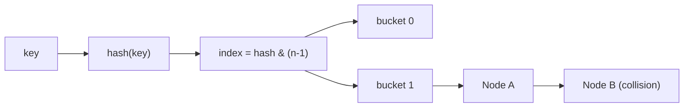
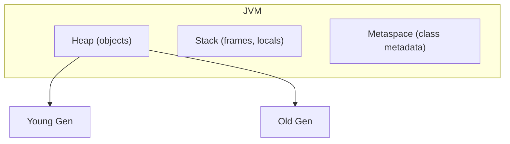
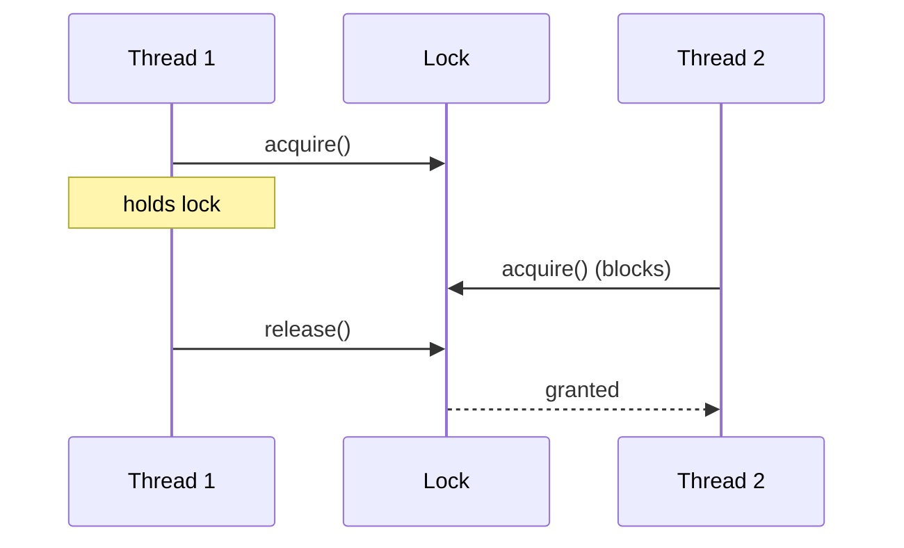
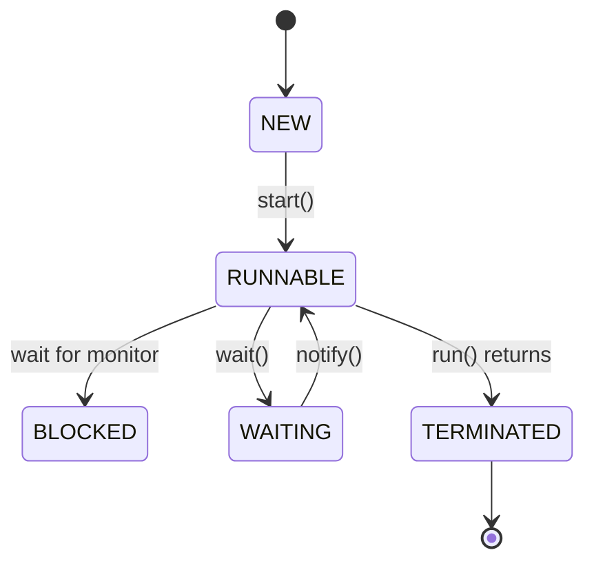
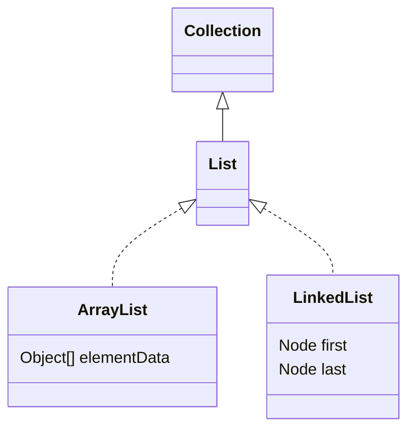
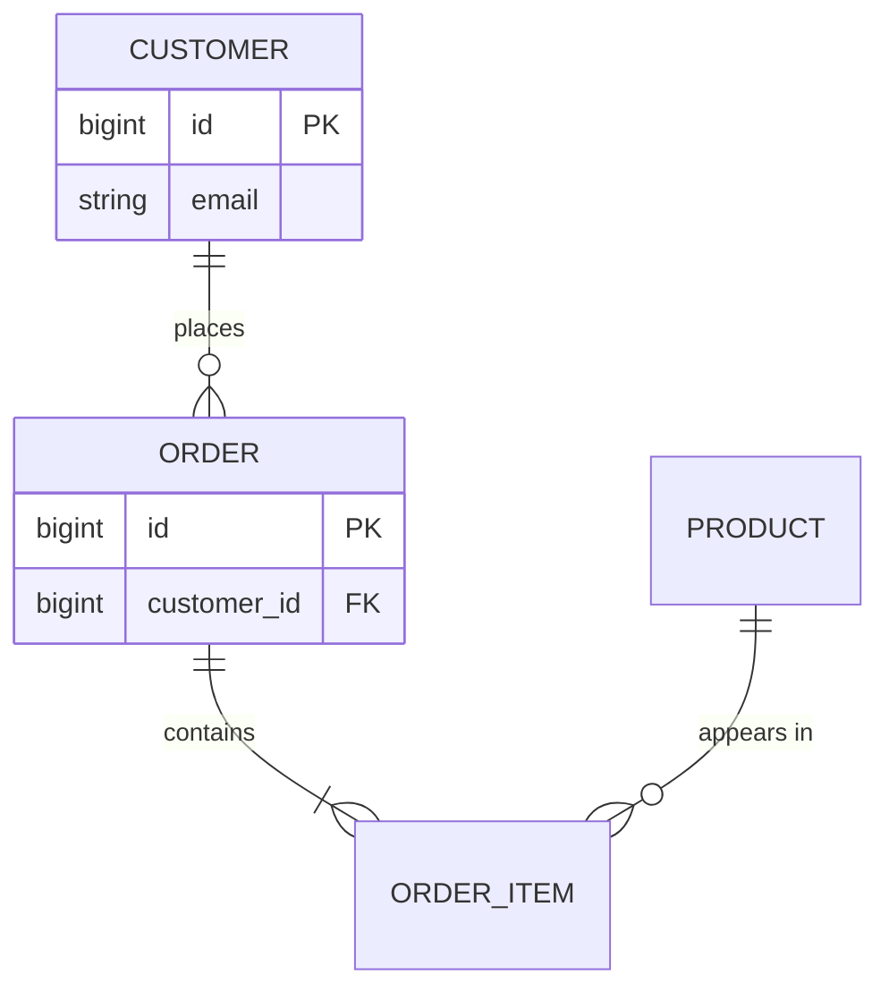

# Mermaid diagram guide for topic explanations

Use these as **ready-to-copy templates** when adding diagrams to
`explanation.en.md` / `explanation.ru.md`. Pick the type that fits the concept,
then adapt the labels. Keep labels as **English technical terms** so the same
diagram block is byte-identical in both language files (only the surrounding
prose is translated).

General rules:

- Target **Mermaid 11** syntax. Validate it mentally — a broken diagram falls back
  to raw text in the app.
- Keep each diagram focused: roughly **≤ 12 nodes**. Split a big idea into two.
- Quote any label with spaces or punctuation: `B["index = hash & (n-1)"]`.
- Do **not** use `%%{init}%%`, custom themes, `click` handlers or raw HTML — the app
  applies its own dark theme and sanitizes the SVG.

---

## flowchart / graph — data structures, algorithms, memory layout

Best for: how something is structured, or how a decision/algorithm flows.

Memory layout example:

---

## sequenceDiagram — interactions over time

Best for: threads communicating, request/response flow, transaction steps.

---

## stateDiagram-v2 — lifecycles and state machines

Best for: Thread states, bean lifecycle, connection/transaction states.

---

## classDiagram — type relationships, inheritance, design patterns

Best for: OOP hierarchies, interface/implementation, pattern roles.

---

## erDiagram — table / entity relationships

Best for: SQL schema, JPA entity relationships.

