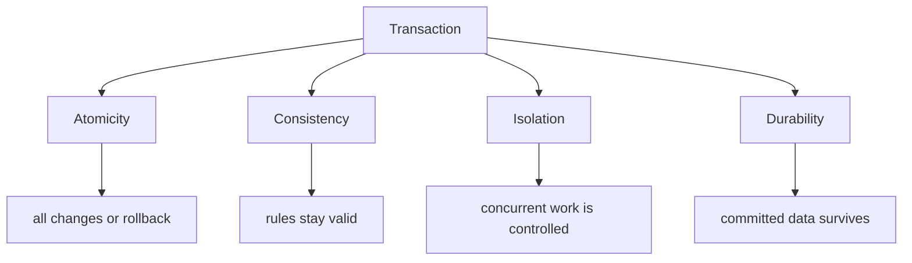
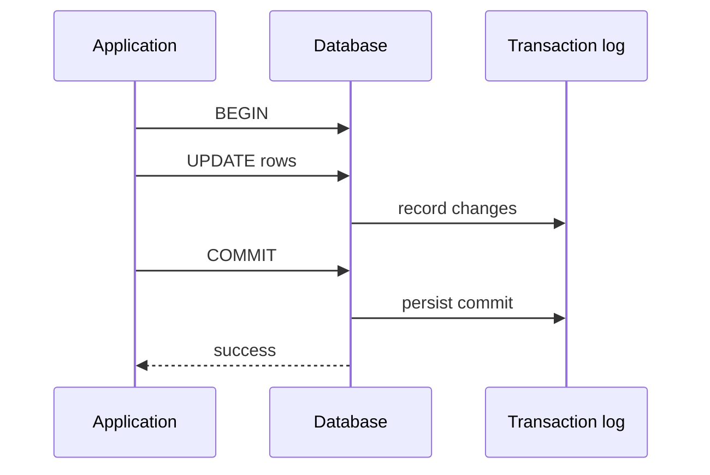

# ACID Principles

**ACID** is a short name for four transaction guarantees: **Atomicity**,
**Consistency**, **Isolation** and **Durability**. A transaction is a group of
database operations that should be treated as one unit. Real-life analogy: a
cashier rings up a whole shopping basket, not each item as a separate promise.

ACID matters most when one logical action touches several rows, tables or
indexes. For example, moving money from one account to another needs both the
debit and the credit. In a kitchen analogy, either the whole order goes to the
table, or the waiter does not serve a half-finished plate and call it dinner.

## The four letters

**Atomicity** means a transaction is all-or-nothing. If step 3 fails, the database
rolls back steps 1 and 2 too, so other users do not see a partial result. Like a
post office parcel: either the whole parcel is delivered, or it stays in the
system as undelivered.

**Consistency** means a committed transaction leaves the database in a valid
state according to its constraints: primary keys, foreign keys, unique indexes,
checks and other database rules. In a schema with relationships like
[Many-to-Many in SQL](topic:sql-many-to-many), this includes not leaving dangling
foreign keys. Like a traffic system, the database can enforce red lights and lane
rules, but it cannot guarantee that your trip plan was wise.

**Isolation** means concurrent transactions should not interfere with each other
in unsafe ways. Without enough isolation, one transaction may read uncommitted
data, miss a concurrent update or make a decision from a changing snapshot. Like
two cooks using one cutting board, the kitchen needs rules for who can use it and
when, otherwise the final dish may include somebody else's half-prepared work.

**Durability** means that once the database reports a successful `COMMIT`, the
change is meant to survive crashes. Databases usually achieve this with a
transaction log, checkpoints and careful disk flushing. Like a receipt printed at
a shop: after the sale is confirmed, the shop must be able to reconstruct what
happened even if the register restarts.

## 60-second interview answer

> ACID describes the basic guarantees of database transactions. **Atomicity**
> means all operations in a transaction commit together or roll back together.
> **Consistency** means a committed transaction preserves database constraints
> and valid invariants. **Isolation** means concurrent transactions are controlled
> so they do not observe unsafe intermediate states. **Durability** means that
> after `COMMIT` succeeds, the change should survive a crash. In practice ACID is
> what lets us safely update related rows, such as debiting one account and
> crediting another, without leaving half-written data.

## Production relevance

ACID is the reason a service can update multiple tables and still keep a clear
failure story: commit means the whole unit happened, rollback means it did not.
Like a restaurant ticket, the kitchen needs one clear status for the order, not
four different stories from four stations.

ACID is local to the transactional resource. A single database transaction does
not automatically make a message broker, another service and a remote API commit
together. For that kind of workflow, patterns such as the
[Outbox pattern](topic:outbox-pattern) and [Inbox pattern](topic:inbox-pattern)
help connect database commits to message delivery and duplicate handling. Like a
post office, a stamped letter in one branch still needs a reliable handoff to the
next branch.

Isolation has a performance tradeoff. Stronger isolation prevents more anomalies
but can reduce concurrency through locks, waiting or serialization failures. Like
closing a whole road for safety, it may be correct, but it slows traffic more than
using lanes and signals.

## Common misconceptions

- Wrong: "ACID means no bugs." ACID protects transaction boundaries and database
  rules; it does not prove that the business logic is correct. A cashier can
  complete the receipt perfectly and still scan the wrong item.
- Wrong: "Consistency means every user always sees the newest data." That is
  mostly about isolation level and read model, not the C in ACID. A notice board
  can follow all posting rules while one visitor is still reading an older copy.
- Wrong: "Atomicity is the same as Isolation." Atomicity is about commit or
  rollback of one transaction; Isolation is about how transactions interact while
  they overlap. One is the whole shopping bag, the other is how shoppers share the
  checkout lane.
- Wrong: "Durability means data can never be lost." Durability depends on the
  database configuration, storage system and replication choices. A printed
  receipt helps, but only if the shop stores receipts safely.
- Wrong: "ACID solves distributed transactions by itself." ACID is strongest
  inside one database transaction; distributed systems need extra coordination,
  retries and idempotency. A kitchen can control one order ticket, but delivery
  drivers still need their own tracking.
