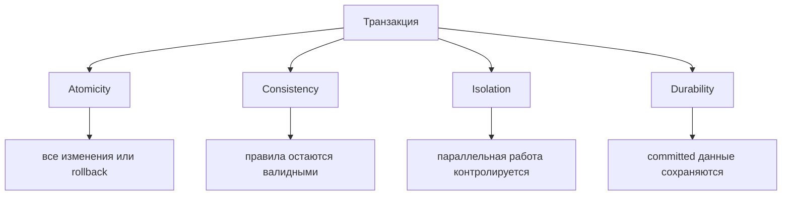
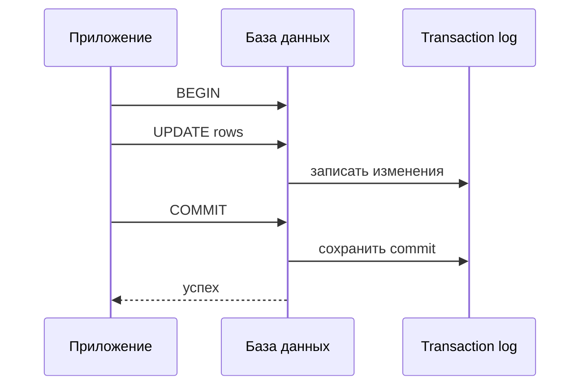

# Принципы ACID

**ACID** - краткое название четырех гарантий транзакции: **Atomicity**,
**Consistency**, **Isolation** и **Durability**. Транзакция - это группа
операций с базой данных, которую нужно рассматривать как единое целое. Аналогия
из жизни: кассир пробивает всю корзину покупок, а не каждую позицию как
отдельное обещание.

ACID особенно важен, когда одно логическое действие затрагивает несколько строк,
таблиц или индексов. Например, перевод денег с одного счета на другой требует и
списания, и зачисления. Кухонная аналогия: либо весь заказ уходит на стол, либо
официант не подает наполовину готовую тарелку как полноценный ужин.

## Четыре буквы

**Atomicity** означает "все или ничего". Если шаг 3 падает, база данных
откатывает и шаги 1 и 2, чтобы другие пользователи не увидели частичный
результат. Как посылка на почте: либо вся посылка доставлена, либо она остается
в системе как недоставленная.

**Consistency** означает, что committed транзакция оставляет базу данных в
валидном состоянии согласно ее ограничениям: primary key, foreign key, unique
index, check и другим правилам базы. В схеме со связями вроде
[Many-to-Many в SQL](topic:sql-many-to-many) это включает отсутствие "висячих"
foreign key. Как дорожная система: база может соблюдать красный свет и правила
полос, но не может гарантировать, что ваш маршрут был удачным.

**Isolation** означает, что параллельные транзакции не должны опасно мешать друг
другу. Без достаточной isolation одна транзакция может прочитать uncommitted
данные, пропустить параллельное обновление или принять решение по меняющемуся
снимку. Как два повара с одной разделочной доской: кухне нужны правила, кто и
когда ей пользуется, иначе в итоговом блюде может оказаться чужая наполовину
готовая работа.

**Durability** означает, что после успешного ответа базы на `COMMIT` изменение
должно пережить сбой. Обычно базы данных достигают этого через transaction log,
checkpoints и аккуратную запись на диск. Как чек в магазине: после подтверждения
покупки магазин должен восстановить, что произошло, даже если касса
перезапустится.

## Ответ на собеседовании за 60 секунд

> ACID описывает базовые гарантии транзакций в базе данных. **Atomicity**
> означает, что все операции в транзакции commit вместе или rollback вместе.
> **Consistency** означает, что committed транзакция сохраняет ограничения базы и
> валидные инварианты. **Isolation** означает, что параллельные транзакции
> контролируются и не видят опасные промежуточные состояния. **Durability**
> означает, что после успешного `COMMIT` изменение должно пережить сбой. На
> практике ACID позволяет безопасно обновлять связанные строки, например списать
> деньги с одного счета и зачислить на другой, не оставляя наполовину записанные
> данные.

## Значение в production

ACID позволяет сервису обновлять несколько таблиц и иметь понятную историю
ошибок: commit значит, что весь блок произошел, rollback значит, что он не
произошел. Как ресторанный заказ: кухне нужен один ясный статус заказа, а не
четыре разные версии от четырех станций.

ACID локален для transactional resource. Одна транзакция базы данных не заставит
автоматически message broker, другой сервис и удаленный API зафиксироваться
вместе. Для таких workflow помогают паттерны вроде
[Outbox pattern](topic:outbox-pattern) и [Inbox pattern](topic:inbox-pattern):
они связывают commit в базе с доставкой сообщений и обработкой дублей. Как на
почте: письмо со штампом в одном отделении все равно требует надежной передачи в
следующее отделение.

Isolation имеет цену в производительности. Более строгая isolation предотвращает
больше аномалий, но может снижать параллелизм через locks, ожидание или
serialization failures. Как перекрыть всю дорогу ради безопасности: это может
быть правильно, но замедляет движение сильнее, чем полосы и светофоры.

## Частые заблуждения

- Неверно: "ACID означает отсутствие багов." ACID защищает границы транзакций и
  правила базы; он не доказывает корректность бизнес-логики. Кассир может
  идеально закрыть чек и все равно пробить не тот товар.
- Неверно: "Consistency означает, что каждый пользователь всегда видит самые
  свежие данные." Это в основном вопрос isolation level и модели чтения, а не C
  в ACID. Доска объявлений может соблюдать все правила размещения, пока один
  посетитель все еще читает старую копию.
- Неверно: "Atomicity и Isolation - одно и то же." Atomicity говорит про commit
  или rollback одной транзакции; Isolation говорит про взаимодействие
  пересекающихся транзакций. Одно - это вся сумка покупок, другое - как
  покупатели делят кассовую очередь.
- Неверно: "Durability означает, что данные невозможно потерять." Durability
  зависит от конфигурации базы, системы хранения и репликации. Напечатанный чек
  помогает, но только если магазин хранит чеки надежно.
- Неверно: "ACID сам решает распределенные транзакции." ACID сильнее всего
  внутри одной транзакции базы данных; распределенным системам нужны
  дополнительная координация, retries и idempotency. Кухня может контролировать
  один заказ, но курьерам все равно нужен собственный трекинг.
