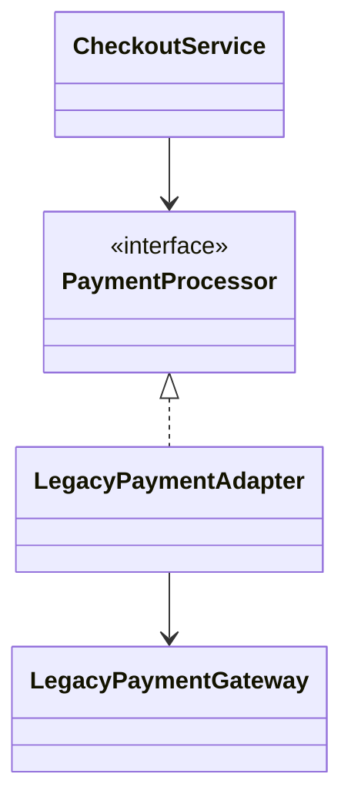

# Adapter Pattern

> **Practice mode.** This is a *structural* topic: there is no "Run". You build
> the pattern as real classes in the file tree on the left, press **Analyze**, and
> the app compiles your code, draws the **class diagram** from it, and checks the
> missions against the relationships it finds.

## The Problem It Solves

**Adapter** lets code with incompatible interfaces work together without changing
the client or the existing class. Your application expects a target interface,
but a legacy class or third-party SDK exposes a different method name, parameter
shape, or protocol. The adapter sits between them and translates calls. Think of
a plug adapter: the wall socket and charger keep their shapes, and the small
adapter makes them fit.

This is useful when the old class is stable, external, risky to edit, or used by
other code. The adapter protects the rest of the application from that mismatch.
It is like a post office forwarding desk: customers use the normal counter, while
the forwarding clerk knows the strange old address format behind the scenes.

## The Target Shape

You will build a checkout flow that wants the clean `PaymentProcessor` interface,
while the existing system offers an incompatible `LegacyPaymentGateway`:

- `PaymentProcessor` is the **target** interface the application wants. Like a
  kitchen order ticket, it gives the cook one standard format to follow.
- `LegacyPaymentGateway` is the **adaptee**: useful existing code with the wrong
  interface. Like an old cash register, it still works but speaks in its own
  button layout.
- `LegacyPaymentAdapter` is the **adapter**: it implements `PaymentProcessor`,
  holds a `LegacyPaymentGateway`, and translates `processPayment(...)` into the
  legacy call. Like a bilingual clerk, it repeats the same request in the form
  the old system understands.
- `CheckoutService` is the **client**: it should depend on `PaymentProcessor`,
  not on `LegacyPaymentGateway`. Like a customer at a service window, it should
  not need to know what machinery is behind the counter.

## How To Build It

1. Keep the client pointed at the target interface. `CheckoutService` should hold
   a `PaymentProcessor` field and call `processPayment(...)`. Everyday analogy:
   the traffic sign tells every driver the same rule, no matter what engine is
   inside the car.
2. Create the legacy class with its own method. It can have a name like
   `chargeInCents(...)` or `makeLegacyPayment(...)`. Everyday analogy: the old
   kitchen scale still measures correctly, but it has a dial instead of a digital
   display.
3. Create `LegacyPaymentAdapter implements PaymentProcessor`. This class receives
   a `LegacyPaymentGateway` and delegates after translating the call. Everyday
   analogy: a travel plug changes the shape of the pins, not the electricity.
4. Inject the adapter where a `PaymentProcessor` is expected. The client sees a
   clean interface, and the legacy code remains isolated. Everyday analogy: the
   cashier hands every order to the same counter, even if a specialist handles
   one unusual package in the back room.

## 60-Second Interview Answer

> Adapter solves interface incompatibility. It wraps an existing class, called
> the adaptee, and exposes the target interface expected by the client. The
> client talks to the target interface, the adapter translates the call, and the
> adaptee does the real work. This lets you reuse legacy or third-party code
> without modifying it and without spreading its awkward API through the
> application. In Java, the common form is an object adapter: the adapter
> implements the target interface and composes the adaptee.

## Production Relevance

Adapters are common at application boundaries: payment SDKs, message brokers,
file formats, HTTP clients, old internal services, and vendor APIs. The same idea
appears in ports-and-adapters architecture: domain code depends on a clean port,
while an adapter talks to the outside system. Like a delivery desk, the public
counter stays predictable even when each courier has different paperwork.

Adapter supports the dependency inversion part of [SOLID Principles](topic:solid-principles):
business code can depend on an interface instead of a concrete vendor class. It
also fits the broader family of [Design Patterns Overview](topic:design-patterns-overview):
it is a structural pattern because it changes how classes are connected, not
which algorithm is selected. Like using a standard mailbox slot, callers do not
need to learn every private sorting room behind it.

## Common Misconceptions

- **"Adapter changes the legacy class."** No. It usually leaves the adaptee as it
  is and adds a wrapper. Like putting a label on an old jar, you do not melt the
  jar down; you make it understandable to the current kitchen.
- **"Adapter is just a data mapper."** Mapping fields can be part of an adapter,
  but the pattern is about making one interface usable as another. Like a post
  office clerk, it may rewrite the address, choose the right form, and route the
  package.
- **"The client should know it is using an adapter."** Ideally the client only
  sees the target interface. Like a driver using a toll lane, the exact machine
  behind the payment panel is not the driver's concern.
- **"Adapter and Strategy solve the same problem."** [Strategy](topic:strategy)
  swaps interchangeable behaviours behind one interface; Adapter makes an
  incompatible interface fit an expected one. Like choosing between two recipes
  versus translating an old recipe card into the kitchen's current format.
- **"Inheritance is required."** In Java, object adapters using composition are
  usually clearer and more flexible than class adapters using inheritance. Like
  hiring an interpreter for an old machine is easier than rebuilding the machine
  into the wall.
