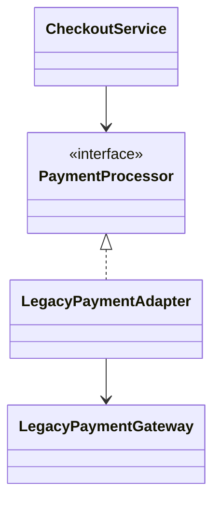

# Паттерн Adapter

> **Режим практики.** Это *структурная* тема: кнопки «Запустить» нет. Вы строите
> паттерн настоящими классами в дереве файлов слева, нажимаете **«Проанализировать»**,
> и приложение компилирует ваш код, рисует по нему **диаграмму классов** и проверяет
> миссии по найденным связям.

## Какую проблему он решает

**Adapter** позволяет коду с несовместимыми интерфейсами работать вместе без
изменения клиента или существующего класса. Приложение ожидает target interface,
а legacy-класс или сторонний SDK предоставляет другое имя метода, другую форму
параметров или другой протокол. Adapter становится между ними и переводит
вызовы. Представь переходник для розетки: розетка и зарядка сохраняют свою
форму, а маленький adapter помогает им совпасть.

Это полезно, когда старый класс стабилен, внешний, рискованный для правок или уже
используется другим кодом. Adapter защищает остальное приложение от этого
несовпадения. Это как стойка переадресации на почте: посетители идут к обычному
окну, а сотрудник за ним знает странный старый формат адресов.

## Целевая структура

Вы соберёте оформление заказа, которому нужен чистый интерфейс `PaymentProcessor`,
пока существующая система предлагает несовместимый `LegacyPaymentGateway`:

- `PaymentProcessor` — это **target** interface, который нужен приложению. Как
  кухонный чек с заказом: он даёт повару один стандартный формат.
- `LegacyPaymentGateway` — это **adaptee**: полезный существующий код с неподходящим
  интерфейсом. Как старая касса, она ещё работает, но говорит своим набором кнопок.
- `LegacyPaymentAdapter` — это **adapter**: он реализует `PaymentProcessor`, хранит
  `LegacyPaymentGateway` и переводит `processPayment(...)` в legacy-вызов. Как
  двуязычный сотрудник, он повторяет тот же запрос в форме, которую понимает
  старая система.
- `CheckoutService` — это **client**: он должен зависеть от `PaymentProcessor`, а
  не от `LegacyPaymentGateway`. Как посетитель у сервисного окна, он не обязан
  знать, какие механизмы стоят за стойкой.

## Как его собрать

1. Держите client направленным на target interface. `CheckoutService` должен
   хранить поле `PaymentProcessor` и вызывать `processPayment(...)`. Бытовая
   аналогия: дорожный знак задаёт одно правило для всех водителей, независимо от
   двигателя внутри машины.
2. Создайте legacy-класс с его собственным методом. Это может быть имя вроде
   `chargeInCents(...)` или `makeLegacyPayment(...)`. Бытовая аналогия: старые
   кухонные весы всё ещё измеряют правильно, но у них стрелочный циферблат вместо
   цифрового дисплея.
3. Создайте `LegacyPaymentAdapter implements PaymentProcessor`. Этот класс получает
   `LegacyPaymentGateway` и делегирует после перевода вызова. Бытовая аналогия:
   travel plug меняет форму контактов, а не электричество.
4. Внедрите adapter туда, где ожидается `PaymentProcessor`. Client видит чистый
   интерфейс, а legacy-код остаётся изолированным. Бытовая аналогия: кассир
   передаёт каждый заказ на одну и ту же стойку, даже если необычную посылку в
   подсобке обрабатывает специалист.

## Ответ на собеседовании за 60 секунд

> Adapter решает несовместимость интерфейсов. Он оборачивает существующий класс,
> который называется adaptee, и предоставляет target interface, ожидаемый client.
> Client обращается к target interface, adapter переводит вызов, а adaptee делает
> реальную работу. Это позволяет переиспользовать legacy- или сторонний код без
> его изменения и без распространения неудобного API по приложению. В Java
> обычная форма — object adapter: adapter реализует target interface и композирует
> adaptee.

## Где это встречается в production

Adapters часто стоят на границах приложения: payment SDKs, message brokers,
форматы файлов, HTTP clients, старые внутренние сервисы и vendor APIs. Та же идея
есть в ports-and-adapters architecture: domain code зависит от чистого port, а
adapter разговаривает с внешней системой. Как стойка доставки, публичное окно
остаётся предсказуемым, даже если у каждого курьера свои бумаги.

Adapter поддерживает dependency inversion из [SOLID Principles](topic:solid-principles):
business code может зависеть от интерфейса, а не от конкретного vendor-класса. Он
также входит в общую семью [Design Patterns Overview](topic:design-patterns-overview):
это структурный паттерн, потому что он меняет соединение классов, а не выбирает
алгоритм. Как стандартная щель почтового ящика, callers не должны изучать каждую
внутреннюю сортировочную комнату.

## Частые заблуждения

- **«Adapter меняет legacy-класс.»** Нет. Обычно он оставляет adaptee как есть и
  добавляет wrapper. Как наклеить этикетку на старую банку: вы не переплавляете
  банку, а делаете её понятной для текущей кухни.
- **«Adapter — это просто data mapper.»** Перенос полей может быть частью adapter,
  но паттерн про то, как сделать один интерфейс пригодным вместо другого. Как
  сотрудник почты, он может переписать адрес, выбрать нужный бланк и направить
  посылку.
- **«Client должен знать, что использует adapter.»** В идеале client видит только
  target interface. Как водитель на платной полосе: точная машина за панелью
  оплаты не его забота.
- **«Adapter и Strategy решают одну проблему.»** [Strategy](topic:strategy)
  подменяет взаимозаменяемые поведения за одним интерфейсом; Adapter подгоняет
  несовместимый интерфейс под ожидаемый. Это как выбирать между двумя рецептами
  и как перевести старую карточку рецепта в текущий формат кухни.
- **«Наследование обязательно.»** В Java object adapters на композиции обычно
  понятнее и гибче, чем class adapters на наследовании. Как нанять переводчика
  для старой машины проще, чем встраивать саму машину в стену.
