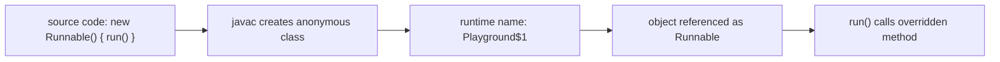
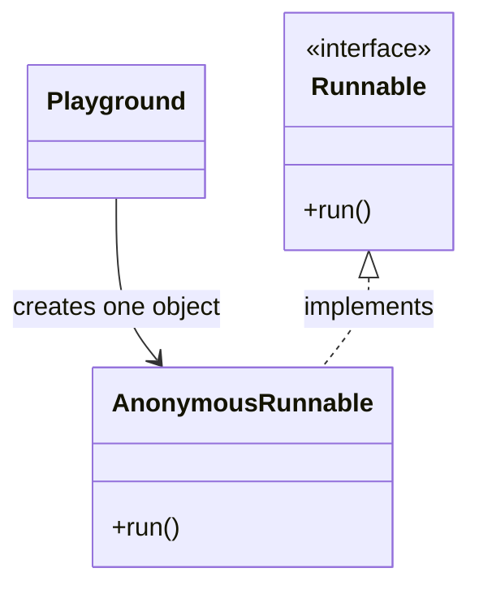

# Anonymous Classes in Java

## Intuition

An anonymous class is a class declared and instantiated in one expression. It has
no source-level name, but it still creates a real runtime class and an object.
You usually write it as `new SomeInterface() { ... }` or `new SomeClass(...) { ... }`.
Think of a post office clerk filling a one-time form for one parcel: the form has
no reusable office name, but it is still a real document for that job.

The type after `new` is the target type. If it is an interface, the anonymous
class implements it. If it is a class or abstract class, the anonymous class
extends it. This connects directly to [Interface vs Abstract Class](topic:interface-vs-abstract-class).
It is like choosing the correct counter at a station: parcel counter or passport
counter decides which rules the clerk must follow.

Inside the braces you override methods required by the target type. That is the
same overriding idea covered in [Overriding vs Overloading](topic:override-vs-overload):
the call is made through the target type, but the anonymous class implementation
runs. In a kitchen, the menu says "prepare lunch", but today's substitute cook
decides the exact recipe for that one order.

Anonymous classes can read fields of the surrounding object and can read local
variables from the surrounding method only when those locals are `final` or
effectively final. The compiler copies the stable value into the generated class.
At a ticket office, the clerk can read the printed order number on a ticket, but
the customer cannot keep changing that number while the clerk is already serving it.

## 60-second interview answer

An anonymous class in Java is an unnamed class declared and instantiated at the
same place. It is written as `new Type(...) { ... }`, where `Type` is an
interface, class, or abstract class. The anonymous class implements or extends
that target type and usually overrides one or more methods. The compiler still
generates a real runtime class, often visible as a name like `Outer$1`.
Anonymous classes are useful for small one-off implementations, callbacks,
listeners, comparators, or test doubles. They can capture only `final` or
effectively final local variables. Compared with a lambda, an anonymous class has
its own class and its own `this`, and it can extend a class, while a lambda is
only for functional interfaces.

## Production relevance

You will still see anonymous classes in older Java code, Swing listeners,
`Comparator` implementations, quick test doubles, and examples based on
`Runnable` or callbacks. Modern Java often replaces simple single-method
anonymous classes with lambdas, especially for topics related to
[Thread vs Runnable](topic:thread-vs-runnable), but anonymous classes remain
valid when you need a small object with fields, helper methods, or class
extension. In traffic terms, a lambda is like a short hand signal; an anonymous
class is like assigning a temporary traffic controller with a small rule book.

Anonymous classes also teach the object model clearly: variable type, runtime
class, overridden method, and captured state are separate ideas. That is a useful
bridge to [OOP Principles](topic:oop-principles). In a warehouse, the label on a
box, the actual box model, the worker's instruction, and the note attached to
the box are related, but they are not the same thing.

## Common misconceptions and traps

`Anonymous` does not mean "no class exists". The class has no source-level name,
but the compiler generates one. It is like an unbranded receipt: it may not have
a shop logo, but it still has a receipt number.

An anonymous class is not always the same as a lambda. A lambda works only with a
functional interface and does not introduce a new `this`; an anonymous class has
its own `this` and can extend a class. It is like the difference between leaving
a short kitchen instruction and hiring a temporary cook for the shift.

You cannot declare a named constructor inside an anonymous class because there is
no source-level class name. You can use an instance initializer block if you must
run setup code, but often a named class is clearer. At a post office, a one-time
form can have filled-in fields, but it does not get a permanent onboarding process.

Captured local variables must be `final` or effectively final. If you change the
local variable after creating the anonymous class, the code will not compile.
The ticket number analogy is strict here: once the ticket is printed for the
clerk, the customer cannot rewrite it midway.

Anonymous classes are best for small, local behavior. If the body becomes large,
needs tests, or is reused in several places, give it a named class. A temporary
road sign is useful for one repair spot; if it appears on every street, the city
needs a real traffic plan.
