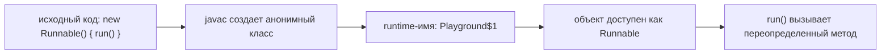
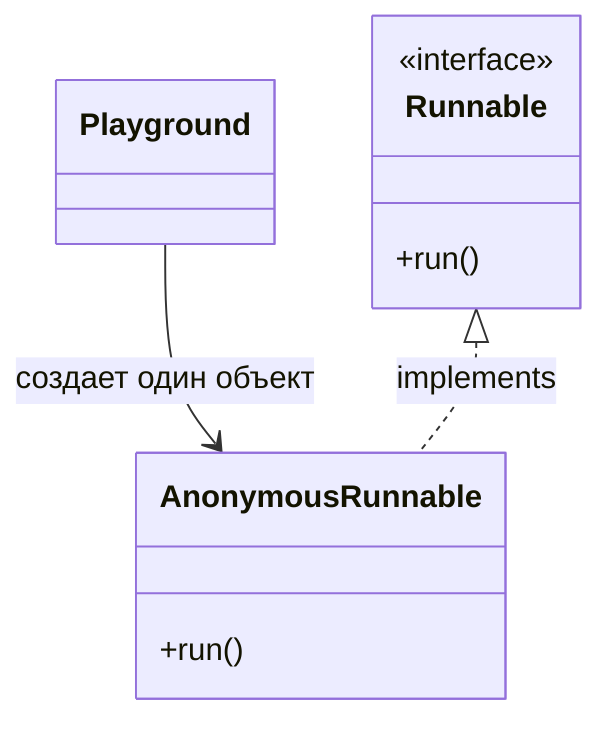

# Анонимные классы в Java

## Интуиция

Анонимный класс - это класс, который объявляется и создается в одном выражении.
У него нет имени на уровне исходного кода, но он все равно создает настоящий
runtime-класс и объект. Обычно он пишется как `new SomeInterface() { ... }` или
`new SomeClass(...) { ... }`. Представь сотрудника почты, который заполняет
одноразовую форму для одной посылки: у формы нет отдельного названия отделения,
но для этой задачи это настоящий документ.

Тип после `new` - это целевой тип. Если это интерфейс, анонимный класс его
реализует. Если это класс или абстрактный класс, анонимный класс от него
наследуется. Это напрямую связано с темой
[Interface vs Abstract Class](topic:interface-vs-abstract-class).
Это похоже на выбор нужного окна на вокзале: окно для посылок или окно для
паспортов определяет, каким правилам должен следовать сотрудник.

Внутри фигурных скобок ты переопределяешь методы, которые требует целевой тип.
Это та же идея overriding, которая разбирается в
[Overriding vs Overloading](topic:override-vs-overload): вызов идет через
целевой тип, но выполняется реализация из анонимного класса. На кухне меню
говорит «приготовить обед», но сегодняшний временный повар выбирает конкретный
рецепт для этого одного заказа.

Анонимные классы могут читать поля окружающего объекта и могут читать локальные
переменные окружающего метода только тогда, когда эти переменные `final` или
effectively final. Компилятор копирует стабильное значение в сгенерированный
класс. В билетной кассе сотрудник может прочитать напечатанный номер заказа на
талоне, но клиент не может постоянно менять этот номер, пока его уже обслуживают.

## Ответ за 60 секунд

Анонимный класс в Java - это безымянный класс, который объявляется и создается в
одном месте. Он пишется как `new Type(...) { ... }`, где `Type` - это интерфейс,
класс или абстрактный класс. Анонимный класс реализует или наследует этот
целевой тип и обычно переопределяет один или несколько методов. Компилятор все
равно генерирует настоящий runtime-класс, который часто виден как имя вроде
`Outer$1`. Анонимные классы полезны для маленьких одноразовых реализаций,
callbacks, listeners, comparators или test doubles. Они могут захватывать только
`final` или effectively final локальные переменные. В отличие от lambda,
анонимный класс имеет собственный класс и собственный `this`, а также может
наследовать класс, тогда как lambda работает только с functional interfaces.

## Значение в production

Анонимные классы до сих пор встречаются в старом Java-коде, Swing listeners,
реализациях `Comparator`, быстрых test doubles и примерах на базе `Runnable` или
callbacks. В современной Java простые одно-методные анонимные классы часто
заменяют lambdas, особенно в темах вроде
[Thread vs Runnable](topic:thread-vs-runnable), но анонимные классы остаются
валидным инструментом, когда нужен маленький объект с полями, helper-методами
или наследованием класса. В терминах дорожного движения lambda похожа на короткий
жест рукой, а анонимный класс - на временного регулировщика с маленьким набором
правил.

Анонимные классы также хорошо показывают объектную модель: тип переменной,
runtime-класс, переопределенный метод и захваченное состояние - это разные идеи.
Это полезный мост к [OOP Principles](topic:oop-principles). На складе ярлык на
коробке, реальная модель коробки, инструкция работника и записка на коробке
связаны, но это не одно и то же.

## Частые заблуждения и ловушки

`Anonymous` не означает «класса не существует». У класса нет имени на уровне
исходного кода, но компилятор генерирует его. Это как чек без бренда: на нем
может не быть логотипа магазина, но у него все равно есть номер чека.

Анонимный класс не всегда то же самое, что lambda. Lambda работает только с
functional interface и не вводит новый `this`; анонимный класс имеет собственный
`this` и может наследовать класс. Это разница между короткой инструкцией на
кухне и временным поваром на смену.

Внутри анонимного класса нельзя объявить именованный constructor, потому что у
класса нет имени в исходном коде. Если нужно выполнить setup-код, можно
использовать instance initializer block, но часто именованный класс понятнее. На
почте одноразовая форма может иметь заполненные поля, но для нее не заводят
постоянный процесс адаптации сотрудника.

Захваченные локальные переменные должны быть `final` или effectively final. Если
изменить локальную переменную после создания анонимного класса, код не
скомпилируется. Аналогия с талоном здесь строгая: когда номер уже напечатан для
сотрудника, клиент не может переписать его посреди обслуживания.

Анонимные классы хороши для маленького локального поведения. Если тело становится
большим, требует тестов или переиспользуется в нескольких местах, лучше дать
ему именованный класс. Временный дорожный знак полезен на одном участке ремонта;
если он нужен на каждой улице, городу нужен настоящий план движения.
