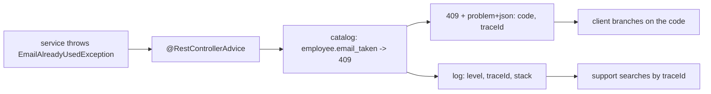
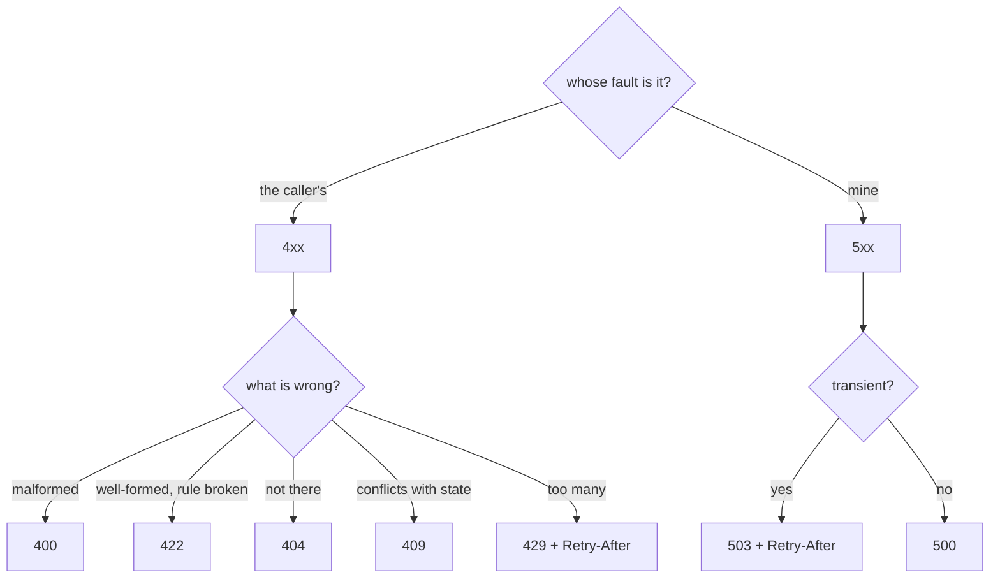
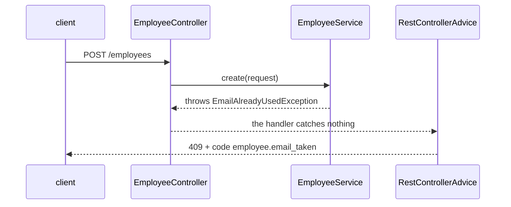
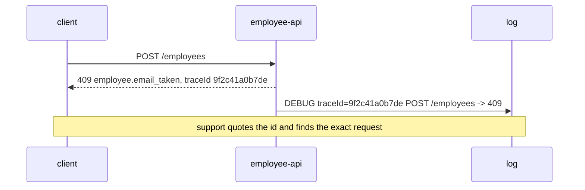

# Managing Errors and Error Codes

An API answers failures the same way it answers successes: with a **documented
shape**. Designing that shape is two decisions per failure:

1. **Which HTTP status carries it** — because gateways, caches, retry policies,
   circuit breakers and dashboards read only the status line.
2. **Which stable code names it** — because the client's `switch` needs the exact
   reason, and `409` alone does not say *which* conflict.

Everything else — where the mapping lives, what the body contains, what the log
gets — follows from those two.

## The status is the class, the code is the case



The status is a small, fixed, universally understood vocabulary. That is its
strength (everything in the network path understands it) and its limit (there are
only about ten useful ones). Your codes are unlimited and precise, but only your
own client parses them.

So you need both. `409 Conflict` tells the proxy not to cache and the retry
policy not to retry; `employee.email_taken` tells the sign-up form to highlight
the email field and say the address is in use.

| Failure | Status | Code |
|---|---|---|
| Body is malformed / a field is missing | `400` | `employee.validation_failed` |
| Body is well-formed, a rule says no | `422` | `employee.salary_below_minimum` |
| The thing is not there | `404` | `employee.not_found` |
| Conflicts with current state | `409` | `employee.email_taken` |
| Not authenticated / not allowed | `401` / `403` | `auth.token_expired` |
| Rate limited | `429` + `Retry-After` | `employee.rate_limited` |
| Dependency is down or slow | `503` / `504` + `Retry-After` | `employee.payroll_unavailable` |
| Anything you did not classify | `500` | `employee.internal_error` |

## Choosing the status



Two edges are worth arguing about in an interview:

- **`400` vs `422`.** `400` is "I could not even understand the request" —
  malformed JSON, a letter where a number belongs, a missing required field.
  `422` is "I understood it perfectly and I am refusing" — a salary below the
  legal minimum. Many teams use `400` for both and document it; what matters is
  that they are consistent and that the *code* distinguishes them.
- **`404` vs `403`.** If the caller may not even know the resource exists,
  answering `403` confirms it does. Answering `404` for both "missing" and
  "yours to not see" leaks nothing — see
  [designing a security scheme](topic:endpoint-security-design).

## The code has to survive a decade

The status changes never; the code must be just as immovable, because clients
branch on it. Four rules:

- **Lowercase, no spaces, machine-shaped**: `employee.email_taken`, not
  `"Employee email already used"`. A human sentence used as an identifier breaks
  every client the day someone fixes its typo or translates it.
- **Namespaced by the owning domain**: in a client that calls six services
  through a [gateway](topic:api-gateway), three of them will all say
  `not_found`, and the aggregated log cannot tell them apart.
- **Enumerable and published** — as an `enum` in your code, and as a table in
  the API docs. A client can only handle codes it can see; see
  [sharing API endpoints](topic:sharing-api-endpoints).
- **Append-only.** Adding a code is safe. Renaming or removing one breaks callers
  exactly as hard as removing an endpoint.

## The body: one shape for every failure

```json
{
  "type":      "https://api.acme.com/errors/employee.email_taken",
  "title":     "Email already used",
  "status":    409,
  "code":      "employee.email_taken",
  "detail":    "jane@acme.com already belongs to employee 4471",
  "instance":  "/employees",
  "traceId":   "9f2c41a0b7de",
  "retryable": false
}
```

This is [RFC 9457 Problem Details](https://www.rfc-editor.org/rfc/rfc9457)
(formerly RFC 7807), served as `application/problem+json` so a client can tell an
error body from a resource body without guessing. The division of labour inside
it is the whole point:

- `code` is **for machines** — stable forever, the thing to branch on.
- `title` / `detail` are **for humans** — free to be reworded, localized, or
  improved every release. Never parse them.
- `traceId` is **for the two of you** — see the logging section.
- `retryable` (plus `Retry-After`) is **an instruction**, not a description.

Validation is the case where one code is not enough: a form with three bad fields
needs to know *which three*, so the body carries a structured array —
`"errors": [{"field": "salary", "code": "must_be_positive"}]` — never a prose
sentence the client would have to parse.

The one thing this shape must never contain is anything about your inside: no
stack trace, no exception class, no SQL, no constraint name. That is a free map
for anyone probing the API, and it is a contract that breaks on your next library
upgrade.

## One place, not one per method



The service throws a word from the **domain's** vocabulary; the handler catches
nothing; one `@RestControllerAdvice` with `@ExceptionHandler` methods maps
exception types onto catalog rows. That is what makes the error format part of
the contract instead of a per-method accident — and it keeps `EmployeeService`
free of HTTP, so the same rule can be enforced from a scheduler or a message
consumer, where there is no response to put a status in. The mechanics of the
handler side are in
[designing endpoints in a REST controller](topic:rest-controller-endpoint-design)
and [resource exception handling](topic:resource-exception-handling).

Two consequences worth knowing:

- **Unmapped means `500`.** An exception no `@ExceptionHandler` claims falls to
  the catch-all. That is the correct default — an unrecognised failure *is* a
  server error until someone decides otherwise — but every unmapped exception is
  a case the client cannot handle and an alert somebody has to read.
- **Throw unchecked exceptions from services.** Spring rolls back on
  `RuntimeException` by default, so a checked exception silently commits unless
  you say `rollbackFor`; see
  [@Transactional rollback rules](topic:spring-transactional-rollback) and
  [exception types](topic:exception-basics).

## The other half is the log

A response tells the client what to do. A log tells you what happened. They are
joined by one value:



- **`5xx` → `ERROR`, with the full stack.** It is your bug until proven
  otherwise, and it is what the alert watches.
- **`4xx` → `DEBUG` or `INFO`, no stack.** A rejected form is not an incident.
  Logging every `400` at `ERROR` is how an alert becomes noise nobody reads.
- **The `traceId` goes in both**, and it is generated per request (a correlation
  id / `traceparent` header propagated across services). Without it, "it failed
  around three o'clock" is the entire investigation.
- **Alert on `5xx` rate and on unmapped-exception count**, not on `4xx`. A `4xx`
  spike is a client release or an attack — a dashboard, not a page.

## Telling the client to retry

`retryable` is the field that turns your error into behaviour. `429` and `503`
mean "not now": the correct client response is exponential backoff, ideally with
your `Retry-After` as the starting point. `400`, `404` and `409` mean "not like
this": repeating the identical request only burns the client's budget and yours.

Retrying safely is a two-sided contract — the client backs off and gives up
([timeouts, fallbacks and circuit breakers](topic:service-timeouts-fallbacks)),
and the server makes a retried write harmless with an idempotency key
([avoiding duplicate sales](topic:duplicate-sale-prevention),
[registering over an unreliable connection](topic:sales-api-unreliable-connection)).

## The 60-second interview answer

> I treat errors as part of the API contract, not as an afterthought. Every
> failure gets two things: an HTTP status, because that is what gateways, caches
> and retry policies read, and a stable application code like
> `employee.email_taken`, because the status alone does not say which conflict it
> was. The codes live in an enum and in the published docs — lowercase,
> namespaced by domain, never reworded, append-only, since renaming one breaks
> callers like removing an endpoint. Services throw domain exceptions, never HTTP
> ones; a single `@RestControllerAdvice` maps them to codes, so every endpoint
> reports errors identically and the domain stays free of HTTP. The body is
> `problem+json`: `code` for machines, `title`/`detail` for humans, `instance`,
> `traceId`, `retryable`, plus a per-field array for validation — and never a
> stack trace or a constraint name. The same `traceId` goes into the log, where
> `5xx` is logged at ERROR with the stack and alerted on, and `4xx` at DEBUG
> because it is the caller's mistake. And a failure is never answered with `200`
> — that hides the outage from everything built to notice it.

## Why it matters in production

- **A stable code is what lets a client automate.** With codes, a payment client
  can distinguish "card expired" (ask the user) from "issuer timeout" (retry).
  Without them, it matches on English strings and breaks on your next copy edit.
- **The `traceId` is the difference between a five-minute answer and an
  afternoon.** Support pastes the id; you get the exact request, the exact stack,
  the exact downstream call.
- **Leaked internals are a real finding in a real audit.** Constraint names,
  package paths and framework versions in error bodies are how an attacker maps
  your stack for free.
- **`4xx` at ERROR is how alerting dies.** Once the channel is noisy, the one
  genuine `5xx` spike scrolls past unread.
- **Errors cross service boundaries too.** When a downstream call fails, you
  decide what your caller sees: translate it into *your* catalog, never forward a
  foreign code or a foreign stack — see
  [types of interaction between microservices](topic:microservice-interaction-types).

## Common misconceptions

- **"The HTTP status is enough."** It is enough for the network, not for the
  application. There are dozens of distinct reasons behind `409` and one status
  to carry all of them.
- **"The error message is the error code."** A message is written for a human and
  will be reworded, translated, and corrected. The moment a client does
  `if (error.message == "Employee not found")`, your copy edits are breaking
  changes.
- **"Return `200` with `{"success": false}` so the client always parses one
  shape."** Then the retry policy does not retry, the circuit breaker stays
  closed, the proxy caches the failure, and the dashboard shows 100% success
  through an outage. An error smuggled through as a success is strictly worse
  than a `500`.
- **"Catch everything so the API never returns `500`."** A `500` you can see is
  better than a swallowed exception you cannot. The goal is not zero `500`s; it
  is zero *unclassified* failures.
- **"Numeric codes are more professional."** `ERR-1047` needs a lookup table to
  be readable in a log or a bug report. Namespaced strings are self-documenting
  and just as machine-friendly.
- **"Errors don't need versioning."** They are as public as your endpoints.
  Adding a code is additive; changing what an existing one means is a silent
  breaking change nobody's compiler will catch.
- **"`try/catch` in the controller gives better messages."** It gives *different*
  messages per method, which is precisely the problem: two endpoints then
  disagree about what "not found" looks like, and a client has to handle both.
