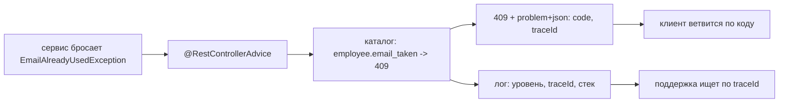
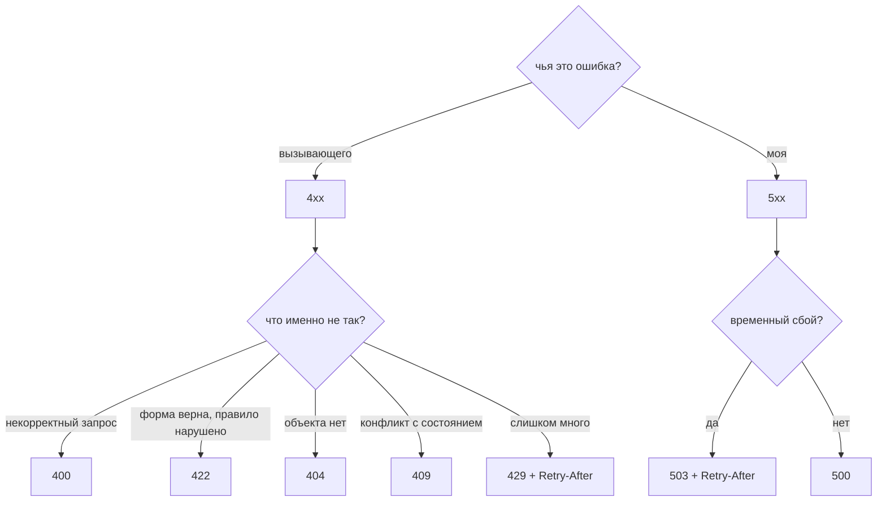
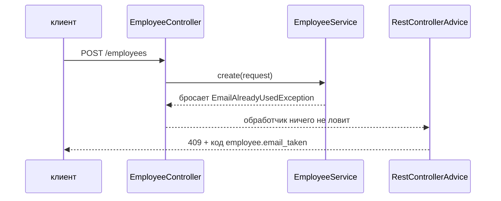
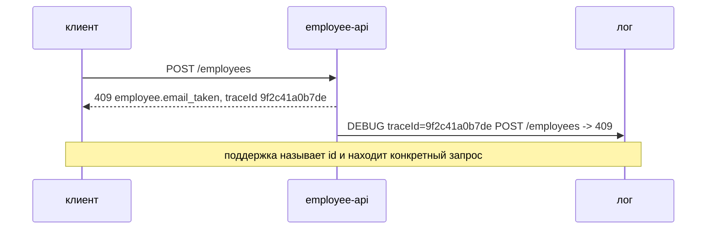

# Управление ошибками и коды ошибок

API отвечает на сбои так же, как на успехи, — **документированной формой**.
Спроектировать эту форму — значит принять два решения на каждый сбой:

1. **Какой HTTP-статус его несёт** — потому что шлюзы, кэши, политики повторов,
   предохранители и дашборды читают только строку статуса.
2. **Какой стабильный код его называет** — потому что `switch` в клиенте нужна
   точная причина, а `409` сам по себе не говорит, *какой* это конфликт.

Всё остальное — где живёт отображение, что лежит в теле, что попадает в лог —
следует из этих двух решений.

## Статус — это класс, код — это случай



Статус — это маленький, фиксированный, всем понятный словарь. В этом его сила
(его понимает всё по пути следования запроса) и его предел (полезных статусов
около десятка). Ваши коды не ограничены и точны, но разбирает их только ваш
собственный клиент.

Поэтому нужны оба. `409 Conflict` говорит прокси не кэшировать, а политике
повторов — не повторять; `employee.email_taken` говорит форме регистрации
подсветить поле email и написать, что адрес уже занят.

| Сбой | Статус | Код |
|---|---|---|
| Тело некорректно / нет поля | `400` | `employee.validation_failed` |
| Тело корректно, но правило запрещает | `422` | `employee.salary_below_minimum` |
| Объекта нет | `404` | `employee.not_found` |
| Конфликт с текущим состоянием | `409` | `employee.email_taken` |
| Не аутентифицирован / не разрешено | `401` / `403` | `auth.token_expired` |
| Превышен лимит запросов | `429` + `Retry-After` | `employee.rate_limited` |
| Зависимость недоступна или тормозит | `503` / `504` + `Retry-After` | `employee.payroll_unavailable` |
| Всё, что вы не классифицировали | `500` | `employee.internal_error` |

## Как выбрать статус



Две границы, о которых стоит поспорить на собеседовании:

- **`400` против `422`.** `400` — это «я даже не смог понять запрос»:
  некорректный JSON, буква там, где ждали число, отсутствующее обязательное
  поле. `422` — это «я понял его прекрасно и отказываю»: зарплата ниже
  установленного минимума. Многие команды используют `400` для обоих случаев и
  документируют это; важно лишь то, что они последовательны и что *код*
  различает эти случаи.
- **`404` против `403`.** Если вызывающему не положено даже знать о
  существовании ресурса, ответ `403` подтверждает, что ресурс есть. Ответ `404`
  и на «нет», и на «есть, но не для вас» не выдаёт ничего — см.
  [проектирование схемы безопасности](topic:endpoint-security-design).

## Код должен пережить десятилетие

Статусы не меняются никогда; код обязан быть настолько же неподвижным, потому
что клиенты ветвятся по нему. Четыре правила:

- **Строчными буквами, без пробелов, в машинной форме**: `employee.email_taken`,
  а не `"Employee email already used"`. Человеческая фраза в роли идентификатора
  ломает всех клиентов в тот день, когда кто-то исправит в ней опечатку или
  переведёт её.
- **С пространством имён владеющего домена**: в клиенте, который через
  [шлюз](topic:api-gateway) ходит в шесть сервисов, трое из них скажут
  `not_found`, и в сводном логе их будет не различить.
- **Перечислимы и опубликованы** — как `enum` в коде и как таблица в
  документации API. Клиент может обработать только те коды, которые видит; см.
  [публикация эндпоинтов API](topic:sharing-api-endpoints).
- **Только пополняется.** Добавить код безопасно. Переименовать или удалить —
  ломает вызывающих ровно так же сильно, как удаление эндпоинта.

## Тело: одна форма для всех сбоев

```json
{
  "type":      "https://api.acme.com/errors/employee.email_taken",
  "title":     "Email already used",
  "status":    409,
  "code":      "employee.email_taken",
  "detail":    "jane@acme.com already belongs to employee 4471",
  "instance":  "/employees",
  "traceId":   "9f2c41a0b7de",
  "retryable": false
}
```

Это [RFC 9457 Problem Details](https://www.rfc-editor.org/rfc/rfc9457) (ранее
RFC 7807), отдаваемый как `application/problem+json`, чтобы клиент отличал тело
ошибки от тела ресурса, не гадая. Разделение ролей внутри — это и есть весь
смысл:

- `code` — **для машин**: стабилен навсегда, именно по нему ветвятся.
- `title` / `detail` — **для людей**: их можно переформулировать, локализовать и
  улучшать хоть каждый релиз. Никогда не разбирайте их программно.
- `traceId` — **для вас двоих**: см. раздел про логи.
- `retryable` (плюс `Retry-After`) — **инструкция**, а не описание.

Валидация — тот случай, когда одного кода мало: форме с тремя неверными полями
надо знать, *какими именно тремя*, поэтому тело несёт структурированный массив —
`"errors": [{"field": "salary", "code": "must_be_positive"}]`, — а не фразу,
которую клиенту пришлось бы разбирать.

Единственное, чего в этой форме быть не должно, — что-либо о ваших
внутренностях: ни стека, ни класса исключения, ни SQL, ни имени ограничения. Это
бесплатная карта для любого, кто прощупывает API, и контракт, который сломается
на следующем обновлении библиотеки.

## Одно место, а не по одному на метод



Сервис бросает слово из словаря **домена**; обработчик ничего не ловит; один
`@RestControllerAdvice` с методами `@ExceptionHandler` отображает типы исключений
на строки каталога. Именно это делает формат ошибки частью контракта, а не
случайностью каждого метода, — и держит `EmployeeService` свободным от HTTP,
чтобы то же правило можно было применить из планировщика или консьюмера
сообщений, где нет ответа, куда положить статус. Механика со стороны обработчика
разобрана в
[проектировании эндпоинтов REST-контроллера](topic:rest-controller-endpoint-design)
и [обработке исключений ресурса](topic:resource-exception-handling).

Два следствия, которые стоит знать:

- **Не отображено — значит `500`.** Исключение, на которое не претендует ни один
  `@ExceptionHandler`, проваливается в общий перехватчик. Это правильное
  поведение по умолчанию — нераспознанный сбой *является* серверной ошибкой,
  пока не решено иначе, — но каждое неотображённое исключение это случай,
  который клиент не может обработать, и тревога, которую кому-то придётся
  читать.
- **Бросайте из сервисов непроверяемые исключения.** Spring по умолчанию
  откатывает транзакцию на `RuntimeException`, поэтому проверяемое исключение
  молча зафиксирует её, если не указать `rollbackFor`; см.
  [правила отката @Transactional](topic:spring-transactional-rollback) и
  [типы исключений](topic:exception-basics).

## Вторая половина — это лог

Ответ говорит клиенту, что делать. Лог говорит вам, что произошло. Их связывает
одно значение:



- **`5xx` → `ERROR`, с полным стеком.** Это ваша ошибка, пока не доказано
  обратное, и именно за ней следит алерт.
- **`4xx` → `DEBUG` или `INFO`, без стека.** Отклонённая форма — не инцидент.
  Писать каждый `400` на уровне `ERROR` — верный способ превратить алерт в шум,
  который никто не читает.
- **`traceId` попадает в оба места** и генерируется на каждый запрос
  (корреляционный id / заголовок `traceparent`, пробрасываемый между сервисами).
  Без него всё расследование — это «сломалось где-то около трёх».
- **Оповещения настраивают на долю `5xx` и на число неотображённых исключений**,
  а не на `4xx`. Всплеск `4xx` — это релиз клиента или атака: повод для
  дашборда, а не для звонка ночью.

## Как сказать клиенту, что стоит повторить

`retryable` — то поле, которое превращает вашу ошибку в поведение. `429` и `503`
означают «не сейчас»: правильная реакция клиента — экспоненциальная задержка,
желательно отталкиваясь от вашего `Retry-After`. `400`, `404` и `409` означают
«не так»: повтор того же самого запроса лишь сожжёт бюджет клиента и ваш.

Безопасный повтор — двусторонний контракт: клиент отступает и сдаётся
([таймауты, фолбэки и предохранители](topic:service-timeouts-fallbacks)), а
сервер делает повторную запись безвредной с помощью ключа идемпотентности
([предотвращение дублей продаж](topic:duplicate-sale-prevention),
[регистрация при ненадёжном соединении](topic:sales-api-unreliable-connection)).

## Ответ на собеседовании за 60 секунд

> Я отношусь к ошибкам как к части контракта API, а не как к тому, о чём
> вспоминают в конце. У каждого сбоя есть две вещи: HTTP-статус, потому что
> именно его читают шлюзы, кэши и политики повторов, и стабильный прикладной код
> вроде `employee.email_taken`, потому что один статус не говорит, какой это был
> конфликт. Коды живут в `enum` и в опубликованной документации: строчными
> буквами, с пространством имён по домену, без переформулировок, только
> пополняются, потому что переименование кода ломает вызывающих как удаление
> эндпоинта. Сервисы бросают доменные исключения, а не HTTP-шные; один
> `@RestControllerAdvice` отображает их в коды, поэтому все эндпоинты сообщают об
> ошибках одинаково, а домен остаётся свободным от HTTP. Тело — `problem+json`:
> `code` для машин, `title`/`detail` для людей, `instance`, `traceId`,
> `retryable` плюс массив по полям для валидации — и никогда ни стека, ни имени
> ограничения. Тот же `traceId` уходит в лог, где `5xx` пишется на уровне ERROR
> со стеком и по нему настроены оповещения, а `4xx` — на уровне DEBUG, потому что
> это ошибка вызывающего. И на сбой никогда не отвечают `200`: это прячет аварию
> от всего, что построено её замечать.

## Почему это важно в продакшене

- **Стабильный код — это то, что позволяет клиенту автоматизировать
  реакцию.** С кодами платёжный клиент отличит «карта просрочена» (спросить
  пользователя) от «таймаут эмитента» (повторить). Без них он сравнивает
  английские строки и ломается на вашей следующей правке текста.
- **`traceId` — это разница между ответом за пять минут и потерянным днём.**
  Поддержка вставляет id, вы получаете конкретный запрос, конкретный стек,
  конкретный вызов вниз по цепочке.
- **Утёкшие внутренности — это реальная находка реального аудита.** Имена
  ограничений, пути пакетов и версии фреймворка в телах ошибок — это способ
  бесплатно составить карту вашего стека.
- **`4xx` на уровне ERROR — это то, как умирает алертинг.** Как только канал
  зашумлён, единственный настоящий всплеск `5xx` пролистывают, не прочитав.
- **Ошибки пересекают и границы сервисов.** Когда вызов вниз по цепочке
  падает, вы решаете, что увидит ваш вызывающий: переведите ошибку в *свой*
  каталог, никогда не пробрасывайте чужой код или чужой стек — см.
  [типы взаимодействия между микросервисами](topic:microservice-interaction-types).

## Частые заблуждения

- **«HTTP-статуса достаточно».** Его достаточно сети, но не приложению. За `409`
  стоят десятки разных причин, а статус, который их несёт, один.
- **«Сообщение об ошибке и есть код ошибки».** Сообщение написано для человека,
  и его будут переформулировать, переводить и исправлять. Как только клиент
  напишет `if (error.message == "Employee not found")`, ваши правки текстов
  станут ломающими изменениями.
- **«Верну `200` с `{"success": false}`, чтобы клиент всегда разбирал одну
  форму».** Тогда политика повторов не повторит, предохранитель не разомкнётся,
  прокси закэширует сбой, а дашборд покажет 100% успеха на протяжении всей
  аварии. Ошибка, провезённая контрабандой как успех, строго хуже `500`.
- **«Перехвачу всё, чтобы API никогда не отдавал `500`».** Видимый `500` лучше
  проглоченного исключения, которого не видно. Цель — не ноль `500`, а ноль
  *неклассифицированных* сбоев.
- **«Числовые коды профессиональнее».** Чтобы прочитать `ERR-1047` в логе или в
  баг-репорте, нужна таблица соответствий. Строки с пространством имён
  самодокументируемы и настолько же удобны машине.
- **«Ошибки не нуждаются в версионировании».** Они настолько же публичны, как
  ваши эндпоинты. Добавление кода аддитивно; изменение смысла существующего —
  тихое ломающее изменение, которое не поймает ни один компилятор.
- **«`try/catch` в контроллере даёт более понятные сообщения».** Он даёт *разные*
  сообщения в каждом методе, и в этом-то и проблема: два эндпоинта начинают
  по-разному понимать, как выглядит «не найдено», а клиенту приходится
  обрабатывать оба варианта.
