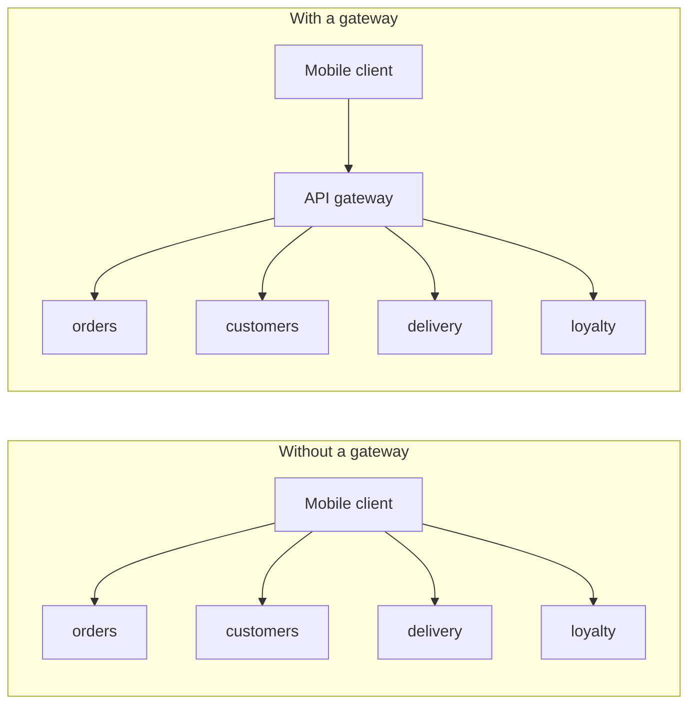
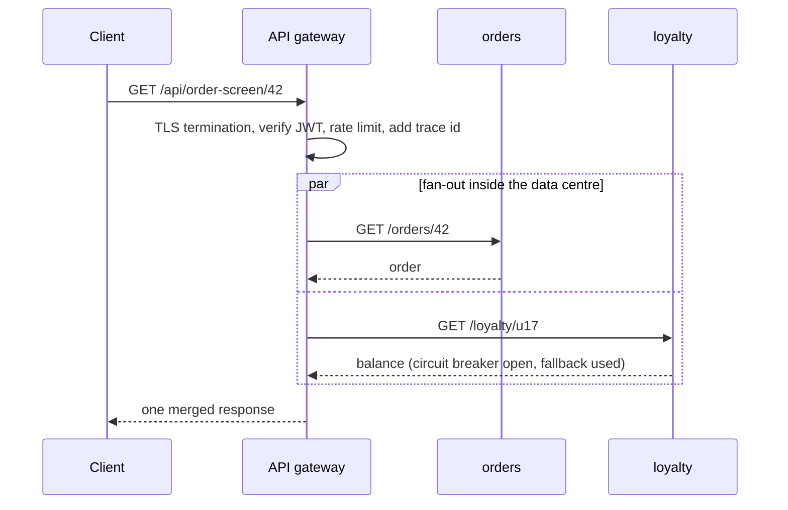
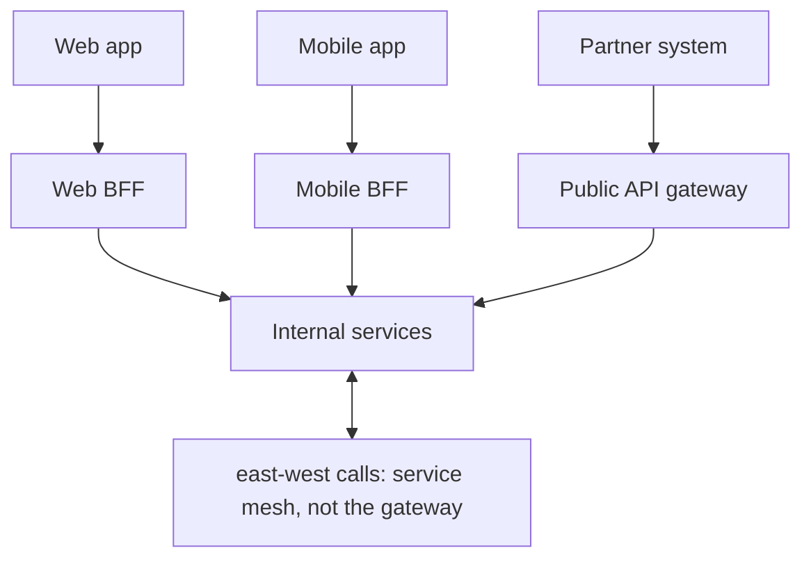

# Why an API Gateway Is Needed

An API gateway is a server that sits at the **edge** of your system and is the single address every external client talks to. It accepts the request, applies policy, decides which internal service should handle it, forwards it, and returns the response.

The reason it exists is easier to see by first removing it.

## The problem it solves

Once a system is split into services (see [Why Microservices Are Used](topic:why-microservices)), a mobile app that wants to render one order screen needs the order, the customer, the delivery status and the loyalty balance. Without a gateway, the app calls four services directly. That immediately creates five separate problems:

1. **The client knows your internal topology.** Four hostnames, four ports, four API versions are baked into a shipped mobile app. Split `orders` into `orders` + `pricing` next quarter and you break clients you cannot force to upgrade.
2. **Chatty communication over the worst network.** Four round trips over mobile latency, sequentially if they depend on each other. Inside the data centre those calls are cheap; from a phone they are not.
3. **Cross-cutting concerns get duplicated.** Authentication, rate limiting, TLS termination, CORS, request logging, correlation ids — every service implements them, slightly differently, and one of them gets it wrong.
4. **Every service is exposed to the internet.** The attack surface is the whole system, not one hardened front door.
5. **The public API is frozen to the internal design.** You cannot reorganise services without renegotiating with every consumer.

The gateway turns a many-to-many mesh of client-to-service links into a one-to-many fan-out behind a stable façade. Architecturally it is a **reverse proxy with policy**: the same idea as the [Proxy pattern](topic:decorator-vs-proxy), applied at the network edge, and internally usually built as a filter chain — a [Chain of Responsibility](topic:chain-of-responsibility) where each filter can inspect, modify, short-circuit or pass the request on.

## What a gateway actually does

**1. Routing and request dispatch.** Match on path, host, header, method or query (`/api/orders/**` → the `orders` service) and forward. It resolves the target through service discovery or the platform's DNS, so it always talks to live instances. This is the job that decouples the public URL space from the internal service split.

**2. Authentication and token handling.** Validate the JWT signature or the opaque token once, reject anonymous traffic at the door, and pass a verified identity downstream. A common pattern is **token translation**: the outside world presents an opaque session token, the gateway exchanges it for an internal JWT the services trust. Coarse-grained authorization ("is this caller allowed to touch the admin API at all?") belongs here; fine-grained authorization ("may this user edit *this* order?") stays in the service.

**3. Rate limiting, quotas and load shedding.** Per-client, per-API-key or per-tenant limits, enforced before the request costs you anything downstream. This is genuinely hard to do correctly in each service independently, because a limit is a property of the *caller* across all endpoints, not of one service.

**4. Protocol and format translation.** Browsers speak HTTP/1.1 and JSON. Internally you may run gRPC, or want a request to end up on a Kafka topic. The gateway can terminate TLS, translate REST to gRPC, expose an HTTP endpoint whose handler publishes a message asynchronously, or downgrade HTTP/2 for old clients. That decoupling lets internal transports evolve — the menu of them is in [Options for Configuring Inter-Service Communication](topic:inter-service-communication-options).

**5. Response aggregation (used sparingly).** One client call, several backend calls, one merged response. This is what fixes the mobile round-trip problem — one request instead of four, executed in parallel inside the data centre.

**6. Edge reliability.** Timeouts, retries, circuit breakers, bulkheads and fallbacks at the boundary, so one sick service degrades one part of the response instead of hanging every client connection. The mechanics are in [Service Timeouts, Fallbacks, and Circuit Breakers](topic:service-timeouts-fallbacks).

**7. Observability and control.** A single choke point where every external request gets a correlation id, a trace span, an access log line and a latency metric — and where you can canary, blue-green, mirror traffic, or serve a maintenance page.

## Gateway, load balancer, service mesh, BFF

Interviewers probe here, because the terms overlap.

| Component | Traffic | Decides by | Typical jobs |
| --- | --- | --- | --- |
| Load balancer | north-south or east-west | connection or simple L7 rules | spread load over identical instances, health checks |
| API gateway | **north-south** (client → system) | API semantics: route, client, token | authn, rate limit, routing, translation, aggregation |
| Service mesh | **east-west** (service → service) | per-call policy in a sidecar | mTLS, retries, timeouts, telemetry between services |
| BFF | north-south, one per client type | the needs of one UI | client-specific shaping and aggregation |

A load balancer distributes traffic across interchangeable copies; a gateway makes a routing and policy decision about *what the request is*. A mesh applies similar policies but on internal calls, where the gateway has no visibility at all. They are complements — gateway at the front door, mesh in the corridors.

**BFF (Backend for Frontend)** is the answer to "our web app and our mobile app want different shapes of the same data". Instead of one gateway growing conditional logic for every client, you run a thin gateway per client type. It is a variation of the gateway, not a competitor.

## 60-second interview answer

> An API gateway is the single entry point for external traffic into a system of many services. Without it, every client has to know which service owns what, a mobile screen costs several round trips over a slow network, and every service re-implements authentication, rate limiting, TLS and CORS — usually inconsistently. The gateway centralises exactly those edge concerns: it routes by path or host to the right service using service discovery, validates tokens and enforces coarse-grained authorization, applies per-client rate limits, terminates TLS, translates protocols such as REST to gRPC, can aggregate several backend calls into one response, and adds timeouts, circuit breakers, correlation ids and metrics at the boundary. Just as importantly it decouples the public contract from the internal split, so services can be reorganised without breaking shipped clients. The limits matter too: it only sees north-south traffic, so internal service-to-service calls bypass it — that is a service mesh's job — and services must still authorize their own requests rather than trusting the network. It is on the critical path, so it runs as several stateless replicas behind a load balancer, and it must stay thin: business logic in the gateway recreates the monolith you were trying to avoid. In a Spring stack this is usually Spring Cloud Gateway; in the wider ecosystem, Kong, Envoy, Traefik, NGINX or a managed cloud gateway.

## Production relevance

**It is on the critical path, so it must be boring.** Every external request goes through it: if it is down, everything is down. Run several stateless replicas behind a plain L4 load balancer, keep no session state in it, and treat its latency budget as sacred. The "single point of failure" objection is real but is solved by replication — the alternative, every client hard-wired to every service, fails in more ways and more quietly.

**Thin gateway, fat services.** The most common way gateways go wrong is scope creep: a little transformation, then a validation rule, then a business condition. Now every team's feature needs a gateway change, the gateway team is a release bottleneck, and you have a distributed monolith with an extra hop. Keep it to routing and cross-cutting policy; put anything domain-specific in a service or a BFF owned by the client team.

**Configuration is a deployment artefact.** Routes, rate limits and timeouts should be versioned and reviewed like code, not clicked into a console. A wrong route or a rate limit that is an order of magnitude too low is an outage with no stack trace.

**Watch the latency and the fan-out.** The gateway adds a hop, which is fine; what is not fine is an aggregation endpoint that quietly calls seven services, because its availability becomes the product of theirs and its latency the worst of theirs. Aggregate deliberately, in parallel, with per-call timeouts and partial-response fallbacks.

**Gateway timeouts do not protect internal calls.** A common incident shape: the gateway has a sane 2-second timeout, but service A calls service B with no timeout at all. The client gets its 504 and retries while the internal call is still hanging a thread. Edge policy and internal policy are separate configurations — see [Types of Interaction Between Microservices](topic:microservice-interaction-types).

## Common misconceptions

- **"An API gateway is just a load balancer."** A load balancer spreads traffic across interchangeable instances. A gateway makes semantic decisions — which service, which version, is this caller authenticated, has this API key exceeded its quota, should this REST call become a gRPC call. You usually have both, with the load balancer in front of the gateway replicas.
- **"The gateway secures the system."** It secures the *front door*. Internal east-west calls never pass through it, so a compromised pod inside the network can talk to any service directly. Services must still authenticate and authorize their callers — mTLS or token validation — rather than assuming "if it reached me, the gateway approved it".
- **"Authorization can move entirely into the gateway."** Coarse-grained checks can. Ownership rules ("this user may only see their own orders") depend on domain data the gateway does not have, and pushing that data into the gateway couples it to every domain model.
- **"A gateway replaces a service mesh."** North-south versus east-west. A mesh gives you mTLS, retries and telemetry on calls the gateway never sees; a gateway gives you client-facing concerns a mesh has no concept of, like API keys and quotas.
- **"You need exactly one gateway."** The BFF pattern deliberately runs one per client type, and large organisations often run a separate partner/public gateway with stricter quotas. One gateway per client audience is a feature; one gateway with a giant `if` per client is the anti-pattern.
- **"Aggregation in the gateway is free."** It moves the fan-out from the client to the server, which is a real win over mobile networks, but it also makes the gateway's response depend on N services at once. Without per-call timeouts and fallbacks you have coupled the availability of every screen to the least reliable backend.
- **"It removes the need for service discovery."** The gateway is a *consumer* of discovery — it has to resolve `orders` to live instances somehow, via a registry or platform DNS. It centralises discovery for external callers; it does not eliminate it.
- **"A gateway makes synchronous calls the only option."** A gateway endpoint can accept a request, publish a message and return `202 Accepted`, which is often the right shape for slow work — the trade-offs are in [Synchronous vs Asynchronous Communication](topic:sync-vs-async-communication) and [Choosing Sync or Async Service Communication](topic:service-communication-choice).
- **"Adding a gateway is what makes an API well designed."** It routes and protects; it does not fix resource modelling, status codes or versioning. Those decisions still have to be made in the API itself — see [Employee API: Design](topic:employee-api-design) and [REST and Separation of Concerns](topic:employee-api-rest-cqrs).
