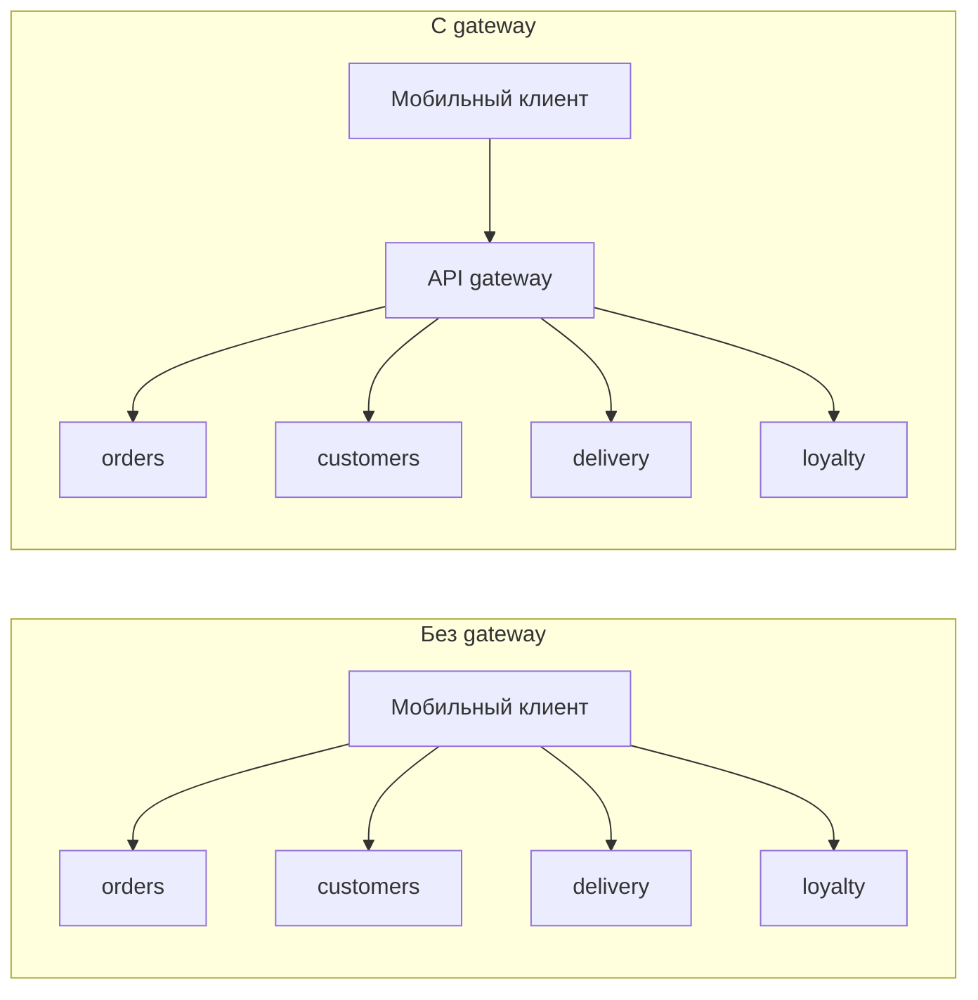
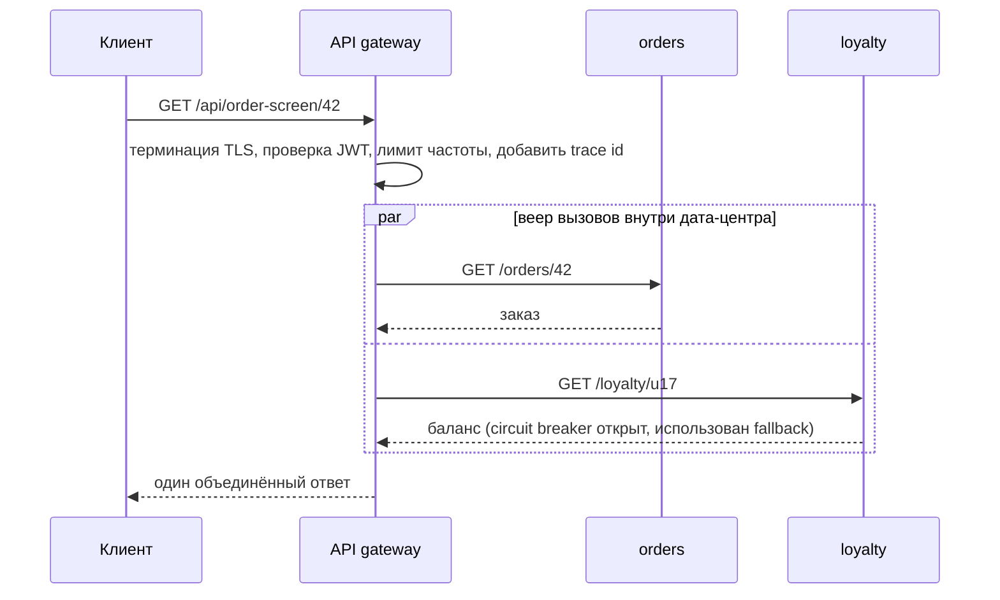
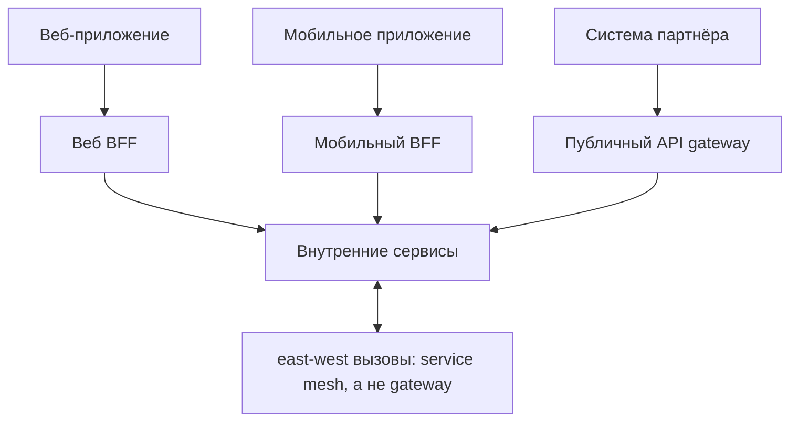

# Зачем нужен API Gateway

API gateway - это сервер, который стоит на **периметре** системы и является единственным адресом, с которым общается любой внешний клиент. Он принимает запрос, применяет политику, решает, какой внутренний сервис должен его обработать, пересылает его и возвращает ответ.

Зачем он нужен, проще понять, если сначала его убрать.

## Какую проблему он решает

Как только система разрезана на сервисы (см. [Зачем нужны микросервисы](topic:why-microservices)), мобильному приложению, чтобы отрисовать один экран заказа, нужны сам заказ, клиент, статус доставки и баланс бонусов. Без gateway приложение вызывает четыре сервиса напрямую. Это сразу создаёт пять отдельных проблем:

1. **Клиент знает вашу внутреннюю топологию.** Четыре хоста, четыре порта, четыре версии API зашиты в уже выпущенное мобильное приложение. Разделите в следующем квартале `orders` на `orders` + `pricing` - и вы сломаете клиентов, которых не можете принудительно обновить.
2. **Болтливое общение по самой плохой сети.** Четыре обращения при мобильных задержках, причём последовательно, если они зависят друг от друга. Внутри дата-центра такие вызовы дешёвые, с телефона - нет.
3. **Сквозная функциональность дублируется.** Аутентификация, ограничение частоты запросов, терминация TLS, CORS, логирование запросов, correlation id - каждый сервис реализует это сам, чуть по-своему, и где-то обязательно с ошибкой.
4. **Каждый сервис открыт в интернет.** Поверхность атаки - вся система, а не одна укреплённая входная дверь.
5. **Публичный API намертво связан с внутренним устройством.** Нельзя перекроить сервисы, не договариваясь заново с каждым потребителем.

Gateway превращает сетку связей «многие клиенты - многие сервисы» в веер вызовов за стабильным фасадом. Архитектурно это **обратный прокси с политикой**: та же идея, что и у [паттерна Proxy](topic:decorator-vs-proxy), только применённая на сетевом периметре, а внутри он обычно построен как цепочка фильтров - [Chain of Responsibility](topic:chain-of-responsibility), где каждый фильтр может изучить запрос, изменить его, оборвать обработку или передать дальше.

## Что gateway делает на самом деле

**1. Маршрутизация и диспетчеризация запросов.** Сопоставление по пути, хосту, заголовку, методу или параметрам (`/api/orders/**` → сервис `orders`) и пересылка. Цель он находит через service discovery или DNS платформы, поэтому всегда обращается к живым экземплярам. Именно эта работа отвязывает публичное пространство URL от внутреннего разделения на сервисы.

**2. Аутентификация и работа с токенами.** Проверить подпись JWT или непрозрачный токен один раз, отсечь анонимный трафик на входе и передать вниз уже подтверждённую личность. Распространённый приём - **трансляция токена**: внешний мир предъявляет непрозрачный токен сессии, а gateway меняет его на внутренний JWT, которому доверяют сервисы. Грубая авторизация («имеет ли этот вызывающий право вообще трогать админский API?») - это сюда; тонкая авторизация («может ли этот пользователь редактировать *именно этот* заказ?») остаётся в сервисе.

**3. Ограничение частоты, квоты и сброс нагрузки.** Лимиты на клиента, на API-ключ или на арендатора, применяемые до того, как запрос начнёт что-то стоить внутри. Сделать это корректно в каждом сервисе по отдельности по-настоящему трудно, потому что лимит - это свойство *вызывающего* по всем эндпоинтам сразу, а не свойство одного сервиса.

**4. Трансляция протоколов и форматов.** Браузеры говорят на HTTP/1.1 и JSON. Внутри у вас может быть gRPC, а какой-то запрос вообще должен оказаться в топике Kafka. Gateway может терминировать TLS, переводить REST в gRPC, выставить HTTP-эндпоинт, обработчик которого асинхронно публикует сообщение, или понижать HTTP/2 для старых клиентов. Такая развязка позволяет внутренним транспортам эволюционировать - их перечень есть в теме [Варианты настройки взаимодействия между сервисами](topic:inter-service-communication-options).

**5. Агрегация ответов (применять умеренно).** Один вызов клиента, несколько обращений к бэкенду, один объединённый ответ. Именно это лечит проблему мобильных round trip - один запрос вместо четырёх, выполненных параллельно внутри дата-центра.

**6. Надёжность на периметре.** Таймауты, повторы, circuit breaker, bulkhead и fallback на границе, чтобы один больной сервис деградировал одну часть ответа, а не подвешивал все клиентские соединения. Механика описана в теме [Таймауты, fallback и circuit breaker](topic:service-timeouts-fallbacks).

**7. Наблюдаемость и управление.** Единая точка, где каждый внешний запрос получает correlation id, span трассировки, строку в access-логе и метрику задержки, - и где можно делать canary, blue-green, зеркалировать трафик или показать страницу техобслуживания.

## Gateway, балансировщик, service mesh, BFF

Здесь интервьюеры копают, потому что термины перекрываются.

| Компонент | Трафик | Решает по | Типичные задачи |
| --- | --- | --- | --- |
| Балансировщик нагрузки | north-south или east-west | соединение или простые правила L7 | распределить нагрузку по одинаковым экземплярам, health checks |
| API gateway | **north-south** (клиент → система) | смысл API: маршрут, клиент, токен | аутентификация, лимиты, маршрутизация, трансляция, агрегация |
| Service mesh | **east-west** (сервис → сервис) | политика на вызов в sidecar | mTLS, повторы, таймауты, телеметрия между сервисами |
| BFF | north-south, по одному на тип клиента | потребности одного UI | подгонка и агрегация под конкретного клиента |

Балансировщик распределяет трафик по взаимозаменяемым копиям; gateway принимает решение о маршруте и политике исходя из того, *что это за запрос*. Service mesh применяет похожие политики, но на внутренних вызовах, которых gateway вообще не видит. Они дополняют друг друга - gateway у входной двери, mesh в коридорах.

**BFF (Backend for Frontend)** - это ответ на ситуацию «нашему веб-приложению и нашему мобильному приложению нужны разные формы одних и тех же данных». Вместо одного gateway, обрастающего условной логикой под каждого клиента, вы запускаете тонкий gateway на каждый тип клиента. Это разновидность gateway, а не конкурент ему.

## Ответ за 60 секунд

> API gateway - это единая точка входа для внешнего трафика в систему из множества сервисов. Без него каждый клиент обязан знать, какому сервису что принадлежит, один мобильный экран стоит нескольких обращений по медленной сети, а каждый сервис заново реализует аутентификацию, ограничение частоты, TLS и CORS - обычно по-разному. Gateway централизует ровно эти периметровые задачи: маршрутизирует по пути или хосту в нужный сервис, используя service discovery, проверяет токены и применяет грубую авторизацию, накладывает лимиты на клиента, терминирует TLS, транслирует протоколы вроде REST в gRPC, может собрать несколько обращений к бэкенду в один ответ и добавляет таймауты, circuit breaker, correlation id и метрики на границе. Не менее важно, что он отвязывает публичный контракт от внутреннего разделения, так что сервисы можно перекраивать, не ломая уже выпущенных клиентов. Ограничения тоже существенны: он видит только north-south трафик, поэтому внутренние вызовы между сервисами проходят мимо - это задача service mesh, - и сервисы обязаны авторизовать запросы сами, а не доверять сети. Он находится на критическом пути, поэтому работает как несколько stateless-реплик за балансировщиком, и должен оставаться тонким: бизнес-логика в gateway воссоздаёт тот самый монолит, от которого вы уходили. В стеке Spring это обычно Spring Cloud Gateway; в более широкой экосистеме - Kong, Envoy, Traefik, NGINX или управляемый облачный gateway.

## Значение в продакшене

**Он на критическом пути, поэтому должен быть скучным.** Через него идёт каждый внешний запрос: если он лежит, лежит всё. Запускайте несколько stateless-реплик за обычным L4-балансировщиком, не храните в нём состояния сессии и относитесь к его бюджету задержки как к священному. Возражение про «единую точку отказа» справедливо, но решается репликацией - альтернатива, где каждый клиент намертво привязан к каждому сервису, ломается большим числом способов и куда незаметнее.

**Тонкий gateway, толстые сервисы.** Чаще всего gateway портится из-за расползания задач: сначала небольшое преобразование, потом правило валидации, потом бизнес-условие. И вот уже фича любой команды требует изменения gateway, команда gateway становится узким местом релизов, а у вас распределённый монолит с лишним прыжком. Держите в нём только маршрутизацию и сквозные политики; всё предметное - в сервис или в BFF, которым владеет команда клиента.

**Конфигурация - это артефакт развёртывания.** Маршруты, лимиты и таймауты должны версионироваться и проходить ревью как код, а не кликаться в консоли. Неверный маршрут или лимит, заниженный на порядок, - это авария без единого стектрейса.

**Следите за задержкой и веером вызовов.** Gateway добавляет прыжок, и это нормально; ненормально - эндпоинт агрегации, который втихую вызывает семь сервисов, потому что его доступность становится произведением их доступностей, а задержка - худшей из их задержек. Агрегируйте осознанно, параллельно, с таймаутом на каждый вызов и с fallback на частичный ответ.

**Таймауты gateway не защищают внутренние вызовы.** Типичная форма инцидента: у gateway разумный таймаут в 2 секунды, но сервис A вызывает сервис B вообще без таймаута. Клиент получает свой 504 и повторяет запрос, пока внутренний вызов всё ещё держит поток. Политика периметра и внутренняя политика - это разные конфигурации, см. [Типы взаимодействия между микросервисами](topic:microservice-interaction-types).

## Частые заблуждения

- **«API gateway - это просто балансировщик нагрузки».** Балансировщик распределяет трафик по взаимозаменяемым экземплярам. Gateway принимает смысловые решения: какой сервис, какая версия, аутентифицирован ли вызывающий, не исчерпал ли этот API-ключ квоту, надо ли превратить этот REST-вызов в gRPC. Обычно у вас есть и то и другое, причём балансировщик стоит перед репликами gateway.
- **«Gateway защищает систему».** Он защищает *входную дверь*. Внутренние east-west вызовы через него не проходят, поэтому скомпрометированный под внутри сети может обращаться к любому сервису напрямую. Сервисы обязаны сами аутентифицировать и авторизовать вызывающих - mTLS или проверка токена, - а не исходить из принципа «раз запрос дошёл до меня, значит gateway его одобрил».
- **«Авторизацию можно полностью перенести в gateway».** Грубые проверки - можно. Правила владения («пользователь видит только свои заказы») зависят от предметных данных, которых у gateway нет, а протаскивание этих данных в gateway привязывает его к каждой доменной модели.
- **«Gateway заменяет service mesh».** North-south против east-west. Mesh даёт mTLS, повторы и телеметрию на вызовах, которых gateway никогда не видит; gateway даёт клиентские вещи, о которых mesh не имеет понятия, - вроде API-ключей и квот.
- **«Gateway должен быть ровно один».** Паттерн BFF намеренно запускает по одному на тип клиента, а крупные организации часто держат отдельный партнёрский/публичный gateway с более жёсткими квотами. Один gateway на аудиторию клиентов - это преимущество; один gateway с гигантским `if` под каждого клиента - антипаттерн.
- **«Агрегация в gateway бесплатна».** Она переносит веер вызовов с клиента на сервер, что действительно выигрыш на мобильных сетях, но при этом ответ gateway начинает зависеть сразу от N сервисов. Без таймаута на каждый вызов и без fallback вы связали доступность каждого экрана с самым ненадёжным бэкендом.
- **«Он убирает необходимость в service discovery».** Gateway - *потребитель* discovery: ему как-то надо превратить `orders` в живые экземпляры, через реестр или DNS платформы. Он централизует обнаружение для внешних вызывающих, но не устраняет его.
- **«С gateway возможны только синхронные вызовы».** Эндпоинт gateway может принять запрос, опубликовать сообщение и вернуть `202 Accepted`, и для долгой работы это часто правильная форма - компромиссы разобраны в темах [Синхронное и асинхронное взаимодействие](topic:sync-vs-async-communication) и [Выбор синхронного или асинхронного взаимодействия сервисов](topic:service-communication-choice).
- **«Добавление gateway само по себе делает API хорошо спроектированным».** Он маршрутизирует и защищает, но не исправляет моделирование ресурсов, коды статусов или версионирование. Эти решения всё равно принимаются в самом API - см. [Employee API: проектирование](topic:employee-api-design) и [REST и разделение ответственности](topic:employee-api-rest-cqrs).
