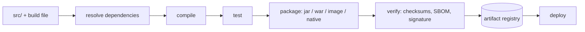
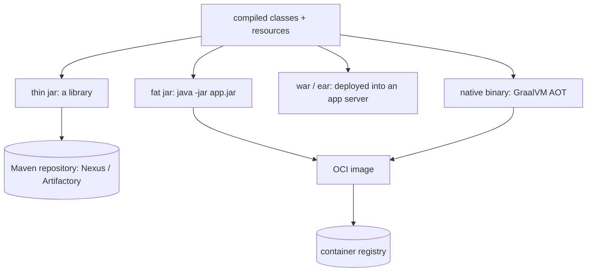
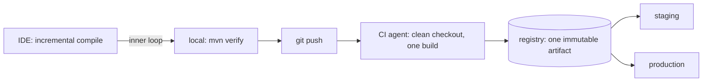

# Ways to build an application

**A build turns a source tree into an artifact you can deploy.** Nothing more
mysterious than that: resolve dependencies, compile, run tests, package the
result, publish it somewhere a deployment can pull it from.

So "what are the ways to build applications" is really four independent
questions, and a good answer walks all four:

1. **What drives the build** — `javac` by hand, Ant, Maven, Gradle, Bazel.
2. **What comes out** — a library jar, a fat jar, a war, a container image, a
   native binary.
3. **Where it runs** — the IDE, your machine, inside a container, on a CI agent.
4. **What makes the result trustworthy** — pinned dependencies, honest caches,
   reproducibility, provenance.

Those stages are the same everywhere. The choices below are about *who* performs
them and *what* they hand over.

## 1. The tool that drives the build

| Tool | Model | Where it fits |
|---|---|---|
| `javac` + `jar` | you invoke the compiler yourself | teaching, tiny tools; no dependency resolution |
| Ant (+ Ivy) | imperative XML targets, no conventions | legacy projects you inherit |
| Maven | declarative XML, one fixed lifecycle, plugins bound to phases | the default for most Java services |
| Gradle | a task graph in Groovy/Kotlin DSL, incremental + cached | large multi-module builds, Android |
| Bazel / Pants | hermetic, content-addressed, remote cache and execution | monorepos where a full build is unaffordable |

**Doing it by hand** is worth understanding once, because it shows what the tools
automate: `javac -cp lib/* -d out $(find src -name '*.java')`, then `jar cfe
app.jar Main -C out .`. See [how Java source becomes running
code](topic:jvm-source-code-flow). It stops being viable at the third
dependency — nothing resolves transitive dependencies or their versions for you.

**Maven** is convention over configuration. Source lives in `src/main/java`, the
lifecycle is fixed (`validate → compile → test → package → verify → install →
deploy`), and running `mvn package` runs every phase up to that one. Because the
lifecycle is fixed, any Maven project is buildable by anyone with one command,
and any two Maven projects look the same. The price is that anything the
lifecycle did not anticipate becomes an awkward plugin configuration.

**Gradle** models the build as a graph of tasks with declared inputs and outputs.
That declaration is what buys incrementality: a task whose inputs are unchanged
is skipped (`UP-TO-DATE`) or restored from the build cache (`FROM-CACHE`), local
or shared across the team and CI. On a fifty-module build that is the difference
between two minutes and twenty. The price is that a build script is a program:
it can do anything, including become unmaintainable.

**Bazel and friends** go further — every action declares its exact inputs, runs
sandboxed, and is keyed by a hash of them, so results are shared across an entire
organisation and only what actually changed is rebuilt. You pay with a steep
learning curve and by describing your dependencies far more precisely than Maven
ever asked.

Two things matter more than the choice:

- **One command builds everything.** `mvn verify` or `./gradlew build` from a
  clean checkout, no manual steps in a README. If a new hire cannot build on day
  one, the build is broken regardless of the tool.
- **Ship the wrapper.** `mvnw` / `gradlew` pin the *build tool's* version in the
  repository, so your machine, a colleague's and the CI agent all run the same
  one. Pin the JDK too — Gradle toolchains or Maven's toolchains plugin — rather
  than trusting whatever `JAVA_HOME` happens to be.

## 2. The artifact that comes out

- **Thin jar** — just your classes. It is a *library*: it needs its dependencies
  supplied by whoever uses it, and it is published to a Maven repository under
  `groupId:artifactId:version`. This is what you build for shared code, e.g. a
  [custom Spring Boot starter](topic:spring-boot-starter-web).
- **Fat (uber / executable) jar** — your classes *plus* every dependency, launched
  with `java -jar`. Spring Boot's `repackage` goal builds one with nested jars
  and its own [ClassLoader](topic:classloader) to read them; Maven Shade instead
  flattens everything into one namespace, which is faster to start but can
  collide on duplicate resources such as `META-INF/services`. This is the normal
  artifact for a service, and it is what goes into an image.
- **War / ear** — no embedded server; a servlet container or application server
  hosts it. Still alive in older estates, but it inverts the modern model: the
  server is long-lived and shared, the app is a guest. Containers made the
  opposite (one process, one image) simpler to operate.
- **OCI container image** — the fat jar plus a JVM plus a Linux userland. This is
  the deployable unit for [Kubernetes](topic:why-kubernetes); see [building a
  Docker image from a Spring Boot app](topic:spring-boot-docker-image) for how to
  layer it so a one-line change does not re-push the whole jar.
- **Native binary** — GraalVM compiles ahead of time to machine code. Startup in
  tens of milliseconds and a fraction of the memory, which matters for
  serverless and for scaling to zero. The cost is real: a closed-world
  assumption (reflection, proxies and resources must be declared or registered),
  builds measured in minutes, and no [JIT](topic:java-jit-compilation) profiling,
  so long-running peak throughput is usually *lower* than on the JVM.
- **jlink / jpackage** — a trimmed custom runtime, or a platform installer
  (`.msi`, `.deb`) for a desktop app. Rare for services, standard for tools.

## 3. Where the build runs

- **In the IDE.** IntelliJ compiles incrementally with its own compiler settings
  and its own idea of the classpath and of annotation processing. It exists for
  speed of the inner loop, and it is *not* your build — "works in the IDE, fails
  in CI" almost always means the two disagree about annotation processors,
  resource filtering or a generated-sources folder. Configure the IDE to delegate
  to Maven/Gradle when that bites.
- **Locally, with the build tool.** `mvn verify` before pushing. Fast feedback,
  but the result depends on your JDK, your `~/.m2`, your locale and whatever is
  in your environment. Fine for checking; never the source of a deployed artifact.
- **Inside a container.** A multi-stage Dockerfile runs Maven in a builder stage
  and copies only the jar into the final image, so `docker build .` needs no local
  JDK at all and everyone gets the same toolchain. It is slower unless you cache
  the dependency layer or use a BuildKit cache mount.
- **On a CI server** — Jenkins, GitLab CI, GitHub Actions, TeamCity. A clean
  agent, a fresh checkout, one build, tests run, artifact published, and the
  version tagged with the commit SHA. This is the *authoritative* build: the only
  binary that should ever reach production is one CI produced. Everything else is
  a convenience copy.
- **Distributed / remote execution.** Gradle Develocity or Bazel's remote
  executors farm actions out across machines and share one cache. This is what
  large monorepos do instead of accepting hour-long builds.

**Build once, promote many.** The same artifact — the same bytes, the same
digest — moves from staging to production; only its configuration changes,
supplied by the environment (see [which wins: properties or environment
variables](topic:spring-config-property-precedence)). Rebuilding per environment
means production runs bytes nobody tested, and it re-opens every source of
non-determinism below.

## 4. What makes a build trustworthy

- **Pin what you depend on.** No version ranges, no `-SNAPSHOT` in a release, a
  BOM or `dependencyManagement` for versions, Gradle dependency locking where you
  need byte-level certainty.
- **Proxy the outside world.** An internal Nexus/Artifactory mirror means the
  build survives a public outage, a deleted version, or a network policy that
  blocks egress — and it is where you enforce which licences and CVEs are allowed.
- **Reproducibility.** The same source and the same dependencies should produce
  the same bytes. What breaks it: build timestamps in the manifest, file ordering,
  locale and timezone, a different JDK minor version, and `FROM base:latest` in a
  Dockerfile. Maven's `project.build.outputTimestamp` and Gradle's reproducible
  archive settings fix the easy half.
- **Caches must be keyed honestly.** Incremental builds are how you stay fast,
  and a stale cache is how you ship yesterday's code. The fix is a correct key
  (all inputs contribute), not `clean` on every build — though CI should still
  build from a clean checkout so the key can never be a lie.
- **Provenance.** Generate an SBOM, sign the artifact and the image, verify
  checksums of what you download. Your dependencies are code you did not write
  and did not review — supply-chain attacks are exactly this gap, and they sit
  next to the risks in [OWASP's top ten](topic:owasp-top-ten).
- **Tests are part of the build.** `mvn package -DskipTests` in a pipeline is a
  build that proves nothing. Split fast unit tests (every build) from slow
  integration tests (a later stage) instead of skipping them.

For a multi-module or [modular](topic:modular-architecture-options) codebase,
add one more question: do you build the whole repository or only the modules that
changed? Maven can do `-pl … -am` and Gradle/Bazel can compute it from the task
graph — that decision, plus [one repository per
service](topic:why-microservices) or one for all of them, is what makes a big
build tolerable.

## Building the image, specifically

Three ways, all in normal use:

- **Dockerfile + `docker build`** — full control, and you own the file.
- **Cloud Native Buildpacks** — `mvn spring-boot:build-image` produces a layered,
  non-root, memory-tuned image with no Dockerfile at all.
- **Jib** — `mvn jib:build` builds and pushes a layered image straight from the
  build tool, with no Docker daemon, which is why it suits locked-down CI agents.
  Kaniko and rootless BuildKit solve the same "no daemon in the cluster" problem
  for Dockerfiles.

## The 60-second interview answer

> A build is resolve → compile → test → package → publish, so the ways to build
> differ in four things. The *tool*: Maven, with a fixed lifecycle and conventions,
> or Gradle, with an incremental task graph and a build cache that pays off on big
> multi-module projects; Ant is legacy and Bazel-style hermetic builds are for
> monorepos. The *artifact*: a thin jar for a library published to Nexus, a fat jar
> for a service, a war if there is an app server, an OCI image for Kubernetes, or a
> GraalVM native binary when startup time matters more than peak throughput. The
> *place*: the IDE compiles incrementally for the inner loop but is not the build;
> a local `mvn verify` is for feedback; a multi-stage Docker build gives everyone
> the same toolchain; and CI on a clean agent produces the only artifact allowed
> into production. And the *guarantees*: pin versions and the JDK, ship `mvnw`,
> proxy dependencies through an internal repository, make the output reproducible,
> and sign it with an SBOM. The rule I care about most is build once and promote
> the same digest through staging to production, changing only configuration.

## Why it matters in production

- **The artifact is the unit of rollback.** An immutable, versioned artifact means
  a rollback is redeploying a previous digest. "Rebuild from the old tag" is a
  gamble that the world outside your repository has not moved.
- **Build time is delivery time.** A twenty-minute build caps how often you can
  release and pushes people towards batching changes, which makes every release
  riskier. Caching and module-level granularity are reliability features.
- **Non-reproducible builds turn incidents into archaeology.** If you cannot
  rebuild exactly what is running, you cannot bisect it or patch it under
  pressure.
- **The build is an attack surface.** It has credentials, network access and
  writes what you deploy. A compromised build server compromises every service it
  builds — hence signing, isolated agents and locked-down dependency sources.
- **The image's base layer is your patching story.** Most CVEs are in the base
  image, not your jar, so the pipeline must be able to rebuild and redeploy
  without any code change.

## Common misconceptions

- **"Building in the IDE is the same as `mvn package`."** Different compiler,
  different annotation processing, different resource handling. Trust the build
  tool, and make the IDE delegate to it when they disagree.
- **"Gradle is always faster than Maven."** Only when its caching applies. A cold
  cache on a fresh CI agent is a normal full build, and Maven with `-T 1C` in
  parallel is not slow either. The speed comes from incrementality, not the logo.
- **"A fat jar and a Docker image are alternatives."** They are consecutive
  layers: the image usually *contains* the jar. The real choice is what you hand
  to the platform.
- **"`mvn install` publishes my library."** It copies it into your local `~/.m2`.
  `deploy` is what pushes to a shared repository — a common reason something
  "works for me" and nowhere else.
- **"Same source, same build."** Not with version ranges, `-SNAPSHOT`
  dependencies, `latest` base images, timestamps in the manifest, or a different
  JDK. Reproducibility is engineered, not inherited.
- **"CI just runs the tests."** CI produces the artifact you ship. If someone can
  build a jar on a laptop and deploy it, your pipeline is decoration.
- **"We rebuild for each environment so it is configured correctly."** Then each
  environment runs different bytes. Build once; inject configuration at runtime.
- **"Native image is strictly better."** Better startup and memory, worse peak
  throughput, long builds, and reflection/proxies must be declared — which is
  exactly what heavily proxied frameworks lean on.
- **"`clean` on every build keeps us safe."** It hides an incorrect cache key
  instead of fixing it, and it throws away the incrementality you are paying for.
  Clean checkouts on CI, correct keys everywhere.
- **"A build script is not real code."** It has logic, dependencies and bugs, and
  everyone is blocked when it breaks. Review it like production code.
