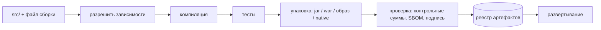
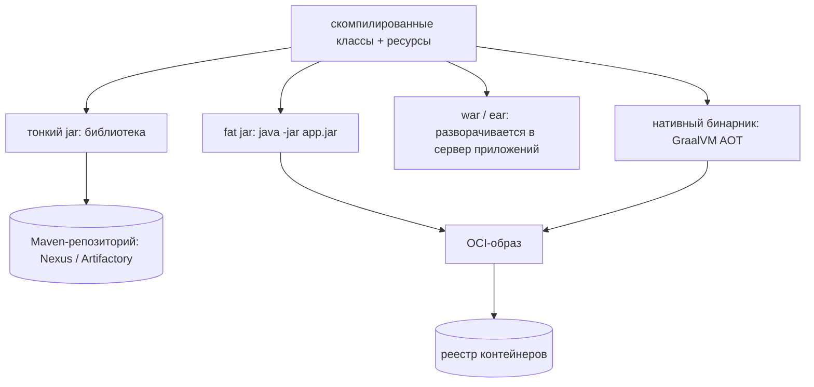
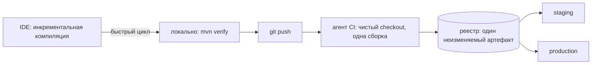

# Способы сборки приложения

**Сборка превращает дерево исходников в артефакт, который можно развернуть.**
Ничего более загадочного: разрешить зависимости, скомпилировать, прогнать тесты,
упаковать результат, опубликовать туда, откуда его заберёт деплой.

Поэтому «какие есть способы сборки приложений» — это на самом деле четыре
независимых вопроса, и хороший ответ проходит по всем четырём:

1. **Чем собираем** — руками `javac`, Ant, Maven, Gradle, Bazel.
2. **Что получается на выходе** — jar-библиотека, fat jar, war, образ контейнера,
   нативный бинарник.
3. **Где выполняется** — в IDE, на вашей машине, внутри контейнера, на агенте CI.
4. **Что делает результат заслуживающим доверия** — зафиксированные зависимости,
   честные кеши, воспроизводимость, происхождение артефакта.

Эти стадии одинаковы везде. Выбор ниже — про то, *кто* их выполняет и *что*
передаёт дальше.

## 1. Инструмент, который ведёт сборку

| Инструмент | Модель | Где уместен |
|---|---|---|
| `javac` + `jar` | компилятор вызывается вручную | обучение, крошечные утилиты; зависимости не разрешаются |
| Ant (+ Ivy) | императивные XML-цели, никаких соглашений | унаследованные проекты |
| Maven | декларативный XML, один фиксированный жизненный цикл, плагины на фазах | выбор по умолчанию для большинства Java-сервисов |
| Gradle | граф задач на Groovy/Kotlin DSL, инкрементальность и кеш | большие многомодульные сборки, Android |
| Bazel / Pants | герметичность, адресация по содержимому, удалённый кеш и выполнение | монорепозитории, где полная сборка непозволительна |

**Собрать руками** стоит хотя бы раз, потому что видно, что именно автоматизируют
инструменты: `javac -cp lib/* -d out $(find src -name '*.java')`, затем `jar cfe
app.jar Main -C out .`. См. [как исходный код Java становится работающим
кодом](topic:jvm-source-code-flow). Такой способ перестаёт работать на третьей
зависимости — транзитивные зависимости и их версии за вас никто не разрешит.

**Maven** — это соглашения вместо конфигурации. Исходники лежат в
`src/main/java`, жизненный цикл фиксирован (`validate → compile → test → package
→ verify → install → deploy`), и `mvn package` выполняет все фазы до указанной.
Именно из-за фиксированного жизненного цикла любой Maven-проект собирается одной
командой у кого угодно, а два любых Maven-проекта выглядят одинаково. Плата —
всё, что жизненным циклом не предусмотрено, превращается в неуклюжую настройку
плагина.

**Gradle** описывает сборку как граф задач с объявленными входами и выходами. Это
объявление и даёт инкрементальность: задача с неизменившимися входами
пропускается (`UP-TO-DATE`) или восстанавливается из кеша сборки (`FROM-CACHE`) —
локального или общего для команды и CI. На сборке из пятидесяти модулей это
разница между двумя минутами и двадцатью. Плата — скрипт сборки является
программой: он может всё, в том числе стать неподдерживаемым.

**Bazel и подобные** идут дальше: каждое действие объявляет точный список входов,
выполняется в песочнице и ключуется хешем этих входов, поэтому результаты
переиспользуются в масштабах всей организации и пересобирается только реально
изменившееся. Расплата — крутая кривая обучения и необходимость описывать
зависимости куда точнее, чем когда-либо требовал Maven.

Две вещи важнее самого выбора:

- **Всё собирается одной командой.** `mvn verify` или `./gradlew build` из чистой
  копии репозитория, без ручных шагов из README. Если новый сотрудник не может
  собрать проект в первый день, сборка сломана независимо от инструмента.
- **Кладите wrapper в репозиторий.** `mvnw` / `gradlew` фиксируют версию *самого
  инструмента сборки*, так что ваша машина, машина коллеги и агент CI запускают
  одну и ту же. JDK тоже фиксируйте — toolchains в Gradle или плагин toolchains в
  Maven — вместо надежды на то, что окажется в `JAVA_HOME`.

## 2. Артефакт на выходе

- **Тонкий jar** — только ваши классы. Это *библиотека*: зависимости должен
  предоставить тот, кто её использует, а публикуется она в Maven-репозиторий под
  координатами `groupId:artifactId:version`. Так собирают общий код, например
  [собственный Spring Boot starter](topic:spring-boot-starter-web).
- **Fat (uber, исполняемый) jar** — ваши классы *плюс* все зависимости, запуск
  через `java -jar`. Цель `repackage` из Spring Boot собирает такой jar с
  вложенными jar-файлами и собственным [ClassLoader](topic:classloader) для их
  чтения; Maven Shade вместо этого сплющивает всё в одно пространство имён — это
  быстрее стартует, но может конфликтовать на дублирующихся ресурсах вроде
  `META-INF/services`. Для сервиса это обычный артефакт, и именно он попадает в
  образ.
- **War / ear** — встроенного сервера нет; приложение размещает сервлет-контейнер
  или сервер приложений. Всё ещё встречается в старых системах, но модель
  вывернута наизнанку: сервер долгоживущий и общий, а приложение — гость.
  Контейнеры сделали противоположную схему (один процесс, один образ) проще в
  эксплуатации.
- **OCI-образ контейнера** — fat jar плюс JVM плюс окружение Linux. Это единица
  развёртывания для [Kubernetes](topic:why-kubernetes); о том, как разложить его
  по слоям, чтобы правка в одну строку не перезаливала весь jar, см. [сборку
  Docker-образа из приложения на Spring Boot](topic:spring-boot-docker-image).
- **Нативный бинарник** — GraalVM компилирует в машинный код заранее (AOT). Старт
  за десятки миллисекунд и доля прежней памяти, что важно для serverless и
  масштабирования до нуля. Цена вполне реальна: предположение о замкнутом мире
  (reflection, прокси и ресурсы нужно объявить или зарегистрировать), сборка
  измеряется минутами, а профилирования [JIT](topic:java-jit-compilation) нет,
  поэтому пиковая пропускная способность на длинной дистанции обычно *ниже*, чем
  на JVM.
- **jlink / jpackage** — урезанная собственная среда выполнения или платформенный
  установщик (`.msi`, `.deb`) для десктопного приложения. Для сервисов редкость,
  для утилит — норма.

## 3. Где выполняется сборка

- **В IDE.** IntelliJ компилирует инкрементально со своими настройками
  компилятора и своим представлением о classpath и обработке аннотаций. Это
  сделано ради скорости внутреннего цикла разработки и вашей сборкой *не
  является* — «в IDE работает, в CI падает» почти всегда означает, что эти двое
  расходятся в обработчиках аннотаций, фильтрации ресурсов или папке
  сгенерированных исходников. Когда это мешает, переключите IDE на делегирование
  сборки Maven/Gradle.
- **Локально, инструментом сборки.** `mvn verify` перед пушем. Быстрая обратная
  связь, но результат зависит от вашего JDK, вашего `~/.m2`, вашей локали и того,
  что вообще есть в окружении. Для проверки годится; источником развёрнутого
  артефакта — никогда.
- **Внутри контейнера.** Многоэтапный Dockerfile запускает Maven на этапе сборки
  и копирует в финальный образ только jar, так что `docker build .` вообще не
  требует локального JDK, и у всех одинаковый набор инструментов. Это медленнее,
  если не кешировать слой зависимостей или не использовать cache mount в
  BuildKit.
- **На сервере CI** — Jenkins, GitLab CI, GitHub Actions, TeamCity. Чистый агент,
  свежий checkout, одна сборка, прогон тестов, публикация артефакта и версия,
  помеченная SHA коммита. Это *авторитетная* сборка: в production должен попадать
  только тот бинарник, который произвёл CI. Всё остальное — копия для удобства.
- **Распределённое / удалённое выполнение.** Gradle Develocity и удалённые
  исполнители Bazel раскидывают действия по машинам и делят общий кеш. Именно так
  большие монорепозитории обходятся без часовых сборок.

**Собрать один раз, продвигать многократно.** Один и тот же артефакт — те же
байты, тот же дайджест — переезжает со staging в production; меняется только
конфигурация, которую даёт окружение (см. [что важнее: properties или переменные
окружения](topic:spring-config-property-precedence)). Пересборка под каждое
окружение означает, что в production работают байты, которые никто не
тестировал, и заново открывает все источники недетерминированности из следующего
раздела.

## 4. Что делает сборку заслуживающей доверия

- **Фиксируйте то, от чего зависите.** Никаких диапазонов версий, никаких
  `-SNAPSHOT` в релизе, BOM или `dependencyManagement` для версий, dependency
  locking в Gradle там, где нужна уверенность вплоть до байтов.
- **Проксируйте внешний мир.** Внутреннее зеркало Nexus/Artifactory означает, что
  сборка переживёт недоступность публичного репозитория, удалённую версию или
  сетевую политику, запрещающую исходящий трафик, — и именно там вы контролируете
  допустимые лицензии и CVE.
- **Воспроизводимость.** Один и тот же исходник и те же зависимости должны давать
  те же байты. Что это ломает: временные метки сборки в манифесте, порядок
  файлов, локаль и часовой пояс, другая минорная версия JDK и `FROM base:latest`
  в Dockerfile. `project.build.outputTimestamp` в Maven и настройки
  воспроизводимых архивов в Gradle закрывают простую половину.
- **Ключи кеша должны быть честными.** Инкрементальная сборка — это то, как вы
  остаётесь быстрыми, а устаревший кеш — то, как вы выкатываете вчерашний код.
  Лечится правильным ключом (в него входят все входы), а не `clean` на каждой
  сборке — хотя CI всё равно должен собирать из чистого checkout, чтобы ключ
  физически не мог соврать.
- **Происхождение.** Генерируйте SBOM, подписывайте артефакт и образ, проверяйте
  контрольные суммы того, что скачиваете. Ваши зависимости — это код, который вы
  не писали и не читали; атаки на цепочку поставок бьют ровно в этот зазор и
  стоят рядом с рисками из [OWASP Top 10](topic:owasp-top-ten).
- **Тесты — часть сборки.** `mvn package -DskipTests` в пайплайне — это сборка,
  которая ничего не доказывает. Разделяйте быстрые модульные тесты (на каждой
  сборке) и медленные интеграционные (на более позднем этапе) вместо того, чтобы
  их пропускать.

Для многомодульной или [модульной](topic:modular-architecture-options) кодовой
базы добавляется ещё один вопрос: собирать весь репозиторий или только
изменившиеся модули? Maven умеет `-pl … -am`, а Gradle/Bazel могут вычислить это
по графу задач — это решение вместе с выбором [репозитория на
сервис](topic:why-microservices) или одного на всех и делает большую сборку
переносимой.

## Отдельно про сборку образа

Три способа, все в обычном ходу:

- **Dockerfile + `docker build`** — полный контроль, и файл ваш.
- **Cloud Native Buildpacks** — `mvn spring-boot:build-image` даёт слоёный образ
  без root и с настроенной памятью вообще без Dockerfile.
- **Jib** — `mvn jib:build` собирает и публикует слоёный образ прямо из
  инструмента сборки, без демона Docker, поэтому подходит для агентов CI с
  жёсткими ограничениями. Kaniko и rootless BuildKit решают ту же задачу «нет
  демона в кластере» для Dockerfile.

## Ответ на собеседовании за 60 секунд

> Сборка — это разрешить зависимости → скомпилировать → протестировать →
> упаковать → опубликовать, поэтому способы сборки различаются по четырём вещам.
> *Инструмент*: Maven с фиксированным жизненным циклом и соглашениями или Gradle с
> инкрементальным графом задач и кешем сборки, который окупается на больших
> многомодульных проектах; Ant — legacy, а герметичные сборки уровня Bazel — для
> монорепозиториев. *Артефакт*: тонкий jar для библиотеки, публикуемой в Nexus,
> fat jar для сервиса, war, если есть сервер приложений, OCI-образ для Kubernetes
> или нативный бинарник GraalVM, когда время старта важнее пиковой
> производительности. *Место*: IDE компилирует инкрементально ради быстрого цикла,
> но сборкой не является; локальный `mvn verify` — для обратной связи;
> многоэтапная сборка в Docker даёт всем одинаковый инструментарий; а CI на чистом
> агенте производит единственный артефакт, которому разрешено попасть в
> production. И *гарантии*: фиксировать версии и JDK, класть `mvnw` в репозиторий,
> проксировать зависимости через внутренний репозиторий, делать результат
> воспроизводимым и подписывать его вместе с SBOM. Правило, которое я считаю
> главным, — собрать один раз и продвигать один и тот же дайджест через staging в
> production, меняя только конфигурацию.

## Почему это важно в production

- **Артефакт — это единица отката.** Неизменяемый версионированный артефакт
  означает, что откат — это развёртывание предыдущего дайджеста. «Пересоберём со
  старого тега» — ставка на то, что мир за пределами вашего репозитория не
  изменился.
- **Время сборки — это время поставки.** Двадцатиминутная сборка ограничивает
  частоту релизов и подталкивает людей копить изменения пачками, отчего каждый
  релиз становится рискованнее. Кеширование и гранулярность по модулям — это
  свойства надёжности.
- **Невоспроизводимая сборка превращает инцидент в археологию.** Если нельзя
  пересобрать ровно то, что сейчас работает, нельзя ни найти проблемный коммит
  бисекцией, ни выпустить патч под давлением.
- **Сборка — это поверхность атаки.** У неё есть учётные данные, доступ в сеть и
  право писать то, что вы разворачиваете. Скомпрометированный сервер сборки
  компрометирует каждый сервис, который он собирает, — отсюда подписи,
  изолированные агенты и контролируемые источники зависимостей.
- **Базовый слой образа — это ваша стратегия обновлений безопасности.**
  Большинство CVE находятся в базовом образе, а не в вашем jar, поэтому пайплайн
  должен уметь пересобрать и переразвернуть без единого изменения в коде.

## Частые заблуждения

- **«Сборка в IDE — то же самое, что `mvn package`».** Другой компилятор, другая
  обработка аннотаций, другая работа с ресурсами. Доверяйте инструменту сборки, а
  IDE, когда они расходятся, переключайте на делегирование ему.
- **«Gradle всегда быстрее Maven».** Только когда работает его кеширование.
  Холодный кеш на свежем агенте CI — это обычная полная сборка, а Maven с `-T 1C`
  параллельно тоже не медленный. Скорость даёт инкрементальность, а не логотип.
- **«Fat jar и Docker-образ — альтернативы».** Это последовательные слои: образ
  обычно *содержит* jar. Реальный выбор — что вы отдаёте платформе.
- **«`mvn install` публикует мою библиотеку».** Он кладёт её в ваш локальный
  `~/.m2`. Публикует в общий репозиторий `deploy` — частая причина того, что
  «у меня работает», а больше нигде.
- **«Тот же исходник — та же сборка».** Не с диапазонами версий, зависимостями
  `-SNAPSHOT`, базовыми образами `latest`, временными метками в манифесте или
  другим JDK. Воспроизводимость проектируют, а не получают по умолчанию.
- **«CI просто гоняет тесты».** CI производит артефакт, который вы поставляете.
  Если кто-то может собрать jar на ноутбуке и развернуть его, ваш пайплайн —
  декорация.
- **«Мы пересобираем под каждое окружение, чтобы конфигурация была правильной».**
  Тогда в каждом окружении работают разные байты. Собирайте один раз, а
  конфигурацию подставляйте во время выполнения.
- **«Native image однозначно лучше».** Лучше старт и память, хуже пиковая
  пропускная способность, долгие сборки, а reflection и прокси нужно объявлять —
  ровно то, на чём держатся фреймворки с обильным проксированием.
- **«`clean` на каждой сборке — это безопасно».** Так вы прячете неправильный ключ
  кеша вместо того, чтобы его починить, и выбрасываете инкрементальность, за
  которую платите. Чистый checkout на CI, правильные ключи везде.
- **«Скрипт сборки — не настоящий код».** В нём есть логика, зависимости и ошибки,
  и когда он ломается, блокируются все. Ревьюйте его как production-код.
