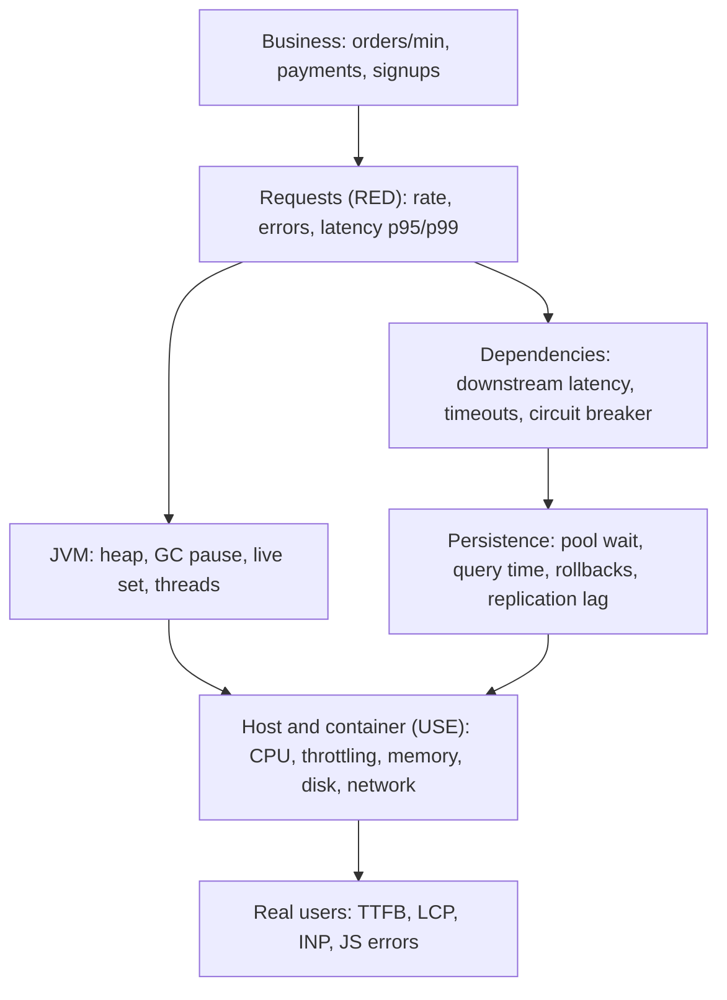
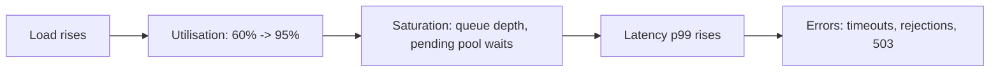
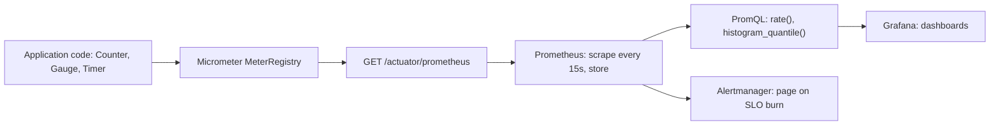

# What Application Metrics Do You Know?

The question is phrased as if it wants a list, and a list is the weakest thing you
can give it. "CPU, memory, response time, errors" is what every candidate says,
and it demonstrates nothing except that you have seen a dashboard.

What the interviewer is actually checking is whether you have a **structure**: do
you know what a metric is and is not, can you organise metrics by layer, do you
know which ones are leading indicators and which are lagging, and can you name the
few that people actually forget. Answer with a framework, then fill it in.

## A Metric Is a Number Over Time, Not an Explanation

Observability has three signal types, and they are complements, not substitutes:

| Signal | What it is | Answers | Cost per event |
| --- | --- | --- | --- |
| Metric | a number sampled or accumulated over time, with a few labels | is something wrong, how bad, since when | ~nothing |
| Log | a discrete event with text and fields | what exactly happened to this one thing | high |
| Trace | one request's path and timing across services | where the time went, in this request | high |

A metric is cheap precisely **because it throws information away**. Ten million
requests become one counter and a handful of histogram buckets, which is why you
can keep a year of them and query them in milliseconds. The price is that a metric
can never tell you *why*: it tells you the p99 tripled at 14:20, and then you go to
[logs](topic:why-kibana), traces or a profiler to find out what happened. A
candidate who says "I'd look at the metrics to find the cause" has the roles
slightly wrong — metrics find the *symptom* and narrow the search; see
[the site is slow: how do you find the cause](topic:slow-website-diagnosis) for the
hunt itself.

## The Four Instrument Types

Before the list, know the vocabulary. In Micrometer/Prometheus terms:

- **Counter** — monotonically increasing, resets to zero on restart. Requests
  served, errors, retries, messages consumed. You never read the value, you read
  `rate(...)` over it, because the absolute number is meaningless.
- **Gauge** — a value that goes up and down and is sampled when scraped. Heap used,
  queue size, active connections, threads. You cannot recover what happened between
  two samples, so a gauge is a bad way to count events.
- **Histogram** — observations bucketed by size. This is what gives you percentiles,
  and crucially the buckets are **additive across instances**: you can sum ten pods'
  buckets and compute a true global p99.
- **Summary / client-side quantile** — percentiles computed inside the process.
  Cheaper to read, but **not aggregatable**: there is no valid arithmetic that turns
  ten pods' p99 values into the p99 of the fleet.
- **Timer** — Micrometer's histogram of durations. One timer gives you count, sum
  and buckets, which is rate, errors (when tagged with the outcome) and duration
  from a single meter.

That last point is worth saying out loud in an interview: a properly tagged timer
around a request *is* RED.

## Three Frameworks to Organise the Answer

- **RED** — for anything that *serves requests* (an endpoint, a service, a consumer):
  **R**ate, **E**rrors, **D**uration.
- **USE** — for anything that *is a resource* (CPU, disk, connection pool, thread
  pool): **U**tilisation, **S**aturation, **E**rrors.
- **Four golden signals** (Google SRE) — latency, traffic, errors, saturation. The
  shortlist you actually alert on.

The one refinement that shows experience: **measure the latency of successful and
failed requests separately**. Failures are often fast — a connection refused takes
1ms — so a flood of instant 500s makes your latency graph look better than ever.

## The Layers, Top Down

### 1. Business and product metrics

Orders placed per minute, payments authorised vs declined, signups, checkout
conversion, cart abandonment, jobs processed, emails sent, revenue per minute.

These go first, and almost nobody names them. They are the only metrics that prove
the system is doing **its job**: a deploy that breaks a discount rule leaves every
technical graph green while the company loses money. They are also the fastest
outage detector you own — "orders per minute went to zero" is a more reliable page
than any CPU threshold, because it cannot be true while things are fine.

### 2. Request metrics (RED), per endpoint

Throughput in requests per second; error rate split into 4xx (the client's fault,
usually not your alert) and 5xx (yours); latency as **p50, p95, p99 and max**, never
the average; in-flight/concurrent requests; time spent queued before a thread picked
the request up; request and response sizes; server thread-pool saturation (busy
threads / max threads).

In Spring Boot this arrives for free as `http.server.requests`, tagged with `uri`,
`method`, `status`, `outcome` and `exception`. Two things matter here:

- The `uri` tag must be the **template** (`/orders/{id}`), never the actual path
  (`/orders/42`) — otherwise every order id becomes its own time series.
- Aggregate per endpoint. A service-wide p99 mixes a 3ms health check with a 4s
  report and describes neither.

### 3. Dependency metrics (the client side of every outbound call)

Per downstream target: call rate, error rate, latency percentiles, **timeouts**,
retries and retry-induced amplification, [circuit breaker](topic:service-timeouts-fallbacks)
state and open/half-open transitions, bulkhead rejections, HTTP connection-pool
usage.

Two insights: your latency is mostly your dependencies' latency plus your own work,
so a dependency panel is where a p99 investigation usually ends; and the client-side
number never equals the server-side number the callee reports. The gap is network
plus queueing, and that gap is itself a metric worth graphing. This is the practical
half of [types of interaction between microservices](topic:microservice-interaction-types).

### 4. Database and persistence metrics

- **Connection pool** (HikariCP): active, idle, **pending threads waiting for a
  connection**, connection acquisition time, timeouts. Pending-and-waiting is one of
  the highest-value metrics in a Java service and one of the least watched — it is
  what a "slow only under load" incident looks like from the inside.
- **Queries**: duration percentiles, slow-query count, statements per request. That
  last one is how the [N+1 select problem](topic:hibernate-n-plus-one) shows up as a
  number rather than as a hunch: 300 statements for one page.
- **Server side**: transactions per second, rollback ratio, deadlocks, lock wait
  time, replication lag, buffer cache hit ratio, dead tuples / bloat, sequential
  scans on large tables (a hint for [which indexes to add](topic:indexes-for-query-optimization)),
  and connections used vs `max_connections`.

### 5. JVM runtime metrics

- **Memory**: used, committed and max per pool — Eden, Survivor, Old, Metaspace,
  code cache (see [heap generations](topic:heap-generations)) — plus off-heap direct
  buffers.
- **GC**: collection count and pause duration per collector, GC time as a percentage
  of wall clock, allocation rate, promotion rate. See
  [configuring the garbage collector](topic:gc-configuration).
- **The one that matters most**: the **live set after a full GC**, i.e. old-gen
  occupancy at the bottom of the sawtooth. Rising heap usage is normal and means
  nothing; a rising *floor* is a [memory leak](topic:memory-leaks), and it is the
  first graph in [diagnosing memory growth in production](topic:diagnosing-memory-leaks).
- **Threads**: live, daemon, peak, and counts by state — a growing `BLOCKED` count is
  contention, a growing `WAITING` count is usually a pool starved by a slow
  dependency.
- **Process**: CPU usage of the process vs the machine, open file descriptors vs the
  limit, loaded classes, JIT compilation time, safepoint pause time.

### 6. Thread pools and async work

Active threads, pool size, **queued tasks**, remaining queue capacity, rejected task
count, task execution time, and task **wait time in the queue**. Queue depth is a
*leading* indicator: it grows before latency does, which makes it a better alert than
the latency it will eventually cause. See [thread pool](topic:java-thread-pool).

Read left to right, this is why saturation metrics are worth more than utilisation
metrics: by the time the graph on the right moves, users have already noticed.

### 7. Messaging metrics

**Consumer lag** is the single most important [Kafka](topic:kafka-vs-rabbitmq)
metric — it is the only one that says "we are falling behind" rather than "we are
busy". Alongside it: records consumed per second, processing time per record,
rebalance frequency, producer send rate and error/retry rate, and on the broker
side queue depth, **age of the oldest message**, unacked count, redelivery count and
**dead-letter queue size and rate**. If you use an [outbox](topic:outbox-pattern),
the age of its oldest unpublished row is the metric that catches a stuck relay.

### 8. Cache metrics

Hit ratio, miss rate, eviction rate, load time, entry count and size. A hit ratio
without the request rate is meaningless: 99% of nothing is not a healthy cache, and
a falling hit ratio with a rising eviction rate means the cache is too small for its
working set.

### 9. Host and container metrics (USE)

CPU utilisation **and run-queue length**; memory RSS / working set against the limit,
page faults, swap, OOMKill count; disk IOPS, throughput, service time and queue
length, free space and inodes; network bytes in/out, packet drops, **TCP
retransmits**, socket states, conntrack table usage.

The one everyone forgets in [Kubernetes](topic:why-kubernetes): **CPU throttling**
(`container_cpu_cfs_throttled_seconds`). A pod with a CPU limit gets stopped for the
rest of each 100ms period once it exhausts its quota, so it looks like it is using
"only 40% CPU" while being frozen for milliseconds at a time and adding latency out
of nowhere. Also worth naming: pod restarts, replicas ready vs desired, and node
pressure conditions — the inputs to any conversation about
[scaling an overloaded server](topic:scaling-an-overloaded-server).

### 10. Real user monitoring (the client side)

TTFB, Largest Contentful Paint, Interaction to Next Paint, Cumulative Layout Shift,
full page load, JavaScript error rate, API failure rate as seen by the browser.

This layer exists because your server-side p99 excludes DNS, TLS, the network, the
device and rendering — everything in [what happens when you type a URL](topic:browser-page-load)
that is not your handler. A backend that is fast and a page that is slow is an
extremely common combination, and only client-side metrics can show it.

### 11. Delivery and reliability metrics

Availability as an SLI against an SLO, **error-budget burn rate**, MTTR, MTBF, and
the four DORA metrics — deployment frequency, lead time for changes, change failure
rate, time to restore — which measure the team's delivery rather than the running
process. They fit naturally alongside a
[CI/CD pipeline](topic:cicd-process-variants).

## How a Number Reaches a Graph

In a Spring Boot service, `spring-boot-starter-actuator` plus a Micrometer registry
gives you JVM, thread-pool, HikariCP, Tomcat and HTTP metrics with no code at all;
you add `@Timed`, `Counter.builder(...).register(registry)` or a `Gauge` for your own
domain. Prometheus **pulls** by scraping (short-lived jobs push to a gateway or
OTLP instead), so a metric that only exists between two scrapes is invisible — a 2s
stall can hide entirely inside a 15s scrape interval. OpenTelemetry is where the
industry is converging for a vendor-neutral pipeline, and **exemplars** let a
histogram bucket carry a trace id, so you can click from "the slow bucket" straight
into one slow request.

## Cardinality: How Metrics Actually Break

The number of time series is the **product** of the distinct values of every label.
`method` (5) × `status` (8) × `uri` (40) is 1,600 series, which is fine. Add `user_id`
and it is millions, and you have taken down your monitoring system with your
monitoring code.

The rule: a label's values must come from a **small, bounded, known set**. User ids,
order ids, session ids, raw URLs, full error messages and stack traces belong in
[logs](topic:why-kibana) and traces, which are built for high cardinality. This is
the single most common way a metrics setup fails in production, and naming it
unprompted is worth more than ten more metric names.

## What You Alert On

Alert on **symptoms** the user feels — error rate, latency against the SLO, error
budget burning too fast, orders dropping to zero. Do not page on **causes** — CPU at
85%, heap at 70%, a queue that is briefly deep — because a cause can be true while
everything is fine, and false while everything is broken. Causes belong on the
dashboard you open *after* the alert, which is exactly the split that keeps
[a production-only failure](topic:endpoint-broken-in-prod) findable instead of
buried in noise.

## 60-Second Interview Answer

> A metric is a cheap, low-cardinality number over time. It tells me whether
> something is wrong, how bad and since when — logs and traces tell me why. I group
> them with RED for anything serving requests (rate, errors, duration) and USE for
> anything that is a resource (utilisation, saturation, errors), and then go by
> layer. Business metrics first — orders per minute, payment success — because they
> are the only proof the system does its job. Then request metrics per endpoint:
> throughput, 4xx and 5xx separately, and latency as p95/p99, not an average. Then
> dependencies: downstream latency, timeouts, retries, circuit-breaker state. Then
> persistence: connection-pool waiting time, query duration, rollbacks, replication
> lag. Then the JVM: heap per pool, GC pause time and allocation rate, and the live
> set after a full GC, which is the real leak signal, plus threads and file
> descriptors. Then thread-pool queue depth and rejected tasks, which lead latency;
> consumer lag and DLQ size for messaging; cache hit ratio. Then host and container:
> CPU, run queue, memory against the limit, disk, network, and CPU throttling, which
> people forget in Kubernetes. And real-user metrics — TTFB, LCP, INP — because the
> server-side percentile excludes the network and the browser. Instrumentation-wise
> they are counters, gauges and histograms; I prefer histograms over client-side
> quantiles because buckets aggregate across instances and percentiles do not. The
> two things I watch out for are label cardinality and alerting on causes instead of
> symptoms.

## Common Misconceptions

- **"Average response time is fine, so we're fine."** The average is the one number
  that describes nobody. Percentiles, per endpoint, or you are not measuring the
  users who complain.
- **"p99 across the fleet is the average of each pod's p99."** It is not, and there
  is no arithmetic that makes it so. Aggregate histogram **buckets** and compute the
  quantile once; this is exactly why client-side summaries are the wrong instrument
  in a multi-instance service.
- **"CPU is at 50%, there is headroom."** Utilisation is not saturation. A run queue,
  a full connection pool, a throttled container or a saturated single-threaded
  bottleneck all produce queueing at moderate utilisation.
- **"The counter says 4,300,000."** A counter's value is an artefact of uptime; it
  resets on restart. Only its rate means anything.
- **"Metrics will tell me the cause."** They narrow the search. The cause lives in a
  trace, a log line, a query plan or a heap dump.
- **"Free heap keeps falling — we have a leak."** Heap usage sawtooths by design.
  The leak signal is the *floor* after a full GC rising over days.
- **"We have 300 dashboards, so we have observability."** Usually it means every
  technical layer is measured and the business layer is not, so an outage that keeps
  the process healthy is invisible.
- **"A green health check means the service works."** A health check proves the
  process answers HTTP. It routinely stays green through a full connection pool, a
  dead downstream or an empty result set.
- **"p99 per call is p99 per page."** A page that fans out to 20 calls hits a 1%-slow
  call about 18% of the time. Tail latency compounds with fan-out.
- **"More metrics is strictly better."** Cardinality, storage, scrape time and alert
  noise are all real costs, and a metric nobody has ever looked at is a liability.
- **"Errors are covered by the error rate."** Fast failures shorten your latency
  graph. Measure latency of successes and failures separately, or an outage will look
  like a performance win.
