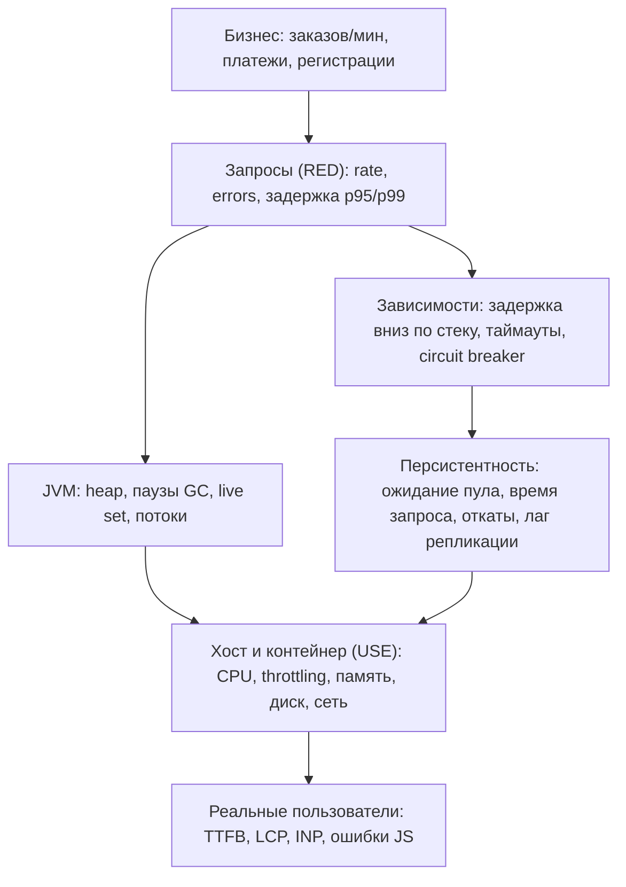
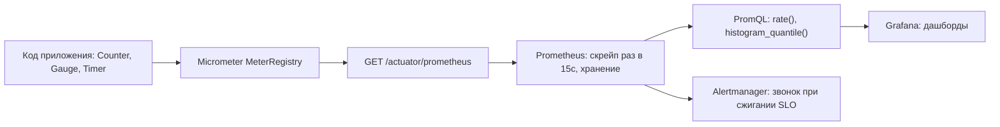

# Какие метрики приложения ты знаешь?

Вопрос сформулирован так, будто ему нужен список, и список — самое слабое, что
можно на него ответить. «CPU, память, время ответа, ошибки» говорит каждый
кандидат, и это не доказывает ничего, кроме того, что вы видели дашборд.

На самом деле интервьюер проверяет, есть ли у вас **структура**: понимаете ли вы,
что такое метрика и чем она не является, умеете ли раскладывать метрики по слоям,
знаете ли, какие из них опережающие, а какие запаздывающие, и назовёте ли те
несколько, о которых обычно забывают. Отвечайте фреймворком, а потом наполняйте
его.

## Метрика — это число во времени, а не объяснение

У наблюдаемости три типа сигналов, и они дополняют друг друга, а не заменяют:

| Сигнал | Что это | На что отвечает | Цена одного события |
| --- | --- | --- | --- |
| Метрика | число, накопленное или сэмплированное во времени, с парой лейблов | что-то не так, насколько плохо, с какого момента | почти ноль |
| Лог | дискретное событие с текстом и полями | что именно случилось с этой конкретной вещью | высокая |
| Трейс | путь и тайминги одного запроса по сервисам | куда ушло время в этом запросе | высокая |

Метрика дешёвая именно потому, что **выбрасывает информацию**. Десять миллионов
запросов превращаются в один counter и горсть бакетов гистограммы — поэтому их
можно хранить год и запрашивать за миллисекунды. Плата за это в том, что метрика
никогда не скажет *почему*: она говорит, что p99 вырос втрое в 14:20, а дальше вы
идёте в [логи](topic:why-kibana), трейсы или профилировщик выяснять, что
произошло. Кандидат, который говорит «я посмотрю метрики, чтобы найти причину»,
немного путает роли: метрики находят *симптом* и сужают поиск — сама охота описана
в [«сайт тормозит: как найти причину»](topic:slow-website-diagnosis).

## Четыре типа инструментов

До списка нужно знать словарь. В терминах Micrometer/Prometheus:

- **Counter** — монотонно растёт, обнуляется при перезапуске. Обслуженные запросы,
  ошибки, повторы, прочитанные сообщения. Значение никогда не читают напрямую,
  читают `rate(...)` по нему, потому что абсолютное число бессмысленно.
- **Gauge** — значение, которое растёт и падает и сэмплируется в момент скрейпа.
  Занятый heap, размер очереди, активные соединения, потоки. Восстановить, что
  происходило между двумя сэмплами, нельзя, поэтому gauge — плохой способ считать
  события.
- **Histogram** — наблюдения, разложенные по бакетам. Именно он даёт перцентили, и
  главное — бакеты **складываются между экземплярами**: можно сложить бакеты десяти
  подов и посчитать настоящий глобальный p99.
- **Summary / квантиль, посчитанный на клиенте** — перцентили, вычисленные внутри
  процесса. Читать дешевле, но они **не агрегируются**: нет корректной арифметики,
  превращающей десять значений p99 в p99 всего флота.
- **Timer** — гистограмма длительностей в Micrometer. Один timer даёт count, sum и
  бакеты, то есть rate, errors (если размечен исходом) и duration из одного метра.

Последнее стоит произнести вслух на собеседовании: правильно размеченный timer
вокруг запроса **и есть** RED.

## Три фреймворка, чтобы организовать ответ

- **RED** — для всего, что *обслуживает запросы* (эндпоинт, сервис, консьюмер):
  **R**ate, **E**rrors, **D**uration.
- **USE** — для всего, что *является ресурсом* (CPU, диск, пул соединений, пул
  потоков): **U**tilization, **S**aturation, **E**rrors.
- **Четыре золотых сигнала** (Google SRE) — latency, traffic, errors, saturation.
  Короткий список того, на что реально ставят алерты.

Уточнение, которое выдаёт опыт: **измеряйте задержку успешных и неуспешных запросов
раздельно**. Отказы часто быстрые — connection refused занимает 1мс, — поэтому
поток мгновенных 500-х делает график задержки лучше, чем когда-либо.

## Слои, сверху вниз

### 1. Бизнес- и продуктовые метрики

Заказов в минуту, авторизованные и отклонённые платежи, регистрации, конверсия
оформления, брошенные корзины, обработанные задачи, отправленные письма, выручка в
минуту.

Они идут первыми, и почти никто их не называет. Это единственные метрики,
доказывающие, что система делает **свою работу**: деплой, сломавший правило скидки,
оставляет все технические графики зелёными, пока компания теряет деньги. Это ещё и
самый быстрый детектор аварии: «заказов в минуту стало ноль» — более надёжный
повод для звонка, чем любой порог по CPU, потому что это не может быть правдой,
когда всё в порядке.

### 2. Метрики запросов (RED), по эндпоинтам

Пропускная способность в запросах в секунду; доля ошибок, разделённая на 4xx (вина
клиента, обычно не ваш алерт) и 5xx (ваша); задержка как **p50, p95, p99 и max**,
никогда не среднее; число запросов в обработке; время в очереди до того, как поток
взял запрос; размеры запроса и ответа; насыщенность серверного пула потоков (busy
threads / max threads).

В Spring Boot это приезжает бесплатно как `http.server.requests` с тегами `uri`,
`method`, `status`, `outcome` и `exception`. Здесь важны две вещи:

- Тег `uri` должен быть **шаблоном** (`/orders/{id}`), а не реальным путём
  (`/orders/42`), иначе каждый id заказа становится отдельным временным рядом.
- Агрегируйте по эндпоинтам. Общий p99 сервиса смешивает 3-миллисекундный
  health check с четырёхсекундным отчётом и не описывает ни того, ни другого.

### 3. Метрики зависимостей (клиентская сторона каждого исходящего вызова)

По каждой цели вниз по стеку: частота вызовов, доля ошибок, перцентили задержки,
**таймауты**, повторы и вызванная ими амплификация нагрузки, состояние
[circuit breaker](topic:service-timeouts-fallbacks) и переходы open/half-open,
отказы bulkhead, использование пула HTTP-соединений.

Два наблюдения: ваша задержка — это в основном задержка ваших зависимостей плюс
собственная работа, поэтому расследование p99 обычно заканчивается именно на этой
панели; и клиентское число никогда не совпадает с серверным, которое рапортует
вызываемый. Разница — это сеть плюс очередь, и сама эта разница достойна графика.
Это практическая половина
[типов взаимодействия между микросервисами](topic:microservice-interaction-types).

### 4. Метрики базы данных и персистентности

- **Пул соединений** (HikariCP): active, idle, **потоки, ждущие соединение**, время
  получения соединения, таймауты. Ожидание в пуле — одна из самых ценных метрик
  Java-сервиса и одна из самых редко наблюдаемых: именно так изнутри выглядит
  инцидент «тормозит только под нагрузкой».
- **Запросы**: перцентили длительности, число медленных запросов, количество
  statements на один запрос. Последнее превращает
  [проблему N+1](topic:hibernate-n-plus-one) из догадки в число: 300 statements на
  одну страницу.
- **Со стороны сервера**: транзакций в секунду, доля откатов, дедлоки, время
  ожидания блокировок, лаг репликации, hit ratio буферного кэша, мёртвые кортежи и
  раздувание, последовательные сканы больших таблиц (подсказка о том,
  [какие индексы добавить](topic:indexes-for-query-optimization)), и использованные
  соединения против `max_connections`.

### 5. Метрики рантайма JVM

- **Память**: used, committed и max по каждому пулу — Eden, Survivor, Old,
  Metaspace, code cache (см. [поколения heap](topic:heap-generations)) — плюс
  внекучные direct-буферы.
- **GC**: число сборок и длительность пауз по каждому коллектору, доля времени GC от
  общего времени, скорость аллокации, скорость промоушена. См.
  [настройку сборщика мусора](topic:gc-configuration).
- **Самая важная**: **live set после полной сборки**, то есть занятость old
  generation на дне «пилы». Растущее использование heap нормально и не значит
  ничего; растущий *пол* — это [утечка памяти](topic:memory-leaks) и первый график в
  [диагностике роста памяти в продакшене](topic:diagnosing-memory-leaks).
- **Потоки**: живые, демоны, пиковое число и разбивка по состояниям — растущий
  `BLOCKED` означает конкуренцию за монитор, растущий `WAITING` обычно означает пул,
  голодающий из-за медленной зависимости.
- **Процесс**: загрузка CPU процессом против машины, открытые файловые дескрипторы
  против лимита, число загруженных классов, время JIT-компиляции, время пауз на
  safepoint.

### 6. Пулы потоков и асинхронная работа

Активные потоки, размер пула, **задачи в очереди**, оставшаяся ёмкость очереди,
число отклонённых задач, время выполнения задачи и **время ожидания в очереди**.
Глубина очереди — *опережающий* индикатор: она растёт раньше задержки, и потому
служит лучшим алертом, чем задержка, которую она в итоге вызовет. См.
[пул потоков](topic:java-thread-pool).

Читая слева направо, понятно, почему метрики насыщения ценнее метрик утилизации: к
моменту, когда сдвинется график справа, пользователи уже всё заметили.

### 7. Метрики очередей и брокеров

**Consumer lag** — самая важная метрика [Kafka](topic:kafka-vs-rabbitmq):
единственная, которая говорит «мы отстаём», а не «мы заняты». Рядом с ней: записей
в секунду, время обработки одной записи, частота ребалансировок, частота отправок и
ошибок/повторов у продюсера, а на стороне брокера — глубина очереди, **возраст
самого старого сообщения**, число неподтверждённых, число переотправок и **размер и
скорость роста dead-letter queue**. Если вы используете [outbox](topic:outbox-pattern),
возраст самой старой неопубликованной строки — это метрика, ловящая застрявший
релей.

### 8. Метрики кэша

Hit ratio, доля промахов, скорость вытеснений, время загрузки, число и размер
записей. Hit ratio без частоты запросов бессмыслен: 99% от ничего — это не здоровый
кэш, а падающий hit ratio вместе с растущими вытеснениями означает, что кэш мал для
своего рабочего набора.

### 9. Метрики хоста и контейнера (USE)

Утилизация CPU **и длина очереди на выполнение**; RSS / working set относительно
лимита, page faults, swap, число OOMKill; IOPS диска, пропускная способность, время
обслуживания и длина очереди, свободное место и inodes; байты в сеть и из сети,
потери пакетов, **TCP retransmits**, состояния сокетов, заполненность таблицы
conntrack.

То, о чём в [Kubernetes](topic:why-kubernetes) забывают все: **CPU throttling**
(`container_cpu_cfs_throttled_seconds`). Под с лимитом CPU останавливают до конца
каждого 100-миллисекундного периода, как только он исчерпал квоту, поэтому он
выглядит как «использует всего 40% CPU», будучи при этом заморожен на миллисекунды
и добавляя задержку из ниоткуда. Стоит назвать и рестарты подов, готовые реплики
против желаемых и condition'ы давления на ноде — это исходные данные для любого
разговора о [масштабировании перегруженного сервера](topic:scaling-an-overloaded-server).

### 10. Мониторинг реальных пользователей (клиентская сторона)

TTFB, Largest Contentful Paint, Interaction to Next Paint, Cumulative Layout Shift,
полная загрузка страницы, частота JavaScript-ошибок, доля неуспешных вызовов API с
точки зрения браузера.

Этот слой существует потому, что серверный p99 не включает DNS, TLS, сеть,
устройство и рендеринг — всё то из
[«что происходит, когда вы вводите URL»](topic:browser-page-load), что не является
вашим обработчиком. Быстрый бэкенд и медленная страница — крайне частая комбинация,
и показать её могут только клиентские метрики.

### 11. Метрики поставки и надёжности

Доступность как SLI против SLO, **скорость сжигания бюджета ошибок**, MTTR, MTBF и
четыре метрики DORA — частота деплоев, время от коммита до продакшена, доля
неудачных изменений, время восстановления, — которые измеряют доставку командой, а
не работающий процесс. Они естественно ложатся рядом с
[пайплайном CI/CD](topic:cicd-process-variants).

## Как число доезжает до графика

В сервисе на Spring Boot `spring-boot-starter-actuator` плюс реестр Micrometer дают
метрики JVM, пулов потоков, HikariCP, Tomcat и HTTP вообще без кода; свои доменные
вы добавляете через `@Timed`, `Counter.builder(...).register(registry)` или `Gauge`.
Prometheus **забирает** метрики скрейпом (короткоживущие задачи вместо этого пушат в
шлюз или по OTLP), поэтому метрика, существующая только между двумя скрейпами,
невидима: двухсекундный «затык» целиком помещается внутрь 15-секундного интервала.
OpenTelemetry — то, к чему индустрия сходится ради вендоронезависимого конвейера, а
**exemplars** позволяют бакету гистограммы нести trace id, чтобы из «медленного
бакета» кликом провалиться в конкретный медленный запрос.

## Кардинальность: как метрики ломаются на самом деле

Число временных рядов — это **произведение** количеств различных значений всех
лейблов. `method` (5) × `status` (8) × `uri` (40) — это 1600 рядов, и это нормально.
Добавьте `user_id` — и это миллионы, а вы положили свою систему мониторинга
собственным кодом мониторинга.

Правило: значения лейбла обязаны приходить из **небольшого, ограниченного,
заранее известного множества**. Идентификаторы пользователей, заказов и сессий,
сырые URL, полные тексты ошибок и стек-трейсы — это [логи](topic:why-kibana) и
трейсы, которые для высокой кардинальности и созданы. Это самый частый способ, каким
метрики ломаются в продакшене, и назвать его без наводящего вопроса ценнее, чем
перечислить ещё десять названий метрик.

## На что ставить алерты

Алертить нужно на **симптомы**, которые чувствует пользователь: доля ошибок,
задержка против SLO, слишком быстрое сжигание бюджета ошибок, упавшие в ноль
заказы. Не будите людей из-за **причин** — CPU на 85%, heap на 70%, ненадолго
выросшая очередь, — потому что причина может быть истинной, когда всё в порядке, и
ложной, когда всё сломано. Причины живут на дашборде, который вы открываете *после*
алерта, и именно это разделение оставляет
[поломку, воспроизводящуюся только в проде](topic:endpoint-broken-in-prod),
находимой, а не погребённой в шуме.

## Ответ на собеседовании за 60 секунд

> Метрика — это дешёвое число во времени с низкой кардинальностью. Она говорит, что
> что-то не так, насколько плохо и с какого момента; почему — говорят логи и трейсы.
> Я группирую их через RED для всего, что обслуживает запросы (rate, errors,
> duration), и USE для всего, что является ресурсом (utilization, saturation,
> errors), а дальше иду по слоям. Сначала бизнес-метрики — заказов в минуту,
> успешность платежей, — потому что только они доказывают, что система делает свою
> работу. Затем метрики запросов по эндпоинтам: пропускная способность, 4xx и 5xx
> раздельно, задержка как p95/p99, а не среднее. Затем зависимости: задержка вниз по
> стеку, таймауты, повторы, состояние circuit breaker. Затем персистентность: время
> ожидания соединения из пула, длительность запросов, откаты, лаг репликации. Затем
> JVM: heap по пулам, паузы GC и скорость аллокации, live set после полной сборки —
> настоящий признак утечки, — плюс потоки и файловые дескрипторы. Затем глубина
> очереди пула потоков и отклонённые задачи, которые опережают задержку; consumer lag
> и размер DLQ для очередей; hit ratio кэша. Затем хост и контейнер: CPU, очередь на
> выполнение, память против лимита, диск, сеть и CPU throttling, о котором в
> Kubernetes забывают. И метрики реальных пользователей — TTFB, LCP, INP, — потому
> что серверный перцентиль не включает сеть и браузер. По инструментам это counter,
> gauge и histogram; я предпочитаю histogram клиентским квантилям, потому что бакеты
> складываются между экземплярами, а перцентили — нет. Слежу я за двумя вещами:
> кардинальностью лейблов и тем, чтобы алерты были на симптомы, а не на причины.

## Частые заблуждения

- **«Среднее время ответа в порядке, значит всё в порядке».** Среднее — единственное
  число, которое не описывает никого. Перцентили, по эндпоинтам, иначе вы не
  измеряете тех пользователей, которые жалуются.
- **«p99 по флоту — это среднее из p99 каждого пода».** Нет, и никакая арифметика
  этого не даёт. Складывайте **бакеты** гистограмм и считайте квантиль один раз;
  именно поэтому клиентские summary — неправильный инструмент для сервиса из многих
  экземпляров.
- **«CPU на 50%, запас есть».** Utilization — это не saturation. Очередь на
  выполнение, забитый пул соединений, throttling контейнера или упёршееся
  однопоточное бутылочное горлышко создают ожидание при умеренной утилизации.
- **«Counter показывает 4 300 000».** Значение счётчика — артефакт аптайма, он
  обнуляется при перезапуске. Смысл есть только у его rate.
- **«Метрики покажут причину».** Они сужают поиск. Причина живёт в трейсе, строке
  лога, плане запроса или heap dump.
- **«Свободная память падает — у нас утечка».** Использование heap пилообразно по
  своей природе. Признак утечки — растущий изо дня в день *пол* после полной сборки.
- **«У нас 300 дашбордов, значит у нас есть наблюдаемость».** Обычно это значит, что
  измерены все технические слои и не измерен бизнесовый, поэтому авария, при которой
  процесс остаётся здоровым, невидима.
- **«Зелёный health check значит, что сервис работает».** Health check доказывает,
  что процесс отвечает по HTTP. Он регулярно остаётся зелёным при забитом пуле
  соединений, мёртвой зависимости или пустой выдаче.
- **«p99 вызова — это p99 страницы».** Страница, разлетающаяся в 20 вызовов,
  попадает в «медленный 1%» примерно в 18% случаев. Хвост задержки усиливается
  веерным вызовом.
- **«Чем больше метрик, тем строго лучше».** Кардинальность, хранение, время скрейпа
  и шум алертов — реальные издержки, а метрика, на которую никто ни разу не смотрел,
  — это обязательство, а не актив.
- **«Ошибки покрыты долей ошибок».** Быстрые отказы укорачивают график задержки.
  Измеряйте задержку успехов и отказов раздельно, иначе авария будет выглядеть как
  выигрыш в производительности.
