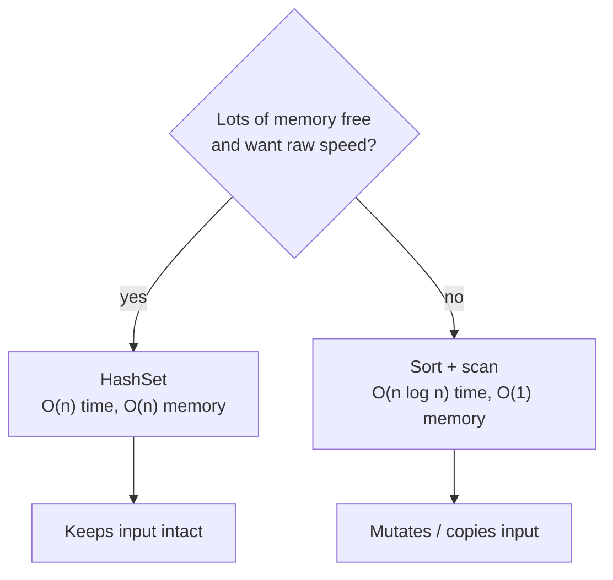

# Finding Duplicates in an Array

> **Practice mode.** This is a *challenge* topic: implement the method in
> `Solution.java`, press **Run tests**, and a hidden harness runs your code
> against a set of cases. The mission passes when they all go green.

## The task

Given an array of integers, return the **distinct values that appear more than
once**, in ascending order. Each duplicated value is listed exactly once, no
matter how often it repeats.

Think of a coat-check at a busy theatre: dozens of people hand in tickets, and you
want the list of ticket numbers that were handed in **twice** — and you want that
list clean, with no number printed twice.

## Approach 1 — HashSet: O(n) time, O(n) memory

Keep a "seen" set. Walk the array once; the first time you meet a value you drop it
in `seen`, and if you ever meet it again you drop it in `dups`.

```java
Set<Integer> seen = new HashSet<>();
Set<Integer> dups = new TreeSet<>();   // TreeSet keeps the output sorted
for (int n : nums) {
    if (!seen.add(n)) {   // add() returns false if it was already there
        dups.add(n);
    }
}
```

This is like the coat-check clerk keeping a pegboard of every ticket already hung
up. Glancing at the pegboard is instant — that's the O(1) lookup of a
[HashSet](topic:java-set-implementations). One pass over `n` tickets gives **O(n)
time**, but the pegboard grows with the crowd: in the worst case (everything
unique) you store all `n` values, so **O(n) memory**.

## Approach 2 — sort, then scan neighbours: O(n log n) time, O(1) memory

Sort the array first. Now equal values sit next to each other, so a single pass
comparing each element with its left neighbour finds every duplicate.

```java
int[] a = nums.clone();
Arrays.sort(a);                         // O(n log n)
List<Integer> dups = new ArrayList<>();
for (int i = 1; i < a.length; i++) {
    if (a[i] == a[i - 1] &&             // same as the previous value
        (dups.isEmpty() || dups.get(dups.size() - 1) != a[i])) {
        dups.add(a[i]);                 // and not already recorded
    }
}
```

This is like sorting the handed-in tickets into numerical order on the counter:
once they're in order, any duplicate is literally the ticket lying right on top of
its twin, so one sweep down the pile finds them all. The sort costs **O(n log n)**
— more than the HashSet's O(n) — but you carry **no extra pegboard**: the work
happens in the pile itself, so **O(1) extra memory** (ignoring the result list).

## The trade-off



| | HashSet | Sort + scan |
|---|---|---|
| Time | **O(n)** | **O(n log n)** |
| Extra memory | **O(n)** | **O(1)** |
| Touches input | no | yes (sorts it) |
| Output order | needs a sort or `TreeSet` | already sorted for free |

Time and space pull in opposite directions — the classic engineering see-saw. You
trade memory for speed (HashSet) or speed for memory (sorting). Like choosing
between a bigger fridge so you can shop once a week, or frequent quick trips to the
corner shop with no storage at all.

## When to pick which

- **HashSet** when speed matters and memory is plentiful, or when you must **not
  disturb** the original array, or you only have a forward stream you can pass once.
- **Sort + scan** when memory is tight (huge arrays, embedded code), when the data
  is **already sorted**, or when you want the output sorted anyway and don't mind
  reordering the input. See [search complexity after sorting](topic:search-complexity-after-sorting).
- Never the **nested-loop** version (compare every pair): that's
  [O(n²)](topic:quadratic-complexity) and falls apart the moment the array is large.

## 60-second interview answer

> Two go-to approaches. A `HashSet` lookup is O(1), so I walk the array once,
> remembering what I've seen and collecting anything I see twice — O(n) time but
> O(n) extra memory. Or I sort the array and scan neighbours, since equal values
> become adjacent — O(n log n) time but only O(1) extra memory, at the cost of
> reordering the input. So it's a time-versus-space trade-off: pick the HashSet
> when memory is cheap and you can't touch the input, pick sorting when memory is
> tight or the data is already sorted. I'd avoid the O(n²) double loop entirely.

## Common misconceptions

- ❌ "HashSet is always best because it's O(n)." — It's O(n) *time* but O(n)
  *memory*, and a bad `hashCode`/many collisions can degrade lookups toward O(n).
  See the [equals/hashCode contract](topic:equals-hashcode-contract).
- ❌ "Sorting is free." — `Arrays.sort` is O(n log n) and **mutates the array**;
  clone it first if the caller still needs the original order.
- ❌ "Just use two nested loops." — Simple, but [O(n²)](topic:quadratic-complexity);
  fine for ten elements, disastrous for a million.
- ❌ "Return every repeated occurrence." — The task wants each duplicated value
  **once**; deduplicate the result (a `TreeSet`, or the neighbour check above).
