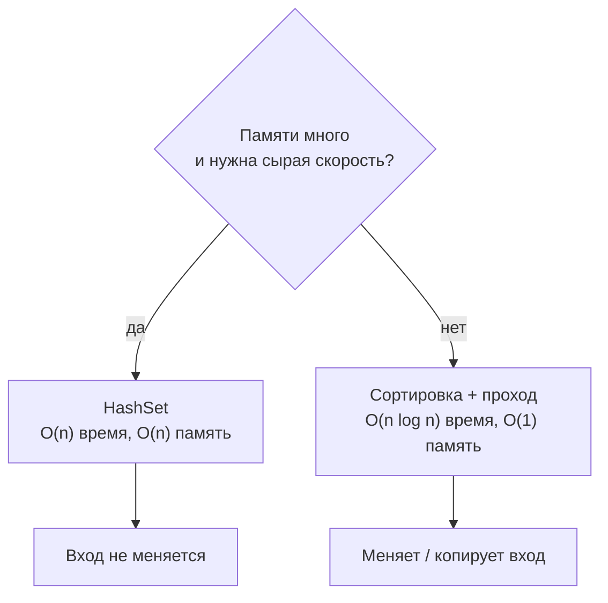

# Поиск дубликатов в массиве

> **Режим практики.** Это *challenge*-тема: реализуй метод в `Solution.java`,
> нажми **Run tests**, и скрытый набор тестов прогонит твой код по нескольким
> кейсам. Миссия зачтена, когда все они становятся зелёными.

## Задача

Дан массив целых чисел — верни **различные значения, которые встречаются более
одного раза**, по возрастанию. Каждое повторяющееся значение указывается ровно
один раз, сколько бы раз оно ни повторялось.

Представь гардероб в переполненном театре: десятки людей сдают номерки, и тебе
нужен список номеров, которые сдали **дважды** — причём список чистый, без
повторов одного и того же номера.

## Подход 1 — HashSet: O(n) по времени, O(n) по памяти

Заводим множество «увиденного». Проходим по массиву один раз: при первой встрече
значение кладём в `seen`, а если встретили снова — кладём в `dups`.

```java
Set<Integer> seen = new HashSet<>();
Set<Integer> dups = new TreeSet<>();   // TreeSet держит вывод отсортированным
for (int n : nums) {
    if (!seen.add(n)) {   // add() вернёт false, если значение уже было
        dups.add(n);
    }
}
```

Это как гардеробщик, который держит доску с колышками для каждого уже повешенного
номерка. Взгляд на доску мгновенен — это и есть поиск за O(1) у
[HashSet](topic:java-set-implementations). Один проход по `n` номеркам даёт **O(n)
по времени**, но доска растёт вместе с толпой: в худшем случае (всё уникально) ты
хранишь все `n` значений, то есть **O(n) по памяти**.

## Подход 2 — отсортировать и пройтись по соседям: O(n log n), O(1) памяти

Сначала сортируем массив. Теперь равные значения стоят рядом, и один проход со
сравнением каждого элемента с левым соседом находит все дубликаты.

```java
int[] a = nums.clone();
Arrays.sort(a);                         // O(n log n)
List<Integer> dups = new ArrayList<>();
for (int i = 1; i < a.length; i++) {
    if (a[i] == a[i - 1] &&             // совпадает с предыдущим значением
        (dups.isEmpty() || dups.get(dups.size() - 1) != a[i])) {
        dups.add(a[i]);                 // и ещё не записано
    }
}
```

Это как разложить сданные номерки по порядку прямо на стойке: когда они
упорядочены, любой дубликат — это буквально номерок, лежащий поверх своего
близнеца, так что один проход вниз по стопке находит их все. Сортировка стоит
**O(n log n)** — больше, чем O(n) у HashSet, — зато тебе не нужна **отдельная
доска**: вся работа идёт в самой стопке, то есть **O(1) дополнительной памяти**
(не считая списка результата).

## Компромисс



| | HashSet | Сортировка + проход |
|---|---|---|
| Время | **O(n)** | **O(n log n)** |
| Доп. память | **O(n)** | **O(1)** |
| Трогает вход | нет | да (сортирует) |
| Порядок вывода | нужна сортировка или `TreeSet` | уже отсортирован бесплатно |

Время и память тянут в разные стороны — классические инженерные качели. Ты
меняешь память на скорость (HashSet) или скорость на память (сортировка). Как
выбор между большим холодильником, чтобы закупаться раз в неделю, и частыми
быстрыми забегами в магазин у дома без всякого хранилища.

## Когда что выбрать

- **HashSet** — когда важна скорость и памяти достаточно, или когда **нельзя
  трогать** исходный массив, или у тебя есть лишь поток, по которому можно пройти
  один раз.
- **Сортировка + проход** — когда памяти мало (огромные массивы, встраиваемый
  код), когда данные **уже отсортированы**, или когда вывод и так нужен
  отсортированным и не жалко переставить вход. См.
  [сложность поиска после сортировки](topic:search-complexity-after-sorting).
- Никогда не вариант с **вложенными циклами** (сравнивать каждую пару): это
  [O(n²)](topic:quadratic-complexity), и он разваливается, как только массив
  становится большим.

## Ответ за 60 секунд

> Два ходовых подхода. Поиск в `HashSet` — это O(1), поэтому я прохожу по массиву
> один раз, запоминая увиденное и собирая всё, что встретилось дважды: O(n) по
> времени, но O(n) дополнительной памяти. Либо я сортирую массив и иду по соседям,
> ведь равные значения становятся рядом: O(n log n) по времени, зато всего O(1)
> дополнительной памяти ценой перестановки входа. То есть это компромисс время
> против памяти: бери HashSet, когда память дешёвая и вход трогать нельзя, бери
> сортировку, когда памяти мало или данные уже отсортированы. Двойного цикла за
> O(n²) я бы избегал.

## Частые заблуждения

- ❌ «HashSet всегда лучший, ведь он O(n)». — Он O(n) по *времени*, но O(n) по
  *памяти*, а плохой `hashCode`/множество коллизий могут ухудшить поиск до O(n).
  См. [контракт equals/hashCode](topic:equals-hashcode-contract).
- ❌ «Сортировка бесплатна». — `Arrays.sort` — это O(n log n), и он **меняет
  массив**; склонируй его, если вызывающему ещё нужен исходный порядок.
- ❌ «Просто два вложенных цикла». — Просто, но [O(n²)](topic:quadratic-complexity):
  годится для десяти элементов, катастрофа для миллиона.
- ❌ «Вернуть каждое повторение». — Задача хочет каждое повторяющееся значение
  **один раз**; убери повторы из результата (`TreeSet` или проверка соседа выше).
