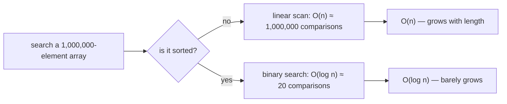
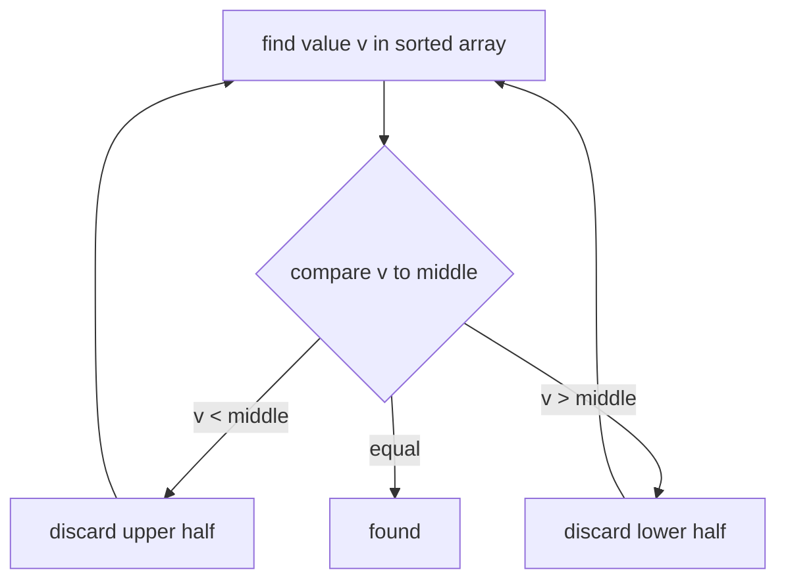

# Search Complexity for a 1,000,000-Element Array

This is a classic interview trap. The number **1,000,000** is bait. The honest
answer is *not* a single number — it is a **growth class**, and the class depends
on **how** you search and whether the array is sorted, not on the specific length.

Think of a giant warehouse with a million numbered shelves. The question "how long
to find a box?" has no single answer until you know: do you have to walk every
aisle, or is there a catalogue?

## The headline answer

For a plain (unsorted) array, **searching by value is `O(n)`** — linear time.
Plugging in `n = 1,000,000`:

| How you search                    | Complexity | Work for n = 1,000,000      |
|-----------------------------------|------------|-----------------------------|
| Linear scan (unsorted)            | `O(n)`     | up to ~1,000,000 comparisons |
| Binary search (**sorted** array)  | `O(log n)` | about **20** comparisons     |
| Hash lookup (`HashMap`/`HashSet`) | `O(1)` avg | about **1** probe            |

So "what is the complexity?" → **`O(n)` for the array as given**; the million only
tells you the *worst-case* scan touches ~a million elements. If the array is
**sorted**, you may answer `O(log n)`, because then binary search is on the table.

## Why the length does not change the class

`O(n)` is a statement about **how the cost grows as `n` grows**, not about a fixed
amount of work. Doubling the array roughly doubles a linear scan; the *shape* of
the curve is the same whether the array has 10 elements or 1,000,000.

It's like asking "how long to walk a corridor?" The honest answer is "it scales
with the length of the corridor" — a 10-metre and a 10-kilometre corridor are the
same *kind* of problem (walk every metre), just at different scale. Big-O names the
kind; the million names the scale.

(For the full reasoning on why index access is `O(1)` but value search is `O(n)`,
see [Array Lookup by Index vs by Value](topic:array-search-complexity).)

## Linear scan: the ~1,000,000 figure

Walking the warehouse aisle by aisle, you might find the box on the first shelf
(lucky) or on the very last one (unlucky). So linear search is:

- **Best case `O(1)`** — it's the first element.
- **Average `O(n)`** — on average you check about half, ~500,000.
- **Worst case `O(n)`** — it's last, or absent, so you touch all 1,000,000.

We report the **worst/average** behaviour, which is why the answer is `O(n)` and
the headline figure is ~a million, not the lucky "1". Note `Arrays`/`ArrayList`
`indexOf` and `contains` are exactly this linear scan.

## Binary search: ~20, not a million

If the warehouse shelves are sorted by part number, you don't walk every aisle. You
check the **middle** shelf, decide whether your box is in the lower or upper half,
and throw away half the warehouse in one look. Repeat, halving each time.

For a million elements that is `log2(1,000,000) ≈ 20` steps. This is the dramatic
part of the answer: **~20 vs ~1,000,000** for the same array. But it only works on
a **sorted** array, and keeping the array sorted (or sorting it first, `O(n log n)`)
has its own cost — see [Search Complexity After Sorting an Array](topic:search-complexity-after-sorting).

## When you need fast lookup without sorting

If the warehouse used a **lookup desk** — hand over a part number, the clerk reads a
code and walks straight to one shelf — you'd find any box in roughly one step,
regardless of size. That is a hash-based structure: a
[HashMap](topic:hashmap-lookup-complexity) or `HashSet` computes the slot **from the
value itself**, giving `O(1)` average lookup at the price of extra memory and no
ordering. A [TreeSet](topic:treeset) keeps values sorted for guaranteed `O(log n)`.
For frequent membership tests on a million items, that's the difference between ~1
and ~1,000,000 — which is exactly why databases add [indexes](topic:database-indexes)
instead of scanning every row, and why the [Java Collections Overview](topic:java-collections-overview)
matters when you pick a container.

## 60-second interview answer

> It's a trick framing — 1,000,000 doesn't define the complexity, the *method*
> does. Searching an unsorted array **by value** is `O(n)`: a linear scan that in
> the worst case checks all ~1,000,000 elements (average ~half). Big-O describes how
> cost grows with length, so the class is `O(n)` whether n is 10 or a million; the
> number just makes it concrete. If the array is **sorted**, I'd binary-search in
> `O(log n)` — about 20 comparisons for a million. And if I need fast lookup without
> sorting, I'd use a hash structure like `HashMap`/`HashSet` for `O(1)` average.
> Indexed access `arr[i]`, by the way, is always `O(1)` and unrelated to the search.

## Common misconceptions

- ❌ "The complexity is 1,000,000." — That's a count of operations in the worst
  case, not *the complexity*. The complexity is the class `O(n)`; the count follows
  from it once you fix `n`.
- ❌ "A bigger array has a bigger Big-O." — No. `O(n)` is `O(n)` for any size. The
  length scales the *work*, not the *class*.
- ❌ "Searching the array is `O(1)`." — Only **indexed access** `arr[i]` is `O(1)`.
  Searching **by value** in an unsorted array is `O(n)`.
- ❌ "Binary search works on this million-element array." — Only if it is **sorted**.
  On unsorted data you must sort first (`O(n log n)`) or scan linearly (`O(n)`).
- ❌ "`contains` / `indexOf` are cheap." — On an array or `ArrayList` they are linear
  scans, `O(n)`. For frequent membership checks use a `HashSet`. See
  [ArrayList vs LinkedList](topic:arraylist-vs-linkedlist).
