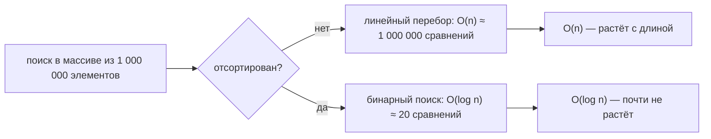
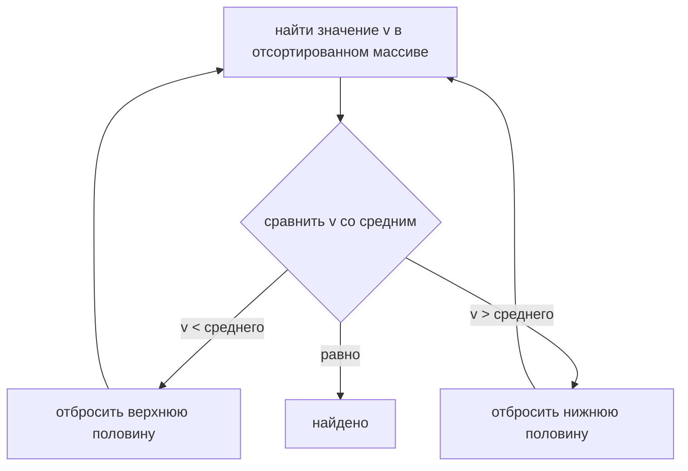

# Сложность поиска в массиве из 1 000 000 элементов

Это классическая ловушка на собеседовании. Число **1 000 000** — приманка. Честный
ответ — это *не* одно число, а **класс роста**, и класс зависит от того, **как** вы
ищете и отсортирован ли массив, а не от конкретной длины.

Представьте огромный склад с миллионом пронумерованных стеллажей. У вопроса
«сколько времени искать коробку?» нет единственного ответа, пока не известно:
обходить ли каждый ряд или есть каталог?

## Главный ответ

Для обычного (неотсортированного) массива **поиск по значению — это `O(n)`** —
линейное время. Подставляя `n = 1 000 000`:

| Как вы ищете                       | Сложность   | Работа при n = 1 000 000        |
|------------------------------------|-------------|---------------------------------|
| Линейный перебор (неотсортирован)  | `O(n)`      | до ~1 000 000 сравнений         |
| Бинарный поиск (**отсортирован**)  | `O(log n)`  | около **20** сравнений          |
| Хеш-поиск (`HashMap`/`HashSet`)    | `O(1)` сред.| около **1** обращения           |

Итак, «чему равна сложность?» → **`O(n)` для массива как он есть**; миллион лишь
говорит, что *в худшем случае* перебор затронет ~миллион элементов. Если массив
**отсортирован**, можно ответить `O(log n)`, потому что тогда доступен бинарный
поиск.

## Почему длина не меняет класс

`O(n)` — это утверждение о том, **как растёт стоимость с ростом `n`**, а не о
фиксированном объёме работы. Удвоение массива примерно удваивает линейный перебор;
*форма* кривой одна и та же, что у массива из 10 элементов, что из 1 000 000.

Это как спросить «сколько идти по коридору?». Честный ответ — «масштабируется с
длиной коридора»: коридор в 10 метров и в 10 километров — это один и тот же *тип*
задачи (пройти каждый метр), просто в разном масштабе. Big-O называет тип, а
миллион — масштаб.

(Полное обоснование того, почему доступ по индексу — `O(1)`, а поиск по значению —
`O(n)`, см. в [Поиск в массиве по индексу и по значению](topic:array-search-complexity).)

## Линейный перебор: цифра ~1 000 000

Обходя склад ряд за рядом, вы можете найти коробку на первом стеллаже (повезло) или
на самом последнем (не повезло). Поэтому линейный поиск таков:

- **Лучший случай `O(1)`** — это первый элемент.
- **Средний `O(n)`** — в среднем проверяется около половины, ~500 000.
- **Худший случай `O(n)`** — он последний или отсутствует, и вы трогаете все
  1 000 000.

Мы сообщаем **худшее/среднее** поведение — поэтому ответ `O(n)`, а главная цифра
~миллион, а не удачная «1». Заметьте: `indexOf` и `contains` у `Arrays`/`ArrayList`
— это ровно такой линейный перебор.

## Бинарный поиск: ~20, а не миллион

Если стеллажи склада отсортированы по номеру детали, вы не обходите каждый ряд. Вы
смотрите на **средний** стеллаж, решаете, в нижней или верхней половине ваша
коробка, и одним взглядом отбрасываете половину склада. Повторяете, каждый раз
сокращая вдвое.

Для миллиона элементов это `log2(1 000 000) ≈ 20` шагов. Это самая яркая часть
ответа: **~20 против ~1 000 000** для одного и того же массива. Но это работает
только на **отсортированном** массиве, а поддержание массива отсортированным (или
сортировка перед поиском, `O(n log n)`) имеет свою цену — см.
[Сложность поиска после сортировки массива](topic:search-complexity-after-sorting).

## Когда нужен быстрый поиск без сортировки

Если бы на складе была **стойка справок** — вы называете номер детали, клерк читает
код и идёт прямо к одному стеллажу — вы нашли бы любую коробку примерно за один шаг,
независимо от размера. Это структура на основе хеша: [HashMap](topic:hashmap-lookup-complexity)
или `HashSet` вычисляет ячейку **из самого значения**, давая в среднем `O(1)` ценой
дополнительной памяти и отсутствия порядка. [TreeSet](topic:treeset) держит значения
отсортированными ради гарантированного `O(log n)`. Для частых проверок наличия среди
миллиона элементов это разница между ~1 и ~1 000 000 — именно поэтому базы данных
добавляют [индексы](topic:database-indexes) вместо сканирования каждой строки, и
поэтому [Обзор коллекций Java](topic:java-collections-overview) важен при выборе
контейнера.

## Ответ за 60 секунд

> Это формулировка-ловушка: 1 000 000 не определяет сложность — её определяет
> *метод*. Поиск в неотсортированном массиве **по значению** — это `O(n)`: линейный
> перебор, который в худшем случае проверяет все ~1 000 000 элементов (в среднем
> ~половину). Big-O описывает, как растёт стоимость с длиной, поэтому класс — `O(n)`,
> будь n равно 10 или миллиону; число лишь делает это конкретным. Если массив
> **отсортирован**, я применю бинарный поиск за `O(log n)` — около 20 сравнений для
> миллиона. А если нужен быстрый поиск без сортировки, возьму хеш-структуру вроде
> `HashMap`/`HashSet` ради `O(1)` в среднем. Доступ по индексу `arr[i]`, кстати,
> всегда `O(1)` и к поиску отношения не имеет.

## Частые заблуждения

- ❌ «Сложность равна 1 000 000.» — Это число операций в худшем случае, а не *сама
  сложность*. Сложность — это класс `O(n)`; число следует из него, как только
  зафиксируешь `n`.
- ❌ «У большего массива больше Big-O.» — Нет. `O(n)` — это `O(n)` при любом размере.
  Длина масштабирует *работу*, а не *класс*.
- ❌ «Поиск в массиве — это `O(1)`.» — `O(1)` только **доступ по индексу** `arr[i]`.
  Поиск **по значению** в неотсортированном массиве — это `O(n)`.
- ❌ «Бинарный поиск работает на этом массиве из миллиона элементов.» — Только если
  он **отсортирован**. На неотсортированных данных нужно сначала отсортировать
  (`O(n log n)`) или перебирать линейно (`O(n)`).
- ❌ «`contains` / `indexOf` дешёвые.» — На массиве или `ArrayList` это линейный
  перебор, `O(n)`. Для частых проверок наличия используйте `HashSet`. См.
  [ArrayList против LinkedList](topic:arraylist-vs-linkedlist).
