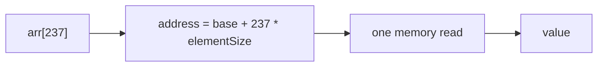
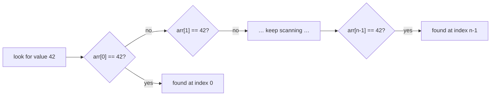
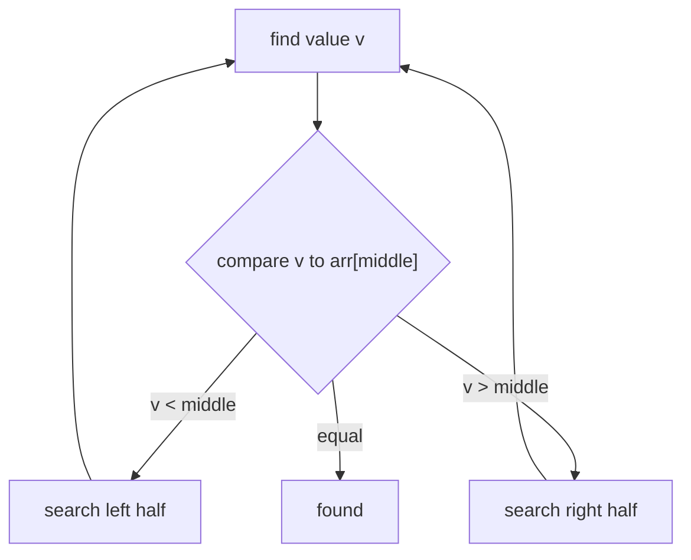

# Array Lookup by Index vs by Value

An array is a single, contiguous block of memory holding equal-sized slots. That
one physical fact explains both numbers an interviewer wants from you:

- **By index — `arr[i]` — is `O(1)`** (constant time).
- **By value — "where is the number 42?" — is `O(n)`** (linear time).

Think of a wall of numbered mailboxes in an apartment lobby, all the same size,
standing side by side.

## By index: O(1)

To open **mailbox #237** you don't walk past the first 236 boxes. You know each
box is, say, 30 cm wide and the wall starts at the door, so box #237 sits exactly
`237 × 30 cm` from the start. You step straight to it. One calculation, one move —
no matter how long the wall is.

The CPU does the same arithmetic: the element address is

```
address = base + index * elementSize
```

It is a multiply and an add, then a single memory read. The array's length never
enters the formula, so a 10-element array and a 10-million-element array cost the
same for an indexed read. That is what `O(1)` means. (The deeper mechanics of how
the index turns into an address live in
[How an ArrayList Index Finds Its Object](topic:arraylist-index-addressing).)



## By value: O(n)

Now the question flips: "*which* mailbox contains the letter addressed to Smith?"
The boxes are arranged by number, not by who lives there, so there is no formula
for "Smith". You open box #1, look inside, then #2, then #3… until you find it (or
reach the end and conclude it's not there). With `n` boxes you may open all `n`.

That sequential walk is **linear search**, and it is `O(n)`:

- **Best case** `O(1)` — the value is at the very first slot.
- **Worst / average case** `O(n)` — the value is last, or absent, so you touch
  every element.



The asymmetry is the whole point: the array indexes positions, not contents. Going
position → value is instant; going value → position requires a search.

## The shortcut: a sorted array → O(log n)

If the mailboxes were instead sorted **by resident name**, you wouldn't scan from
the start — you'd open the middle box, see whether "Smith" comes before or after
it, and throw away half the wall in one look. Repeat, halving each time. That is
**binary search**, `O(log n)`: a million sorted elements take about 20 comparisons.

The catch is the same as in real life: keeping the wall sorted by name has its own
cost, and binary search only works while the array stays ordered. A sorted-on-name
wall is great for finding people but no longer lets you jump to "box #237" by
resident — you trade one fast lookup for another.



## Why not just always have O(1) value lookup?

You can — but not with a plain array. A different structure pays for it. A
[HashMap](topic:hashmap-lookup-complexity) computes a slot **from the value/key
itself** (like sorting mail by a code printed on each letter into pigeonholes), so
it averages `O(1)` lookup by content — at the price of extra memory and no order. A
[TreeSet](topic:treeset) keeps things sorted for `O(log n)` lookup and range
queries. The array is the baseline these are measured against. This same
"scan vs. addressed lookup" trade-off is why databases add
[indexes](topic:database-indexes) instead of scanning every row.

## 60-second interview answer

> An array is a contiguous block of fixed-size slots. **By index it's O(1)**: the
> address is computed directly as `base + index * elementSize`, one arithmetic
> step plus one memory read, independent of length. **By value it's O(n)**: the
> array doesn't know where a value lives, so you do a linear scan — best case O(1)
> if it's first, but O(n) on average and worst case, or to prove it's absent.
> If the array is **sorted**, you can binary-search by value in **O(log n)**. If
> you need fast lookup by content without sorting, you reach for a hash-based
> structure like a `HashMap`, which is O(1) on average. Writing is a separate
> story — inserting or deleting in the middle is O(n) because elements shift.

## Common misconceptions

- ❌ "Searching an array is O(1)." — Only **indexed access** is O(1). Searching
  **by value** in an unsorted array is O(n).
- ❌ "Binary search works on any array." — Only on a **sorted** array. On unsorted
  data you must sort first (O(n log n)) or scan linearly (O(n)).
- ❌ "Bigger arrays make `arr[i]` slower." — No. Indexed read is constant time; the
  length is not in the address formula.
- ❌ "`indexOf` / `contains` are cheap." — `Arrays`/`ArrayList` `indexOf` and
  `contains` are linear scans, O(n). For frequent membership tests prefer a
  `HashSet`. See [ArrayList vs LinkedList](topic:arraylist-vs-linkedlist) and the
  [Java Collections Overview](topic:java-collections-overview).
- ❌ "Index access and value search are the same kind of lookup." — They're
  opposites: position → value is direct; value → position needs a search.
