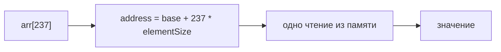
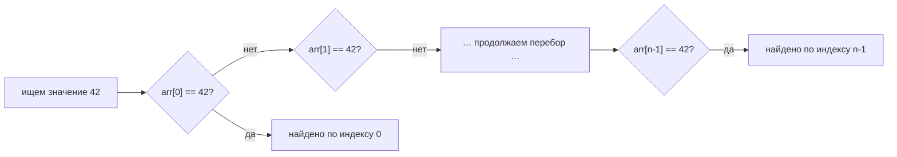
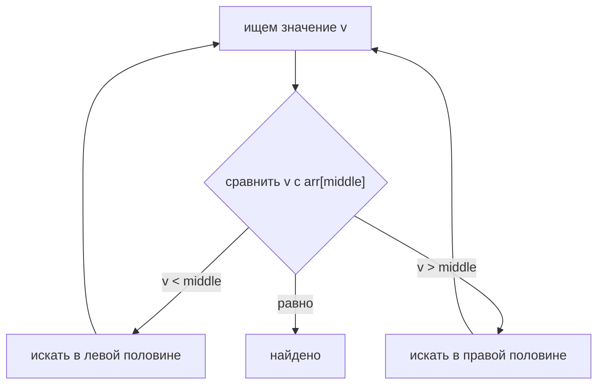

# Поиск в массиве по индексу и по значению

Массив — это единый непрерывный блок памяти из одинаковых по размеру ячеек. Этот
один физический факт объясняет оба числа, которые хочет услышать собеседующий:

- **По индексу — `arr[i]` — это `O(1)`** (константное время).
- **По значению — «где число 42?» — это `O(n)`** (линейное время).

Представьте стену пронумерованных почтовых ящиков в подъезде: все одинакового
размера, стоят вплотную друг к другу.

## По индексу: O(1)

Чтобы открыть **ящик №237**, вы не проходите мимо первых 236. Вы знаете, что
каждый ящик, скажем, 30 см шириной, а стена начинается от двери — значит, ящик
№237 находится ровно в `237 × 30 см` от начала. Вы сразу подходите к нему. Один
расчёт, одно движение — и неважно, насколько длинная стена.

Процессор делает ту же арифметику: адрес элемента равен

```
address = base + index * elementSize
```

Это умножение и сложение, затем одно чтение из памяти. Длина массива в формулу не
входит, поэтому массив из 10 элементов и массив из 10 миллионов элементов стоят
одинаково при чтении по индексу. Это и есть `O(1)`. (Подробная механика того, как
индекс превращается в адрес, разобрана в теме
[Как индекс ArrayList находит свой объект](topic:arraylist-index-addressing).)



## По значению: O(n)

Теперь вопрос переворачивается: «в *каком* ящике лежит письмо для Смита?» Ящики
расставлены по номерам, а не по жильцам, поэтому формулы для «Смита» нет. Вы
открываете ящик №1, смотрите внутрь, потом №2, потом №3… пока не найдёте (или не
дойдёте до конца и не решите, что письма нет). При `n` ящиках вы можете открыть
все `n`.

Этот последовательный обход — **линейный поиск**, и он `O(n)`:

- **Лучший случай** `O(1)` — значение в самой первой ячейке.
- **Худший / средний случай** `O(n)` — значение последнее или отсутствует, так
  что вы трогаете каждый элемент.



В этой асимметрии вся суть: массив индексирует позиции, а не содержимое. Переход
позиция → значение мгновенный; переход значение → позиция требует поиска.

## Короткий путь: отсортированный массив → O(log n)

Если бы ящики были расставлены **по фамилии жильца**, вы бы не перебирали с
начала — вы открыли бы средний ящик, посмотрели, идёт «Смит» до или после него, и
отбросили половину стены за один взгляд. Повторяем, каждый раз деля пополам. Это
**бинарный поиск**, `O(log n)`: миллион отсортированных элементов — это около 20
сравнений.

Подвох тот же, что и в жизни: поддерживать стену отсортированной по фамилии стоит
отдельных усилий, а бинарный поиск работает только пока массив остаётся
упорядоченным. Стена, отсортированная по фамилии, отлично подходит для поиска
людей, но уже не позволяет прыгнуть к «ящику №237» по жильцу — вы меняете один
быстрый доступ на другой.



## Почему бы не сделать поиск по значению всегда O(1)?

Можно — но не обычным массивом. За это платит другая структура.
[HashMap](topic:hashmap-lookup-complexity) вычисляет ячейку **из самого
значения/ключа** (как сортировка писем по напечатанному на каждом коду по
ячейкам), поэтому в среднем даёт `O(1)` поиск по содержимому — ценой лишней памяти
и отсутствия порядка. [TreeSet](topic:treeset) держит элементы отсортированными
для поиска и диапазонных запросов за `O(log n)`. Массив — это базовый уровень, с
которым их сравнивают. Этот же компромисс «перебор против адресного доступа» —
причина, по которой базы данных добавляют [индексы](topic:database-indexes)
вместо сканирования каждой строки.

## Ответ за 60 секунд

> Массив — это непрерывный блок ячеек фиксированного размера. **По индексу это
> O(1)**: адрес вычисляется напрямую как `base + index * elementSize` — один шаг
> арифметики плюс одно чтение из памяти, независимо от длины. **По значению это
> O(n)**: массив не знает, где лежит значение, поэтому делается линейный перебор —
> лучший случай O(1), если оно первое, но O(n) в среднем и в худшем случае, или
> чтобы доказать, что его нет. Если массив **отсортирован**, по значению можно
> искать бинарным поиском за **O(log n)**. Если нужен быстрый поиск по содержимому
> без сортировки — берут хеш-структуру вроде `HashMap` со средним O(1). Запись —
> отдельная история: вставка или удаление в середине это O(n), потому что элементы
> сдвигаются.

## Распространённые заблуждения

- ❌ «Поиск в массиве — это O(1)». — O(1) только **доступ по индексу**. Поиск **по
  значению** в неотсортированном массиве — это O(n).
- ❌ «Бинарный поиск работает на любом массиве». — Только на
  **отсортированном**. По неупорядоченным данным нужно сначала отсортировать
  (O(n log n)) или перебирать линейно (O(n)).
- ❌ «Чем больше массив, тем медленнее `arr[i]`». — Нет. Чтение по индексу
  константно; длина в формулу адреса не входит.
- ❌ «`indexOf` / `contains` дешёвые». — `indexOf` и `contains` у
  `Arrays`/`ArrayList` — это линейный перебор, O(n). Для частых проверок
  принадлежности лучше `HashSet`. См. [ArrayList vs LinkedList](topic:arraylist-vs-linkedlist)
  и [Обзор коллекций Java](topic:java-collections-overview).
- ❌ «Доступ по индексу и поиск по значению — это одно и то же». — Это
  противоположности: позиция → значение прямой; значение → позиция требует поиска.
