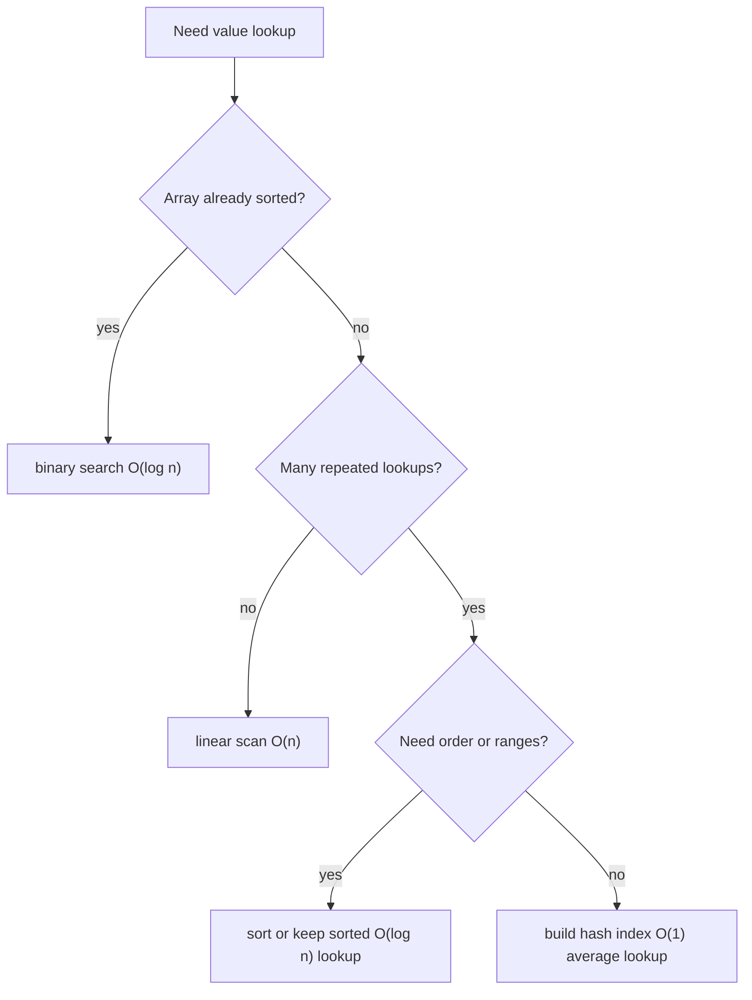
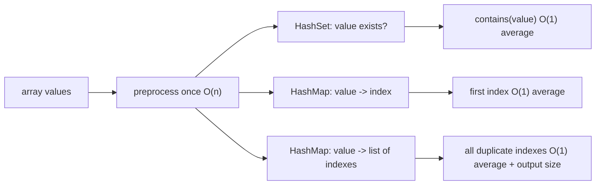

# Speeding Up Array Search by Value

## The core problem

In a plain unsorted array, searching by value means checking elements one by one,
so the cost is **O(n)**. The array gives fast access by position, not by content:
`arr[10]` is direct, but "where is value 42?" has no address formula. For the
baseline distinction, see [Array Lookup by Index vs by Value](topic:array-search-complexity).
Think of a kitchen shelf: if jars are only placed by shelf position, finding the
jar labeled "paprika" means reading labels until you see it.

So the honest answer is not "make the array itself magically faster." The answer
is: add information that lets you skip most of the scan, and pay for that
information somewhere else. A post office sorts or indexes mail before the rush
hour; the preparation work is what makes later lookup faster.

## Option 1: keep the array sorted and use binary search

If the array is sorted by the same value you search for, use binary search:
compare with the middle element, discard half of the remaining range, and repeat.
Lookup becomes **O(log n)** after the data is sorted. This is like a recipe box
ordered alphabetically: you open near the middle instead of checking every card.

The cost is that sorting is not free. A normal comparison sort is **O(n log n)**,
so sorting just for one lookup is usually worse than a simple O(n) scan. Sorting
pays off when the data is searched many times, or when it is naturally kept
sorted. The focused topic [Search Complexity After Sorting an Array](topic:search-complexity-after-sorting)
goes deeper into that trade-off.

Also watch updates. Inserting into the middle of a sorted array may require
shifting elements, so it can cost **O(n)**. In real life, a perfectly alphabetized
post-office tray is fast to search, but adding a new envelope in the right place
can disturb the tray.

## Option 2: build a hash-based lookup structure

For frequent membership checks, build a `HashSet` from the array. Building it is
**O(n)**, and then `contains(value)` is **O(1) average**. If you need the index,
build a `HashMap<Value, Integer>` or, when duplicates matter,
`HashMap<Value, List<Integer>>`. This is like putting every jar label into a
kitchen notebook: the shelf is still the shelf, but the notebook tells you where
to go.

Hashing is usually the best answer when order is irrelevant and the question is
"does this value exist?" or "where did I first see it?" The trade-offs are extra
memory, preprocessing time, and the need for correct `equals()` / `hashCode()` for
object values. For the mechanics, see [HashMap lookup speed](topic:hashmap-lookup-complexity)
and the broader [HashMap internals](topic:hashmap). For Java membership
collections, [HashSet vs LinkedHashSet vs TreeSet](topic:java-set-implementations)
compares the usual choices.

## Option 3: choose an index shape that matches the question

The exact index depends on what "find" means:

- Need only yes/no membership: use `HashSet<T>`. It is like a guest list at a
  building entrance: either the name is present or not.
- Need one position: use `HashMap<T, Integer>`, usually storing the first or last
  index by an explicit rule. It is like a cloakroom ticket pointing to one hook.
- Need all positions for duplicates: use `HashMap<T, List<Integer>>`. It is like a
  post office ledger where one surname can map to several mailboxes.
- Need sorted traversal, nearest value, or range queries: keep data sorted or use
  a tree-based structure such as `TreeSet` / `TreeMap`, with **O(log n)** lookup.
  This is like traffic signs arranged by kilometer mark: finding "all exits
  between 10 and 20 km" needs order, not just a hash code.

This is the same idea as [database indexes](topic:database-indexes): a table can
be scanned row by row, but an index stores extra structure so repeated lookups
avoid a full scan.

## When a linear scan is still fine

Do not build an index blindly. For one lookup on a small or one-off array, a
linear scan is often simpler, faster in practice, and uses no extra memory. A
cook does not create a catalog for three jars on the counter; reading three labels
is cheaper than maintaining the catalog.

If the array changes often, the index must be updated too. A stale `HashMap` that
points to old positions is worse than a slow scan because it returns the wrong
answer quickly. Treat the index as cached derived data: when the source array
changes, rebuild or update the index consistently.

## 60-second interview answer

> Searching by value in an unsorted array is O(n), because the array indexes
> positions, not contents. To speed it up, I need extra structure or ordering. If
> the array is sorted, I can use binary search and get O(log n), but sorting first
> costs O(n log n), so it only pays off for many searches or already sorted data.
> If I need many membership lookups and do not care about order, I can build a
> HashSet in O(n) and then check values in O(1) average. If I need positions, I
> can build a HashMap from value to index, or value to a list of indexes for
> duplicates. The trade-offs are extra memory, preprocessing time, update
> maintenance, and correct equality/hashCode for object values. For one small
> one-off lookup, a linear scan may still be the best solution.

## Common misconceptions

- "There is a universal way to make array value search O(1)." Not with a plain
  array. O(1) average lookup comes from an extra hash table, not from the array
  itself. It is the kitchen notebook, not the shelf, doing the shortcut.
- "Sorting always helps." Sorting costs O(n log n), so for one search it is often
  overkill. It is like alphabetizing every envelope just to find one letter.
- "HashMap solves everything." Hashing loses ordering and costs memory; it also
  depends on stable equality and hash codes. A fast but stale index is like a
  wrong post-office directory.
- "Duplicates do not matter." They matter if the question asks for all positions
  or counts. One value may map to many indexes, just as one surname may appear in
  several mailboxes.
- "Big-O alone decides the design." Constants, data size, update frequency, memory
  pressure, and required ordering all matter. For a small kitchen shelf, walking
  over is often quicker than building a full catalog.
