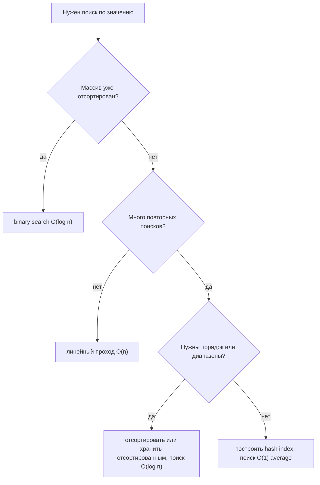
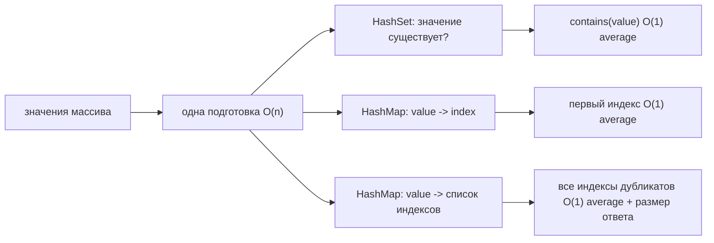

# Как ускорить поиск по значению в массиве

## Основная проблема

В обычном неотсортированном массиве поиск по значению означает проверку
элементов по одному, поэтому стоимость равна **O(n)**. Массив быстро даёт доступ
по позиции, а не по содержимому: `arr[10]` читается напрямую, но для вопроса
«где значение 42?» нет формулы адреса. Базовое различие разобрано в теме
[Поиск в массиве по индексу и по значению](topic:array-search-complexity).
Представьте кухонную полку: если банки стоят только по местам на полке, то банку
с надписью «паприка» приходится искать, читая этикетки одну за другой.

Поэтому честный ответ не в том, чтобы «магически ускорить сам массив». Ответ
такой: добавить информацию, которая позволит пропускать большую часть прохода, и
заплатить за эту информацию в другом месте. Почта сортирует или индексирует
письма до часа пик; именно подготовительная работа делает последующий поиск
быстрее.

## Вариант 1: хранить массив отсортированным и использовать binary search

Если массив отсортирован по тому же значению, по которому идёт поиск, используйте
binary search: сравните искомое значение со средним элементом, отбросьте половину
оставшегося диапазона и повторяйте. После сортировки поиск становится
**O(log n)**. Это похоже на коробку с рецептами по алфавиту: можно открыть около
середины, а не проверять каждую карточку.

Цена в том, что сортировка не бесплатна. Обычная сортировка сравнениями стоит
**O(n log n)**, поэтому сортировать ради одного поиска обычно хуже, чем сделать
простой проход за O(n). Сортировка окупается, когда по тем же данным ищут много
раз или когда данные естественно поддерживаются отсортированными. Подробно этот
компромисс разобран в теме
[Сложность поиска после сортировки массива](topic:search-complexity-after-sorting).

Также учитывайте обновления. Вставка в середину отсортированного массива может
потребовать сдвига элементов, поэтому стоит **O(n)**. В жизни идеально
алфавитный почтовый лоток быстро искать, но новое письмо приходится аккуратно
вставлять в нужное место, нарушая лоток.

## Вариант 2: построить hash-based структуру для поиска

Для частых проверок наличия постройте `HashSet` из массива. Построение стоит
**O(n)**, а затем `contains(value)` работает за **O(1) average**. Если нужен
индекс, постройте `HashMap<Value, Integer>`, а если важны дубликаты,
`HashMap<Value, List<Integer>>`. Это похоже на кухонный блокнот с этикетками
банок: полка остаётся полкой, но блокнот подсказывает, куда идти.

Hashing обычно лучший ответ, когда порядок не важен, а вопрос звучит как «есть
ли это значение?» или «где оно встретилось впервые?». Компромиссы: дополнительная
память, время подготовки и корректные `equals()` / `hashCode()` для объектных
значений. Механику объясняют темы [скорость поиска в HashMap](topic:hashmap-lookup-complexity)
и более широкие [внутренности HashMap](topic:hashmap). Для Java-коллекций
членства см. [HashSet vs LinkedHashSet vs TreeSet](topic:java-set-implementations).

## Вариант 3: выбрать форму индекса под вопрос

Точная форма индекса зависит от того, что означает «найти»:

- Нужно только да/нет по наличию: используйте `HashSet<T>`. Это как список гостей
  у входа в здание: имя либо есть, либо его нет.
- Нужна одна позиция: используйте `HashMap<T, Integer>`, обычно сохраняя первый
  или последний индекс по явно выбранному правилу. Это как номерок в гардеробе,
  который указывает на один крючок.
- Нужны все позиции для дубликатов: используйте `HashMap<T, List<Integer>>`. Это
  как почтовый журнал, где одна фамилия может вести к нескольким ящикам.
- Нужен отсортированный обход, ближайшее значение или запросы по диапазону:
  храните данные отсортированными или используйте древовидную структуру вроде
  `TreeSet` / `TreeMap`, с поиском за **O(log n)**. Это как дорожные указатели,
  расположенные по километрам: чтобы найти «все съезды между 10 и 20 км», нужен
  порядок, а не только hash code.

Та же идея лежит в основе [индексов баз данных](topic:database-indexes): таблицу
можно сканировать строка за строкой, но индекс хранит дополнительную структуру,
чтобы повторные поиски не делали полный проход.

## Когда линейный проход всё ещё нормален

Не строите индекс автоматически. Для одного поиска в маленьком или одноразовом
массиве линейный проход часто проще, быстрее на практике и не требует
дополнительной памяти. Повар не заводит каталог для трёх банок на столе:
прочитать три этикетки дешевле, чем поддерживать каталог.

Если массив часто меняется, индекс тоже нужно обновлять. Устаревший `HashMap`,
который указывает на старые позиции, хуже медленного прохода, потому что быстро
возвращает неправильный ответ. Относитесь к индексу как к кэшированным
производным данным: когда исходный массив меняется, индекс нужно перестроить или
согласованно обновить.

## Ответ на собеседовании за 60 секунд

> Поиск по значению в неотсортированном массиве стоит O(n), потому что массив
> индексирует позиции, а не содержимое. Чтобы ускорить поиск, нужна дополнительная
> структура или порядок. Если массив отсортирован, можно использовать binary
> search и получить O(log n), но предварительная сортировка стоит O(n log n),
> поэтому она окупается для многих поисков или уже отсортированных данных. Если
> нужны частые проверки наличия и порядок не важен, можно построить HashSet за
> O(n), а потом проверять значения за O(1) average. Если нужны позиции, можно
> построить HashMap из значения в индекс или из значения в список индексов для
> дубликатов. Компромиссы: дополнительная память, время подготовки, поддержка при
> обновлениях и корректные equality/hashCode для объектных значений. Для одного
> маленького разового поиска линейный проход всё ещё может быть лучшим решением.

## Частые заблуждения

- «Есть универсальный способ сделать поиск по значению в массиве O(1)». Не для
  обычного массива. O(1) average даёт дополнительная hash table, а не сам массив.
  Короткий путь делает кухонный блокнот, а не полка.
- «Сортировка всегда помогает». Сортировка стоит O(n log n), поэтому ради одного
  поиска это часто избыточно. Это как разложить все конверты по алфавиту ради
  одного письма.
- «HashMap решает всё». Hashing теряет порядок и требует памяти; ещё он зависит
  от стабильных equality и hash code. Быстрый, но устаревший индекс похож на
  неправильный справочник на почте.
- «Дубликаты не важны». Они важны, если вопрос просит все позиции или количество.
  Одно значение может соответствовать многим индексам, как одна фамилия может
  встречаться в нескольких почтовых ящиках.
- «Big-O само выбирает дизайн». Константы, размер данных, частота обновлений,
  давление на память и требование порядка тоже важны. Для маленькой кухонной
  полки подойти и посмотреть часто быстрее, чем строить полный каталог.
