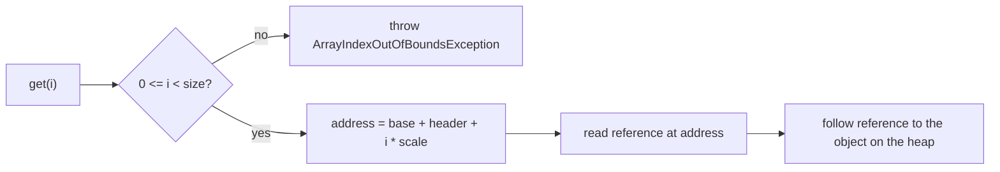
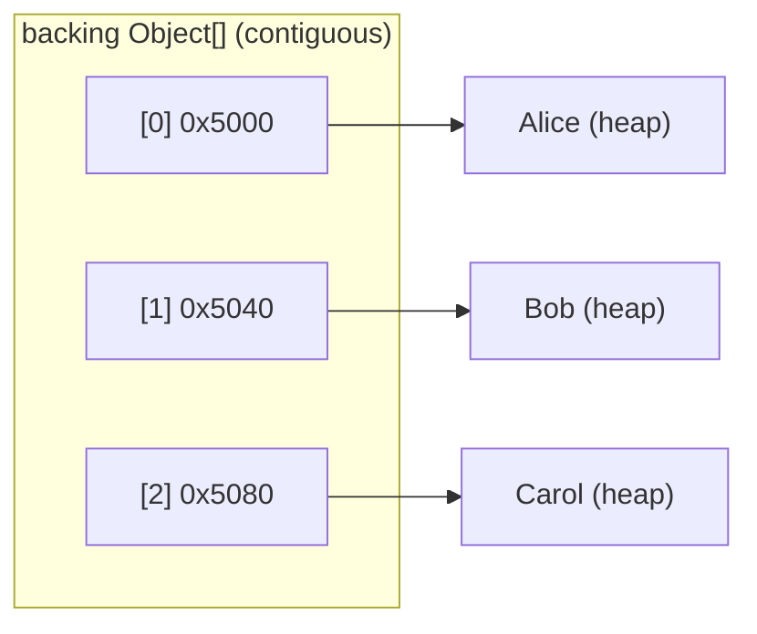

# How an ArrayList Index Finds Its Object

## Intuition

An `ArrayList` is a thin wrapper around a single `Object[]` called `elementData`. The trick to understanding indexing is that this array is **one contiguous block of memory**, and every slot in it is the **same width** — each slot holds a reference, and a reference is a fixed number of bytes (4 with compressed oops, 8 without).

Picture a wall of numbered post-office boxes. The boxes are identical in size and sit edge to edge. To reach box 27 you do not open box 0, then box 1, then box 2 looking for it. You know where box 0 starts and you know how wide one box is, so box 27 is simply `wall_start + 27 * box_width`. You walk straight to it.

`get(i)` works exactly like that. The JVM takes the array's base address, skips a small fixed **header**, then jumps `i * scale` bytes further:

```
address(i) = base + header + i * scale
```

That is a single multiply-and-add. There is no loop and no searching, which is why indexed access is **O(1)** — the cost does not grow with `i` or with the size of the list.

There is one more detail that the post-office image captures perfectly. A box does not contain the parcel itself; it contains a **claim ticket** that points to a parcel on a shelf in the back room. In the same way, a slot does not contain the object — it holds a **reference** (a pointer) to an object that lives elsewhere on the [heap](topic:jvm-memory-areas). So `get(i)` is really two hops: compute the slot's address, read the reference there, then follow that reference to the object.





## Why It Is Implemented This Way

**Equal-width slots are the whole secret.** Because every reference takes the same number of bytes, the position of slot `i` is a simple linear function of `i`. If slots had different sizes, you could not jump straight to one — you would have to walk from the start adding up widths, which is exactly the slow path a linked structure is stuck with. Identical post-office boxes are what let you compute the location of box 27; boxes of random sizes would force you to measure your way along the wall.

**References, not objects, sit in the array.** Storing the object inline would make slots different sizes (a small `Integer` versus a big `Order`), breaking the arithmetic. Keeping a uniform reference in each slot keeps the array compact and the indexing simple. It also means two different indices can point to the *same* object, and a [resize](topic:arraylist-internals) only copies the tickets, never the parcels. See [where reference types are stored](topic:reference-types-storage) and [primitive vs object types](topic:primitive-vs-object-types).

**The bounds check comes first, on purpose.** Before computing any address, the JVM checks `0 <= i < size`. This is the safety guard that turns a would-be wild memory read into a clean `ArrayIndexOutOfBoundsException`. Without it, an out-of-range index would compute an address pointing at memory that does not belong to the array — like a claim ticket for a box that was never built. The check is cheap and the JIT often hoists or eliminates it in tight loops.

**This is why arrays beat linked lists for random access.** A [`LinkedList`](topic:arraylist-vs-linkedlist) has no contiguous block and no fixed stride: to reach index `i` it must follow `i` "next" pointers one node at a time, which is O(n). The array converts an index into an address by arithmetic; the linked list has to take a walk. The same contiguity also makes arrays cache-friendly, because neighbouring slots load together. This addressing is the foundation of fast [HashMap lookup](topic:hashmap-lookup-complexity) too, where a hash is reduced to a bucket index and then read the same way.

## 60-Second Interview Answer

An `ArrayList` is backed by one contiguous `Object[]`. The objects themselves live wherever on the heap, but their references sit side by side in that array, and every reference is the same width. So to resolve index `i` the JVM does not search — it runs a bounds check that `i` is in `[0, size)`, then computes a single address: the array's base address plus a fixed header offset plus `i` times the reference width. It loads the reference stored at that address and follows it to the object. Because it is one multiply-and-add, `get(i)` is O(1), independent of `i` and of the list's size. That is the entire reason arrays give random access: equal-width elements in contiguous memory turn an index into an address by arithmetic. A `LinkedList` has no such layout, so it must walk the chain node by node, which is O(n).

## Production Relevance

When you reach for an `ArrayList` because you do a lot of indexed reads, this is *why* it is the right call: each `get(i)` is effectively free, like grabbing the parcel for a box number off a numbered wall. The same property makes iterating an `ArrayList` fast and cache-friendly, because consecutive slots are adjacent in memory.

It also explains the pitfalls. Searching for a *value* (`indexOf`, `contains`) is still O(n), because addressing helps only when you already know the index — knowing a parcel exists somewhere does not tell you its box number. And inserting or removing in the middle is O(n), because keeping the slots contiguous means everything after the gap must shift; see [ArrayList growth internals](topic:arraylist-internals).

Finally, the reference-not-object model matters for memory reasoning: an `ArrayList<Order>` of a million entries holds a million references in one array, but the `Order` objects are scattered across the heap. Sizing, garbage collection and cache behaviour all follow from that split.

## Common Misconceptions

**"`get(i)` searches for the element."** It does not. It computes the slot's address directly and reads it. No element before index `i` is touched.

**"The array stores the objects."** The array stores references. The objects live elsewhere on the heap; the slots only hold the addresses that point to them.

**"A bigger list makes `get(i)` slower."** No. The address math is the same single operation whether the list has 10 elements or 10 million. Only value searches (`contains`) scale with size.

**"The index *is* the memory address."** The index is a logical position. The JVM turns it into an address with `base + header + i * scale`; the index alone means nothing without the array's base and the slot width.

**"An out-of-range index reads garbage."** It cannot. The bounds check runs first and throws `ArrayIndexOutOfBoundsException`, so no out-of-range address is ever dereferenced.
