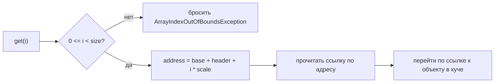
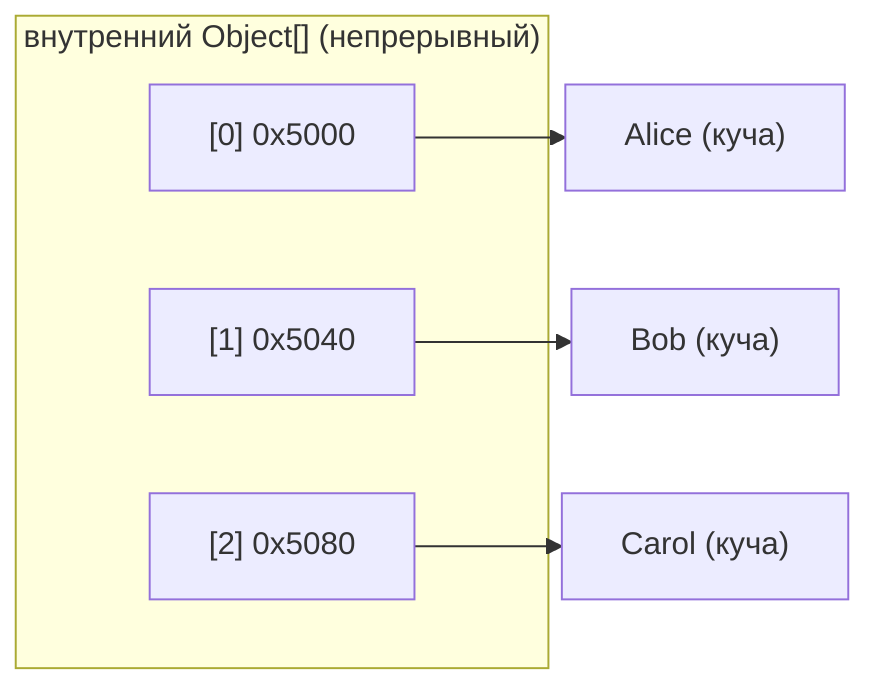

# Как индекс ArrayList находит свой объект

## Интуиция

`ArrayList` — это тонкая обёртка вокруг одного `Object[]` под именем `elementData`. Чтобы понять индексацию, важно увидеть, что этот массив — **один непрерывный блок памяти**, и каждая ячейка в нём **одинаковой ширины**: ячейка хранит ссылку, а ссылка занимает фиксированное число байт (4 с compressed oops, 8 без них).

Представьте стену пронумерованных почтовых ящиков. Ящики одинакового размера и стоят впритык друг к другу. Чтобы добраться до ящика 27, вы не открываете ящик 0, потом 1, потом 2 в его поисках. Вы знаете, где начинается ящик 0, и знаете ширину одного ящика, поэтому ящик 27 — это просто `начало_стены + 27 * ширина_ящика`. Вы идёте прямо к нему.

`get(i)` работает ровно так же. JVM берёт базовый адрес массива, пропускает небольшой фиксированный **заголовок** (header), затем прыгает на `i * scale` байт дальше:

```
address(i) = base + header + i * scale
```

Это одно умножение со сложением. Нет ни цикла, ни перебора — поэтому доступ по индексу **O(1)**: стоимость не растёт ни с `i`, ни с размером списка.

Есть ещё одна деталь, которую образ почтовых ящиков передаёт идеально. В ящике лежит не сама посылка, а **квитанция**, указывающая на посылку на полке в подсобке. Точно так же ячейка хранит не объект, а **ссылку** (указатель) на объект, который лежит в другом месте — в [куче (heap)](topic:jvm-memory-areas). Поэтому `get(i)` — это на самом деле два прыжка: вычислить адрес ячейки, прочитать лежащую там ссылку, а затем перейти по ней к объекту.





## Почему это сделано именно так

**Одинаковая ширина ячеек — весь секрет.** Раз каждая ссылка занимает одно и то же число байт, позиция ячейки `i` — это простая линейная функция от `i`. Будь ячейки разного размера, прыгнуть сразу к нужной было бы нельзя — пришлось бы идти от начала, складывая ширины, то есть ровно тот медленный путь, к которому привязана связная структура. Именно одинаковые почтовые ящики позволяют вычислить положение ящика 27; ящики случайных размеров заставили бы измерять путь вдоль стены.

**В массиве лежат ссылки, а не объекты.** Хранить объект прямо в ячейке означало бы делать ячейки разного размера (маленький `Integer` против большого `Order`), что сломало бы арифметику. Единообразная ссылка в каждой ячейке делает массив компактным, а индексацию — простой. Это также значит, что два разных индекса могут указывать на *один и тот же* объект, а [resize](topic:arraylist-internals) копирует только квитанции, но не сами посылки. См. [где хранятся ссылочные типы](topic:reference-types-storage) и [примитивы против объектных типов](topic:primitive-vs-object-types).

**Проверка границ идёт первой — и намеренно.** Прежде чем вычислять любой адрес, JVM проверяет `0 <= i < size`. Это страховка, которая превращает потенциальное «дикое» чтение памяти в аккуратное `ArrayIndexOutOfBoundsException`. Без неё индекс вне диапазона вычислил бы адрес, указывающий на память, не принадлежащую массиву, — как квитанция на ящик, который никогда не строили. Проверка дешёвая, и JIT часто выносит или устраняет её в плотных циклах.

**Вот почему массивы обыгрывают связные списки в произвольном доступе.** У [`LinkedList`](topic:arraylist-vs-linkedlist) нет ни непрерывного блока, ни фиксированного шага: чтобы добраться до индекса `i`, он идёт по `i` ссылкам «next» узел за узлом, то есть O(n). Массив превращает индекс в адрес арифметикой; связному списку приходится «идти пешком». Та же непрерывность делает массивы дружелюбными к кэшу, потому что соседние ячейки подгружаются вместе. Эта же адресация лежит в основе быстрого [поиска в HashMap](topic:hashmap-lookup-complexity), где хэш сводится к индексу бакета и читается так же.

## Ответ за 60 секунд

`ArrayList` опирается на один непрерывный `Object[]`. Сами объекты лежат где угодно в куче, но их ссылки стоят бок о бок в этом массиве, и каждая ссылка одинаковой ширины. Поэтому, чтобы разрешить индекс `i`, JVM не ищет — она делает проверку границ, что `i` лежит в `[0, size)`, а затем вычисляет один адрес: базовый адрес массива плюс фиксированное смещение заголовка плюс `i`, умноженное на ширину ссылки. Она читает ссылку по этому адресу и переходит по ней к объекту. Поскольку это одно умножение со сложением, `get(i)` — O(1), независимо от `i` и размера списка. В этом вся причина, почему массивы дают произвольный доступ: элементы одинаковой ширины в непрерывной памяти превращают индекс в адрес арифметикой. У `LinkedList` такой раскладки нет, поэтому он идёт по цепочке узел за узлом — O(n).

## Применимость на практике

Когда вы выбираете `ArrayList`, потому что много читаете по индексу, вот *почему* это правильный выбор: каждый `get(i)` практически бесплатен, как взять посылку по номеру ящика с пронумерованной стены. Это же свойство делает обход `ArrayList` быстрым и дружелюбным к кэшу, потому что соседние ячейки расположены рядом в памяти.

Оно же объясняет ловушки. Поиск по *значению* (`indexOf`, `contains`) всё равно O(n), потому что адресация помогает, только когда индекс уже известен — знание, что посылка где-то есть, не подсказывает номер её ящика. А вставка или удаление в середине — O(n), потому что ради непрерывности ячеек всё после разрыва приходится сдвигать; см. [устройство роста ArrayList](topic:arraylist-internals).

Наконец, модель «ссылка, а не объект» важна для рассуждений о памяти: `ArrayList<Order>` на миллион записей хранит миллион ссылок в одном массиве, но объекты `Order` разбросаны по куче. Оценка размера, сборка мусора и поведение кэша — всё следует из этого разделения.

## Частые заблуждения

**«`get(i)` ищет элемент».** Нет. Он напрямую вычисляет адрес ячейки и читает её. Ни один элемент до индекса `i` не затрагивается.

**«Массив хранит объекты».** Массив хранит ссылки. Объекты лежат в другом месте кучи; ячейки хранят только адреса, указывающие на них.

**«Чем больше список, тем медленнее `get(i)`».** Нет. Вычисление адреса — одна и та же единственная операция, будь в списке 10 элементов или 10 миллионов. Только поиск по значению (`contains`) растёт с размером.

**«Индекс — это и есть адрес памяти».** Индекс — логическая позиция. JVM превращает его в адрес через `base + header + i * scale`; сам по себе индекс ничего не значит без базы массива и ширины ячейки.

**«Индекс вне диапазона читает мусор».** Не может. Сначала срабатывает проверка границ и бросает `ArrayIndexOutOfBoundsException`, поэтому ни один адрес вне диапазона не разыменовывается.
