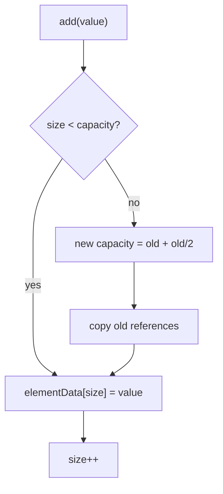
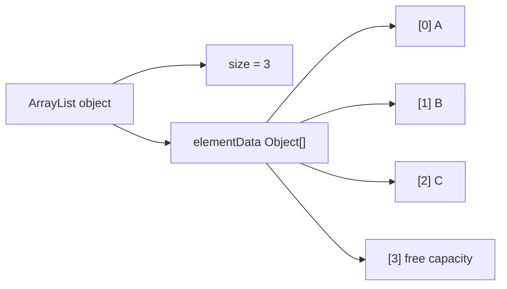

# ArrayList Growth Internals

## Intuition

`ArrayList` is a `List` API wrapped around a plain `Object[]` named `elementData` and an integer `size`. `capacity` is the length of the array; `size` is how many slots are logically part of the list. Think of a post office shelf: it may have 10 cubbies, but only 3 parcels may be present today.

When `add(value)` has free capacity, it writes the value reference into `elementData[size]` and increments `size`. It is like putting the next parcel into the next empty cubby: no one else has to move.

When the backing array is full, `ArrayList` allocates a larger array, copies the existing references, and then writes the new value. In the JDK, the growth is roughly `oldCapacity + oldCapacity / 2`, so about 1.5x. It is like replacing a full sorting shelf with a larger one and moving the address cards across before accepting the next parcel.

The copy moves references, not cloned objects. If the list stores `Order` objects, the new array points to the same `Order` instances. The post office moves labels between shelves; it does not rebuild the parcels.

Modern JDK `new ArrayList<>()` starts with a shared empty array and allocates the default capacity on the first real add. This visual topic starts with capacity 4 only so the grow step is visible quickly. It is like keeping the shelf folded away until the first parcel arrives.

## Why It Is Implemented This Way

Fast indexed access is the main reason. `get(i)` is just an array read, so it is O(1). Numbered shelf cubbies have the same advantage: if the receipt says cubby 7, you walk straight to cubby 7.

Appending is amortized O(1). Most appends are a single write, while an occasional grow copies many elements. Spread over many appends, that resize cost becomes small per operation. This is like a kitchen buying a larger tray only once in a while instead of rearranging the counter for every sandwich.

The 1.5x growth factor is a compromise. Growing too little causes frequent copying; growing too much wastes memory. A traffic analogy: adding one lane at a time causes constant roadwork, while building ten empty lanes wastes space.

Insertion or removal in the middle is still O(n), because elements after the index must shift with `System.arraycopy`. It is like inserting a parcel in the middle of a tight shelf: every parcel to the right must slide one cubby.

Compared with [ArrayList vs LinkedList](topic:arraylist-vs-linkedlist), `ArrayList` is compact and cache-friendly because references sit next to each other in one array. A linked chain stores separate nodes with extra pointers, like parcels scattered across different counters with sticky notes pointing to the next one.

During resize, the new array is another object on the [JVM heap](topic:heap-generations). For a moment, the old and new arrays can both exist until the old one becomes unreachable. It is like having the old shelf and the new shelf in the room while the transfer is happening.

`ArrayList` is not synchronized. If multiple threads mutate it at the same time, use external locking or a suitable collection; see [Concurrent vs Synchronized Collections](topic:concurrent-synchronized-collections). A shared shelf needs a clerk or a queue, otherwise two people may place parcels into the same cubby.

## 60-Second Interview Answer

`ArrayList` keeps elements in an internal `Object[]` and tracks the logical length with `size`. On `add(value)`, if `size < elementData.length`, it stores the reference at `elementData[size]` and increments `size`, which is O(1). If the array is full, it allocates a larger array, usually about 1.5x bigger, copies the old references, then writes the new value. That expensive resize does not happen every time, so appending is amortized O(1). The design exists because arrays give O(1) random access, good locality, and low per-element overhead. The tradeoff is that insertion or removal in the middle shifts elements and costs O(n).

## Production Relevance

If you know the approximate number of elements, pass an initial capacity. It reduces repeated grow-and-copy work. This is like preparing enough post office cubbies before the morning delivery instead of replacing shelves during the rush.

Avoid workloads that repeatedly call `add(0, value)` or remove from the front. Those operations shift almost the whole list each time. It is like pushing every parcel on the shelf one slot to the right for every new arrival at the front.

Large resizes create temporary memory pressure because the old and new arrays overlap briefly. For large batches, choosing capacity up front is a practical performance and memory decision, not just a micro-optimization.

`remove(index)` clears the old tail slot after shifting. This matters because otherwise the array would keep a stale reference and delay garbage collection. It is like removing a parcel label from an empty cubby so nobody thinks the parcel is still there.

## Common Misconceptions

`size` is not `capacity`. `size` is the number of real list elements; `capacity` is reserved space in the backing array. A shelf can have 10 cubbies and only 3 parcels.

Not every `add` copies the whole array. Most appends write one slot. Only the add that finds the array full triggers grow-and-copy.

`ArrayList` stores references, not primitive values directly. `ArrayList<Integer>` stores references to boxed `Integer` objects. The shelf stores address cards that point to parcels, not the parcels embedded inside the shelf.

`LinkedList` is not automatically better for insertion. With the `List` API, finding the middle index is already O(n), and linked nodes have extra memory and cache costs. The everyday version: a chain can relink quickly only after you already found the exact link.

Fail-fast iterators are not thread-safety. `modCount` helps detect some concurrent structural changes, but it is a bug detector, not a lock. A warning bell at the shelf is not the same as a clerk controlling access.
