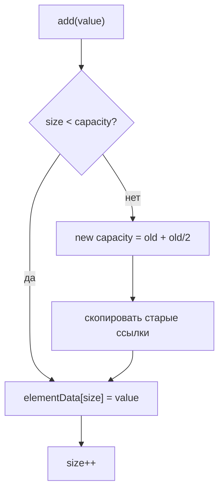
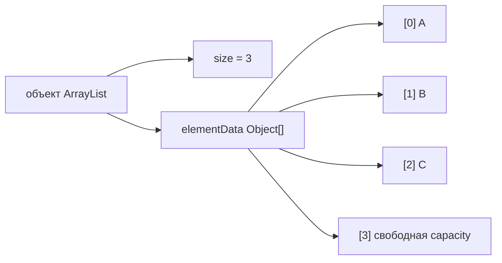

# Как растёт ArrayList

## Интуиция

`ArrayList` - это API `List` поверх обычного `Object[]` с именем `elementData` и целого числа `size`. `capacity` - это длина массива, а `size` - сколько ячеек логически входят в список. Представь полку в почтовом отделении: в ней может быть 10 ячеек, но сегодня занято только 3 посылками.

Когда у `add(value)` есть свободная ёмкость, он записывает ссылку на значение в `elementData[size]` и увеличивает `size`. Это как положить следующую посылку в следующую пустую ячейку: никого другого двигать не нужно.

Когда внутренний массив заполнен, `ArrayList` выделяет массив большего размера, копирует существующие ссылки и только потом записывает новое значение. В JDK рост примерно равен `oldCapacity + oldCapacity / 2`, то есть около 1.5x. Это как заменить заполненную сортировочную полку на большую и перенести адресные карточки перед тем, как принять следующую посылку.

Копирование переносит ссылки, а не клонирует объекты. Если список хранит объекты `Order`, новый массив указывает на те же экземпляры `Order`. Почта переносит ярлыки между полками, а не собирает посылки заново.

Современный JDK `new ArrayList<>()` начинает с общего пустого массива и выделяет дефолтную ёмкость при первом настоящем добавлении. В этой визуальной теме начальная ёмкость равна 4 только для того, чтобы шаг роста был быстро виден. Это как держать полку сложенной до прихода первой посылки.

## Зачем он реализован так

Быстрый доступ по индексу - главная причина. `get(i)` - это чтение из массива, поэтому операция стоит O(1). У пронумерованных почтовых ячеек то же преимущество: если в квитанции указана ячейка 7, ты идёшь сразу к ячейке 7.

Добавление в конец амортизированно O(1). Большинство добавлений - это одна запись, а редкий рост копирует много элементов. Если распределить стоимость resize на много добавлений, средняя цена одной операции остаётся маленькой. Это как кухня покупает поднос большего размера лишь иногда, а не переставляет весь стол для каждого бутерброда.

Коэффициент роста 1.5x - это компромисс. Если расти слишком мало, копирование будет частым; если расти слишком сильно, будет тратиться лишняя память. Аналогия с дорогой: добавлять по одной полосе вызывает постоянный ремонт, а построить десять пустых полос сразу - пустая трата места.

Вставка или удаление в середине всё равно стоят O(n), потому что элементы после индекса нужно сдвинуть через `System.arraycopy`. Это как вставить посылку в середину плотной полки: каждую посылку справа нужно сдвинуть на одну ячейку.

По сравнению с [ArrayList vs LinkedList](topic:arraylist-vs-linkedlist), `ArrayList` компактен и хорошо дружит с cache locality, потому что ссылки лежат рядом в одном массиве. Связанная цепочка хранит отдельные узлы с дополнительными указателями, как посылки на разных стойках со стикерами, которые указывают на следующую.

Во время resize новый массив - это ещё один объект в [JVM heap](topic:heap-generations). Некоторое время старый и новый массивы могут существовать одновременно, пока старый не станет недостижимым. Это как держать в комнате старую и новую полку, пока идёт перенос.

`ArrayList` не синхронизирован. Если несколько потоков одновременно изменяют его, нужен внешний lock или подходящая коллекция; смотри [Concurrent vs Synchronized Collections](topic:concurrent-synchronized-collections). Общей полке нужен сотрудник или очередь, иначе два человека могут положить посылки в одну и ту же ячейку.

## Ответ за 60 секунд

`ArrayList` хранит элементы во внутреннем `Object[]` и отслеживает логическую длину через `size`. При `add(value)`, если `size < elementData.length`, он кладёт ссылку в `elementData[size]` и увеличивает `size`, это O(1). Если массив заполнен, он выделяет массив большего размера, обычно примерно в 1.5 раза больше, копирует старые ссылки и затем записывает новое значение. Дорогой resize происходит не каждый раз, поэтому добавление в конец амортизированно O(1). Такая реализация нужна, потому что массивы дают O(1) произвольный доступ, хорошую locality и небольшой overhead на элемент. Компромисс в том, что вставка или удаление в середине сдвигает элементы и стоит O(n).

## Практическая польза

Если примерное количество элементов известно заранее, передай initial capacity. Это уменьшит количество повторных grow-and-copy. Это как подготовить достаточно почтовых ячеек до утренней доставки, а не менять полки во время rush hour.

Избегай сценариев, где постоянно вызывается `add(0, value)` или удаление из начала. Такие операции почти каждый раз сдвигают весь список. Это как двигать каждую посылку на полке на одну ячейку вправо при каждом новом поступлении в начало.

Крупные resize создают временную нагрузку на память, потому что старый и новый массивы короткое время существуют вместе. Для больших пачек выбор capacity заранее - это практическое решение по производительности и памяти, а не просто микрооптимизация.

`remove(index)` после сдвига очищает старую хвостовую ячейку. Это важно: иначе массив держал бы устаревшую ссылку и задерживал garbage collection. Это как убрать ярлык посылки из пустой ячейки, чтобы никто не думал, что посылка всё ещё там.

## Частые заблуждения

`size` - это не `capacity`. `size` - количество реальных элементов списка, `capacity` - зарезервированное место во внутреннем массиве. У полки может быть 10 ячеек и только 3 посылки.

Не каждый `add` копирует весь массив. Большинство добавлений записывает одну ячейку. Только добавление, которое обнаружило заполненный массив, запускает grow-and-copy.

`ArrayList` хранит ссылки, а не primitive values напрямую. `ArrayList<Integer>` хранит ссылки на boxed объекты `Integer`. Полка хранит адресные карточки, которые указывают на посылки, а не сами посылки внутри полки.

`LinkedList` не становится автоматически лучше для вставки. Через API `List` поиск среднего индекса уже стоит O(n), а связанные узлы имеют дополнительную цену по памяти и cache. В бытовой версии: цепочку можно быстро перекинуть только после того, как ты уже нашёл нужное звено.

Fail-fast итераторы - это не thread-safety. `modCount` помогает обнаружить некоторые конкурентные структурные изменения, но это детектор ошибок, а не lock. Сигнальный звонок у полки - не то же самое, что сотрудник, который управляет доступом.
