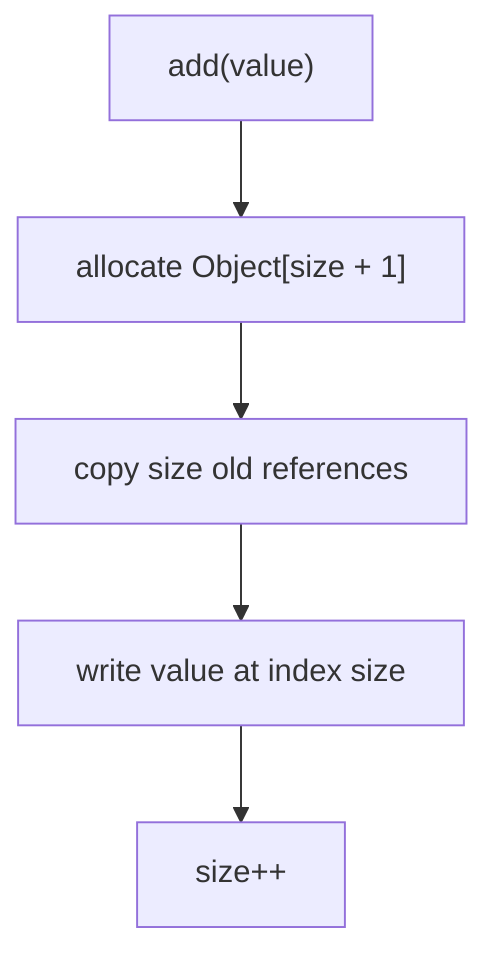
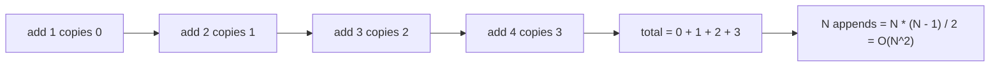

# Naive ArrayList Growth Complexity

## Intuition

The interview question imagines the most primitive resizable array: on every `add(value)`, allocate a new `Object[]` of length `size + 1`, copy all old references, write the new reference, and increment `size`. Think of a kitchen tray that is always exactly full: every new plate forces you to bring a tray with one extra spot and move all existing plates before placing the new one.

For the first append, there are no old elements to copy. For the second append, one old reference is copied. For the third, two are copied. After N appends, the copy work is `0 + 1 + 2 + ... + (N - 1) = N * (N - 1) / 2`, which is O(N^2). It is like a post office adding one mailbox at a time and moving every existing label each morning; the daily moves get longer as the wall grows.

This is not how the real [ArrayList growth internals](topic:arraylist-internals) work. The JDK grows the backing array by a factor, roughly 1.5x, so many later appends fit into spare capacity. A real kitchen buys a noticeably larger tray, not a tray that is only one plate bigger.

The copied things are references, not cloned objects. If the list stores `Order` objects, resize copies the address cards that point to those orders. The parcels stay where they are; only the labels move to a new shelf.

## The Key Complexity Point

One late append can be O(n), because it copies the existing n elements. But the question asks about adding N elements from empty. That is the sum of many growing copy costs, not just the final copy. In kitchen terms: judging only the last tray swap misses all the earlier tray swaps.

The final formula is quadratic because the average copy count is about N / 2 and it happens N times. `N * (N / 2)` is O(N^2). The traffic analogy is one-lane roadwork repeated after every few meters: each small extension forces more cars to be moved out of the way.

After the append finishes, indexed reads can still be O(1), because the data is in an array and index addressing is direct. See [How an ArrayList Index Finds Its Object](topic:arraylist-index-addressing). Numbered mailboxes are still easy to access once the wall is built; the problem is rebuilding the wall too often.

Compared with [ArrayList vs LinkedList](topic:arraylist-vs-linkedlist), this topic is not saying linked lists are always better. It isolates one bad growth policy. A linked chain avoids array copying, but it pays with node overhead and slower indexed access, like a route of scattered counters instead of one numbered shelf.

## 60-Second Interview Answer

If this primitive ArrayList allocated a new array on every append and copied all existing elements, adding N elements would be O(N^2). The first add copies 0 elements, the second copies 1, the third copies 2, and so on until the Nth add copies N - 1. The total is `0 + 1 + ... + (N - 1) = N * (N - 1) / 2`, so the dominant term is N^2. A real ArrayList avoids that by growing by a factor and keeping spare capacity, which makes appending amortized O(1) and N appends O(N).

## Production Relevance

Real `ArrayList` does not grow by one for exactly this reason. It keeps spare capacity after resize, so the next several appends are cheap single writes. A bakery buys a bigger rack with empty slots for the morning batch instead of replacing the rack for every bun.

If you know the expected count, pass an initial capacity: `new ArrayList<>(expectedSize)`. That removes many resize steps and avoids temporary extra arrays. It is like preparing enough post office boxes before the delivery truck arrives.

For large batches, repeated copying also creates temporary memory pressure because the old and new arrays can coexist briefly. On a busy kitchen counter, two trays are present during the transfer, so planning the tray size matters.

This reasoning is useful beyond `ArrayList`: any dynamic buffer, string builder, or custom collection needs a growth policy. Growing by one is simple, but it turns bulk appends into repeated relocation work.

## Common Misconceptions

The answer is not O(N) just because there are N calls to `add`. Each call becomes more expensive as the list grows. Counting only customers in a line misses that the clerk also rearranges a longer shelf each time.

The answer is not O(N log N). There is no halving, sorting tree, or binary split here. The work is a straight arithmetic series.

The final append is O(N), but the whole batch is O(N^2). The last tray swap is not the whole morning; every previous tray swap counts too.

Real `ArrayList` append is amortized O(1), not because resize is cheap, but because resize is rare. The spare tray space spreads the copy cost over many later plates.

Growing copies references, not deep copies of objects. Moving address cards is cheaper than rebuilding parcels, but doing it `0 + 1 + ... + (N - 1)` times is still too much work.
