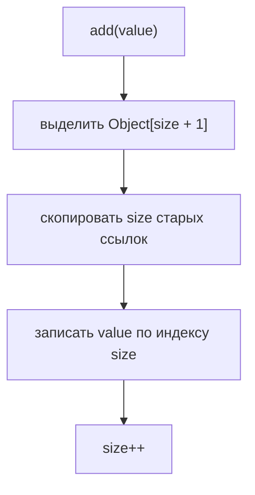
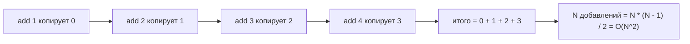

# Сложность наивного роста ArrayList

## Интуиция

Вопрос на собеседовании представляет самый примитивный расширяемый массив: при каждом `add(value)` выделить новый `Object[]` длиной `size + 1`, скопировать все старые ссылки, записать новую ссылку и увеличить `size`. Представь кухонный поднос, который всегда заполнен ровно до края: каждая новая тарелка заставляет принести поднос на одно место больше и переложить все старые тарелки перед тем, как поставить новую.

Для первого добавления старых элементов нет, копировать нечего. Для второго добавления копируется одна старая ссылка. Для третьего - две. После N добавлений работа копирования равна `0 + 1 + 2 + ... + (N - 1) = N * (N - 1) / 2`, то есть O(N^2). Это как почтовое отделение добавляет по одному ящику за раз и каждое утро переносит все существующие ярлыки; чем больше стена, тем длиннее перенос.

Так устроен не реальный [рост ArrayList](topic:arraylist-internals). JDK увеличивает внутренний массив с коэффициентом, примерно в 1.5 раза, поэтому многие следующие добавления помещаются в запасную ёмкость. Реальная кухня покупает заметно больший поднос, а не поднос всего на одну тарелку больше.

Копируются ссылки, а не клонируются объекты. Если список хранит объекты `Order`, resize копирует адресные карточки, которые указывают на эти заказы. Посылки остаются на месте; на новую полку переезжают только ярлыки.

## Ключевая мысль о сложности

Одно позднее добавление может быть O(n), потому что оно копирует уже существующие n элементов. Но вопрос спрашивает про добавление N элементов с пустого списка. Это сумма многих растущих затрат на копирование, а не только последнее копирование. В кухонной версии: если смотреть только на последнюю замену подноса, легко пропустить все предыдущие замены.

Итоговая формула квадратичная, потому что среднее число копирований примерно N / 2, и это происходит N раз. `N * (N / 2)` даёт O(N^2). Аналогия с дорогой: если расширять дорогу по несколько метров и каждый раз двигать всё больше машин, работа растёт слишком быстро.

После завершения добавления чтение по индексу всё ещё может быть O(1), потому что данные лежат в массиве и адресация по индексу прямая. Смотри [Как индекс ArrayList находит объект](topic:arraylist-index-addressing). Пронумерованные почтовые ящики всё ещё легко открыть, когда стена уже построена; проблема в том, что стену слишком часто перестраивают.

По сравнению с [ArrayList vs LinkedList](topic:arraylist-vs-linkedlist), эта тема не говорит, что linked list всегда лучше. Она изолирует одну плохую стратегию роста. Связанная цепочка избегает копирования массива, но платит overhead узлов и медленным доступом по индексу, как маршрут по разным стойкам вместо одной пронумерованной полки.

## Ответ за 60 секунд

Если такой примитивный ArrayList при каждом добавлении выделял бы новый массив и копировал все существующие элементы, добавление N элементов стоило бы O(N^2). Первое add копирует 0 элементов, второе копирует 1, третье копирует 2 и так далее, пока N-е add не копирует N - 1. Сумма равна `0 + 1 + ... + (N - 1) = N * (N - 1) / 2`, поэтому главный член - N^2. Реальный ArrayList избегает этого за счёт роста с коэффициентом и запасной ёмкости: добавление в конец становится амортизированным O(1), а N добавлений - O(N).

## Практическая польза

Реальный `ArrayList` не растёт по одной ячейке именно по этой причине. После resize он оставляет запасную ёмкость, поэтому несколько следующих добавлений являются дешёвыми одиночными записями. Пекарня покупает большую стойку с пустыми местами для утренней партии, а не меняет стойку для каждой булочки.

Если ожидаемое число элементов известно, передай initial capacity: `new ArrayList<>(expectedSize)`. Это убирает многие resize и временные дополнительные массивы. Это как заранее подготовить достаточно почтовых ящиков до приезда машины с посылками.

Для больших пачек повторное копирование также создаёт временную нагрузку на память, потому что старый и новый массивы короткое время могут существовать вместе. На занятой кухонной стойке во время переноса стоят два подноса, поэтому размер подноса лучше планировать.

Это рассуждение полезно не только для `ArrayList`: любому динамическому буферу, string builder или пользовательской коллекции нужна стратегия роста. Расти по одной ячейке просто, но это превращает массовые добавления в постоянное перемещение данных.

## Частые заблуждения

Ответ не O(N) только потому, что вызовов `add` ровно N. Каждый вызов становится дороже по мере роста списка. Если считать только клиентов в очереди, можно не заметить, что сотрудник каждый раз переставляет всё более длинную полку.

Ответ не O(N log N). Здесь нет деления пополам, сортирующего дерева или бинарного разбиения. Работа является обычной арифметической прогрессией.

Последнее добавление стоит O(N), но вся пачка стоит O(N^2). Последняя замена подноса - это не всё утро; все предыдущие замены тоже входят в цену.

Реальное добавление в конец `ArrayList` амортизированно O(1) не потому, что resize дешёвый, а потому что resize редкий. Запасное место на подносе распределяет стоимость копирования на много следующих тарелок.

При росте копируются ссылки, а не глубокие копии объектов. Переносить адресные карточки дешевле, чем пересобирать посылки, но делать это `0 + 1 + ... + (N - 1)` раз всё равно слишком дорого.
