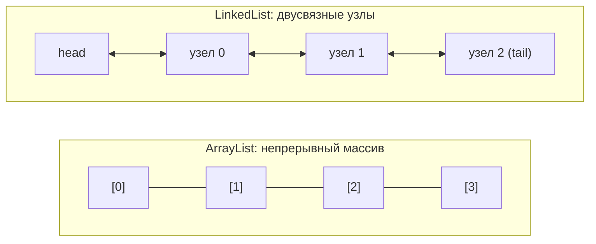
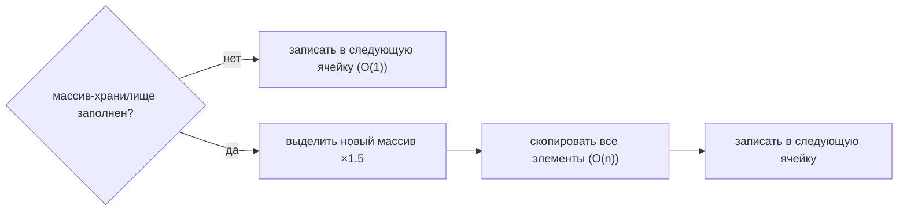

# ArrayList vs LinkedList

> **Учебная модель.** Запускаемый код использует `VisualArrayList` и
> `VisualLinkedList` — учебные модели, которые воспроизводят то, о чём спрашивает
> интервьюер: массив-хранилище, рост с копированием, сдвиги, двусвязную цепочку
> и обход по шагам — и эмитят трейс-события, которые панель справа проигрывает.
> Это **не** классы из JDK (например, массив стартует с ёмкости 4 вместо 10,
> чтобы рост был виден уже после нескольких добавлений). Но *поведение, о котором
> вы рассуждаете*, то же самое.

## Ментальная модель

И `ArrayList`, и `LinkedList` реализуют `List`, поэтому их **API одинаков**. А
вот **устройство противоположно** — в этом весь смысл вопроса на собеседовании.

- **`ArrayList`** — это **динамический массив**. Элементы лежат в подряд идущих
  ячейках `[0], [1], [2]…`. Раз это массив, адрес ячейки `i` — это просто
  `base + i`, поэтому доступ к любому элементу — **O(1)**.
- **`LinkedList`** — это **двусвязная цепочка узлов**. Каждый узел хранит
  значение и указатели `prev` и `next`. Массива для индексации нет, поэтому,
  чтобы добраться до элемента `i`, приходится **идти** по цепочке узел за узлом —
  **O(n)**.

## Цена, операция за операцией

| Операция               | ArrayList                  | LinkedList                  |
| ---------------------- | -------------------------- | --------------------------- |
| `get(i)` / `set(i)`    | **O(1)** (индекс)          | **O(n)** (обход)            |
| `add(e)` (в конец)     | **O(1)** амортизированно   | **O(1)**                    |
| `addFirst` / `addLast` | O(n) в начало, O(1) в конец | **O(1)** оба конца         |
| `add(i, e)` (середина) | O(n) (сдвиг вправо)        | O(n) обход + **O(1)** связь |
| `remove(i)` (середина) | O(n) (сдвиг влево)         | O(n) обход + **O(1)** связь |

Таблицу объясняют несколько фраз:

- **ArrayList сдвигает.** Вставка или удаление где угодно, кроме конца, означает
  перемещение всех последующих элементов на ячейку. Вставка в начало = сдвиг
  всего.
- **ArrayList растёт.** Когда массив-хранилище заполнен, выделяется новый массив
  (×1.5 в JDK) и все элементы копируются в него. Это копирование и есть причина,
  почему добавление в конец — лишь *амортизированный* O(1): большинство
  добавлений O(1), но изредка рост O(n), и в среднем выходит O(1) на добавление.
  Поскольку массив индексируется `int`, в `ArrayList` помещается примерно
  `Integer.MAX_VALUE` (~2.1 млрд) элементов — это его жёсткий предел размера.
- **LinkedList ходит, но не сдвигает.** Вставка в середину меняет лишь два
  указателя — но сперва вы платите O(n), чтобы *найти* узел. `get(i)` идёт от
  **ближнего конца** (head или tail), поэтому `get(size-1)` дёшев, а `get(size/2)`
  — худший случай.

## Так что же выбрать?

На практике **`ArrayList` — выбор по умолчанию и почти всегда правильный.**
Даже для очереди с добавлением/удалением по краям `ArrayDeque` обгоняет
`LinkedList`. `LinkedList` выигрывает лишь когда вы часто вставляете/удаляете **в
позиции, которую уже держите** (например, через `Iterator` / `ListIterator`),
минуя обход. Накладные расходы на объект-узел и плохая локальность кэша обычно
делают его медленнее в реальных бенчмарках даже там, где Big-O сулит ему победу.

## Ответ на собеседовании (60 секунд)

> `ArrayList` основан на динамическом массиве, `LinkedList` — на двусвязном
> списке. Так как `ArrayList` — массив, `get(i)` — это O(1), а добавление в конец
> — амортизированный O(1): при заполнении он копируется в массив в 1.5 раза
> больше. Вставка или удаление в середине — O(n), потому что элементы
> сдвигаются. У `LinkedList` добавление/удаление по краям и у известного узла —
> O(1), но `get(i)` — O(n), потому что идёт обход цепочки. На практике я по
> умолчанию беру `ArrayList`: локальность кэша и отсутствие накладных расходов на
> узлы обычно бьют `LinkedList`, а для дека я возьму `ArrayDeque`.

## Частые заблуждения

- ❌ «LinkedList быстрее для вставок.» — Только если вы уже держите узел. Вставка
  *по индексу* всё равно стоит O(n) на обход до позиции.
- ❌ «ArrayList.add — это O(1).» — Это *амортизированный* O(1); заполненный
  массив вызывает рост с копированием O(n).
- ❌ «LinkedList экономит память.» — Наоборот: каждый элемент несёт лишний
  объект-узел с двумя указателями.
- ❌ «Произвольный доступ к LinkedList — это нормально.» — `get(i)` в цикле
  превращает алгоритм O(n) в O(n²); обходите через итератор.
- ❌ «Для вызывающего кода они ведут себя по-разному.» — Нет; оба реализуют
  `List` с одним API. Различается только производительность.
