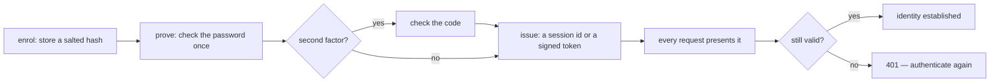
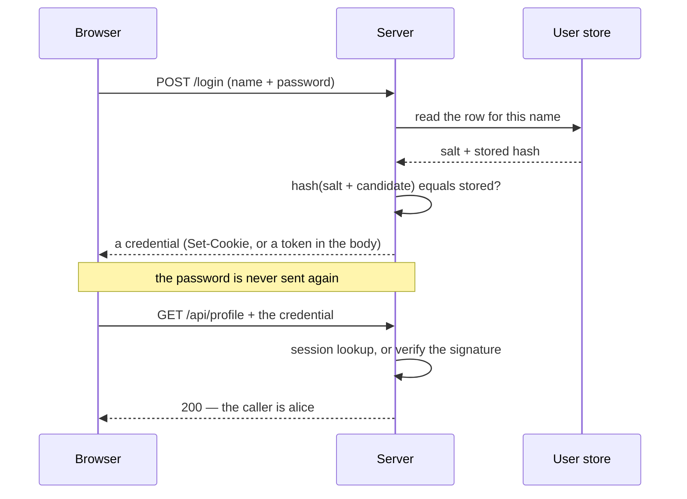
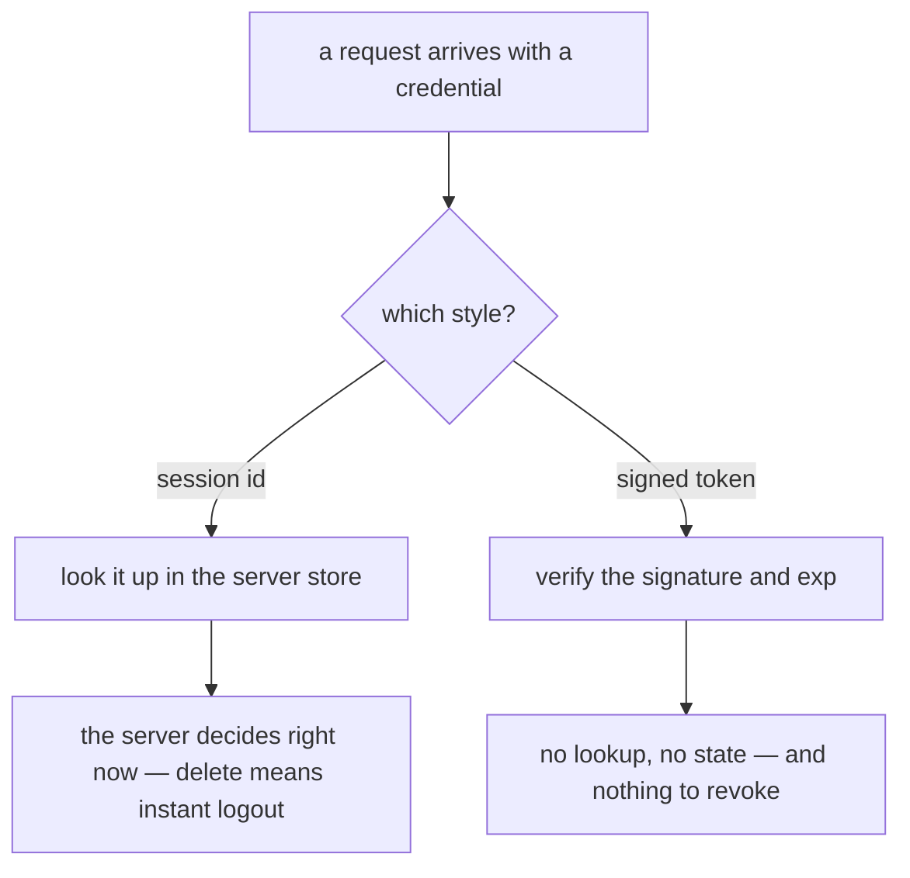

# How authentication works in a system

**Authentication answers exactly one question: *who is calling?*** Not "may they do
this" — that is [authorization](topic:endpoint-security-design), a separate question
asked afterwards, about a caller you have already identified.

The useful way to picture it is not as a login screen but as a **lifecycle**: a
secret is enrolled once, proved once, exchanged for a credential, presented on every
later request, and eventually ended. Almost every real design decision — and every
awkward interview follow-up — lives in one of those five moments.

## 1. Enrolment: what the server keeps

The server never needs the password. It only needs to answer *"could this person
produce it?"* — and a one-way hash answers that without keeping the answer around.

Three properties matter, and each one is a separate interview question:

- **One-way.** You store `hash(salt + password)`. There is no way back to the
  password, so a leaked table is not a list of passwords.
- **Salted, per user.** Two people who choose the same password must get different
  rows. Without a salt, one precomputed table cracks everybody at once, and equal
  rows tell an attacker that two accounts share a password.
- **Deliberately slow.** This is the part people miss. `bcrypt`, `scrypt` and
  `Argon2` exist to be *expensive*: a login costs the server a few hundred
  milliseconds and costs an attacker with the leaked table the same per guess.
  SHA-256 is a fine hash and a terrible password hash, because it is fast.

Everything above is about the bad day — the day somebody else can read the table.
Notice that logging in behaves identically whether you did this right or not, which
is exactly why it survives code review.

## 2. Proof: the one moment the password is used

Two details worth saying out loud:

- **Answer the same thing for "no such user" and "wrong password".** "That account
  does not exist" is a free account-enumeration API.
- **Throttle it.** Password guessing and credential stuffing are attacks no single
  request can reveal: every attempt is a perfectly valid, well-formed login. Only
  the *rate* is the attack. Limit by account *and* by source, make the delay grow,
  and know the trade-off — a hard account lockout also locks out the real owner,
  which is a denial-of-service anyone can trigger with a username.

## 3. Issue: why a credential exists at all

Nobody re-checks a password on every request: it would mean the client storing the
password, and the server paying that deliberately-slow hash on every call. So a
successful login is exchanged for a **credential** — a value the client sends back
each time. This is the design choice that shapes everything else, and there are two
answers.

|  | Server-side session | Stateless signed token (JWT) |
|---|---|---|
| The client holds | a meaningless id | the claims themselves, signed |
| The server holds | a record per session | nothing |
| Every request costs | one lookup | one signature check |
| Logging out | delete the record — immediate | nothing to delete |
| Scaling out | shared session store, or sticky sessions | any instance can verify |
| If claims change (roles, ban) | next request sees it | not until it expires |

Neither is "modern" and neither is "legacy". A session id is opaque, so a client can
neither read nor edit any of it, and the server may change its mind at any moment.
A token is readable by anyone holding it — a JWT is base64, not encryption — and the
signature is the only reason its claims are evidence rather than user input. Verify
the signature, the algorithm, the issuer, the audience and the expiry, or you have
merely decoded a form the client filled in.

The honest way to choose: **start with sessions**; reach for tokens when the
statelessness buys you something concrete — see
[scaling an overloaded server](topic:scaling-an-overloaded-server) — and then answer
the revocation question before you ship.

## 4. Presentation: every request, from scratch

HTTP has no memory, so *every* request re-authenticates itself. This is the part
beginners picture wrongly: there is no "logged-in connection". There is a value the
client attaches to each request, which the server validates each time, and the whole
notion of "being logged in" is that value plus the server's willingness to accept it.

Which means:

- **A credential is a *bearer* credential: whoever holds the value is the user.**
  The server cannot tell a copy from the original. That single fact is why
  credentials travel over [HTTPS](topic:http-vs-https) only, live in `HttpOnly`
  cookies rather than anywhere a script can read them, and expire quickly.
- **Where you put it changes which attack you are exposed to.** A cookie is attached
  by the browser automatically, which is convenient and is precisely what
  [CSRF](topic:csrf) abuses — so a cookie session needs `SameSite` and/or a CSRF
  token. A token your own JavaScript attaches cannot be forged that way, but
  whatever JavaScript can read, an [XSS](topic:xss) can steal. `HttpOnly` cookie +
  CSRF protection is the combination that covers most of both.
- **The identity must come from something the caller cannot forge.** Not an
  `X-User-Id` header the client typed. Behind an [API gateway](topic:api-gateway)
  that pattern is workable only if the gateway *strips* incoming copies of that
  header and nothing else can reach the service.

## 5. Ending it: expiry, refresh, logout

A credential that never ends is a permanent skeleton key, so every one of them
carries a lifetime. Short lifetimes are the main thing limiting the damage of theft:
a stolen credential stops working on its own, without anyone having to notice.

That would mean logging in every fifteen minutes, so real systems split it in two:
a **short-lived access credential** used on every request, and a **long-lived
refresh right** whose only power is to mint a new access credential. The short
lifetime bounds the damage; the long one is the real "keep me signed in" setting.

And then **logout**, which is where the credential-style choice sends the bill:

- **Session:** delete the record. The very next request finds nothing behind the id.
  That lookup you pay for on every request is exactly what you are buying.
- **Stateless token:** there is nothing to delete. The client drops its copy — and
  any copy made elsewhere keeps working until it expires. The workable answers are
  *keep access tokens short and revoke the refresh token*, or *keep a deny-list*,
  which quietly puts the state back.

Same reasoning applies to "ban this user now", "this account was compromised", and
"this user's roles changed a second ago".

## The 60-second interview answer

> Authentication answers "who is calling", and I picture it as a lifecycle rather
> than a screen. First enrolment: the server stores a per-user salted hash from a
> deliberately slow algorithm like bcrypt or Argon2, so it can check a password it
> never keeps. Then one moment of proof at login — the only place the password is
> used — ideally with a second factor of a different kind, and with throttling,
> because guessing is an attack no single request looks like. On success the server
> issues a credential, because re-checking a password on every request is not
> workable. That credential is either a session id, which the server looks up and
> can delete instantly, or a signed stateless token, which needs no lookup and is
> therefore awkward to revoke — I'd default to sessions and switch to tokens when
> statelessness actually buys something. Every subsequent request presents the
> credential and is verified from scratch, because HTTP has no memory; it is a
> bearer credential, so whoever holds it is the user, which is why it is HTTPS-only,
> `HttpOnly`, and short-lived, with a refresh token to keep the user signed in. And
> it has to end: expiry, refresh and logout — where a session is a delete and a JWT
> needs short lifetimes plus a deny-list. Everything after that is authorization,
> which is a different question.

## Why it matters in production

- **Do not implement it yourself.** Use the framework's authentication (Spring
  Security, for instance) and a maintained password hasher. Custom crypto and
  hand-rolled token verification are where the bugs live.
- **Regenerate the session id right after a successful login.** Otherwise an
  attacker who could set the id beforehand — session fixation — is now inside the
  authenticated session.
- **Password reset is an authentication path.** A reset link *is* a credential:
  single-use, short-lived, and it must invalidate existing sessions.
- **Log the decisions, never the secrets.** Log ins, log outs, failures with a
  reason code, from where. Never the password, the token, or the session id.
- **Test it.** An automated test that an endpoint refuses an anonymous, an expired
  and a logged-out credential is the cheapest regression insurance you will buy.
- **Be clear who does what.** The split between browser and server is worth stating
  explicitly — see [frontend and backend interaction](topic:frontend-backend-interaction).
  The client stores and attaches; the server decides. Nothing the client says about
  identity is input to that decision.

## Common misconceptions

- **"Authentication and authorization are the same thing."** One establishes who,
  the other what they may do. 401 means "I do not know who you are"; 403 means "I
  know exactly, and no". See [designing a security scheme for your endpoints](topic:endpoint-security-design).
- **"We hash passwords, so we are fine."** With a fast hash and no salt, the leaked
  table is cracked in an afternoon. The algorithm and the salt are the point.
- **"A JWT is encrypted."** It is base64-encoded and *signed*. Anyone holding it can
  read every claim; the signature only stops them changing one.
- **"Decoding the token identifies the caller."** Decoding is free for everybody.
  Only verification — signature, algorithm, issuer, audience, expiry — makes a claim
  evidence.
- **"Stateless tokens are strictly better."** They trade instant revocation for no
  lookup. That is a trade, not an upgrade, and the day you need to cut off an
  account immediately you pay it.
- **"Logging out invalidates the token."** Only if something on the server acts on
  it. Otherwise "log out" is a button that clears local storage.
- **"HTTPS means the credential is safe."** It protects the value *in transit*. It
  does nothing about a script reading it, a proxy logging it, or a copy taken from a
  shared machine.
- **"MFA means asking for the password twice."** Two factors must be different
  *kinds* of proof — something you know plus something you have — or the second one
  adds nothing an attacker with the first does not already have.
- **"The user is logged in, so the connection is authenticated."** There is no such
  connection. Every request carries its own proof, and a request that arrives without
  one is anonymous no matter what happened a second earlier.
