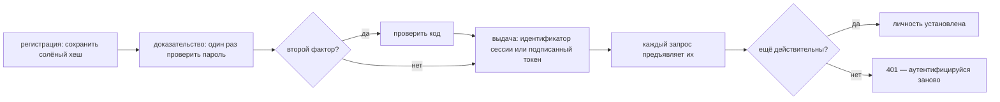
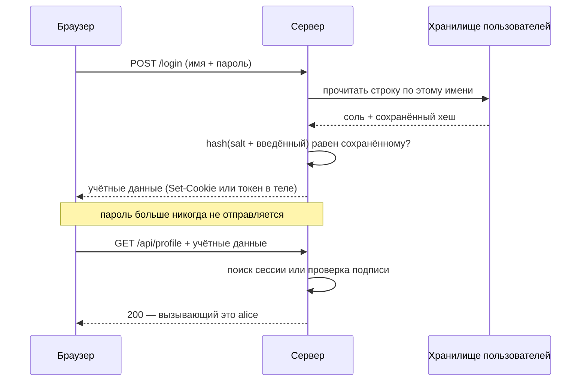
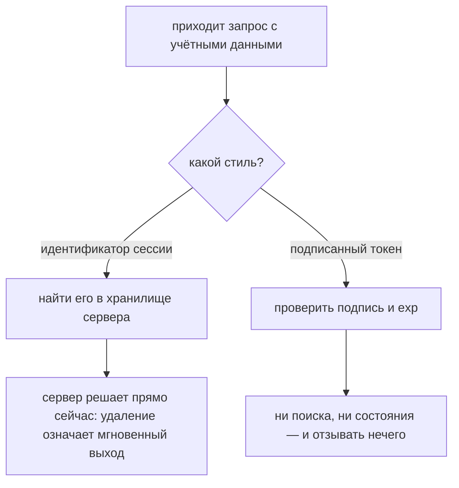

# Как работает аутентификация в системе

**Аутентификация отвечает ровно на один вопрос: *кто вызывает?*** Не «можно ли ему
это» — это [авторизация](topic:endpoint-security-design), отдельный вопрос, который
задают потом и уже про установленного вызывающего.

Полезнее представлять её не как экран входа, а как **жизненный цикл**: секрет один
раз заводят, один раз доказывают, обменивают на учётные данные, предъявляют на
каждом следующем запросе — и в конце концов прекращают. Практически все реальные
проектные решения и все неудобные уточняющие вопросы на собеседовании живут в одном
из этих пяти моментов.

## 1. Регистрация: что хранит сервер

Пароль серверу не нужен. Ему нужно лишь отвечать на вопрос *«мог ли этот человек его
назвать?»* — а односторонний хеш отвечает на него, не сохраняя ответа.

Важны три свойства, и каждое из них — отдельный вопрос на собеседовании:

- **Односторонность.** Хранится `hash(salt + password)`. Обратно к паролю пути нет,
  поэтому утёкшая таблица — не список паролей.
- **Соль, у каждого своя.** Двое, выбравшие одинаковый пароль, должны получить
  разные строки. Без соли одна заранее посчитанная таблица вскрывает всех сразу, а
  одинаковые строки сообщают злоумышленнику, что у двух аккаунтов общий пароль.
- **Намеренная медленность.** Именно это чаще всего упускают. `bcrypt`, `scrypt` и
  `Argon2` существуют, чтобы быть *дорогими*: вход стоит серверу несколько сотен
  миллисекунд, и ровно столько же стоит злоумышленнику с утёкшей таблицей каждая
  попытка подбора. SHA-256 — хороший хеш и никуда не годный хеш для паролей, потому
  что он быстрый.

Всё сказанное — про плохой день, когда таблицу сможет прочитать кто-то ещё.
Обратите внимание: вход работает одинаково независимо от того, сделали вы это
правильно или нет, — поэтому такое и проходит ревью.

## 2. Доказательство: единственный момент, где используется пароль

Две детали, которые стоит проговорить вслух:

- **Отвечайте одинаково на «такого пользователя нет» и «неверный пароль».** «Такого
  аккаунта не существует» — это бесплатный API для перебора аккаунтов.
- **Ограничивайте частоту.** Подбор паролей и credential stuffing — атаки, которых не
  видно ни в одном отдельном запросе: каждая попытка представляет собой совершенно
  корректный, правильно оформленный вход. Атака — это *частота*. Ограничивайте и по
  аккаунту, *и* по источнику, увеличивайте задержку — и помните о компромиссе:
  жёсткая блокировка аккаунта блокирует и настоящего владельца, то есть даёт отказ в
  обслуживании, который может устроить любой, зная имя пользователя.

## 3. Выдача: зачем вообще нужны учётные данные

Пароль не проверяют заново на каждом запросе: это означало бы, что клиент хранит
пароль, а сервер платит тем самым намеренно медленным хешем при каждом вызове.
Поэтому успешный вход обменивают на **учётные данные** — значение, которое клиент
присылает каждый раз. Это и есть решение, определяющее всё остальное, и ответов на
него два.

|  | Серверная сессия | Токен без состояния (JWT) |
|---|---|---|
| Клиент держит | ничего не значащий идентификатор | сами поля, подписанные |
| Сервер держит | запись на каждую сессию | ничего |
| Каждый запрос стоит | одного обращения к хранилищу | одной проверки подписи |
| Выход из системы | удалить запись — мгновенно | удалять нечего |
| Горизонтальное масштабирование | общее хранилище сессий или sticky sessions | проверить может любой инстанс |
| Если поля изменились (роли, бан) | видно на следующем запросе | не раньше истечения срока |

Ни один из вариантов не «современный» и ни один не «устаревший». Идентификатор
сессии непрозрачен: клиент не может ни прочитать его содержимое, ни изменить, а
сервер вправе передумать в любой момент. Токен читается любым, кто его держит — JWT
это base64, а не шифрование, — и подпись остаётся единственной причиной, по которой
его поля являются доказательством, а не пользовательским вводом. Проверяйте подпись,
алгоритм, издателя, аудиторию и срок действия — иначе вы всего лишь декодировали
анкету, которую заполнил клиент.

Честный способ выбрать: **начинайте с сессий**; берите токены, когда отсутствие
состояния даёт что-то конкретное — см.
[перегруженный сервер и масштабирование](topic:scaling-an-overloaded-server), — и
ответьте на вопрос про отзыв до того, как выкатите это в прод.

## 4. Предъявление: каждый запрос — с нуля

У HTTP нет памяти, поэтому *каждый* запрос аутентифицируется заново. Именно это
новички представляют себе неверно: «залогиненного соединения» не существует. Есть
значение, которое клиент прикладывает к каждому запросу, и сервер проверяет его
каждый раз, а всё понятие «пользователь в системе» — это данное значение плюс
готовность сервера его принимать.

Отсюда следует:

- **Учётные данные предъявительские: кто держит значение, тот и есть пользователь.**
  Отличить копию от оригинала сервер не может. Один этот факт объясняет, почему они
  ходят только по [HTTPS](topic:http-vs-https), лежат в `HttpOnly`-куках, а не там,
  где их прочитает скрипт, и быстро протухают.
- **Место хранения определяет, какой атаке вы подставлены.** Куку браузер
  прикладывает автоматически — это удобно, и именно этим злоупотребляет
  [CSRF](topic:csrf), поэтому сессии на куках нужны `SameSite` и/или CSRF-токен.
  Токен, который прикладывает ваш собственный JavaScript, так подделать нельзя, но
  всё, что может прочитать JavaScript, может украсть [XSS](topic:xss).
  `HttpOnly`-кука вместе с защитой от CSRF — комбинация, закрывающая большую часть
  и того, и другого.
- **Личность должна браться из того, что вызывающий не может подделать.** Не из
  заголовка `X-User-Id`, который вписал клиент. За [API-шлюзом](topic:api-gateway)
  такой приём работает, только если шлюз *вырезает* входящие копии этого заголовка и
  до сервиса больше никто не дотягивается.

## 5. Завершение: срок действия, обновление, выход

Учётные данные, которые никогда не заканчиваются, — это вечный универсальный ключ,
поэтому у каждых есть срок жизни. Короткий срок — главное, что ограничивает ущерб от
кражи: украденное перестаёт работать само, и никому не нужно замечать кражу.

Иначе пришлось бы входить каждые пятнадцать минут, поэтому реальные системы делят
это надвое: **короткоживущие учётные данные доступа**, которые используются на
каждом запросе, и **долгоживущее право на обновление**, единственная способность
которого — выпустить новые учётные данные доступа. Короткий срок ограничивает ущерб;
длинный и есть настоящая настройка «оставаться в системе».

А дальше — **выход**, и вот здесь выбор стиля учётных данных выставляет счёт:

- **Сессия:** удалить запись. Следующий же запрос не найдёт за идентификатором
  ничего. Именно за это вы и платите обращением к хранилищу на каждом запросе.
- **Токен без состояния:** удалять нечего. Клиент выбрасывает свою копию, а любая
  копия, сделанная где-то ещё, работает до истечения срока. Рабочие ответы — *делать
  access-токены короткими и отзывать refresh-токен* или *вести список отозванных*,
  что тихо возвращает состояние обратно.

Те же рассуждения применимы к «забанить пользователя прямо сейчас», «этот аккаунт
скомпрометирован» и «роли пользователя изменились секунду назад».

## Ответ на собеседовании за 60 секунд

> Аутентификация отвечает на вопрос «кто вызывает», и я представляю её как
> жизненный цикл, а не как экран. Сначала регистрация: сервер хранит персональный
> солёный хеш, посчитанный намеренно медленным алгоритмом вроде bcrypt или Argon2,
> чтобы проверять пароль, которого он никогда не хранит. Затем один момент
> доказательства при входе — единственное место, где пароль используется, — по
> возможности со вторым фактором другого типа и с ограничением частоты, потому что
> подбор это атака, которая не выглядит атакой ни в одном отдельном запросе. При
> успехе сервер выдаёт учётные данные, потому что проверять пароль на каждом запросе
> нереально. Эти учётные данные — либо идентификатор сессии, который сервер ищет у
> себя и может мгновенно удалить, либо подписанный токен без состояния, которому
> поиск не нужен и который поэтому неудобно отзывать; по умолчанию я взял бы сессии
> и перешёл на токены, когда отсутствие состояния действительно что-то даёт. Каждый
> следующий запрос предъявляет учётные данные и проверяется заново, потому что у
> HTTP нет памяти; учётные данные предъявительские, то есть кто их держит — тот и
> есть пользователь, поэтому только HTTPS, `HttpOnly` и короткий срок жизни, а
> refresh-токен позволяет пользователю оставаться в системе. И всё это должно уметь
> заканчиваться: срок действия, обновление и выход — где сессия это удаление, а JWT
> требует коротких сроков плюс списка отозванных. Всё, что дальше, — уже
> авторизация, а это другой вопрос.

## Почему это важно в продакшене

- **Не пишите это сами.** Берите аутентификацию фреймворка (например, Spring
  Security) и поддерживаемую библиотеку хеширования паролей. Собственная
  криптография и самописная проверка токенов — там и живут ошибки.
- **Перевыпускайте идентификатор сессии сразу после успешного входа.** Иначе
  злоумышленник, сумевший задать идентификатор заранее — session fixation, — окажется
  внутри аутентифицированной сессии.
- **Восстановление пароля — это тоже путь аутентификации.** Ссылка для сброса *и есть*
  учётные данные: одноразовая, короткоживущая, и она обязана завершать существующие
  сессии.
- **Логируйте решения, но не секреты.** Входы, выходы, отказы с кодом причины,
  откуда. Никогда — пароль, токен или идентификатор сессии.
- **Тестируйте это.** Автотест на то, что эндпоинт отклоняет анонимные, просроченные
  и завершённые выходом учётные данные, — самая дешёвая страховка от регрессии.
- **Чётко разделяйте роли.** Разделение между браузером и сервером стоит
  проговаривать явно — см.
  [взаимодействие фронтенда и бэкенда](topic:frontend-backend-interaction). Клиент
  хранит и прикладывает; решает сервер. Ничто из того, что клиент говорит о личности,
  не является входными данными для этого решения.

## Частые заблуждения

- **«Аутентификация и авторизация — одно и то же».** Одна устанавливает, кто, вторая
  — что ему можно. 401 значит «я не знаю, кто ты»; 403 — «я прекрасно знаю, и нет».
  См. [проектирование схемы безопасности эндпоинтов](topic:endpoint-security-design).
- **«Мы хешируем пароли, значит всё в порядке».** С быстрым хешем и без соли утёкшая
  таблица вскрывается за вечер. Дело как раз в алгоритме и в соли.
- **«JWT зашифрован».** Он закодирован в base64 и *подписан*. Любой, у кого он есть,
  прочитает все поля; подпись лишь мешает их изменить.
- **«Декодировал токен — значит установил вызывающего».** Декодировать может кто
  угодно бесплатно. Доказательством поле делает только проверка — подпись, алгоритм,
  издатель, аудитория, срок действия.
- **«Токены без состояния однозначно лучше».** Они меняют мгновенный отзыв на
  отсутствие обращений к хранилищу. Это обмен, а не улучшение, и в тот день, когда
  аккаунт нужно отрезать немедленно, вы за него платите.
- **«Выход из системы делает токен недействительным».** Только если на сервере что-то
  на это реагирует. Иначе «выйти» — это кнопка, очищающая локальное хранилище.
- **«HTTPS значит, что учётные данные в безопасности».** Он защищает значение *при
  передаче*. Он ничего не делает со скриптом, который его прочитает, прокси, который
  его залогирует, или копией, снятой с общего компьютера.
- **«MFA — это когда пароль спрашивают дважды».** Два фактора обязаны быть разными
  *типами* доказательства — то, что ты знаешь, плюс то, чем ты владеешь, — иначе
  второй не добавляет ничего, чего у злоумышленника с первым уже нет.
- **«Пользователь вошёл, значит соединение аутентифицировано».** Такого соединения
  не существует. Каждый запрос несёт своё доказательство, и запрос, пришедший без
  него, анонимен независимо от того, что было секунду назад.
