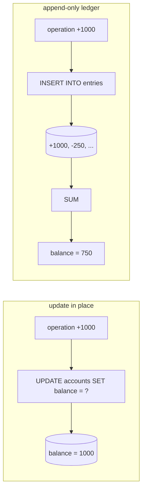
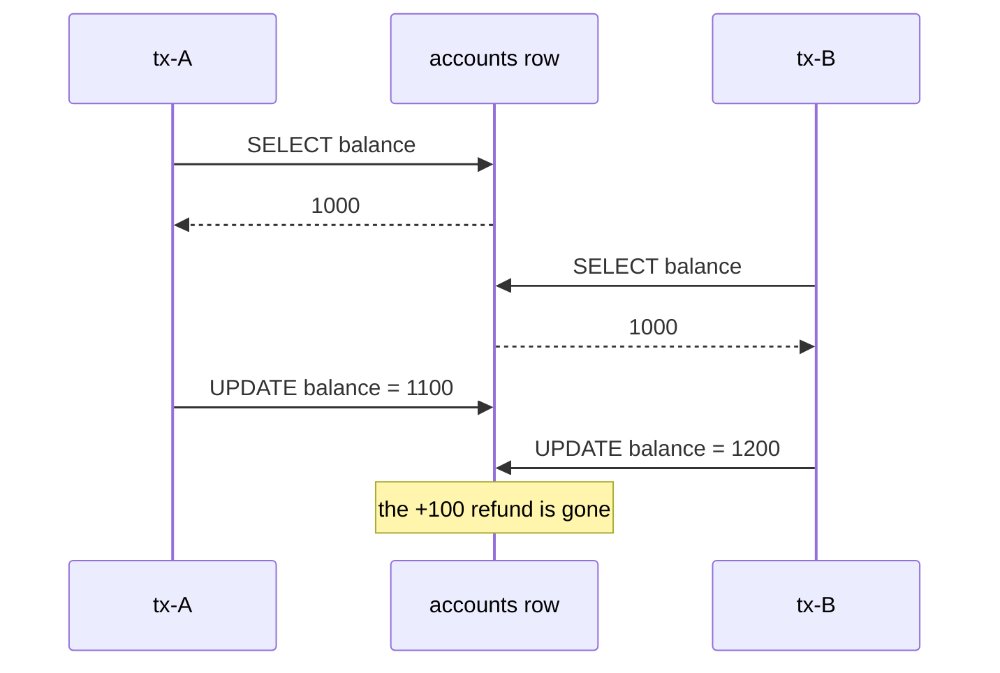
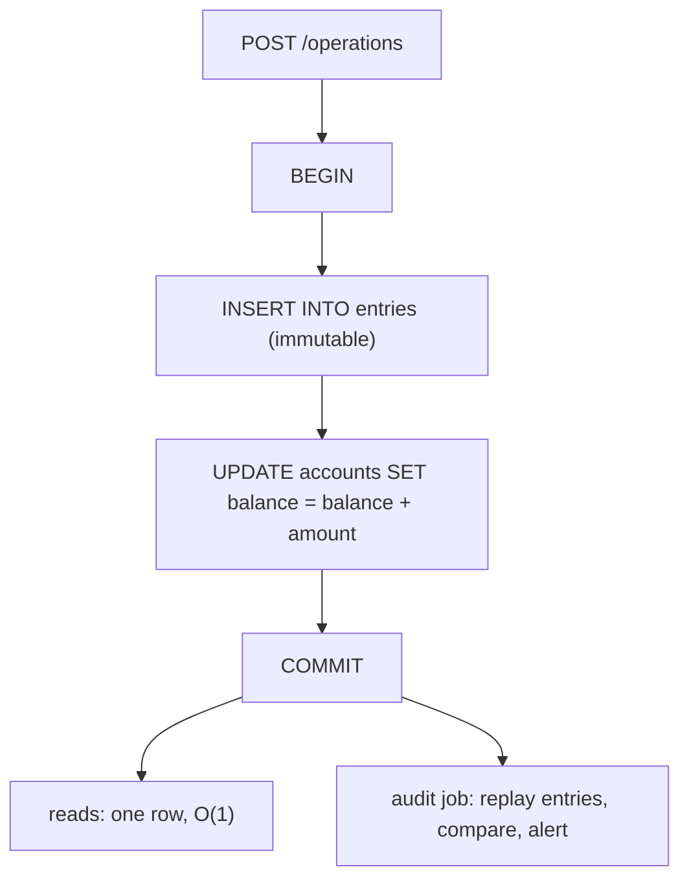

# Mutable Balance vs Append-Only Ledger

A balance is not a fact. It is a **conclusion** — the sum of every operation that
ever touched the account. So the design question is not "how do I store a
number", it is: *do I store the conclusion, or the operations I drew it from?*

Store only the conclusion and every write throws away the evidence for it. Store
the operations and the conclusion becomes something you can always recompute —
and something you now have to pay to read.



## What an in-place UPDATE actually destroys

`UPDATE accounts SET balance = balance - 250 WHERE id = 7` is one row, one
statement, O(1) to read afterwards, and it is genuinely the right answer for
plenty of counters. What it costs is easy to underestimate, because the loss is
invisible at the moment it happens:

- **The "why" is gone.** The column says 750. It cannot tell you whether that is
  1000 − 250 or 2000 − 1250, and nobody can reconstruct it from the database.
- **Repairs are indistinguishable from the truth.** When an operator fixes a
  wrong posting by retyping the total, the account ends up correct and there is
  no record that it was ever wrong — no old value, no correction, no who, no
  when. Run the **Fixing a wrong posting** example: the in-place account and the
  ledger both end at 750, and only one of them can be audited.
- **Every write is a read-modify-write.** Even `balance = balance + ?`, which is
  atomic in SQL, becomes a race the moment the *decision* (may this withdrawal
  proceed?) is made from a value read earlier.
- **Debugging has no input.** "Some customers' balances were wrong last Tuesday"
  is unanswerable. You can see the current state and you cannot see what produced
  it, so you cannot tell a data bug from a code bug from a duplicated request.

The last point is why this question comes up in interviews for money systems and
almost nowhere else: for a balance, *the history is part of the product*.
Regulators, disputes, chargebacks and reconciliation all ask "why", not "what".

## What the ledger gives you

The append-only version stores the operations and derives the balance:

```sql
CREATE TABLE entries (
  id          bigserial PRIMARY KEY,
  account_id  bigint    NOT NULL,
  amount      bigint    NOT NULL,      -- signed, in minor units; never a float
  reason      text      NOT NULL,
  operation_id uuid     NOT NULL,      -- the idempotency key of the business action
  created_at  timestamptz NOT NULL DEFAULT now()
);

SELECT COALESCE(SUM(amount), 0) FROM entries WHERE account_id = 7;
```

Four properties follow directly from "nothing is ever overwritten":

1. **The balance is provable.** Any number the service reports can be itemized
   down to the operation that caused it.
2. **Corrections are appends.** A wrong posting is repaired with a **reversing
   entry** plus the right one — the accountant's move, and now yours. The mistake
   stays in the book. That is a feature: an audit trail with the embarrassing
   parts edited out is not an audit trail.
3. **Concurrent writes stop conflicting.** Two operations become two `INSERT`s
   into two rows. There is no shared cell for them to overwrite, so the
   [lost update](topic:transaction-read-anomalies) simply cannot occur. Run **Two
   operations at once**: 1200 in place, 1300 in the ledger, same database, same
   isolation level.
4. **State is rebuildable.** Corrupted the balance? Replay. Added a new
   report that needs "spend per category per month"? It is a different fold over
   data you already have, not a migration you can only apply going forward.

Real accounting goes one step further: **double entry**. Every movement writes
two rows — a debit on one account and a credit on another — so the sum of every
entry in the whole book is always zero. It costs one extra row and buys you an
invariant that catches an entire class of bugs with a single query.

## The race append-only removes, and the one it doesn't

This distinction separates a confident answer from a hand-wave.

**Removed: the lost update.** Read-modify-write on one row loses whichever
transaction committed first.



Appending has no such step. (In place, the fix is a single atomic statement, or
[optimistic/pessimistic locking](topic:optimistic-vs-pessimistic-locking) — see
also [avoiding race conditions](topic:race-condition-avoidance).)

**Not removed: check-then-act on the balance.** "Never below zero" is a rule
about the *fold*, and an `INSERT` knows nothing about the fold. Two concurrent
withdrawals both read 200, both pass `200 - 200 >= 0`, both append, and the
account is at −200 with no conflict anywhere. Run **Overdrawing an append-only
account**. Under [MVCC](topic:mvcc) each transaction reads its own snapshot, so a
higher [isolation level](topic:postgresql-isolation-levels) does not save you
either — it converts the problem into a serialization failure you must catch.

To enforce an invariant you have to reintroduce a serialization point on the
account:

- lock the account row (`SELECT ... FOR UPDATE`) for the duration of the write;
- or keep a version/balance column and update it conditionally — the database
  version of [compare-and-set](topic:compare-and-set);
- or make one writer per account (a partitioned queue, one consumer per account
  key), which is how high-throughput ledgers usually do it.

**Appending removes conflicts between writes. It does not remove the need to
serialize decisions.**

## The read cost, and snapshots

`SUM(amount)` over an account's whole history is fine at 50 entries and a
problem at 5 million. The standard answers, in the order you should reach for
them:

1. **Index it.** A composite [index](topic:database-indexes) on
   `(account_id, id)` turns the fold into a range scan of one account's rows.
2. **Snapshot.** Store the balance as of entry N and fold only what came after.
   A snapshot is a *cache of the fold*, never a replacement for the history —
   the entries stay. Run **When the fold gets slow**: nine entries, and the read
   drops from eight rows to one, with nothing deleted.
3. **Close the period.** The accounting version of a snapshot: an opening balance
   per account per month, after which old entries can be archived or partitioned
   away without losing the ability to state the balance.
4. **Keep a running balance on the entry itself.** Each row stores the balance
   after it, so the current balance is `ORDER BY id DESC LIMIT 1`. This only
   works if entries for one account are serialized — which, as above, you may
   need anyway.

## The hybrid: what production actually looks like

Nearly every real balance service ends up with both — entries as the source of
truth and a denormalized balance column serving the reads:



There is exactly one rule, and the whole design rests on it:

> The entry and the balance update are **one transaction**. Always.

Split them and the cached number quietly stops being true — the entry commits,
the second transaction never runs, and reads keep answering the stale value with
total confidence. Run **Entries plus a cached balance** to watch it happen and
then be caught. Within one database this costs nothing: it is the atomicity you
already have from [ACID](topic:acid-principles), and in Spring it is a single
[`@Transactional`](topic:spring-transactional-proxy) boundary. This is
[denormalization](topic:database-normalization) with a safety net — and the
safety net is the second thing the entries buy you, because a reconciliation job
comparing `accounts.balance` to `SUM(entries.amount)` can *detect* the drift. An
in-place-only design has no such job; there is nothing to compare against.

If the balance must be updated asynchronously (a separate read model, a
different service), you have chosen eventual consistency and must handle a stale
read at a decision point — see [async data at a synchronous decision
point](topic:event-carried-state-transfer).

## Immutability is a policy, not a database feature

Nothing in PostgreSQL stops `DELETE FROM entries WHERE id = 42`. The **Fixing a
wrong posting** example ends with exactly that: one statement, and the book
rebuilds to a different number while looking perfectly consistent. What actually
makes entries immutable:

- **Permissions.** The application role gets `INSERT` and `SELECT` on `entries`,
  never `UPDATE` or `DELETE`. Revoking is the enforcement.
- **A hash chain or signature.** Each row stores a hash of its content plus the
  previous row's hash, so a deletion or edit breaks the chain and a verification
  job finds it.
- **Reconciliation.** Compare the fold against snapshots, against the balance
  column, and against external statements (the bank, the acquirer). Tampering
  that survives all three is not a schema problem.

## Is this event sourcing?

Related, not identical, and the difference is worth stating:

| | Accounting ledger | Event sourcing |
| --- | --- | --- |
| Scope | one aggregate: money movements | the whole system's state |
| Vocabulary | debit, credit, reversal, posting date | events, aggregates, projections, replay |
| Read model | usually a balance column in the same DB | projections, often CQRS and a separate store |
| Schema change | the entry shape is a domain fact and barely moves | every old event version must stay replayable forever |
| Team cost | low — it is a table with a `SUM` | high — new failure modes, tooling, mental model |

A ledger is the narrow, boring, well-understood version of the same idea, and it
is what "should I event-source my balance service?" almost always wants. Event
sourcing the *whole* service is a much larger commitment (see [microservice
patterns](topic:microservice-patterns)) and its biggest hidden cost is schema
evolution: if you replay history to rebuild state, you can never delete an old
event version, and a change in what an event *means* is a data migration over
years of records. A ledger dodges most of this because "money moved by X for
reason Y" doesn't change meaning.

## Practical details that get skipped

- **Money is integers**, in minor units (cents), or `NUMERIC`. Never a float, and
  in a ledger this matters twice, because rounding errors accumulate over the
  fold. See [very large numbers in databases](topic:large-numbers-database-storage).
- **Entries need idempotency.** A retried request must not append a second entry
  — the unique key is the business operation's id, enforced by the database, not
  by an application check. That is the whole of [avoiding duplicate
  sales](topic:duplicate-sale-prevention); the append-only shape makes it *more*
  important, since a duplicate here is silently permanent.
- **Sequencing versus timestamps.** Use a per-account sequence for ordering, and
  keep the business date separate from the recording date; an operation is often
  recorded after the day it belongs to.
- **Publishing.** If registering an operation must also emit an event, write it
  with the entry via the [Outbox pattern](topic:outbox-pattern) and deduplicate
  on the consumer with the [Inbox pattern](topic:inbox-pattern).

## When updating in place is the right answer

Not everything is money. In place is correct when the number is **not a claim
about the past**: a cached counter you can recompute from somewhere else, a
gauge (CPU, queue depth, last-seen timestamp), a like count, a stock level whose
authority is a physical warehouse. The test is a single question: *if this number
is wrong tomorrow, will anyone need to know how it got that way?* If nobody will,
storing the conclusion is not a shortcut — it is the right model.

## The 60-second interview answer

> For a balance service I append immutable entries and derive the balance,
> because a balance is a conclusion and the operations are the facts. In place, a
> single `UPDATE` destroys the only evidence of how the number was reached — you
> cannot explain a balance to an auditor, a correction is indistinguishable from
> the truth, and concurrent read-modify-write silently loses operations. With
> entries, corrections become reversing entries, concurrent writes are separate
> rows and cannot lose each other, and any past state is recomputable. The cost
> is the read: `SUM` over the history grows forever, so in practice I run the
> hybrid — entries as the source of truth plus a denormalized balance column,
> written in the *same transaction*, with snapshots or period closing to bound
> the fold and a reconciliation job comparing the two. One thing append-only does
> not give me is invariants: "never below zero" is a rule about the fold, so two
> concurrent withdrawals can both pass the check and both append. That still
> needs a lock on the account, a conditional update, or one writer per account.
> And immutability is a policy — it holds because the app role has no `DELETE`,
> not because the table is special. If I did not need to answer "why", I would
> update in place and stop there.

## Common misconceptions

- **"Append-only means no concurrency problems."** It removes the lost update,
  not check-then-act. Any rule that depends on the balance still needs
  serialization.
- **"The ledger is slow, so we can't use it."** The fold is the only slow part,
  and snapshots, period closing or a cached balance column fix it while keeping
  the history.
- **"A snapshot lets us delete old entries."** A snapshot caches the fold. Delete
  the entries behind it and you are back to an in-place balance with extra steps.
- **"The entries table is immutable."** It is a table. It is immutable exactly as
  far as your permissions, hash chain and reconciliation make it.
- **"Event sourcing and a ledger are the same thing."** A ledger is one
  aggregate's financial history. Event sourcing is an architecture for the whole
  system, and pays a much larger schema-evolution tax.
- **"Keep both entries and a balance column — it's just a cache."** Only inside
  one transaction. Two transactions means two truths, and the stale one is the
  one your reads use.
- **"We have audit logging, so we don't need a ledger."** An audit log is written
  beside the state and can disagree with it. A ledger *is* the state; the balance
  is derived from it, so they cannot disagree by construction.
- **"We can always add the history later."** You can start recording tomorrow.
  You cannot recover what today's `UPDATE` overwrote.
