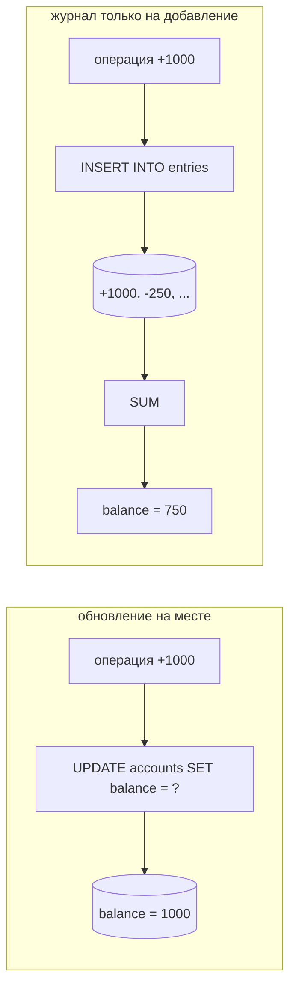
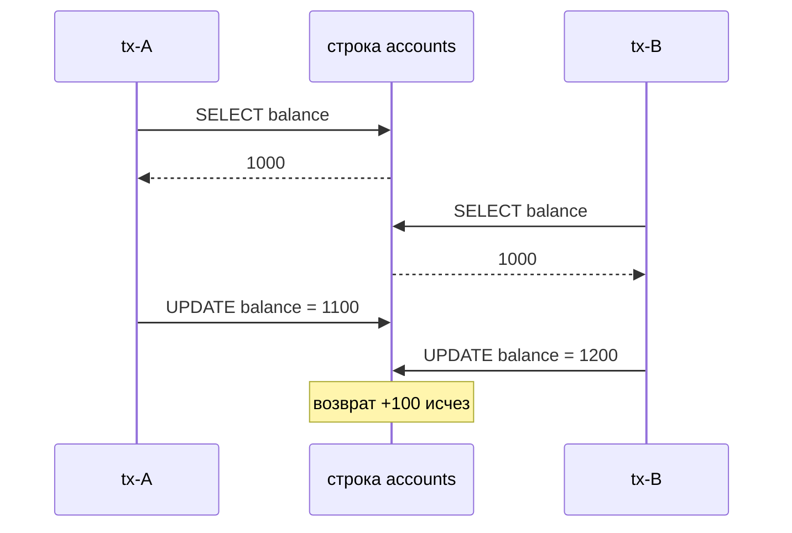
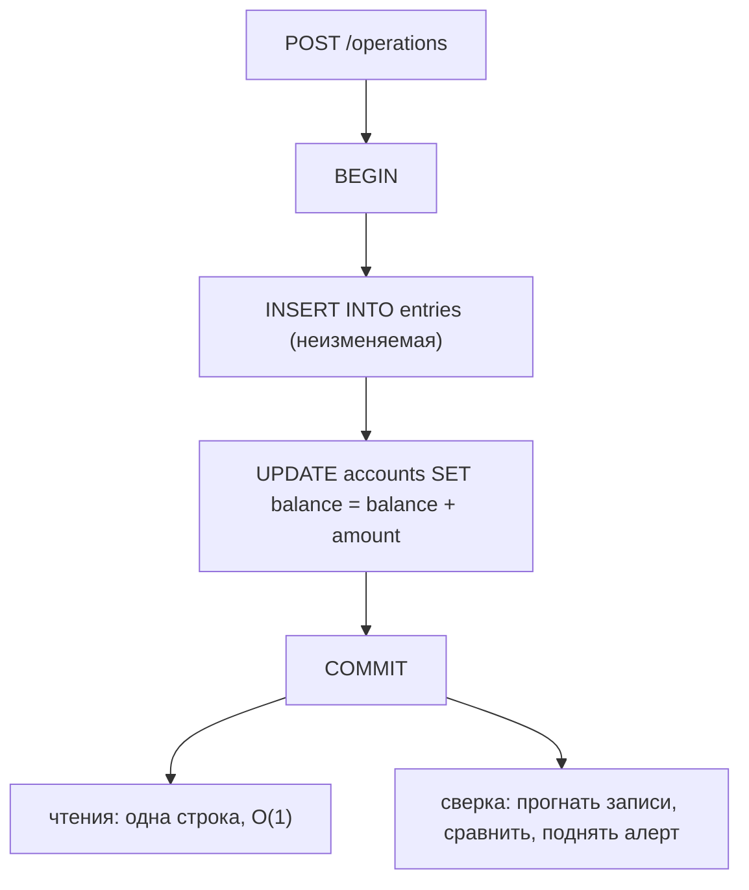

# Изменяемый баланс против журнала операций

Баланс — это не факт. Это **вывод**: сумма всех операций, которые когда-либо
коснулись счёта. Поэтому вопрос проектирования не «как хранить число», а: *что
именно я храню — вывод или те операции, из которых я его сделал?*

Если хранить только вывод, каждая запись выбрасывает подтверждающие его данные.
Если хранить операции, вывод превращается в то, что всегда можно пересчитать, —
и в то, за чтение чего теперь приходится платить.



## Что на самом деле уничтожает UPDATE на месте

`UPDATE accounts SET balance = balance - 250 WHERE id = 7` — это одна строка,
один оператор, O(1) на последующее чтение, и для множества счётчиков это
действительно правильный ответ. Его цену легко недооценить, потому что потеря
незаметна ровно в тот момент, когда происходит:

- **«Почему» исчезло.** В колонке лежит 750. Она не скажет, это 1000 − 250 или
  2000 − 1250, и восстановить это из базы никто не сможет.
- **Исправления неотличимы от правды.** Когда оператор чинит ошибочную проводку,
  перепечатывая итог, счёт становится верным — и нигде не остаётся записи, что он
  был неверным: ни старого значения, ни поправки, ни кто, ни когда. Запусти
  пример **Исправление ошибочной проводки**: и счёт «на месте», и журнал приходят
  к 750, но проверить можно только один из них.
- **Любая запись — это read-modify-write.** Даже `balance = balance + ?`, атомарный
  в SQL, становится гонкой в тот момент, когда *решение* (можно ли провести это
  списание?) принимается по значению, прочитанному раньше.
- **Отладке не с чем работать.** «У части клиентов балансы были неверными в
  прошлый вторник» — вопрос без ответа. Видно текущее состояние и не видно, что
  его породило, поэтому нельзя отличить баг в данных от бага в коде и от
  задвоенного запроса.

Последний пункт и объясняет, почему этот вопрос задают на собеседованиях по
денежным системам и почти нигде больше: для баланса *история является частью
продукта*. Регуляторы, споры, чарджбэки и сверки спрашивают «почему», а не «что».

## Что даёт журнал

Вариант «только добавление» хранит операции и выводит из них баланс:

```sql
CREATE TABLE entries (
  id          bigserial PRIMARY KEY,
  account_id  bigint    NOT NULL,
  amount      bigint    NOT NULL,      -- со знаком, в минорных единицах; никогда не float
  reason      text      NOT NULL,
  operation_id uuid     NOT NULL,      -- ключ идемпотентности бизнес-операции
  created_at  timestamptz NOT NULL DEFAULT now()
);

SELECT COALESCE(SUM(amount), 0) FROM entries WHERE account_id = 7;
```

Из принципа «ничего никогда не перезаписывается» напрямую следуют четыре
свойства:

1. **Баланс доказуем.** Любое число, которое сообщает сервис, раскладывается
   вплоть до вызвавшей его операции.
2. **Исправление — это добавление.** Ошибочная проводка чинится **сторнирующей
   записью** плюс правильной — приём бухгалтера, теперь и твой. Ошибка остаётся в
   книге. Это преимущество: аудиторский след, из которого вырезали неудобные
   места, аудиторским следом не является.
3. **Параллельные записи перестают конфликтовать.** Две операции превращаются в
   два `INSERT` в две строки. Общей ячейки, которую можно перезаписать, просто
   нет, поэтому [потерянное обновление](topic:transaction-read-anomalies)
   невозможно. Запусти **Две операции одновременно**: 1200 «на месте» и 1300 в
   журнале — при той же базе и том же уровне изоляции.
4. **Состояние восстанавливаемо.** Испортили баланс? Прогнать заново. Понадобился
   новый отчёт «траты по категориям по месяцам»? Это другая свёртка по уже
   имеющимся данным, а не миграция, которая работает только начиная с сегодня.

Настоящий бухучёт идёт дальше: **двойная запись**. Каждое движение пишет две
строки — дебет по одному счёту и кредит по другому, — так что сумма всех записей
во всей книге всегда равна нулю. Это стоит одной лишней строки и даёт инвариант,
который ловит целый класс багов одним запросом.

## Какую гонку убирает append-only, а какую нет

Именно это различие отделяет уверенный ответ от общих слов.

**Убирает: потерянное обновление.** Read-modify-write по одной строке теряет ту
транзакцию, которая зафиксировалась первой.



У добавления такого шага нет вовсе. (При хранении «на месте» лечится одним
атомарным оператором или [оптимистичной/пессимистичной
блокировкой](topic:optimistic-vs-pessimistic-locking) — см. также [как избегать
гонок](topic:race-condition-avoidance).)

**Не убирает: check-then-act по балансу.** «Никогда ниже нуля» — это правило о
*свёртке*, а `INSERT` о свёртке ничего не знает. Два одновременных списания
читают 200, оба проходят `200 - 200 >= 0`, оба добавляют запись — и счёт уходит в
−200, причём ничто ни с чем не конфликтовало. Запусти **Уход в минус в
append-only**. При [MVCC](topic:mvcc) каждая транзакция читает свой снимок,
поэтому более высокий [уровень изоляции](topic:postgresql-isolation-levels) тоже
не спасает — он превращает проблему в ошибку сериализации, которую нужно ловить.

Чтобы обеспечить инвариант, придётся вернуть точку сериализации по счёту:

- заблокировать строку счёта (`SELECT ... FOR UPDATE`) на время записи;
- либо держать колонку версии/баланса и обновлять её условно — версия
  [compare-and-set](topic:compare-and-set) на уровне базы;
- либо сделать одного писателя на счёт (секционированная очередь, по одному
  консьюмеру на ключ счёта) — так обычно и устроены высоконагруженные журналы.

**Добавление убирает конфликты между записями. Оно не убирает необходимость
сериализовать решения.**

## Стоимость чтения и снимки

`SUM(amount)` по всей истории счёта прекрасен на 50 записях и проблемен на 5
миллионах. Стандартные ответы, в том порядке, в каком за ними стоит тянуться:

1. **Проиндексировать.** Составной [индекс](topic:database-indexes) по
   `(account_id, id)` превращает свёртку в range scan по строкам одного счёта.
2. **Сделать снимок.** Сохранить баланс по состоянию на запись N и сворачивать
   только то, что было после. Снимок — это *кэш свёртки*, а не замена истории:
   записи остаются. Запусти **Когда свёртка становится медленной**: девять
   записей, и чтение падает с восьми строк до одной, ничего не удаляя.
3. **Закрыть период.** Бухгалтерская версия снимка: входящий остаток по счёту на
   каждый месяц, после чего старые записи можно архивировать или выносить в
   отдельные секции, не теряя возможности назвать баланс.
4. **Хранить нарастающий итог в самой записи.** Каждая строка хранит баланс после
   себя, и текущий баланс — это `ORDER BY id DESC LIMIT 1`. Работает, только если
   записи по одному счёту сериализованы, — а это, как показано выше, может
   понадобиться и так.

## Гибрид: как это выглядит в продакшене

Почти любой реальный сервис балансов приходит к обоим вариантам сразу: записи как
источник истины и денормализованная колонка баланса, обслуживающая чтения.



Правило здесь ровно одно, и на нём держится вся конструкция:

> Запись и обновление баланса — это **одна транзакция**. Всегда.

Разнеси их — и кэшированное число тихо перестанет быть правдой: запись
зафиксировалась, вторая транзакция так и не выполнилась, а чтения с полной
уверенностью продолжают отдавать устаревшее значение. Запусти **Записи плюс
кэшированный баланс**, чтобы увидеть, как это происходит и как это потом ловят. В
пределах одной базы это ничего не стоит: это та самая атомарность, которая уже
есть из [ACID](topic:acid-principles), а в Spring — одна граница
[`@Transactional`](topic:spring-transactional-proxy). Это
[денормализация](topic:database-normalization) со страховкой — и страховка есть
второе, что дают записи, потому что задача сверки, сравнивающая
`accounts.balance` с `SUM(entries.amount)`, способна *обнаружить* расхождение. У
схемы «только на месте» такой задачи нет: сравнивать не с чем.

Если баланс приходится обновлять асинхронно (отдельная модель чтения, другой
сервис), значит, выбрана согласованность в конечном счёте, и придётся отдельно
обрабатывать устаревшее чтение в точке принятия решения — см. [асинхронные данные
в точке синхронного решения](topic:event-carried-state-transfer).

## Неизменяемость — это политика, а не возможность базы

Ничто в PostgreSQL не мешает выполнить `DELETE FROM entries WHERE id = 42`. Пример
**Исправление ошибочной проводки** именно этим и заканчивается: один оператор — и
книга пересчитывается в другое число, выглядя при этом идеально согласованной. Что
действительно делает записи неизменяемыми:

- **Права доступа.** Роль приложения получает `INSERT` и `SELECT` на `entries` и
  никогда `UPDATE` или `DELETE`. Отзыв прав и есть механизм принуждения.
- **Цепочка хэшей или подпись.** Каждая строка хранит хэш своего содержимого плюс
  хэш предыдущей строки, поэтому удаление или правка рвут цепочку и задача
  проверки это находит.
- **Сверка.** Сравнивать свёртку со снимками, с колонкой баланса и с внешними
  выписками (банк, эквайер). Подделка, пережившая все три проверки, — это уже не
  проблема схемы.

## Это event sourcing?

Идеи родственные, но не одинаковые, и разницу стоит проговаривать:

| | Бухгалтерский журнал | Event sourcing |
| --- | --- | --- |
| Охват | один агрегат: движения денег | состояние всей системы |
| Словарь | дебет, кредит, сторно, дата проводки | события, агрегаты, проекции, replay |
| Модель чтения | обычно колонка баланса в той же БД | проекции, часто CQRS и отдельное хранилище |
| Изменение схемы | форма записи — доменный факт, почти не меняется | любая старая версия события должна остаться воспроизводимой навсегда |
| Цена для команды | низкая: это таблица и `SUM` | высокая: новые режимы отказа, инструменты, образ мышления |

Журнал — узкая, скучная и хорошо изученная версия той же идеи, и именно её почти
всегда имеют в виду, спрашивая «стоит ли делать event sourcing для сервиса
балансов?». Event sourcing *всего* сервиса — куда более серьёзное обязательство
(см. [паттерны микросервисов](topic:microservice-patterns)), и его главная скрытая
цена — эволюция схемы: если состояние восстанавливается прогоном истории, старую
версию события уже никогда не удалить, а изменение *смысла* события становится
миграцией данных за годы. Журнал обходит почти всё это, потому что «деньги
подвинулись на X по причине Y» смысла не меняет.

## Практические детали, которые пропускают

- **Деньги — это целые числа** в минорных единицах (копейки) или `NUMERIC`.
  Никогда не float, и в журнале это важно вдвойне, потому что ошибки округления
  накапливаются по всей свёртке. См. [очень большие числа в
  БД](topic:large-numbers-database-storage).
- **Записям нужна идемпотентность.** Повторённый запрос не должен добавить вторую
  запись; уникальный ключ — идентификатор бизнес-операции, и обеспечивает его
  база, а не проверка в приложении. Об этом целиком [как избежать дублей
  продаж](topic:duplicate-sale-prevention); в append-only-схеме это *важнее*, так
  как дубль здесь молча остаётся навсегда.
- **Нумерация против отметок времени.** Для порядка используй последовательность в
  рамках счёта и держи бизнес-дату отдельно от даты внесения: операцию нередко
  вносят позже того дня, к которому она относится.
- **Публикация событий.** Если регистрация операции должна ещё и породить
  событие, пиши его вместе с записью через [Outbox](topic:outbox-pattern), а на
  стороне консьюмера дедуплицируй через [Inbox](topic:inbox-pattern).

## Когда обновление на месте — правильный ответ

Не всё является деньгами. «На месте» верно тогда, когда число **не является
утверждением о прошлом**: кэшированный счётчик, который можно пересчитать из
другого места; датчик (CPU, длина очереди, время последнего визита); количество
лайков; остаток на складе, авторитет по которому — физический склад. Проверка
сводится к одному вопросу: *если завтра это число окажется неверным, понадобится
ли кому-нибудь узнать, как оно таким стало?* Если никому — хранить вывод не
срезание угла, а правильная модель.

## Ответ за 60 секунд на собеседовании

> Для сервиса балансов я добавляю неизменяемые записи и вывожу баланс из них,
> потому что баланс — это вывод, а операции — факты. При хранении на месте один
> `UPDATE` уничтожает единственное свидетельство того, как получилось число:
> баланс невозможно объяснить аудитору, исправление неотличимо от правды, а
> параллельный read-modify-write молча теряет операции. С записями исправления
> становятся сторнирующими проводками, параллельные записи — это отдельные строки
> и потерять друг друга не могут, а любое прошлое состояние пересчитываемо. Цена
> — чтение: `SUM` по истории растёт бесконечно, поэтому на практике я делаю
> гибрид: записи как источник истины плюс денормализованная колонка баланса,
> записываемая *в той же транзакции*, со снимками или закрытием периода, чтобы
> ограничить свёртку, и с задачей сверки, сравнивающей эти два числа. Чего
> append-only не даёт — так это инвариантов: «никогда ниже нуля» — правило о
> свёртке, поэтому два одновременных списания могут оба пройти проверку и оба
> добавить запись. Для этого всё равно нужна блокировка счёта, условное
> обновление или один писатель на счёт. А неизменяемость — это политика: она
> держится на том, что у роли приложения нет `DELETE`, а не на особенности
> таблицы. Если бы отвечать на «почему» было не нужно, я бы обновлял на месте и
> на этом остановился.

## Частые заблуждения

- **«Append-only — значит, нет проблем с параллелизмом».** Он убирает потерянное
  обновление, но не check-then-act. Любое правило, зависящее от баланса,
  по-прежнему требует сериализации.
- **«Журнал медленный, поэтому нам не подходит».** Медленна только свёртка, и её
  чинят снимки, закрытие периода или кэширующая колонка баланса — с сохранением
  истории.
- **«Снимок позволяет удалить старые записи».** Снимок кэширует свёртку. Удали
  записи за ним — и получишь баланс «на месте», только сложным путём.
- **«Таблица записей неизменяема».** Это таблица. Она неизменяема ровно настолько,
  насколько её такой делают права доступа, цепочка хэшей и сверка.
- **«Event sourcing и журнал — это одно и то же».** Журнал — финансовая история
  одного агрегата. Event sourcing — архитектура всей системы, и платит куда
  больший налог за эволюцию схемы.
- **«Держим и записи, и колонку баланса — это же просто кэш».** Только внутри
  одной транзакции. Две транзакции означают две правды, и чтения используют
  устаревшую.
- **«У нас есть аудит-лог, журнал не нужен».** Аудит-лог пишется рядом с
  состоянием и может с ним разойтись. Журнал *и есть* состояние: баланс выводится
  из него, поэтому разойтись они не могут по построению.
- **«Историю всегда можно добавить потом».** Начать записывать можно с завтрашнего
  дня. Вернуть то, что сегодняшний `UPDATE` затёр, нельзя.
