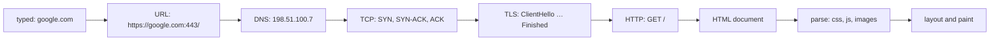
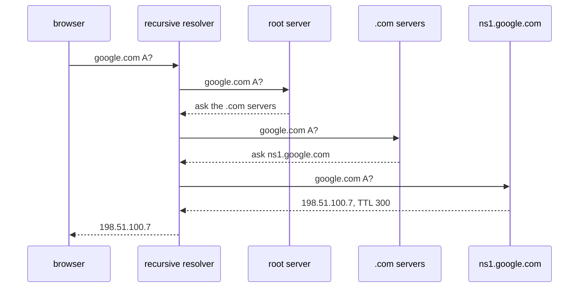
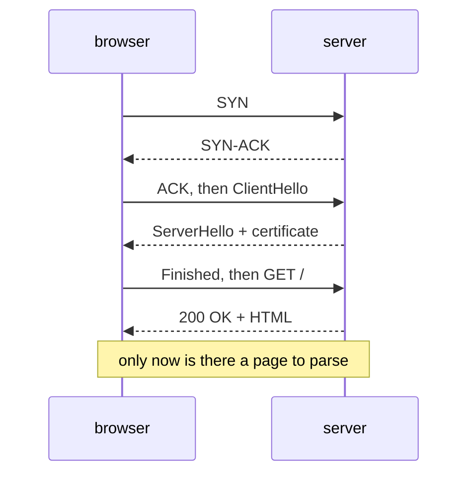

# What Happens When You Type a URL

## Why interviewers love this question

It has no trick in it, it cannot be answered from memory of one framework, and
the depth of the answer scales with the candidate. A junior says "it asks the
server and gets HTML back". A middle engineer names DNS, TCP, TLS and HTTP in
the right order. A senior explains why the order is forced, what each layer
costs, and which of those costs you can actually delete in production.

The spine of a good answer is one sentence: **each layer only exists because
the one below it finished.** What you typed is not a URL, a name is not an
address, an address is not a connection, a connection is not a secure
connection, and a document is not a page.



## 1. What you typed is not a URL

Before any network activity, the browser decides what the string even is. A
value with spaces and no dots goes to the default search engine; this one looks
like a host name, so it is a navigation. Then it fills in everything you did not
type:

- the **scheme** — modern browsers try `https` first, and if the host is on the
  HSTS list, `https` is not a guess but a rule;
- the **port** — 443 for https, 80 for http, which is why you never see it;
- the **path** — `/`, because a URL always has one.

So `google.com` becomes `https://google.com:443/`. Nothing has left the machine
yet.

## 2. A name is not an address — DNS

TCP cannot connect to a name, so the name must become an IP address. Three local
lookups happen first: the browser's own DNS cache, the OS stub resolver's cache,
and the `hosts` file (which still wins over DNS — an old line in it can make one
host unreachable for years). Only if all three miss does one UDP datagram go to
the configured **recursive resolver** — your router, your ISP's, `8.8.8.8`,
`1.1.1.1` — asking it to do the walking.

The resolver walks down a tree of delegations:



The root does not know `google.com` and never will — it knows who runs `.com`.
The `.com` servers do not know the address — they know which name servers the
domain owner declared. Only the **authoritative** server holds the zone file
with the record. Everyone on the way back caches the answer for its **TTL**,
which is why the second visitor on your network skips all of it, and why you
lower a TTL *before* a migration rather than during it.

Three details that separate a good answer from a memorised one:

- A real answer is usually several `A` records plus `AAAA` records for IPv6, and
  the browser races the two families against each other (Happy Eyeballs).
- DNS is UDP on port 53 (falling back to TCP for large answers) and, unless DoH
  or DoT is configured, it is **plaintext** — the one part of loading an
  `https://` page that an observer can read in full.
- DNS is where the biggest single performance lever lives, because a CDN answers
  the same name with a different address per region.

## 3. An address is not a connection — TCP

The browser opens a TCP connection to `198.51.100.7:443`: **SYN**, **SYN-ACK**,
**ACK**. That is one full round trip spent before a single byte of your request
may be sent. Both sides exchange initial sequence numbers and window sizes, and
each kernel allocates a socket with buffers — that is what a connection
physically is.

Note what TCP does *not* know: the host name. That is why the name has to be
repeated inside TLS (as SNI) and inside HTTP (as `Host`), and why one IP address
can serve thousands of different sites.

## 4. A connection is not a secure connection — TLS

For `https`, a TLS handshake runs on that fresh connection before any HTTP
exists. The `ClientHello` carries three things worth naming:

- **SNI** — the host name in plaintext, which is how one address serves
  thousands of certificates (and the one field an observer can still read);
- **ALPN** — the list of protocols the browser speaks, which is how HTTP/2 is
  chosen without an extra exchange;
- the supported TLS versions and the client's key material.

The server picks a version, sends its **certificate chain** and its own key
share. The browser verifies the chain up to a root it already trusts, checks the
validity dates, and checks that the certificate actually covers *this* host name
— a perfectly valid certificate for the wrong name fails exactly here, and that
check is the whole reason the padlock means anything. Both sides then derive the
same symmetric session keys.

TLS 1.3 completes in **one** round trip because the client guesses the key
exchange in its first message; TLS 1.2 needs **two**. From here everything —
request line, headers, cookies, body — is encrypted. An observer still sees your
IP, the SNI host name, and the size and timing of what you transfer. See
[HTTP vs HTTPS](topic:http-vs-https) for what that buys and what it does not.

## 5. The request, at last — HTTP

Only now does the thing you actually wanted exist on the wire:

```
:method GET · :authority www.google.com · :path / · :scheme https
accept-encoding: gzip, br
cookie: SID=…
```

The server answers with a status line, headers and a body. The moment the first
byte arrives is **TTFB**, and it is one more round trip plus however long the
server spent building the page — on top of everything the lower layers already
cost. Headers matter as much as the body: `content-type` decides how the bytes
are interpreted, `content-encoding` says they arrived compressed, and
`cache-control` is the server telling the browser whether the next visit may
skip this request entirely. For the methods and status codes themselves, see
[HTTP and its methods](topic:http-methods).



## 6. A document is not a page

The parser builds the DOM and immediately hits references it cannot render
without: stylesheets, scripts, fonts, images. Each is another HTTP request. A
stylesheet and a synchronous script are **render-blocking** — nothing appears
until they arrive. On a real site this is dozens of requests, often to other
origins, each of which may need its own DNS lookup and its own TCP + TLS
handshake. Requests the page's own JavaScript makes afterwards to other origins
are subject to [CORS](topic:cors) and sometimes a
[preflight](topic:preflight-requests) — which is a second full round trip before
the real one.

Only when nothing render-blocking is outstanding does the browser build the
render tree, lay it out and paint. *That* is when "the page loaded".

## The 60-second interview answer

> The browser first turns what I typed into a URL — scheme, port, path, and an
> HSTS check. Then DNS: browser cache, OS cache, hosts file, and if all miss, a
> recursive resolver walks root → `.com` → authoritative and returns an A record
> with a TTL. With an address it opens a TCP connection — SYN, SYN-ACK, ACK, one
> round trip. On https it then runs a TLS handshake: ClientHello with SNI and
> ALPN, the server's certificate chain, which the browser verifies against its
> trust store and against the host name, and session keys — one round trip on
> TLS 1.3, two on 1.2. Only then does it send `GET /`, and the first response
> byte is another round trip plus the server's own time. The HTML is not the
> page: the parser finds stylesheets, scripts and images, fetches them on the
> same connection, and only then lays out and paints. The fixed cost is measured
> in round trips, so the real optimisations are a CDN, keep-alive and HTTP/2,
> HSTS instead of a redirect, and caching so the request never happens.

## Why this matters in production

Add up the cold path: 4 round trips for DNS, 1 for TCP, 1–2 for TLS, 1 for the
request. That is 7–8 round trips **before the first byte** — and a round trip is
set by distance, not by bandwidth. A faster connection does not fix it; a nearer
server does. Every real optimisation is a way of deleting one of those:

| what you do | what it deletes |
| --- | --- |
| CDN / edge | milliseconds per round trip, and often the DNS walk too |
| HSTS preload | the `http → https` redirect, and one plaintext request |
| keep-alive, HTTP/2 | the TCP and TLS handshakes for every request after the first |
| TLS 1.3, session resumption | one handshake round trip (0-RTT on HTTP/3) |
| `cache-control` on static assets | the request itself |
| fewer / smaller render-blocking resources | the round trips between the HTML and the paint |

The same arithmetic is why service-to-service calls inside a system are worth
pooling rather than reopening — see
[service timeouts, fallbacks and circuit breakers](topic:service-timeouts-fallbacks)
— and why a chat feature keeps [one WebSocket](topic:websocket-connection) open
instead of paying this bill per message.

This is also the checklist for "the site does not open for one user": is it DNS
(wrong or stale record, hosts file), TCP (firewall, wrong port), TLS (expired
certificate, wrong name, clock skew), HTTP (status code, redirect loop) or the
page itself (a blocking script that failed)? Each layer fails differently, which
is what makes the sequence worth knowing — see also
[it passed tests and broke in production](topic:endpoint-broken-in-prod).

## Common traps and misconceptions

- **"DNS opens the connection."** It does not. DNS returns an address; TCP opens
  the connection, and they are separate failures with separate fixes.
- **"My machine asks the root servers."** It asks one recursive resolver a
  recursive question. The resolver walks the tree; your stub just waits.
- **"A DNS change takes effect immediately."** Not until every cache's TTL
  expires. Lower the TTL before the migration.
- **"TLS happens before TCP."** TLS runs *inside* an established TCP connection.
  There is nothing to encrypt before there is a connection.
- **"The certificate proves the site is trustworthy."** It proves you are
  talking to the holder of that name. A phishing site can have a perfectly valid
  certificate.
- **"https hides everything."** The IP, the SNI host name, and the size and
  timing of traffic remain visible. Plain DNS lookups are visible too.
- **"Typing `http://` is harmless, the server redirects."** That redirect costs a
  full DNS + TCP + request cycle and puts one unencrypted request on the
  network. HSTS deletes both.
- **"Loading is done when the HTML arrives."** The HTML is a list of further
  requests. First paint usually waits for CSS, and the `load` event waits for
  everything.
- **"It is slow because the connection is slow."** Most of the fixed cost is
  round trips. Measure DNS, connect, TLS and TTFB separately before blaming
  bandwidth — the split is exactly what a browser's network panel shows you.
- **"Each request opens a new connection."** With keep-alive and HTTP/2 the
  connection is reused and multiplexed; that reuse is the difference between one
  expensive request and a hundred cheap ones.
