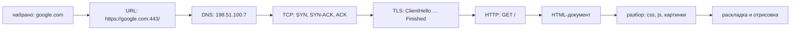
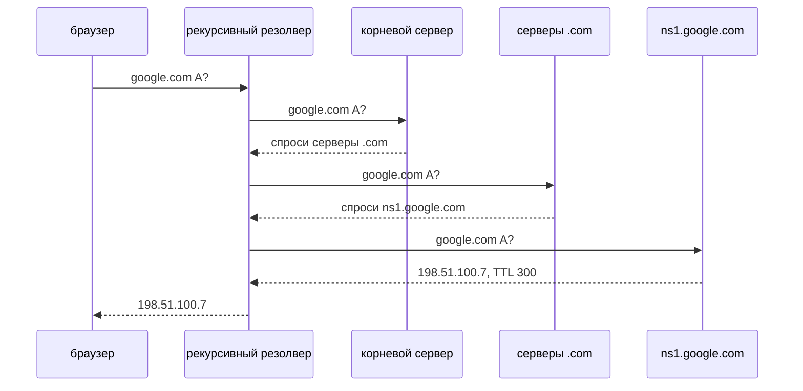
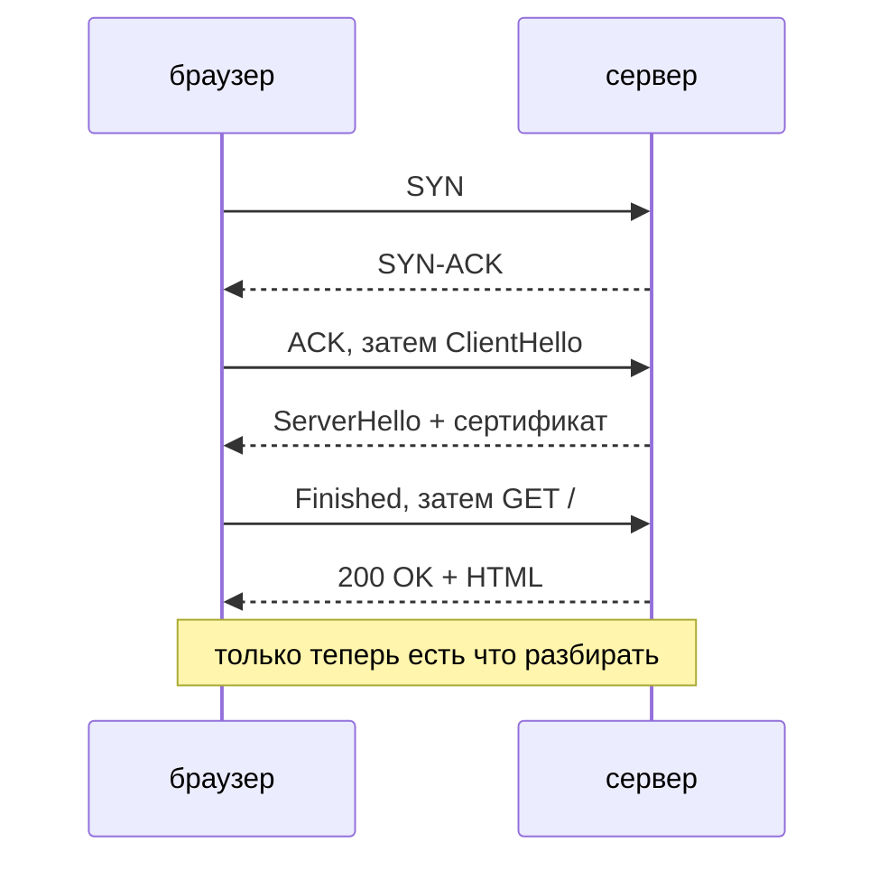

# Что происходит, когда вы вводите URL

## Почему собеседующие любят этот вопрос

В нём нет подвоха, на него нельзя ответить, помня один фреймворк, а глубина
ответа растёт вместе с уровнем кандидата. Джуниор скажет «запрашивает сервер и
получает HTML». Мидл назовёт DNS, TCP, TLS и HTTP в правильном порядке. Сеньор
объяснит, почему этот порядок вынужденный, во что обходится каждый слой и какие
из этих затрат в продакшене действительно можно убрать.

Стержень хорошего ответа — одно предложение: **каждый слой существует только
потому, что закончился предыдущий.** То, что вы набрали, — ещё не URL, имя — ещё
не адрес, адрес — ещё не соединение, соединение — ещё не защищённое соединение,
а документ — ещё не страница.



## 1. То, что вы набрали, — ещё не URL

До всякой сетевой активности браузер решает, что это вообще за строка. Значение с
пробелами и без точек уходит в поисковую систему по умолчанию; эта похожа на имя
хоста, значит, это навигация. Затем он дописывает всё, что вы не набрали:

- **схему** — современные браузеры сначала пробуют `https`, а если хост есть в
  списке HSTS, то `https` — уже не догадка, а правило;
- **порт** — 443 для https, 80 для http, поэтому вы его никогда не видите;
- **путь** — `/`, потому что путь у URL есть всегда.

Так `google.com` превращается в `https://google.com:443/`. Из машины пока не
ушло ничего.

## 2. Имя — ещё не адрес: DNS

TCP не умеет подключаться к имени, поэтому имя должно стать IP-адресом. Сначала
происходят три локальных обращения: собственный DNS-кэш браузера, кэш системного
stub-резолвера и файл `hosts` (который до сих пор побеждает DNS — старая строчка
в нём может годами делать один хост недоступным). И только если промахнулись все
три, одна UDP-датаграмма уходит настроенному **рекурсивному резолверу** —
роутеру, провайдерскому, `8.8.8.8`, `1.1.1.1` — с просьбой сходить за ответом.

Резолвер спускается по дереву делегаций:



Корень не знает `google.com` и никогда не узнает — он знает, кто заведует
зоной `.com`. Серверы `.com` не знают адреса — они знают, какие серверы имён
объявил владелец домена. И только **авторитативный** сервер держит файл зоны с
записью. Все на обратном пути кэшируют ответ на время его **TTL** — поэтому
следующий посетитель из вашей сети пропускает всё это целиком и поэтому TTL
понижают *до* переезда, а не во время него.

Три детали, которые отличают осмысленный ответ от заученного:

- Настоящий ответ — это обычно несколько записей `A` плюс записи `AAAA` для
  IPv6, и браузер устраивает гонку двух семейств адресов (Happy Eyeballs).
- DNS работает по UDP на порту 53 (с откатом на TCP для больших ответов) и, если
  не настроены DoH или DoT, идёт **открытым текстом** — это единственная часть
  загрузки `https://`-страницы, которую наблюдатель читает целиком.
- Именно в DNS находится самый сильный рычаг производительности, потому что CDN
  отвечает на одно и то же имя разными адресами в разных регионах.

## 3. Адрес — ещё не соединение: TCP

Браузер открывает TCP-соединение к `198.51.100.7:443`: **SYN**, **SYN-ACK**,
**ACK**. Это целый round trip, потраченный до того, как можно отправить хоть один
байт запроса. Обе стороны обмениваются начальными номерами последовательности и
размерами окна, и ядро на каждом конце выделяет сокет с буферами — вот что такое
соединение физически.

Обратите внимание, чего TCP *не* знает: имени хоста. Поэтому имя приходится
повторять внутри TLS (как SNI) и внутри HTTP (как `Host`), и поэтому один
IP-адрес может обслуживать тысячи разных сайтов.

## 4. Соединение — ещё не защищённое соединение: TLS

Для `https` на этом свежем соединении сначала проходит рукопожатие TLS, и только
потом появляется HTTP. В `ClientHello` едут три вещи, которые стоит назвать:

- **SNI** — имя хоста открытым текстом, благодаря которому один адрес
  обслуживает тысячи сертификатов (и единственное поле, которое наблюдатель
  по-прежнему читает);
- **ALPN** — список протоколов, на которых говорит браузер, благодаря которому
  HTTP/2 выбирается без лишнего обмена;
- поддерживаемые версии TLS и ключевой материал клиента.

Сервер выбирает версию, присылает свою **цепочку сертификатов** и свою часть
ключа. Браузер проверяет цепочку до корня, которому уже доверяет, проверяет сроки
действия и проверяет, что сертификат действительно покрывает *это* имя хоста:
совершенно действительный сертификат на чужое имя падает ровно здесь, и именно
эта проверка придаёт замочку смысл. После этого обе стороны выводят одинаковые
симметричные сеансовые ключи.

TLS 1.3 укладывается в **один** round trip, потому что клиент угадывает обмен
ключами в первом же сообщении; TLS 1.2 требует **двух**. Дальше шифруется всё:
строка запроса, заголовки, куки, тело. Наблюдатель по-прежнему видит ваш IP, имя
хоста в SNI, а также размеры и тайминги передачи. О том, что это даёт и чего не
даёт, — топик [HTTP против HTTPS](topic:http-vs-https).

## 5. Наконец сам запрос: HTTP

Только теперь на проводе появляется то, что вы на самом деле хотели:

```
:method GET · :authority www.google.com · :path / · :scheme https
accept-encoding: gzip, br
cookie: SID=…
```

Сервер отвечает строкой состояния, заголовками и телом. Момент прихода первого
байта — это **TTFB**, и он складывается ещё из одного round trip плюс времени,
которое сервер потратил на сборку страницы, — поверх всего, что уже стоили нижние
слои. Заголовки тут важны не меньше тела: `content-type` решает, как трактовать
байты, `content-encoding` говорит, что они пришли сжатыми, а `cache-control` —
это сервер, сообщающий браузеру, можно ли в следующий раз пропустить этот запрос
целиком. О самих методах и кодах состояния — топик
[HTTP и его методы](topic:http-methods).



## 6. Документ — ещё не страница

Парсер строит DOM и тут же натыкается на ссылки, без которых отрисовать нечего:
таблицы стилей, скрипты, шрифты, картинки. Каждая из них — очередной HTTP-запрос.
Таблица стилей и синхронный скрипт **блокируют отрисовку**: пока они не придут,
на экране не появится ничего. На реальном сайте это десятки запросов, часто к
другим origin, каждому из которых может понадобиться свой DNS-запрос и своё
рукопожатие TCP + TLS. Запросы, которые JavaScript страницы делает потом к другим
origin, подчиняются [CORS](topic:cors), а иногда и
[preflight-запросу](topic:preflight-requests) — а это ещё один полный round trip
перед настоящим.

И только когда не осталось ничего блокирующего отрисовку, браузер строит дерево
отрисовки, раскладывает его и рисует. *Вот теперь* «страница загрузилась».

## Ответ на собеседовании за 60 секунд

> Сначала браузер превращает набранное в URL: схема, порт, путь и проверка HSTS.
> Затем DNS: кэш браузера, кэш системы, файл hosts, а если все промахнулись —
> рекурсивный резолвер обходит корень → `.com` → авторитативный сервер и
> возвращает A-запись с TTL. С адресом он открывает TCP-соединение: SYN, SYN-ACK,
> ACK — один round trip. На https дальше идёт рукопожатие TLS: ClientHello с SNI
> и ALPN, цепочка сертификатов сервера, которую браузер проверяет по своему
> хранилищу доверия и по имени хоста, и сеансовые ключи — один round trip на
> TLS 1.3 и два на 1.2. И только потом отправляется `GET /`, а первый байт ответа
> — это ещё один round trip плюс собственное время сервера. HTML — не страница:
> парсер находит стили, скрипты и картинки, тянет их по тому же соединению, и
> только после этого происходят раскладка и отрисовка. Фиксированная цена
> измеряется в round trip, поэтому настоящие оптимизации — это CDN, keep-alive и
> HTTP/2, HSTS вместо редиректа и кэширование, при котором запроса не происходит
> вовсе.

## Почему это важно в продакшене

Сложите холодный путь: 4 round trip на DNS, 1 на TCP, 1–2 на TLS, 1 на запрос.
Это 7–8 round trip **до первого байта** — а длительность round trip задаётся
расстоянием, а не шириной канала. Быстрый интернет это не лечит, близкий сервер —
да. Любая настоящая оптимизация — это способ вычеркнуть одну из строк:

| что вы делаете | что это убирает |
| --- | --- |
| CDN / edge | миллисекунды на каждый round trip, а часто и сам обход DNS |
| HSTS preload | редирект `http → https` и один незашифрованный запрос |
| keep-alive, HTTP/2 | рукопожатия TCP и TLS для всех запросов после первого |
| TLS 1.3, возобновление сессии | один round trip рукопожатия (0-RTT на HTTP/3) |
| `cache-control` на статике | сам запрос |
| меньше блокирующих отрисовку ресурсов | round trip между HTML и отрисовкой |

Та же арифметика объясняет, почему вызовы между сервисами внутри системы стоит
держать в пуле, а не открывать заново — см.
[таймауты, фолбэки и circuit breaker](topic:service-timeouts-fallbacks), — и
почему чат держит [один WebSocket](topic:websocket-connection) открытым, вместо
того чтобы платить этот счёт за каждое сообщение.

Это же и чек-лист для «сайт не открывается только у одного пользователя»: это
DNS (неверная или устаревшая запись, файл hosts), TCP (файрвол, не тот порт), TLS
(истёкший сертификат, чужое имя, сбитые часы), HTTP (код состояния, петля
редиректов) или сама страница (упавший блокирующий скрипт)? Каждый слой ломается
по-своему — этим и ценно знание последовательности; см. также
[прошло тесты и сломалось в продакшене](topic:endpoint-broken-in-prod).

## Типичные ловушки и заблуждения

- **«DNS открывает соединение».** Нет. DNS возвращает адрес, а соединение
  открывает TCP; это разные отказы с разными способами починки.
- **«Моя машина спрашивает корневые серверы».** Она задаёт рекурсивный вопрос
  одному резолверу. По дереву ходит резолвер, а ваш stub просто ждёт.
- **«Смена DNS-записи действует сразу».** Нет, пока не истечёт TTL во всех
  кэшах. Понижайте TTL до переезда.
- **«TLS идёт до TCP».** TLS работает *внутри* установленного TCP-соединения.
  Пока нет соединения, шифровать нечего.
- **«Сертификат доказывает, что сайту можно доверять».** Он доказывает, что вы
  говорите с владельцем этого имени. У фишингового сайта может быть совершенно
  действительный сертификат.
- **«https скрывает всё».** IP, имя хоста в SNI, а также размеры и тайминги
  трафика остаются видны. Обычные DNS-запросы видны тоже.
- **«Набрать `http://` не страшно, сервер сделает редирект».** Этот редирект
  стоит полного цикла DNS + TCP + запрос и кладёт в сеть один незашифрованный
  запрос. HSTS убирает и то и другое.
- **«Загрузка закончена, когда пришёл HTML».** HTML — это список дальнейших
  запросов. Первая отрисовка обычно ждёт CSS, а событие `load` ждёт вообще всего.
- **«Медленно, потому что медленный интернет».** Большая часть фиксированной цены
  — это round trip. Измерьте DNS, connect, TLS и TTFB по отдельности, прежде чем
  винить канал: именно такую разбивку показывает сетевая панель браузера.
- **«Каждый запрос открывает новое соединение».** С keep-alive и HTTP/2
  соединение переиспользуется и мультиплексируется; это переиспользование и есть
  разница между одним дорогим запросом и сотней дешёвых.
