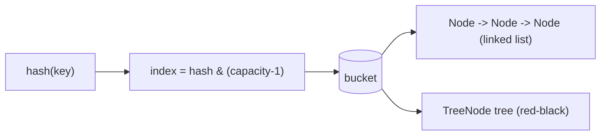
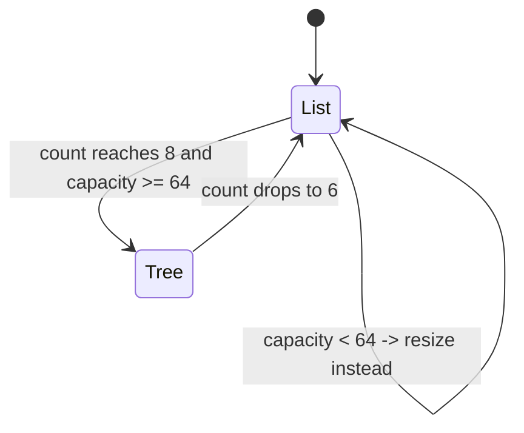

# What Data Structure Stores Values in a Bucket

## The intuition

A [HashMap](topic:hashmap) is an array of **buckets**. The hash of a key picks
one bucket; everything that hashes to the same slot has to share that one bucket.
The interview question is: *what actually lives inside a bucket?*

Think of a post office with a wall of pigeonholes, one per street. Most streets
get a single letter, so a pigeonhole usually holds just one item. But a busy
street can pile up many letters in the same hole, and the clerk needs a way to
keep them.

- **By default a bucket is a singly-linked list** of `Node` objects — a chain.
  Each `Node` holds the key, the value, the cached hash, and a `next` pointer.
  This is *separate chaining*: collisions sit in the same hole, threaded together
  like letters on a spike, newest at the end.
- **Since Java 8, a bucket that grows long is turned into a red-black tree** of
  `TreeNode` objects. When one pigeonhole gets so stuffed that the clerk is
  riffling through a thick stack every time, they switch to a sorted card index
  instead — they can binary-search it rather than read every card.

The whole trick exists because a long chain is slow: finding a key in a chain of
*n* entries is O(n), like flipping through every letter in the hole. A balanced
tree makes that same bucket O(log n).

## When does a bucket become a tree?

Three numbers, all constants in `HashMap`:

- `TREEIFY_THRESHOLD = 8` — a bucket with **8 or more** entries is a treeify
  candidate. (The clerk only bothers with a card index once a hole is genuinely
  overflowing.)
- `MIN_TREEIFY_CAPACITY = 64` — but only if the **table** has at least 64
  buckets. If it is smaller, the map **resizes instead** of treeifying, because
  doubling the wall of pigeonholes spreads the pile-up more cheaply than building
  a tree inside a cramped office.
- `UNTREEIFY_THRESHOLD = 6` — when a tree bucket shrinks to **6** entries, it
  converts back to a list. The gap between 8 and 6 is **hysteresis**: if both
  used the same number, a bucket hovering right at the boundary would flip back
  and forth on every add/remove — like a clerk endlessly setting up and tearing
  down the card index. The gap keeps it stable.

## How the tree orders the keys

A binary search tree needs an ordering, but keys that landed in the same bucket
only agree on their *low* hash bits — they are not naturally sortable. The tree
orders nodes primarily by their **full hash code**. When two keys have the *same*
hash, it breaks the tie with `Comparable` if the key type implements it (think of
the clerk filing two same-address letters by surname); otherwise it falls back to
a deterministic tie-breaker on class name and identity hash. That is why treeified
buckets get the O(log n) benefit even though plain hashing gave no order.

## The 60-second interview answer

> Inside a HashMap, each bucket holds the entries that hash to it. By default a
> bucket is a **singly-linked list** of `Node` objects (separate chaining), and
> lookup within the bucket is O(n). Since Java 8, if a single bucket reaches
> `TREEIFY_THRESHOLD` (8) entries *and* the table capacity is at least
> `MIN_TREEIFY_CAPACITY` (64), that bucket is converted into a **red-black tree**
> of `TreeNode`, making its lookups O(log n). Below capacity 64 the map resizes
> instead. The tree reverts to a list when it shrinks to `UNTREEIFY_THRESHOLD`
> (6) — the 8/6 gap is hysteresis that prevents thrashing. The tree orders nodes
> by hash, breaking ties with `Comparable`. In practice you almost never see
> trees with good hashing; treeification is a safety net against pathological
> collisions (including hash-collision DoS attacks).

## Why it matters in production

- **Degraded but not broken.** A bad `hashCode()` that dumps everything into a
  few buckets used to make HashMap O(n); treeification caps the damage at
  O(log n). It is a guardrail, not a feature you design around — like a fire door
  you hope never to use.
- **Security.** Treeification was partly a defence against *hash-flooding* DoS,
  where an attacker sends keys engineered to collide and turn lookups quadratic.
- **`Comparable` keys help the worst case.** If your keys can collide a lot and
  implement `Comparable`, the tree can order them directly instead of using the
  slower identity tie-break.
- **It is a HashMap detail.** A [TreeSet](topic:treeset)/`TreeMap` is *always* a
  tree (ordered by a [Comparator or Comparable](topic:comparator-vs-comparable));
  a HashMap is a tree only inside an overgrown bucket.

## Common misconceptions and traps

- **"A bucket is always a list."** Not since Java 8 — long buckets become trees.
  Before Java 8 it was always a list (and prepended, not appended).
- **"8 entries always treeify."** No — capacity must also be ≥ 64, otherwise the
  map resizes first. A small map with 8 colliding keys stays a list.
- **"It's a generic balanced BST / AVL tree."** It is specifically a **red-black
  tree** (`TreeNode extends LinkedHashMap.Entry`), chosen because its cheaper
  rebalancing suits a structure that mutates often.
- **"Trees fix bad `hashCode()`."** They only bound the *worst case* to O(log n).
  Good hashing keeps buckets tiny so treeification never triggers — fix the
  [hashCode contract](topic:equals-hashcode-contract) instead of relying on it.
- **"The chain is a [LinkedList](topic:arraylist-vs-linkedlist)."** It is a chain
  of `HashMap.Node` linked by a `next` field, not a `java.util.LinkedList`.
- **Lookup cost.** Average bucket lookup is O(1) with good hashing; the list/tree
  cost only shows up *within* an oversized bucket — see
  [HashMap lookup speed](topic:hashmap-lookup-complexity).
