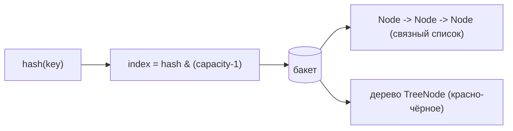
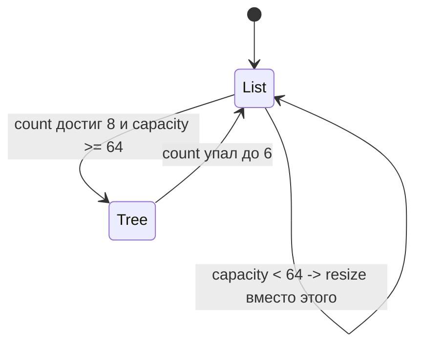

# Какая структура данных хранит значения в бакете

## Интуиция

[HashMap](topic:hashmap) — это массив **бакетов**. Хэш ключа выбирает один бакет;
всё, что хэшируется в ту же ячейку, вынуждено делить этот единственный бакет.
Вопрос с собеседования: *что на самом деле лежит внутри бакета?*

Представьте почтовое отделение со стеной из ячеек-пигеонхолов, по одной на улицу.
На большинство улиц приходит одно письмо, поэтому в ячейке обычно лежит лишь один
предмет. Но на оживлённой улице в одной ячейке может скопиться много писем, и
почтальону нужен способ их хранить.

- **По умолчанию бакет — это односвязный список** объектов `Node`, то есть
  цепочка. Каждый `Node` хранит ключ, значение, закэшированный хэш и указатель
  `next`. Это *separate chaining* (раздельные цепочки): столкнувшиеся записи лежат
  в одной ячейке, нанизанные вместе, как письма на штырь, новые — в конце.
- **Начиная с Java 8 длинный бакет превращается в красно-чёрное дерево** объектов
  `TreeNode`. Когда одна ячейка набита так, что почтальон каждый раз перебирает
  толстую стопку, он переходит на отсортированную картотеку — по ней можно делать
  бинарный поиск, а не читать каждую карточку.

Весь смысл в том, что длинная цепочка медленная: поиск ключа в цепочке из *n*
записей — O(n), как пролистывание каждого письма в ячейке. Сбалансированное дерево
делает тот же бакет O(log n).

## Когда бакет становится деревом?

Три числа, все — константы в `HashMap`:

- `TREEIFY_THRESHOLD = 8` — бакет с **8 и более** записями становится кандидатом
  на treeify. (Почтальон заводит картотеку лишь когда ячейка реально
  переполняется.)
- `MIN_TREEIFY_CAPACITY = 64` — но только если в **таблице** не меньше 64 бакетов.
  Если их меньше, мапа **делает resize вместо** treeify, потому что удвоить стену
  ячеек и распределить скопление дешевле, чем строить дерево в тесном отделении.
- `UNTREEIFY_THRESHOLD = 6` — когда бакет-дерево уменьшается до **6** записей, он
  снова становится списком. Разрыв между 8 и 6 — это **гистерезис**: если бы оба
  порога совпадали, бакет, балансирующий ровно на границе, переключался бы
  туда-сюда на каждом add/remove — как почтальон, бесконечно заводящий и
  разбирающий картотеку. Разрыв делает поведение стабильным.

## Как дерево упорядочивает ключи

Бинарному дереву поиска нужен порядок, но ключи, попавшие в один бакет, совпадают
лишь по *младшим* битам хэша — они не сортируемы естественным образом. Дерево
упорядочивает узлы прежде всего по их **полному hash code**. Когда у двух ключей
хэш *одинаковый*, ничью разрешает `Comparable`, если тип ключа его реализует
(почтальон раскладывает два письма с одним адресом по фамилии); иначе используется
детерминированный запасной критерий по имени класса и identity hash. Поэтому
бакеты-деревья получают выигрыш O(log n), хотя обычное хэширование не давало
порядка.

## Ответ за 60 секунд

> Внутри HashMap каждый бакет хранит записи, которые в него хэшируются. По
> умолчанию бакет — это **односвязный список** объектов `Node` (separate
> chaining), и поиск внутри бакета — O(n). Начиная с Java 8, если один бакет
> достигает `TREEIFY_THRESHOLD` (8) записей *и* ёмкость таблицы не меньше
> `MIN_TREEIFY_CAPACITY` (64), этот бакет превращается в **красно-чёрное дерево**
> из `TreeNode`, и его поиск становится O(log n). Ниже ёмкости 64 мапа вместо
> этого делает resize. Дерево возвращается к списку при уменьшении до
> `UNTREEIFY_THRESHOLD` (6) — разрыв 8/6 это гистерезис, предотвращающий
> «дребезг». Дерево упорядочивает узлы по hash, разрешая ничьи через `Comparable`.
> На практике при хорошем хэшировании деревья почти не возникают; treeification —
> это страховка от патологических коллизий (включая DoS-атаки на коллизии хэшей).

## Почему это важно в продакшене

- **Деградация, но не поломка.** Плохой `hashCode()`, сваливающий всё в несколько
  бакетов, раньше делал HashMap O(n); treeification ограничивает ущерб до
  O(log n). Это ограждение, а не фича, под которую проектируют, — как
  противопожарная дверь, которой надеешься не воспользоваться.
- **Безопасность.** Treeification отчасти была защитой от *hash-flooding* DoS,
  когда атакующий шлёт ключи, специально подобранные для коллизий, делая поиск
  квадратичным.
- **Ключи `Comparable` помогают худшему случаю.** Если ваши ключи могут часто
  сталкиваться и реализуют `Comparable`, дерево упорядочит их напрямую, а не через
  более медленный критерий по identity.
- **Это деталь HashMap.** [TreeSet](topic:treeset)/`TreeMap` — *всегда* дерево
  (упорядоченное [Comparator или Comparable](topic:comparator-vs-comparable));
  HashMap становится деревом только внутри переросшего бакета.

## Частые заблуждения и ловушки

- **«Бакет всегда список».** Не с Java 8 — длинные бакеты становятся деревьями. До
  Java 8 это всегда был список (и вставка в начало, а не в конец).
- **«8 записей всегда дают treeify».** Нет — ёмкость также должна быть ≥ 64, иначе
  мапа сначала делает resize. Маленькая мапа с 8 столкнувшимися ключами остаётся
  списком.
- **«Это произвольное сбалансированное BST / AVL-дерево».** Это именно
  **красно-чёрное дерево** (`TreeNode extends LinkedHashMap.Entry`), выбранное
  потому, что его более дешёвая ребалансировка подходит часто меняющейся
  структуре.
- **«Деревья чинят плохой `hashCode()`».** Они лишь ограничивают *худший случай*
  до O(log n). Хорошее хэширование держит бакеты крошечными, и treeification не
  срабатывает — лучше исправьте
  [контракт hashCode](topic:equals-hashcode-contract), а не полагайтесь на это.
- **«Цепочка — это [LinkedList](topic:arraylist-vs-linkedlist)».** Это цепочка из
  `HashMap.Node`, связанных полем `next`, а не `java.util.LinkedList`.
- **Стоимость поиска.** Средний поиск в бакете — O(1) при хорошем хэшировании;
  стоимость списка/дерева проявляется только *внутри* раздутого бакета — см.
  [скорость поиска в HashMap](topic:hashmap-lookup-complexity).
