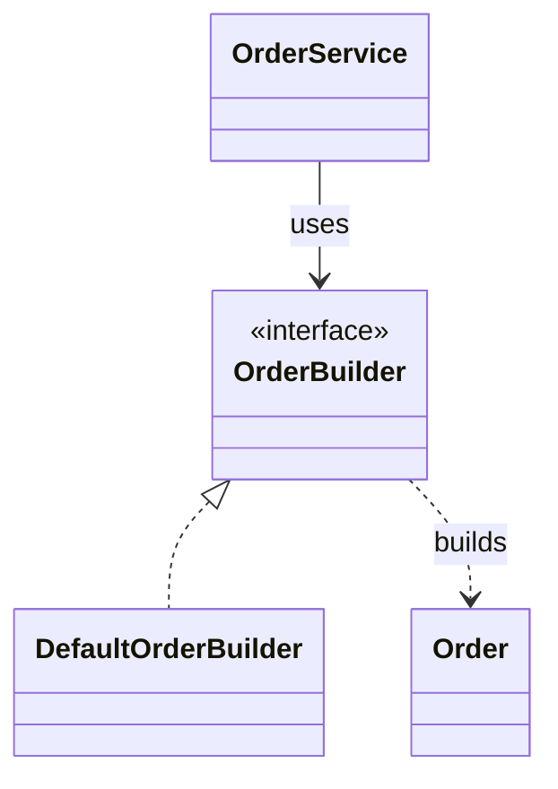
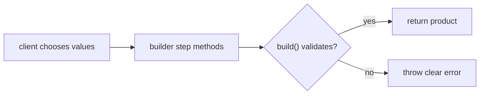

# Builder Pattern

> **Practice mode.** This is a *structural* topic: there is no "Run". You build
> the pattern as real classes in the file tree on the left, press **Analyze**, and
> the app compiles your code, draws the **class diagram** from it, and checks the
> missions against the relationships it finds.

## The Problem It Solves

**Builder** solves object construction that has too many optional parameters,
rules, or steps for one clear constructor. A constructor like
`new Order(customer, item, expedited, giftWrap, discountCode, address, notes)`
forces callers to remember parameter order and pass meaningless placeholders.
That is like ordering a complex meal by shouting every ingredient in one breath:
one missed detail changes the whole plate.

Builder moves construction into a separate object with named steps. The caller
says `customer(...)`, `item(...)`, `expedited(...)`, then `build()`. Each step is
small and readable, like filling a kitchen order ticket line by line instead of
balancing every plate at once.

Builder is especially useful when creation must be valid at the end, not halfway
through. The builder can collect data, apply defaults, and validate in `build()`.
That is like a post office clerk checking package size, address, and postage
before handing over the final receipt.

For the wider family of patterns, compare this with
[Design Patterns Overview](topic:design-patterns-overview). Builder is
creational like [Factory Method vs Abstract Factory](topic:factory-method-vs-abstract-factory),
but it focuses on assembling one complex object step by step. It also supports
the dependency inversion idea from [SOLID Principles](topic:solid-principles)
when clients depend on a builder interface.

## The Target Shape

In this practice, `Order` is the product, `OrderBuilder` is the construction
contract, `DefaultOrderBuilder` is the concrete builder, and `OrderService` is
the client/director that asks the builder for a ready object. Think of a kitchen:
the order is the finished dish, the recipe card is the builder contract, the cook
is the concrete builder, and the service counter coordinates the request.

- `Order` is the **product**. It should represent the finished object. Like a
  sealed parcel, it should not need callers to keep adjusting it after creation.
- `OrderBuilder` is the **builder contract**. It names the construction steps.
  Like a standard order form, it tells every cook which blanks must be filled.
- `DefaultOrderBuilder` is the **concrete builder**. It stores intermediate
  choices and returns the product from `build()`. Like a cook at a station, it
  gathers ingredients before the plate leaves the kitchen.
- `OrderService` is the **client/director**. It should hold `OrderBuilder` and
  describe the construction flow instead of calling a long constructor. Like a
  traffic dispatcher, it chooses the route but does not build the vehicle.

## How Creation Flows

The important interaction is delayed finalization. Step methods collect choices;
`build()` creates the product only when the object can be complete. This is like
collecting a delivery address, package weight, and payment first, then printing
one final shipping label.

Named steps also document intent at the call site. `builder.expedited(true)` is
harder to misread than the fourth `true` in a constructor. Like traffic signs
with words instead of unlabeled colored lights, the call carries meaning.

## How To Build It

1. Keep `Order` focused on representing the finished product. A product should
   not know every construction workflow. Like a finished package, it should not
   contain the whole packing station.
2. Add `DefaultOrderBuilder implements OrderBuilder`. Store the chosen values in
   fields and make each step return `this`, so calls can be chained. Like a
   kitchen prep bowl, the builder holds ingredients until the final dish is ready.
3. Put defaults and validation in `build()`. Required fields should be checked
   there, and optional fields can receive defaults. Like a post office scale, the
   final counter check catches missing postage before the parcel leaves.
4. Give `OrderService` an `OrderBuilder` field. The service should describe the
   order flow through the abstraction. Like a service counter using a standard
   form, it should not care which cook fills it out.

## 60-Second Interview Answer

Builder is a creational pattern for constructing complex objects step by step.
It solves the problem of long constructors, many optional parameters, unclear
parameter order, and construction rules that should be checked in one place. The
client calls named builder methods, then `build()` returns a valid product. Use
Builder when object creation has many optional parts, combinations, defaults, or
validation, especially when you want the final object to be immutable. Do not use
it for simple objects where a constructor or static factory is clearer.

## Production Relevance

Builder is common in DTOs, request objects, test data setup, configuration
objects, and immutable domain objects. It keeps call sites readable and prevents
constructor overloads from multiplying. Like a restaurant order system, the
customer can pick only the relevant options while the kitchen still receives one
valid ticket.

It also helps tests. A test can start from a default builder and override only
what matters for the case. Like a post office form with sensible defaults, each
test changes only the address line it is trying to verify.

Builder is not a replacement for good domain modeling from
[OOP Principles](topic:oop-principles). If a class has too many unrelated fields,
Builder may hide the smell instead of fixing it. Like a bigger tray in a kitchen,
it helps carry a complex order, but it does not make random ingredients belong
together.

## Common Misconceptions

- **"Builder is just setters."** Setters mutate an existing object; Builder
  usually prepares data and creates the final object at `build()`. Like packing a
  parcel at the counter before sealing it, the finished package should not stay
  half-open.
- **"Every object needs a Builder."** Small value objects often need only a clear
  constructor or static factory. Do not bring a whole kitchen checklist to pour a
  glass of water.
- **"Builder and Factory are the same."** Factories choose which concrete type to
  create; Builder describes how to assemble one complex object. Like choosing a
  restaurant versus filling out a detailed order ticket, they answer different
  questions.
- **"Builder automatically makes objects immutable."** It only helps if the
  product stores final state and does not expose mutating methods. Like a sealed
  delivery box, immutability depends on closing the box after packing.
- **"Validation can stay scattered in callers."** That duplicates rules and
  creates inconsistent objects. Put final construction rules in `build()`, like a
  single checkpoint before traffic enters the highway.
