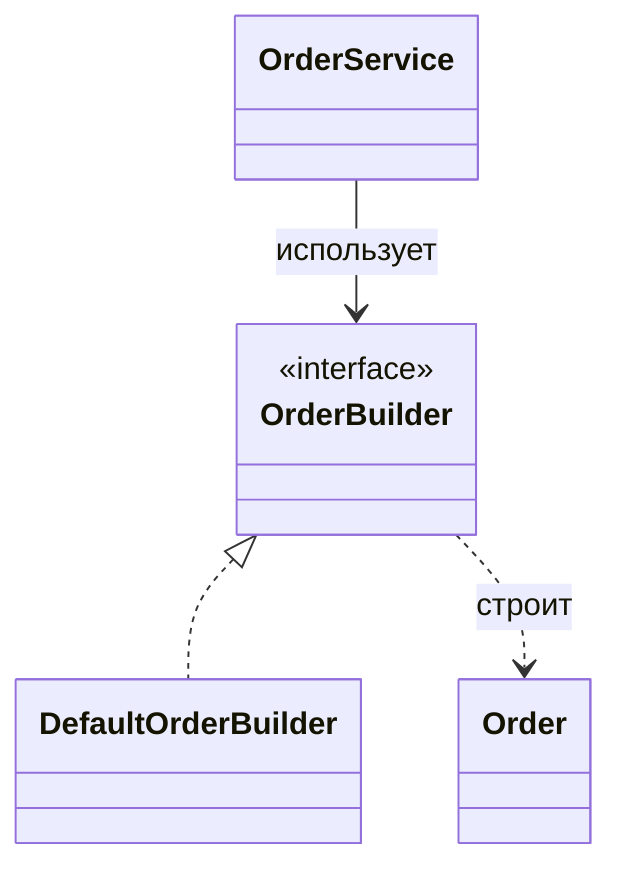

# Паттерн Builder

> **Режим практики.** Это *структурная* тема: кнопки «Run» нет. Вы строите
> паттерн как реальные классы в дереве файлов слева, нажимаете **Analyze**, а
> приложение компилирует код, рисует **диаграмму классов** и проверяет миссии по
> найденным связям.

## Какую проблему он решает

**Builder** решает создание объектов, у которых слишком много необязательных
параметров, правил или шагов для одного понятного конструктора. Конструктор вроде
`new Order(customer, item, expedited, giftWrap, discountCode, address, notes)`
заставляет вызывающий код помнить порядок параметров и передавать бессмысленные
заглушки. Это похоже на заказ сложного блюда, когда нужно выкрикнуть все
ингредиенты одним дыханием: одна пропущенная деталь меняет всю тарелку.

Builder переносит создание в отдельный объект с именованными шагами. Вызывающий
код говорит `customer(...)`, `item(...)`, `expedited(...)`, затем `build()`.
Каждый шаг маленький и читаемый, как кухонный заказ, который заполняют строка за
строкой, а не пытаются удержать все тарелки сразу.

Builder особенно полезен, когда объект должен стать валидным в конце, а не в
середине процесса. Builder может собрать данные, применить значения по умолчанию
и выполнить проверку в `build()`. Это похоже на сотрудника почты, который
проверяет размер посылки, адрес и оплату перед выдачей финальной квитанции.

Чтобы увидеть место паттерна в общей карте, сравните его с
[Design Patterns Overview](topic:design-patterns-overview). Builder относится к
порождающим паттернам, как и [Factory Method vs Abstract Factory](topic:factory-method-vs-abstract-factory),
но фокусируется на пошаговой сборке одного сложного объекта. Он также поддерживает
идею инверсии зависимостей из [SOLID Principles](topic:solid-principles), когда
клиенты зависят от интерфейса builder.

## Целевая форма

В этой практике `Order` — продукт, `OrderBuilder` — контракт создания,
`DefaultOrderBuilder` — конкретный builder, а `OrderService` — client/director,
который просит builder вернуть готовый объект. Представьте кухню: заказ — готовое
блюдо, карточка рецепта — контракт builder, повар — конкретный builder, а стойка
выдачи координирует запрос.

- `Order` — **product**. Он должен представлять готовый объект. Как запечатанная
  посылка, он не должен требовать, чтобы вызывающий код продолжал его настраивать
  после создания.
- `OrderBuilder` — **builder contract**. Он называет шаги создания. Как
  стандартный бланк заказа, он говорит каждому повару, какие поля нужно заполнить.
- `DefaultOrderBuilder` — **concrete builder**. Он хранит промежуточные выборы и
  возвращает продукт из `build()`. Как повар на станции, он собирает ингредиенты,
  прежде чем блюдо уйдёт из кухни.
- `OrderService` — **client/director**. Он должен хранить `OrderBuilder` и
  описывать поток создания вместо вызова длинного конструктора. Как диспетчер
  движения, он выбирает маршрут, но не строит автомобиль.

## Как проходит создание

Важное взаимодействие — отложенная финализация. Методы-шаги собирают выборы;
`build()` создаёт продукт только тогда, когда объект может быть полным. Это
похоже на сбор адреса доставки, веса посылки и оплаты перед печатью одной
финальной наклейки.

Именованные шаги также документируют намерение в месте вызова.
`builder.expedited(true)` сложнее прочитать неправильно, чем четвёртый `true` в
конструкторе. Как дорожные знаки с текстом вместо безымянных цветных ламп, такой
вызов несёт смысл.

## Как это собрать

1. Держите `Order` сфокусированным на представлении готового продукта. Product не
   должен знать каждый сценарий создания. Как готовая посылка, он не должен
   содержать всю упаковочную станцию.
2. Добавьте `DefaultOrderBuilder implements OrderBuilder`. Храните выбранные
   значения в полях и возвращайте `this` из каждого шага, чтобы вызовы можно было
   соединять в цепочку. Как кухонная миска для подготовки, builder держит
   ингредиенты до готовности финального блюда.
3. Поместите значения по умолчанию и валидацию в `build()`. Обязательные поля
   нужно проверять там, а необязательные могут получать defaults. Как почтовые
   весы, финальная проверка у стойки ловит недостающую оплату до отправки посылки.
4. Дайте `OrderService` поле `OrderBuilder`. Service должен описывать поток
   заказа через абстракцию. Как стойка обслуживания со стандартным бланком, он не
   должен зависеть от того, какой повар его заполняет.

## Ответ на собеседовании за 60 секунд

Builder — это порождающий паттерн для пошагового создания сложных объектов. Он
решает проблему длинных конструкторов, множества необязательных параметров,
неочевидного порядка аргументов и правил создания, которые нужно проверять в
одном месте. Клиент вызывает именованные методы builder, а затем `build()`
возвращает валидный продукт. Используйте Builder, когда создание объекта имеет
много необязательных частей, комбинаций, defaults или валидации, особенно если
нужно получить immutable-объект. Не используйте его для простых объектов, где
конструктор или static factory понятнее.

## Практическая польза

Builder часто встречается в DTO, request-объектах, подготовке тестовых данных,
конфигурационных объектах и immutable domain objects. Он делает места вызова
читаемыми и не даёт перегрузкам конструкторов размножаться. Как ресторанная
система заказов, клиент выбирает только нужные опции, а кухня всё равно получает
один валидный билет.

Он также помогает тестам. Тест может начать с builder со значениями по умолчанию
и переопределить только то, что важно для конкретного случая. Как почтовый бланк
с разумными defaults, каждый тест меняет только ту строку адреса, которую
проверяет.

Builder не заменяет хорошее доменное моделирование из
[OOP Principles](topic:oop-principles). Если у класса слишком много несвязанных
полей, Builder может спрятать запах, но не исправить его. Как большой поднос на
кухне, он помогает перенести сложный заказ, но не делает случайные ингредиенты
единой идеей.

## Частые заблуждения

- **«Builder — это просто setters».** Setters меняют уже существующий объект;
  Builder обычно готовит данные и создаёт финальный объект в `build()`. Как
  упаковка посылки у стойки перед запечатыванием: готовая посылка не должна
  оставаться полуоткрытой.
- **«Каждому объекту нужен Builder».** Маленьким value objects часто достаточно
  понятного конструктора или static factory. Не стоит приносить кухонный чек-лист,
  чтобы налить стакан воды.
- **«Builder и Factory — одно и то же».** Factories выбирают, какой конкретный
  тип создать; Builder описывает, как собрать один сложный объект. Как выбор
  ресторана и заполнение подробного билета заказа: это разные вопросы.
- **«Builder автоматически делает объекты immutable».** Он только помогает, если
  product хранит final-состояние и не раскрывает mutating methods. Как
  запечатанная коробка доставки, immutability зависит от того, закрыли ли коробку
  после упаковки.
- **«Валидацию можно оставить разбросанной по callers».** Это дублирует правила и
  создаёт inconsistent objects. Поместите финальные правила создания в `build()`,
  как единый checkpoint перед въездом транспорта на шоссе.
