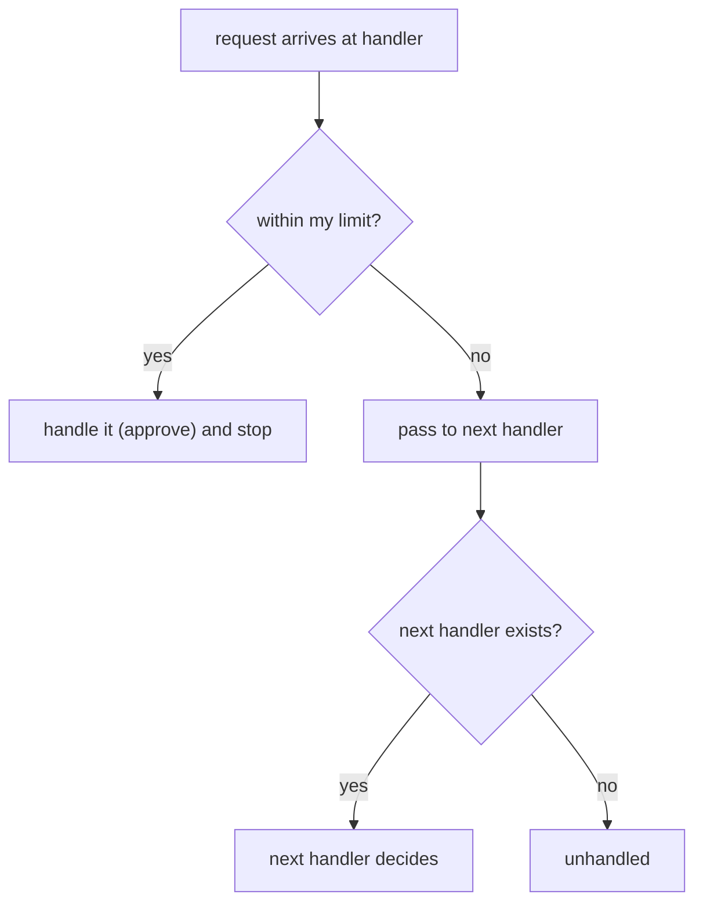
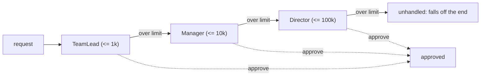
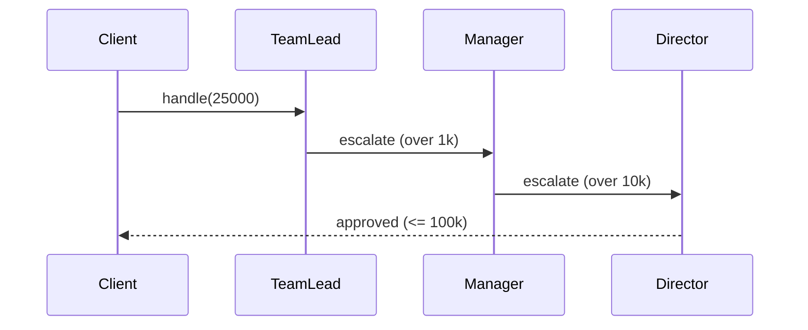

# Chain of Responsibility

> **Teaching model.** The runnable code uses `VisualChain`, a learning model that
> reproduces the idea an interviewer asks about — a request walking a linked chain
> of handlers that each handle-or-pass — and emits trace events the panel on the
> right replays. The concrete chain is an **approval/escalation chain**: each
> handler approves a request up to its own `limit`, otherwise it escalates to the
> next handler. The *behaviour you reason about* is the real pattern.

## The mental model

Chain of Responsibility is a **behavioral** design pattern. You have a request,
and several objects that *might* be able to deal with it. Instead of the caller
choosing the right one with a big `if/else` or `switch`, you **link the handlers
into a chain** and drop the request in at the head. Each handler does one of two
things:

1. **Handle it** — it can deal with the request, so it does, and (usually) the
   chain stops.
2. **Pass it on** — it can't, so it forwards the request to the next handler.

The key benefit is **decoupling**: the sender doesn't know — and doesn't care —
which handler will end up doing the work, or even how many handlers there are.
You can add, remove or reorder handlers without touching the sender.

A request for `800` is approved by `TeamLead` and stops there. A request for
`25_000` is passed by `TeamLead` and `Manager` and approved by `Director`. A
request for `500_000` is passed by everyone and falls off the end **unhandled**.

## Why it's useful

- **Open/closed** — extend behaviour by adding a handler to the chain instead of
  editing a growing conditional.
- **Single responsibility** — each handler knows about exactly one kind of work.
- **Dynamic** — the chain can be built (and reordered) at runtime, from config.

## Order matters

The chain is walked **in order**, and the *first* capable handler wins. So a
broad handler placed near the head can "swallow" requests that a more specific
handler should have taken — the later handlers become dead code. Put **specific
handlers before broad ones**, and keep any catch-all at the **tail**.

## The unhandled case

If no handler can process the request, it reaches the end of the chain. You must
decide what that means: return a "not handled" result, throw, or — most often —
end the chain with a **default/catch-all tail handler** so every request gets
*some* answer.

## Where you've already seen it

- **Servlet `Filter` chains** and Spring's `FilterChain` / `HandlerInterceptor`.
- **Spring Security** filter chain.
- **`java.util.logging`** — a log record bubbles up through parent loggers/handlers.
- **Exception handling** itself: a `try/catch` looks for the first matching handler
  up the call stack.
- Servlet/Netty pipelines, middleware in web frameworks.

## Interview answer (60 seconds)

> Chain of Responsibility decouples the sender of a request from its receiver by
> giving more than one object a chance to handle it. You link the handlers into a
> chain; each handler either handles the request or passes it to the next. The
> sender just drops the request at the head and doesn't care who handles it, so
> you can add, remove or reorder handlers without changing the caller. Order
> matters because the first capable handler wins, and you usually end the chain
> with a default handler so nothing falls through silently. It's how servlet
> filters, Spring Security, and logging handlers all work.

## Common misconceptions

- ❌ "Exactly one handler always handles the request." — No; zero handlers may
  match (it falls off the end) and, in the variant where handlers *forward after
  acting* (like logging), several may act.
- ❌ "The order of handlers doesn't matter." — It does; the first capable handler
  wins, so a broad handler up front hides specific ones.
- ❌ "It's the same as Decorator." — Both wrap objects in a chain, but Decorator
  *adds behaviour* and every wrapper runs; CoR *picks a handler* and typically
  stops once one handles the request.
- ❌ "You always stop at the first handler." — The classic form stops, but a
  handler is also free to do its bit and still pass the request on.
- ❌ "A request that nobody handles is fine to ignore." — Silent drops hide bugs;
  add a default tail handler or signal "unhandled" explicitly.
