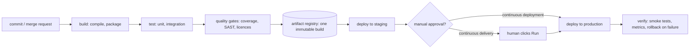
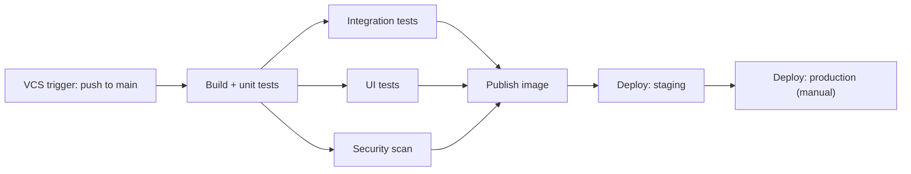
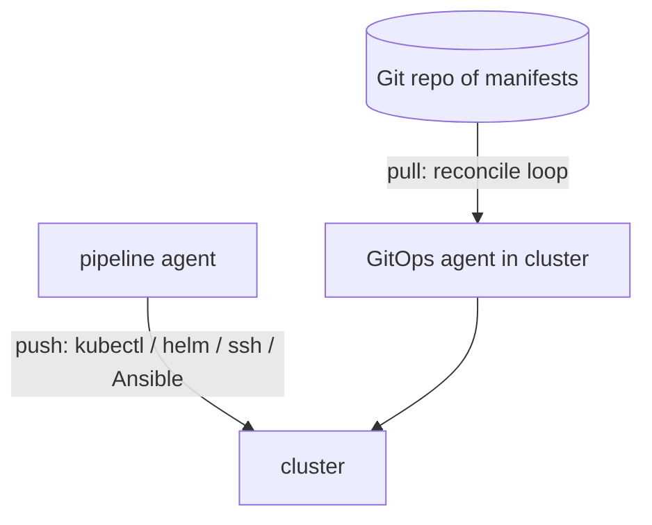

# CI/CD process variants

**CI/CD is one automated path from a commit to running software.** Everything
else is a variation on where that path stops, what starts it, how it is cut into
pieces, and how the last piece — the deploy — actually happens.

The letters are three separate ideas, and interviewers do check that you keep
them apart:

- **CI — continuous integration.** Everyone merges into a shared branch often
  (at least daily), and every merge is built and tested automatically. The point
  is not the server; the point is that integration conflicts are found in
  minutes instead of at the end of a release.
- **CD — continuous delivery.** Every green build is *deployable*: it produces a
  versioned artifact that has already passed the gates and been proven on a
  staging environment. A human decides *when* it goes to production.
- **CD — continuous deployment.** The same, minus the human. A green build goes
  to production automatically.

Continuous delivery and continuous deployment differ by exactly one thing: a
manual approval step. That single difference is the most common question here.

Those stages exist in every pipeline, whether it is TeamCity, Jenkins, GitLab
CI, GitHub Actions or a shell script somebody wrote in 2014. The variants below
are choices *about* them.

## Axis 1 — how far the automation goes

There is a ladder here, and each rung is a real, defensible setup:

1. Nightly or manual builds — no CI at all.
2. CI: every commit is built and tested.
3. CI plus an automated deploy to a test environment.
4. Continuous delivery: the production deploy is one click.
5. Continuous deployment: the production deploy is automatic.

Most real teams sit in the middle. Moving up a
step is a question about *trust*, not about tooling: continuous deployment is
only responsible when you have a test suite you believe, feature flags to hide
unfinished work, deployment strategies that limit blast radius, monitoring that
notices a bad release, and an automatic rollback. Without those, "deploy on
every merge" just means shipping bugs faster.

Regulated environments often *cannot* remove the human gate — a change advisory
approval, a segregation-of-duties rule, or a scheduled maintenance window. That
is a legitimate variant, not a failure: continuous delivery with an auditable
approval is the normal answer in banking and healthcare.

## Axis 2 — what triggers a run

- **VCS / push trigger** — a commit on a watched branch. The default for CI.
- **Merge-request (pull-request) trigger** — build the *merge result*, not the
  branch tip, and publish the status back so the merge button is blocked while
  it is red. This is what makes a protected branch meaningful.
- **Tag trigger** — a `v1.4.0` tag starts the release pipeline. Common when
  releases are deliberate events rather than a consequence of merging.
- **Scheduled (cron) trigger** — nightly full regression, long performance runs,
  a weekly rebuild of images so base-layer CVE patches land without a code
  change.
- **Manual trigger** — a human runs the deploy configuration, usually with
  parameters (which version, which environment).
- **Dependency / upstream trigger** — a build starts because another build
  finished. This is what turns separate configurations into a *chain*.
- **External event** — a webhook, a new artifact in a registry, an API call from
  another system.

A practical detail worth mentioning: **trigger filters**. Do not run the whole
pipeline for a change to `README.md`, and in a monorepo trigger only the
subprojects whose paths changed. TeamCity does this with VCS trigger rules,
GitLab with `rules:changes`, GitHub Actions with `paths:`.

## Axis 3 — the shape of the pipeline

The biggest structural choice is **one long build** versus **a chain of small
ones**.

A single build configuration that compiles, tests, packages and deploys is
simple and fine for a small service. It stops scaling for three reasons: a
failure in minute 18 costs you the previous 17, nothing runs in parallel, and
you cannot re-run just the deploy without rebuilding.

A **build chain** splits the work into configurations that depend on each other,
fan out into parallel stages, and fan back in:

This is exactly what **TeamCity** models, and it uses two different kinds of
dependency to do it — the distinction is a favourite interview question:

- A **snapshot dependency** says "run me only after that build finished, on the
  *same* VCS revision". It defines the order and pins the whole chain to one
  commit, so the tests, the image and the deploy all describe the same source.
- An **artifact dependency** says "give me the files that build produced" — the
  jar, the image tag, a report. It is how a deploy configuration gets the
  artifact instead of rebuilding it.

Together they give you the property that matters: **build once, promote many.**
The same bytes, the same digest, move from staging to production; only the
configuration changes, injected at runtime (see [which wins, properties or
environment variables](topic:spring-config-property-precedence)). If the
production stage rebuilds from source, production runs bytes that nobody tested,
and every source of build non-determinism is back in play — that is one of the
classic reasons [something passes tests and breaks in
production](topic:endpoint-broken-in-prod).

Other topology choices:

- **Fan-out for speed.** Split a 30-minute suite across parallel agents, run
  unit / integration / UI / static analysis concurrently. Pipeline duration is
  the longest path, not the sum.
- **Matrix builds.** The same job across JDK 17 / 21, several OSes, several
  database versions. Cheap coverage for libraries, overkill for a service that
  runs on exactly one runtime.
- **Fail fast, then go deep.** Compile and unit tests in the first two minutes;
  slow integration, performance and security stages after. Developers get a
  verdict before they switch context.
- **Monorepo vs repo-per-service.** One pipeline with change-detection and a
  build graph, or N independent pipelines. This decision follows your
  [module boundaries](topic:modular-architecture-options) and whether you are
  [splitting into services](topic:why-microservices) at all.

## Axis 4 — the branching model the pipeline serves

The pipeline shape is downstream of how you branch:

- **Trunk-based development.** Short-lived branches merged into `main` daily,
  every merge is potentially releasable, unfinished work hidden behind feature
  flags. This is the model continuous deployment actually needs, because
  "release" and "merge" stop being separate events.
- **GitHub flow / PR-based.** Branch, PR, checks green, merge, deploy `main`.
  The mainstream compromise.
- **GitFlow with release branches.** `develop`, `release/*`, `hotfix/*`. The
  pipeline grows per-branch behaviour: `develop` deploys to test, `release/*` to
  staging, a tag to production. It fits scheduled, versioned releases and boxed
  products; it fights continuous deployment, because a long-lived branch is by
  definition delayed integration.
- **Environment branches** (`main` → dev, `staging` branch, `production`
  branch). Superficially tidy, and a reliable source of merge drift — the
  artifact-promotion model exists to replace it.

## Axis 5 — how the deploy is driven: push or pull

- **Push (pipeline-driven).** The last stage of the pipeline holds production
  credentials and applies the change itself — `helm upgrade`, `kubectl apply`,
  Ansible, `scp` and a service restart, or a call to a platform API. Simple,
  immediate, and the CI server becomes a high-value target with write access to
  production.
- **Pull (GitOps).** The pipeline's last step only commits the new image tag to
  a manifests repository. An agent inside the cluster (Argo CD, Flux) watches
  that repository and reconciles reality to it. The declared state is in Git —
  auditable, revertible with `git revert`, and self-healing against manual
  drift. CI never needs cluster credentials. The cost is an extra moving part
  and one more indirection when you are debugging why a deploy "did not happen".

Push is still the norm for VMs and for non-Kubernetes targets; pull is the
default for [Kubernetes](topic:why-kubernetes) estates.

## Axis 6 — how the new version reaches users

Deployment strategy is a separate axis from pipeline structure — you can run any
of these from any tool:

- **Recreate** — stop the old, start the new. Downtime, but trivially simple and
  sometimes required when versions cannot coexist.
- **Rolling update** — replace instances a few at a time. The Kubernetes
  default. Requires that two versions run simultaneously, which is why database
  migrations must be backward compatible (expand → migrate → contract).
- **Blue-green** — two full environments; deploy to the idle one, smoke-test it,
  switch the load balancer. Rollback is switching back, which is as fast as
  deploying. Costs double the capacity during the switch.
- **Canary** — route 1 %, then 10 %, then 100 %, watching error rate and latency
  between steps, automatically rolling back on a regression. The safest and the
  most demanding: it needs per-version metrics and real traffic-splitting.
- **Feature flags / dark launch** — deploy the code disabled, enable it for a
  cohort later. This decouples *deploy* from *release*, which is what lets
  trunk-based teams merge unfinished work safely.

## Axis 7 — where the pipeline runs

- **Self-hosted agents** (TeamCity agents, Jenkins nodes, GitLab runners) —
  needed for access to internal networks, licensed tooling or special hardware.
  Long-lived agents accumulate state, which is how "it only fails on agent 3"
  happens; agent pools and requirements route builds to the right ones.
- **Ephemeral / containerised agents** — a fresh container or VM per build.
  Reproducible, no leftover state, no cross-build interference; slower to start
  and requires that every tool is in the image.
- **Managed cloud runners** — no infrastructure to own, billed per minute, and
  usually the fastest way to start. Watch egress, secrets handling and data
  residency.
- **Docker-in-the-build.** Building an [image from a Spring Boot
  app](topic:spring-boot-docker-image) on an agent needs either a Docker daemon,
  or a daemonless builder (Jib, Kaniko, rootless BuildKit) when the agent is not
  allowed one.

Whatever runs the build, the artifact should come from a clean checkout on an
agent — see [ways to build an application](topic:application-build-options) for
what "trustworthy build" means in detail.

## The pipeline definition itself

- **Pipeline as code** — `.gitlab-ci.yml`, a `Jenkinsfile`, GitHub Actions
  workflows, or TeamCity's **Kotlin DSL** in the repository. The definition is
  versioned with the code, reviewed, and branches carry their own pipeline
  changes.
- **UI-configured** — TeamCity build configurations edited in the web UI,
  Jenkins freestyle jobs. Fast to start and easy to explore, but the history of
  "who changed the deploy step" lives outside your repository.
- **Templates and shared libraries** — TeamCity templates and meta-runners,
  Jenkins shared libraries, GitLab `include:` and `extends:`, reusable Actions.
  With twenty services, you maintain one pipeline template, not twenty
  pipelines.

Most real setups are hybrid: UI for exploration, DSL committed for anything that
matters.

## Gates, secrets and rollback

- **Quality gates** — tests, coverage thresholds, static analysis (SonarQube),
  dependency and container CVE scanning, licence checks, SBOM generation. A gate
  that everybody has learned to override is not a gate; the related risks are
  the ones in [OWASP's top ten](topic:owasp-top-ten).
- **Approvals** — protected environments, required reviewers, deploy windows.
  Keep the audit trail (who approved, which build, which commit) — in a
  regulated shop, this *is* the reason CI/CD is auditable at all.
- **Secrets** — never in the repository or in build logs. A secrets manager
  (Vault, cloud KMS) or the CI's own encrypted parameters, injected at runtime,
  masked in output, and scoped so a feature branch cannot read production
  credentials.
- **Rollback** — redeploy the previous artifact version (fast, boring, correct),
  or `git revert` in the GitOps repository. Roll *forward* only when the fix is
  trivial and tested. The part people forget is the database: a migration that
  dropped a column cannot be rolled back by redeploying the old jar, which is
  why expand/contract migrations matter.
- **Post-deploy verification** — smoke tests, health checks, and watching error
  rate and latency for a few minutes. A pipeline that reports success the moment
  `kubectl apply` returns has verified nothing.

## The 60-second interview answer

> CI/CD is one automated path from commit to production, and the variants are
> choices along a few axes. First, how far it goes: CI alone builds and tests
> every merge; continuous delivery makes every green build deployable with a
> manual approval before production; continuous deployment removes that
> approval. Second, what triggers it: push, merge request, tag, schedule, manual
> run, or a finished upstream build. Third, the shape: one long build, or a
> chain of small ones that fan out into parallel tests and fan back in — in
> TeamCity that is a build chain, where a snapshot dependency pins the whole
> chain to one revision and an artifact dependency hands the jar or image
> downstream, so the deploy promotes the artifact instead of rebuilding it.
> Fourth, how the deploy is driven: the pipeline pushing with Helm or kubectl,
> or GitOps where Argo CD pulls the desired state from Git. And fifth, how it
> reaches users: recreate, rolling, blue-green or canary, usually with feature
> flags so deploying and releasing are separate. Whatever the variant, I want
> the same two things: the artifact is built once and promoted by digest through
> every environment, and the pipeline is defined as code in the repository.

## Why it matters in production

- **Lead time is a business number.** The interval between merging and running
  in production decides how fast a fix reaches a customer. Every manual step on
  that path is measurable delay.
- **Small batches are safer.** Ten changes deployed together mean ten suspects
  during an incident. The main safety argument for continuous deployment is that
  each release contains one change.
- **The pipeline is a production system.** When it is down, nobody can ship a
  hotfix. It needs backups of its configuration, redundant agents and an owner.
- **It is also an attack surface.** It holds credentials and writes what runs in
  production; a compromised agent compromises every service it deploys. Scope
  secrets per environment, isolate agents, and sign artifacts.
- **Rollback speed beats deploy cleverness.** The realistic question in an
  incident is "how fast can we get back to the previous version" — which is why
  artifact promotion and blue-green are worth their cost.

## Common misconceptions

- **"CI/CD is a tool."** It is a practice. A TeamCity server that runs a nightly
  build of a branch nobody merges into is not continuous integration; a team
  merging to trunk daily with a green build gate is, even on modest tooling.
- **"Continuous delivery and continuous deployment are the same."** They differ
  by the manual approval before production. Say which one you mean.
- **"Continuous deployment means no testing."** The opposite: it is only
  possible *because* the automated gates are trusted. Removing the human means
  the machine has to be right.
- **"CI just runs the tests."** CI produces the artifact you ship. If anyone can
  build a jar locally and deploy it, the pipeline is decoration.
- **"Rebuild for each environment so it gets the right configuration."** Then
  each environment runs different bytes. Build once, inject configuration at
  runtime.
- **"A build chain is just stages in a script."** The point of a chain is
  independent re-running, artifact reuse and parallelism. Re-running only the
  failed deploy on the exact artifact that was tested is the whole benefit.
- **"Green pipeline means the release is fine."** It means the deploy command
  succeeded. Without smoke tests and metrics after the deploy, the pipeline is
  reporting on itself.
- **"Deploying is releasing."** With feature flags they are separate: code can
  be in production for weeks before it is on for anyone.
- **"We do GitOps — we have YAML in Git."** GitOps is a reconciliation agent
  that continuously enforces that state, not a pipeline that runs `kubectl
  apply` from a file that happens to be committed.
- **"Rollback = redeploy the old version."** Only for stateless code. Database
  migrations, message formats and cached data all have to be backward
  compatible, or the old version cannot start.
- **"A longer pipeline is a safer pipeline."** A slow pipeline gets bypassed,
  and its feedback arrives after the developer has moved on. Fast first, deep
  later.
