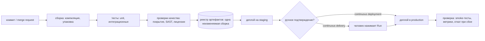
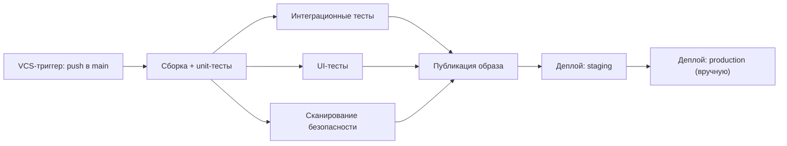
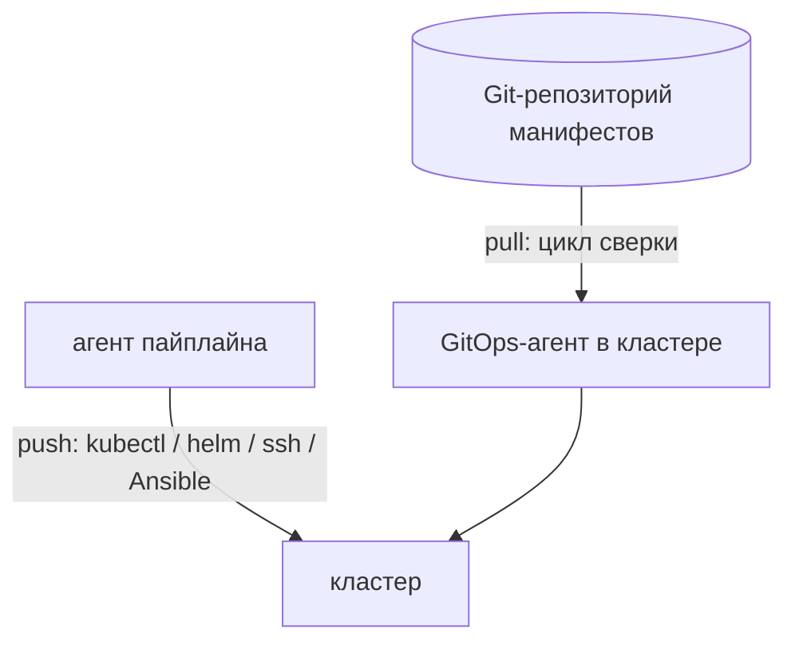

# Варианты процесса CI/CD

**CI/CD — это один автоматизированный путь от коммита до работающего софта.** Всё
остальное — вариации на тему того, где этот путь останавливается, что его
запускает, как он нарезан на части и как именно происходит последняя часть —
деплой.

За буквами стоят три разные идеи, и на собеседовании проверяют, что вы их не
путаете:

- **CI — continuous integration (непрерывная интеграция).** Все часто (как
  минимум раз в день) вливаются в общую ветку, и каждое слияние автоматически
  собирается и тестируется. Суть не в сервере, а в том, что конфликты интеграции
  находятся за минуты, а не в конце релиза.
- **CD — continuous delivery (непрерывная поставка).** Любая зелёная сборка
  *готова к развёртыванию*: она даёт версионированный артефакт, который уже
  прошёл проверки и подтверждён на staging. Человек решает, *когда* он уедет в
  production.
- **CD — continuous deployment (непрерывное развёртывание).** То же самое, но без
  человека. Зелёная сборка уезжает в production автоматически.

Continuous delivery и continuous deployment отличаются ровно одним: шагом
ручного подтверждения. Именно про это разницу спрашивают чаще всего.

Эти стадии есть в любом пайплайне — TeamCity, Jenkins, GitLab CI, GitHub Actions
или shell-скрипт, который кто-то написал в 2014 году. Варианты ниже — это выбор
*относительно* них.

## Ось 1 — до какого предела доведена автоматизация

Здесь есть лестница, и каждая ступень — реальная, вполне защитимая конфигурация:

1. Ночные или ручные сборки — CI нет вообще.
2. CI: каждый коммит собирается и тестируется.
3. CI плюс автоматический деплой на тестовое окружение.
4. Continuous delivery: деплой в production — в один клик.
5. Continuous deployment: деплой в production автоматический.

Большинство реальных команд находится посередине.
Подъём на ступень — вопрос *доверия*, а не инструментов: continuous deployment
ответственно применять только тогда, когда есть тесты, которым вы верите,
feature-флаги, чтобы прятать незаконченную работу, стратегии деплоя,
ограничивающие радиус поражения, мониторинг, который заметит плохой релиз, и
автоматический откат. Без этого «деплой на каждое слияние» означает лишь более
быструю доставку багов.

В регулируемых средах убрать человеческое подтверждение часто *невозможно* —
согласование изменения, требование разделения полномочий или плановое окно
обслуживания. Это законный вариант, а не провал: continuous delivery с
подтверждением, оставляющим след в аудите, — нормальный ответ для банков и
медицины.

## Ось 2 — что запускает прогон

- **VCS-триггер (push)** — коммит в отслеживаемую ветку. Вариант по умолчанию
  для CI.
- **Триггер на merge request (pull request)** — собирать *результат слияния*, а
  не вершину ветки, и публиковать статус обратно, чтобы кнопка слияния была
  заблокирована, пока сборка красная. Именно это придаёт смысл защищённой ветке.
- **Триггер на тег** — тег `v1.4.0` запускает релизный пайплайн. Частый вариант,
  когда релиз — это осознанное событие, а не следствие слияния.
- **Триггер по расписанию (cron)** — ночная полная регрессия, долгие нагрузочные
  прогоны, еженедельная пересборка образов, чтобы патчи CVE в базовом слое
  приезжали без изменения кода.
- **Ручной запуск** — человек запускает конфигурацию деплоя, обычно с
  параметрами (какая версия, какое окружение).
- **Триггер по зависимости (upstream)** — сборка стартует, потому что завершилась
  другая. Именно это превращает отдельные конфигурации в *цепочку*.
- **Внешнее событие** — webhook, новый артефакт в реестре, вызов API из другой
  системы.

Практическая деталь, которую стоит упомянуть, — **фильтры триггеров**. Не надо
гонять весь пайплайн из-за правки `README.md`, а в монорепозитории надо запускать
только те подпроекты, чьи пути изменились. В TeamCity это правила VCS-триггера, в
GitLab — `rules:changes`, в GitHub Actions — `paths:`.

## Ось 3 — форма пайплайна

Главный структурный выбор — **одна длинная сборка** против **цепочки маленьких**.

Одна конфигурация, которая компилирует, тестирует, упаковывает и деплоит, проста
и вполне годится для небольшого сервиса. Она перестаёт масштабироваться по трём
причинам: падение на 18-й минуте обесценивает предыдущие 17, ничего не идёт
параллельно, и нельзя перезапустить только деплой без пересборки.

**Цепочка сборок** разбивает работу на конфигурации, которые зависят друг от
друга, расходятся в параллельные стадии и снова сходятся:

Именно это моделирует **TeamCity**, и для этого у него есть два разных вида
зависимостей — различие между ними любят спрашивать:

- **Snapshot-зависимость** говорит: «запусти меня только после той сборки и на
  *той же* ревизии VCS». Она задаёт порядок и прикрепляет всю цепочку к одному
  коммиту, поэтому тесты, образ и деплой описывают один и тот же исходный код.
- **Artifact-зависимость** говорит: «дай мне файлы, которые произвела та
  сборка», — jar, тег образа, отчёт. Так конфигурация деплоя получает артефакт
  вместо того, чтобы пересобирать его.

Вместе они дают главное свойство: **собрать один раз, продвигать много раз.** Те
же байты, тот же digest едут со staging в production; меняется только
конфигурация, подставляемая в рантайме (см. [что важнее: properties или
переменные окружения](topic:spring-config-property-precedence)). Если стадия
production пересобирает из исходников, в production работают байты, которые никто
не тестировал, и снова включаются все источники недетерминированности сборки —
это одна из классических причин, почему [что-то проходит тесты и ломается в
production](topic:endpoint-broken-in-prod).

Другие решения о топологии:

- **Расхождение ради скорости.** Разложить 30-минутный набор тестов по
  параллельным агентам, гонять unit / интеграционные / UI / статический анализ
  одновременно. Длительность пайплайна — самый длинный путь, а не сумма.
- **Матричные сборки.** Одна и та же работа на JDK 17 / 21, на нескольких ОС, на
  нескольких версиях базы. Дешёвое покрытие для библиотек и излишество для
  сервиса, который работает ровно на одном рантайме.
- **Сначала быстро, потом глубоко.** Компиляция и unit-тесты в первые две минуты;
  медленные интеграционные, нагрузочные и security-стадии — после. Разработчик
  получает вердикт, пока не переключил контекст.
- **Монорепозиторий против репозитория на сервис.** Один пайплайн с определением
  изменений и графом сборки — или N независимых пайплайнов. Это решение вытекает
  из [границ ваших модулей](topic:modular-architecture-options) и из того,
  [делитесь ли вы на сервисы](topic:why-microservices) вообще.

## Ось 4 — модель ветвления, которую обслуживает пайплайн

Форма пайплайна вторична по отношению к тому, как вы ветвитесь:

- **Trunk-based development.** Короткоживущие ветки, ежедневно вливаемые в
  `main`, каждое слияние потенциально релизно, незаконченная работа спрятана за
  feature-флагами. Именно эта модель нужна continuous deployment, потому что
  «релиз» и «слияние» перестают быть разными событиями.
- **GitHub flow / модель через PR.** Ветка, PR, зелёные проверки, слияние, деплой
  `main`. Массовый компромисс.
- **GitFlow с релизными ветками.** `develop`, `release/*`, `hotfix/*`. Пайплайн
  обрастает поведением на ветку: `develop` едет на тестовое окружение, `release/*`
  на staging, тег — в production. Подходит для плановых версионированных релизов
  и коробочных продуктов; конфликтует с continuous deployment, потому что
  долгоживущая ветка — это по определению отложенная интеграция.
- **Ветки-окружения** (`main` → dev, ветка `staging`, ветка `production`). Внешне
  аккуратно и надёжно порождает расхождение при слияниях — модель продвижения
  артефакта существует как раз ей на замену.

## Ось 5 — как выполняется деплой: push или pull

- **Push (ведёт пайплайн).** Последняя стадия пайплайна держит учётные данные
  production и сама применяет изменение — `helm upgrade`, `kubectl apply`,
  Ansible, `scp` и перезапуск сервиса или вызов API платформы. Просто, сразу — и
  CI-сервер становится ценной целью с правом записи в production.
- **Pull (GitOps).** Последний шаг пайплайна только коммитит новый тег образа в
  репозиторий манифестов. Агент внутри кластера (Argo CD, Flux) следит за этим
  репозиторием и приводит реальность в соответствие с ним. Желаемое состояние
  лежит в Git — оно аудируемо, откатывается через `git revert` и само чинит
  ручные отклонения. CI вообще не нужны доступы в кластер. Плата — ещё одна
  движущаяся часть и лишний уровень косвенности, когда вы разбираетесь, почему
  деплой «не произошёл».

Push по-прежнему норма для виртуальных машин и не-Kubernetes целей; pull —
вариант по умолчанию для хозяйств на [Kubernetes](topic:why-kubernetes).

## Ось 6 — как новая версия доезжает до пользователей

Стратегия деплоя — отдельная ось от структуры пайплайна: любую из них можно
запускать из любого инструмента.

- **Recreate** — остановить старое, запустить новое. Есть простой, зато предельно
  просто, а иногда это единственный вариант, если версии не могут сосуществовать.
- **Rolling update** — заменять экземпляры по несколько за раз. Вариант по
  умолчанию в Kubernetes. Требует, чтобы две версии работали одновременно, — и
  поэтому миграции базы должны быть обратно совместимыми (expand → migrate →
  contract).
- **Blue-green** — два полноценных окружения; развернуть на простаивающее,
  прогнать smoke-тесты, переключить балансировщик. Откат — это переключение
  обратно, то есть он такой же быстрый, как деплой. Платите двойной ёмкостью на
  время переключения.
- **Canary** — направить 1 %, потом 10 %, потом 100 % трафика, наблюдая между
  шагами за долей ошибок и задержками и автоматически откатываясь при регрессии.
  Самый безопасный и самый требовательный: нужны метрики в разрезе версий и
  настоящее разделение трафика.
- **Feature-флаги / dark launch** — выкатить код выключенным и включить его для
  части пользователей позже. Это отделяет *деплой* от *релиза* — то, что
  позволяет trunk-based командам безопасно вливать незаконченную работу.

## Ось 7 — где выполняется пайплайн

- **Собственные агенты** (агенты TeamCity, ноды Jenkins, раннеры GitLab) — нужны
  для доступа во внутреннюю сеть, к лицензируемым инструментам или к особому
  железу. Долгоживущие агенты накапливают состояние — отсюда берётся «падает
  только на агенте 3»; пулы агентов и требования сборки направляют её на нужные.
- **Эфемерные / контейнерные агенты** — свежий контейнер или ВМ на каждую сборку.
  Воспроизводимо, без остатков состояния и взаимного влияния сборок; старт
  медленнее, и все инструменты должны быть в образе.
- **Управляемые облачные раннеры** — своей инфраструктуры нет, оплата по минутам,
  обычно самый быстрый способ начать. Следите за исходящим трафиком, обращением с
  секретами и местом хранения данных.
- **Docker внутри сборки.** Чтобы собрать [образ из приложения на Spring
  Boot](topic:spring-boot-docker-image) на агенте, нужен либо демон Docker, либо
  сборщик без демона (Jib, Kaniko, rootless BuildKit), если демон агенту не
  положен.

Чем бы ни выполнялась сборка, артефакт должен получаться из чистого checkout на
агенте — что именно означает «заслуживающая доверия сборка», подробно разобрано в
теме [способы сборки приложения](topic:application-build-options).

## Само описание пайплайна

- **Пайплайн как код** — `.gitlab-ci.yml`, `Jenkinsfile`, workflow-файлы GitHub
  Actions или **Kotlin DSL** TeamCity в репозитории. Описание версионируется
  вместе с кодом, проходит ревью, и ветки несут собственные изменения пайплайна.
- **Настройка через UI** — конфигурации сборки TeamCity, редактируемые в
  веб-интерфейсе, freestyle-задания Jenkins. Быстро начать и удобно изучать, но
  история «кто изменил шаг деплоя» живёт вне вашего репозитория.
- **Шаблоны и общие библиотеки** — шаблоны и мета-раннеры TeamCity, shared
  libraries в Jenkins, `include:` и `extends:` в GitLab, переиспользуемые Actions.
  На двадцати сервисах вы сопровождаете один шаблон пайплайна, а не двадцать
  пайплайнов.

Большинство реальных установок гибридны: UI — чтобы попробовать, DSL в
репозитории — для всего, что имеет значение.

## Проверки, секреты и откат

- **Проверки качества** — тесты, пороги покрытия, статический анализ (SonarQube),
  сканирование зависимостей и образов на CVE, проверка лицензий, генерация SBOM.
  Проверка, которую все научились обходить, — уже не проверка; связанные риски —
  это то, что перечислено в [Top 10 OWASP](topic:owasp-top-ten).
- **Подтверждения** — защищённые окружения, обязательные ревьюеры, окна деплоя.
  Сохраняйте след аудита (кто подтвердил, какую сборку, какой коммит) — в
  регулируемой компании именно это и делает CI/CD аудируемым.
- **Секреты** — никогда в репозитории и никогда в логах сборки. Менеджер секретов
  (Vault, облачный KMS) или собственные зашифрованные параметры CI, подставляемые
  в рантайме, маскируемые в выводе и ограниченные так, чтобы ветка с фичей не
  могла прочитать учётные данные production.
- **Откат** — развернуть предыдущую версию артефакта (быстро, скучно, правильно)
  или сделать `git revert` в GitOps-репозитории. Катиться *вперёд* стоит, только
  когда исправление тривиально и протестировано. Про что забывают — про базу
  данных: миграцию, удалившую колонку, нельзя откатить возвратом старого jar,
  поэтому и важны миграции по схеме expand/contract.
- **Проверка после деплоя** — smoke-тесты, health-проверки и наблюдение за долей
  ошибок и задержками в течение нескольких минут. Пайплайн, который рапортует об
  успехе в момент возврата `kubectl apply`, не проверил ничего.

## Ответ на собеседовании за 60 секунд

> CI/CD — это один автоматизированный путь от коммита до production, а варианты
> — это выбор по нескольким осям. Первая: до какого предела он доведён. Только CI
> собирает и тестирует каждое слияние; continuous delivery делает любую зелёную
> сборку готовой к развёртыванию с ручным подтверждением перед production;
> continuous deployment это подтверждение убирает. Вторая: что его запускает —
> push, merge request, тег, расписание, ручной запуск или завершившаяся
> вышестоящая сборка. Третья: форма — одна длинная сборка или цепочка маленьких,
> которая расходится в параллельные тесты и снова сходится; в TeamCity это build
> chain, где snapshot-зависимость прикрепляет всю цепочку к одной ревизии, а
> artifact-зависимость передаёт дальше jar или образ, так что деплой продвигает
> артефакт, а не пересобирает его. Четвёртая: как выполняется деплой — пайплайн
> сам push-ит через Helm или kubectl, либо GitOps, где Argo CD забирает желаемое
> состояние из Git. И пятая: как версия доезжает до пользователей — recreate,
> rolling, blue-green или canary, обычно вместе с feature-флагами, чтобы деплой и
> релиз были разными событиями. Каким бы ни был вариант, мне нужны две вещи:
> артефакт собирается один раз и продвигается по всем окружениям по digest, а
> пайплайн описан кодом в репозитории.

## Почему это важно в production

- **Lead time — бизнес-показатель.** Промежуток между слиянием и работой в
  production определяет, как быстро исправление доедет до клиента. Каждый ручной
  шаг на этом пути — измеримая задержка.
- **Маленькие порции безопаснее.** Десять изменений, выкаченных вместе, — это
  десять подозреваемых во время инцидента. Главный аргумент в пользу continuous
  deployment именно такой: в каждом релизе одно изменение.
- **Пайплайн — это production-система.** Когда он лежит, никто не может выкатить
  хотфикс. Ему нужны резервные копии конфигурации, запасные агенты и владелец.
- **Он же — поверхность атаки.** В нём лежат учётные данные, и он пишет то, что
  работает в production; скомпрометированный агент компрометирует все сервисы,
  которые он деплоит. Ограничивайте секреты по окружениям, изолируйте агентов,
  подписывайте артефакты.
- **Скорость отката важнее изящества деплоя.** Реальный вопрос во время инцидента
  — «как быстро мы вернёмся на предыдущую версию»; ради этого продвижение
  артефакта и blue-green и стоят своих денег.

## Частые заблуждения

- **«CI/CD — это инструмент».** Это практика. Сервер TeamCity, который по ночам
  собирает ветку, куда никто не вливается, — не непрерывная интеграция; а
  команда, ежедневно вливающаяся в trunk с проверкой на зелёную сборку, — да,
  даже на скромных инструментах.
- **«Continuous delivery и continuous deployment — одно и то же».** Они
  отличаются ручным подтверждением перед production. Говорите, какое из двух вы
  имеете в виду.
- **«Continuous deployment означает, что не тестируют».** Наоборот: он возможен
  именно *потому*, что автоматическим проверкам доверяют. Убрать человека — значит
  потребовать, чтобы машина была права.
- **«CI просто прогоняет тесты».** CI производит артефакт, который вы поставляете.
  Если кто угодно может собрать jar локально и задеплоить его, пайплайн —
  декорация.
- **«Пересоберём под каждое окружение, чтобы конфигурация была правильной».**
  Тогда в каждом окружении работают разные байты. Собирайте один раз, а
  конфигурацию подставляйте в рантайме.
- **«Цепочка сборок — это те же стадии в скрипте».** Смысл цепочки — в
  независимом перезапуске, переиспользовании артефактов и параллельности.
  Перезапустить только упавший деплой на ровно том артефакте, который тестировали,
  — в этом вся выгода.
- **«Зелёный пайплайн значит, что релиз в порядке».** Он значит лишь то, что
  команда развёртывания выполнилась без ошибки. Без smoke-тестов и метрик после
  деплоя пайплайн отчитывается сам о себе.
- **«Задеплоить — значит выпустить».** С feature-флагами это разные вещи: код
  может лежать в production неделями, прежде чем его для кого-то включат.
- **«У нас GitOps — у нас YAML в Git».** GitOps — это агент сверки, который
  непрерывно приводит систему к этому состоянию, а не пайплайн, делающий `kubectl
  apply` из файла, который случайно закоммичен.
- **«Откат = развернуть старую версию».** Только для кода без состояния. Миграции
  базы, форматы сообщений и закешированные данные должны быть обратно
  совместимыми, иначе старая версия просто не запустится.
- **«Чем длиннее пайплайн, тем он безопаснее».** Медленный пайплайн начинают
  обходить, а его обратная связь приходит, когда разработчик уже занят другим.
  Сначала быстро, глубоко — потом.
