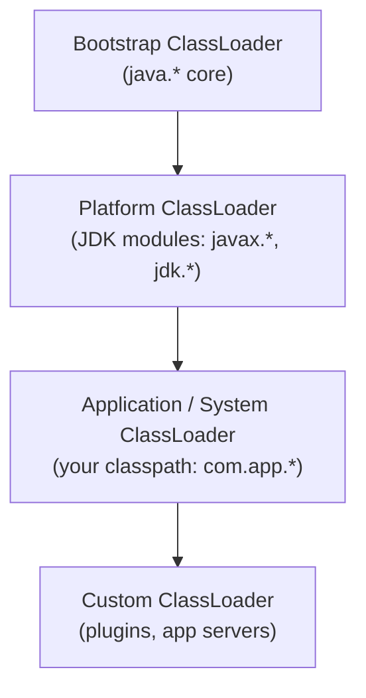
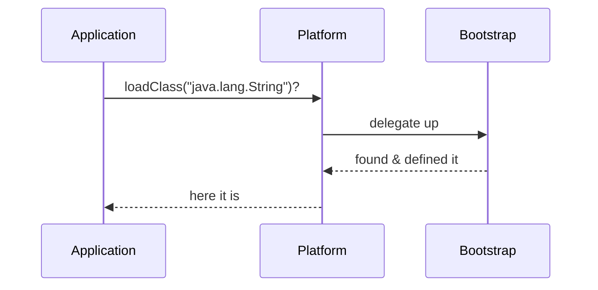
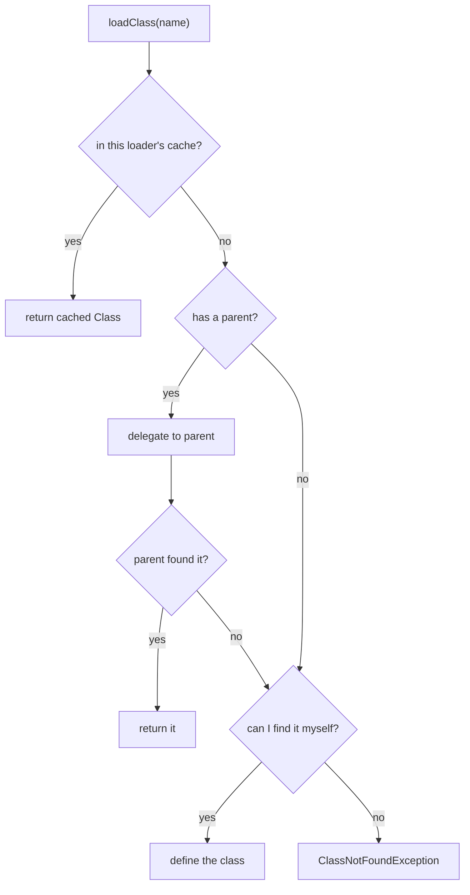

# ClassLoaders and Their Types

## The intuition

A `ClassLoader` is the part of the JVM that **finds a class's bytes and turns
them into a `Class` object** the runtime can use. Java doesn't load every class
when the program starts — it loads each class lazily, the first time it is
actually needed, and a `ClassLoader` is what does the fetching.

> **Real-world analogy.** Think of a big company's records office. When someone
> needs a document (a class), they don't keep a personal copy of every file —
> they send a request to the office, which locates the document and hands back an
> official, ready-to-use copy. The `ClassLoader` is that records office for
> classes.

## The built-in hierarchy

A running JVM has three built-in loaders arranged as a chain of parents:

- **Bootstrap** loads the core JDK (`java.lang`, `java.util`, …). It is written
  in native code and is the root — it has no parent (it shows up as `null`).
- **Platform** (called the *Extension* loader before Java 9) loads the rest of
  the JDK modules.
- **Application / System** loads your own classes from the application classpath.
- **Custom** loaders are ones you (or a framework) write; they sit below.

> **Real-world analogy.** It's an organisation chart. The Bootstrap loader is the
> top executive who owns company-wide matters, the Platform loader is a
> department head, and the Application loader is your team lead who handles your
> project's files. A custom loader is a contractor hired for one special project.

## The parent-delegation model

This is the heart of the topic. When a loader is asked to load a class, it does
**not** try to load it itself first. It:

1. checks its own **cache** — has it already loaded this class? If so, return it.
2. otherwise **delegates to its parent** and lets the parent try first.
3. only if no ancestor can find the class does the loader try to define it itself.
4. if nobody can find it, the chain throws `ClassNotFoundException`.

> **Real-world analogy.** It's "ask your manager first." Before you handle a
> request yourself, you pass it up the chain of command; the most senior person
> who actually owns that matter deals with it. Only if nobody above you owns it
> do you handle it yourself.

Why design it this way? **Safety and consistency.** Because core classes always
come from the Bootstrap loader, no one can sneak in a fake `java.lang.String`
from the application classpath and have it shadow the real one — the parent
always wins the race to define it.

> **Real-world analogy.** No matter who walks in with a "company policy"
> document, the official one always comes from head office. A forged copy handed
> in at the front desk never gets used, because the request is sent upstairs
> first.

Here is the full decision a loader makes:

## Loaded once, then cached

Each loader remembers every class it has defined, so a class is **loaded only
once per loader**. The second request for the same class is served straight from
the cache — no file is read again. This is also why class loading is the natural
place for lazy, one-time work.

> **Real-world analogy.** Once the records office has pulled a file, it keeps a
> copy on the front desk. The next person asking for that same file gets it
> instantly instead of waiting for another trip to the archive.

## Class identity depends on the loader

A subtle but classic interview point: a class's runtime identity is
**(fully-qualified name + the loader that loaded it)**. The *same* `.class` file
loaded by two *different* loaders produces two *different* `Class` objects that
are **not** assignment-compatible — a cast between them throws
`ClassCastException`. This is exactly what lets app servers run two web apps with
different versions of the same library in isolation.

> **Real-world analogy.** Two departments can each keep their own copy of a form
> with the same title. They look identical, but a copy stamped by Department A is
> not interchangeable with one stamped by Department B — each is valid only
> within its own department.

This relates to where the loaded class metadata lives — see
[How Java Memory Is Organized: Stack vs Heap](topic:jvm-memory-areas) and
[JVM Heap Generations](topic:heap-generations).

## When you write a custom loader

You rarely need one, but the classic cases are: application servers (isolating
each deployed app), plugin systems and hot-reload, loading classes from an
unusual source (network, database, encrypted jar), or generating bytecode at
runtime. A custom loader still delegates to its parent first — it only takes over
for the classes the standard loaders can't or shouldn't load.

> **Real-world analogy.** A specialist contractor is brought in only for the work
> the regular staff can't do — and even then, they still respect the company's
> chain of command for everything else.

## The 60-second interview answer

A `ClassLoader` finds a class's bytes and defines the `Class` object lazily, on
first use. The JVM has three built-in loaders forming a parent chain: Bootstrap
(core `java.*`), Platform (the rest of the JDK), and Application (your
classpath); custom loaders sit below. They follow the **parent-delegation
model**: a loader first checks its own cache, then asks its parent, and only
defines the class itself if no ancestor could. This guarantees core classes
always come from Bootstrap (you can't spoof `java.lang.String`) and that each
class is loaded once per loader. A class's identity is its name **plus** its
loader, so the same bytes loaded by two loaders are two incompatible types — the
basis for isolation in app servers. If nobody can find the class you get
`ClassNotFoundException`.

## Common traps and misconceptions

- **"The child tries first."** No — the **parent** gets the first chance. The
  child only defines a class its ancestors couldn't.
- **"Bootstrap has a parent."** It is the root; its parent is `null`. Calling
  `String.class.getClassLoader()` returns `null` for that reason, not an error.
- **Confusing `ClassNotFoundException` with `NoClassDefFoundError`.** The former
  is a checked exception from explicit loading (e.g. `Class.forName`) when the
  class can't be found; the latter is an `Error` thrown when a class that was
  present at compile time is missing at runtime, or its static initializer
  previously failed. See [Exceptions in Java and Their Types](topic:exception-basics).
- **"Extension ClassLoader."** That name is pre-Java 9; since Java 9 it is the
  **Platform** ClassLoader (the module system replaced the old `ext` mechanism).
- **Loading ≠ initialization.** Loading defines the class; static initializers
  run later, on first active use. See [static in Java](topic:java-static-keyword).
- **"A class is global."** It is unique only *per loader*. Two loaders give you
  two distinct classes with the same name.
