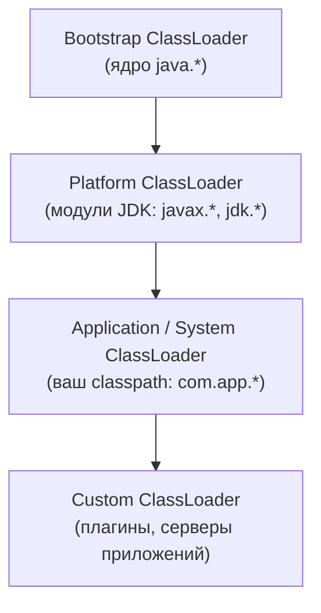
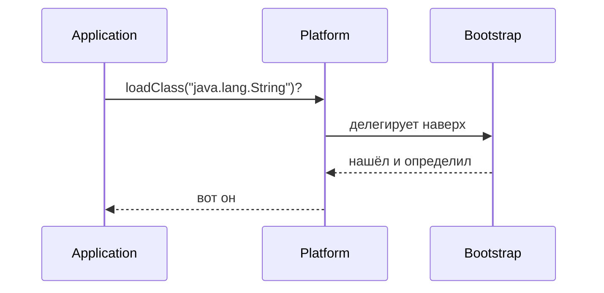
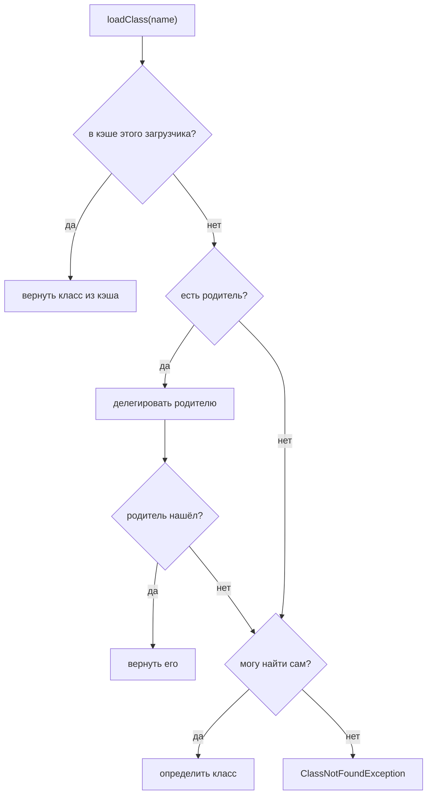

# ClassLoader и их виды

## Интуиция

`ClassLoader` — это часть JVM, которая **находит байты класса и превращает их в
объект `Class`**, пригодный для использования в рантайме. Java не загружает все
классы при старте программы — каждый класс грузится лениво, при первом реальном
обращении к нему, и именно `ClassLoader` выполняет эту загрузку.

> **Аналогия из жизни.** Представьте архив большой компании. Когда кому-то нужен
> документ (класс), он не хранит личную копию каждого файла — он отправляет запрос
> в архив, тот находит документ и выдаёт официальную, готовую к работе копию.
> `ClassLoader` — это и есть такой архив для классов.

## Встроенная иерархия

В работающей JVM есть три встроенных загрузчика, выстроенных в цепочку
родителей:

- **Bootstrap** грузит ядро JDK (`java.lang`, `java.util`, …). Он написан на
  нативном коде и является корнем — у него нет родителя (он виден как `null`).
- **Platform** (до Java 9 назывался *Extension*) грузит остальные модули JDK.
- **Application / System** грузит ваши собственные классы из classpath
  приложения.
- **Custom** — загрузчики, которые пишете вы (или фреймворк); они находятся ниже.

> **Аналогия из жизни.** Это оргструктура компании. Bootstrap — топ-руководитель,
> отвечающий за общекорпоративные вопросы; Platform — начальник отдела; а
> Application — ваш тимлид, который ведёт файлы вашего проекта. Custom-загрузчик —
> подрядчик, нанятый под один особый проект.

## Модель делегирования родителю

Это сердце темы. Когда загрузчика просят загрузить класс, он **не** пытается
загрузить его сам в первую очередь. Он:

1. проверяет свой **кэш** — не загружал ли он уже этот класс? Если да — возвращает его.
2. иначе **делегирует родителю** и даёт родителю попробовать первым.
3. только если ни один предок не нашёл класс, загрузчик пытается определить его сам.
4. если класс не нашёл никто — цепочка выбрасывает `ClassNotFoundException`.

> **Аналогия из жизни.** Это принцип «сначала спроси у руководителя». Прежде чем
> заняться запросом самому, вы передаёте его вверх по цепочке подчинения; решает
> самый старший, кто действительно отвечает за этот вопрос. И только если над вами
> за это никто не отвечает, вы делаете это сами.

Зачем так сделано? **Безопасность и согласованность.** Поскольку базовые классы
всегда приходят от Bootstrap, никто не сможет подсунуть поддельный
`java.lang.String` из classpath приложения и заслонить им настоящий — родитель
всегда выигрывает гонку за определение класса.

> **Аналогия из жизни.** Кто бы ни принёс документ с «политикой компании»,
> официальный всегда приходит из головного офиса. Поддельную копию, сданную на
> ресепшен, никогда не используют, потому что запрос сначала уходит наверх.

Вот полное решение, которое принимает загрузчик:

## Загружается один раз, потом кэш

Каждый загрузчик запоминает все определённые им классы, поэтому класс
**загружается только один раз на загрузчик**. Второй запрос того же класса
обслуживается прямо из кэша — файл больше не читается. Поэтому загрузка класса —
естественное место для ленивой, однократной работы.

> **Аналогия из жизни.** Однажды достав файл из архива, офис оставляет копию на
> стойке. Следующий, кто попросит тот же файл, получит его мгновенно, а не будет
> ждать новой ходки в хранилище.

## Идентичность класса зависит от загрузчика

Тонкий, но классический вопрос на собеседовании: идентичность класса в рантайме —
это **(полное имя + загрузчик, который его загрузил)**. *Один и тот же* `.class`,
загруженный *двумя разными* загрузчиками, даёт *два разных* объекта `Class`,
которые **несовместимы** по присваиванию — приведение между ними бросит
`ClassCastException`. Именно это позволяет серверам приложений запускать два
веб-приложения с разными версиями одной библиотеки в изоляции.

> **Аналогия из жизни.** Два отдела могут держать собственную копию бланка с
> одинаковым названием. Они выглядят идентично, но копия с печатью отдела A не
> взаимозаменяема с копией отдела B — каждая действительна только внутри своего
> отдела.

Это связано с тем, где живут метаданные загруженного класса — см.
[Как устроена память в Java: стек и куча](topic:jvm-memory-areas) и
[Поколения кучи JVM](topic:heap-generations).

## Когда писать собственный загрузчик

Он нужен редко, но классические случаи такие: серверы приложений (изоляция
каждого развёрнутого приложения), системы плагинов и горячая перезагрузка,
загрузка классов из необычного источника (сеть, БД, зашифрованный jar) или
генерация байт-кода в рантайме. Пользовательский загрузчик всё равно сначала
делегирует родителю — он берёт на себя только те классы, которые стандартные
загрузчики не могут или не должны грузить.

> **Аналогия из жизни.** Специалиста-подрядчика зовут только под работу, которую
> не может сделать штатный персонал — и даже тогда во всём остальном он соблюдает
> корпоративную цепочку подчинения.

## Ответ за 60 секунд

`ClassLoader` находит байты класса и определяет объект `Class` лениво, при первом
обращении. В JVM есть три встроенных загрузчика, образующих цепочку родителей:
Bootstrap (ядро `java.*`), Platform (остальной JDK) и Application (ваш classpath);
пользовательские загрузчики находятся ниже. Они следуют **модели делегирования
родителю**: загрузчик сначала проверяет свой кэш, затем спрашивает родителя и
определяет класс сам, только если этого не смог ни один предок. Это гарантирует,
что базовые классы всегда приходят от Bootstrap (нельзя подменить
`java.lang.String`) и что класс грузится один раз на загрузчик. Идентичность
класса — это его имя **плюс** загрузчик, поэтому одни и те же байты, загруженные
двумя загрузчиками, — это два несовместимых типа; на этом строится изоляция в
серверах приложений. Если класс не находит никто — вы получаете
`ClassNotFoundException`.

## Частые ошибки и заблуждения

- **«Сначала пробует потомок».** Нет — первый шанс получает **родитель**.
  Потомок определяет только тот класс, который не смогли его предки.
- **«У Bootstrap есть родитель».** Он корень; его родитель — `null`. Поэтому
  `String.class.getClassLoader()` возвращает `null`, а не ошибку.
- **Путаница `ClassNotFoundException` и `NoClassDefFoundError`.** Первое —
  проверяемое исключение при явной загрузке (например, `Class.forName`), когда
  класс не найден; второе — `Error`, который бросается, когда класс был при
  компиляции, но отсутствует в рантайме, или когда его статический инициализатор
  ранее упал. См. [Исключения в Java и их виды](topic:exception-basics).
- **«Extension ClassLoader».** Это имя из эпохи до Java 9; начиная с Java 9 это
  **Platform** ClassLoader (модульная система заменила старый механизм `ext`).
- **Загрузка ≠ инициализация.** Загрузка определяет класс; статические
  инициализаторы выполняются позже, при первом активном использовании. См.
  [static в Java](topic:java-static-keyword).
- **«Класс глобален».** Он уникален только *в пределах загрузчика*. Два
  загрузчика дают два разных класса с одинаковым именем.
