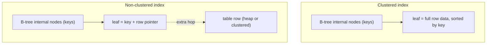
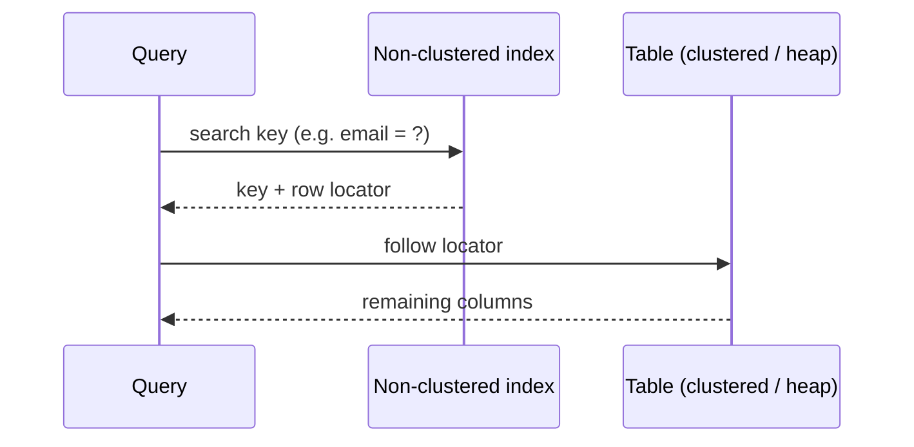

# Clustered vs Non-Clustered Indexes

## Intuition

Both are search structures built on top of a table (start from [Database Indexes](topic:database-indexes) for the basics), but they differ in **where the actual row data lives**. A clustered index *is* the table: the rows are physically stored, sorted by the index key, in the leaves of the index itself. A non-clustered index is a separate, smaller structure that stores the key in sorted order plus a pointer back to where the row really sits.

Think of two ways a library can be organized. A clustered index is like shelving the books themselves in call-number order: once you walk to the right shelf, the book is right there. A non-clustered index is like the alphabetical card catalog: the cards are sorted, but each card only gives you a shelf location, so you still have to walk over to fetch the actual book.

Because rows can be laid out in only one physical order, a table has **at most one clustered index**. But you can build **many non-clustered indexes**, each sorting a different column or set of columns, the way one warehouse of boxes can have several separate sorted catalogs: one by product name, one by supplier, one by date.

## How Each Lookup Works

A clustered index lookup walks the tree by key and arrives directly at the row data in the leaf - one trip, no detour. Searching `WHERE id = 42` on a clustered primary key lands you on the whole row. This is like a parcel locker numbered in order: locker 42 *contains* the parcel, so reaching the locker is the whole job.

A non-clustered lookup walks its own tree to the matching leaf, which holds the key and a **row locator**, and then follows that locator to fetch the rest of the columns from the table. That second step is the classic "key lookup" (or "bookmark lookup"). It is like the card catalog again: the card is fast to find, but answering "what is on page 3 of that book?" means a second walk to the shelf.

The row locator depends on the engine. In MySQL's InnoDB the secondary (non-clustered) index stores the **primary key value** as the pointer, so the second hop is itself a search through the clustered index. In SQL Server, if the table has a clustered index the locator is the clustered key; if the table is a heap (no clustered index) the locator is a physical row id. PostgreSQL stores every table as a heap and all its indexes are effectively non-clustered, pointing at a physical tuple id (ctid).

## Covering Indexes Skip the Second Hop

The extra hop of a non-clustered index disappears when the index already contains every column the query needs - a **covering index**. Then the engine answers from the index leaf alone and never touches the table. Adding extra columns purely to cover a query is often done with an `INCLUDE` clause. This is like a delivery slip that already lists shelf, recipient, and weight: the clerk answers without opening the box. (For the general idea of covering indexes and selectivity, see [Database Indexes](topic:database-indexes).)

## When to Use Which

A clustered index shines for range scans and ordered reads on its key, because matching rows are physically next to each other - reading `created_at BETWEEN ? AND ?` on a clustered `created_at` is a sequential sweep, like reading consecutive house numbers down one side of a street. Most engines make the **primary key** the clustered index by default, which makes primary-key lookups and joins on it very cheap.

Non-clustered indexes are how you make *other* columns searchable without reordering the table. You add them for the columns your queries actually filter, join, or sort on - email, status, foreign keys - accepting that each one costs storage and slows writes, because every `INSERT`/`UPDATE`/`DELETE` must maintain the table plus each affected index. It is like keeping several sorted catalogs in the warehouse: handy for lookups, but every new box must be recorded in all of them.

## 60-second Interview Answer

A clustered index determines the physical storage order of the table rows: the row data lives in the leaf level of the index, sorted by the clustered key. Because data can be ordered only one way, there is at most one clustered index per table - usually the primary key. A clustered lookup reaches the full row in a single tree walk, and range scans on the clustered key are fast because matching rows are stored adjacently.

A non-clustered index is a separate sorted structure holding the indexed key plus a pointer (row locator) back to the row. A table can have many of them. A non-clustered lookup finds the key quickly but usually needs a second hop to fetch the remaining columns - unless the index is covering, meaning it already contains every column the query needs. Engines differ: InnoDB stores the primary key as the secondary-index pointer, while PostgreSQL keeps tables as heaps so all its indexes behave like non-clustered ones.

## Production Relevance

Choosing the clustered key is a high-impact decision because it dictates physical layout. A monotonically increasing key (an auto-increment id) appends new rows at the end, like adding the next numbered locker in a row; a random key (a UUID) scatters inserts across the structure, causing page splits and fragmentation, like forcing a new box into the middle of an already-packed shelf. This is why teams often prefer sequential clustered keys for write-heavy tables.

Understanding the second hop explains real plans: if a query is slow because of millions of key lookups, the fix is often a covering index so the engine stays inside the index. Indexes also interact with transaction visibility - an index entry only points to *candidate* rows, and the engine still checks each version against the transaction's snapshot ([MVCC](topic:mvcc), [PostgreSQL isolation levels](topic:postgresql-isolation-levels)). And the uniqueness of a clustered primary key supports the consistency guarantee of [ACID](topic:acid-principles).

## Common Misconceptions

- "A clustered index is just a faster non-clustered index." No - it changes *where the data lives*. The clustered index leaf is the table; a non-clustered leaf only points at the table. They are different kinds of structure, like shelving the books themselves versus keeping a card catalog.
- "Every table has a clustered index." Not necessarily. SQL Server allows heap tables, and PostgreSQL stores all tables as heaps with only non-clustered indexes; the one-time `CLUSTER` command reorders a Postgres table but does not keep it ordered.
- "You can have several clustered indexes." Only one, because rows have a single physical order. You can have many non-clustered indexes.
- "A non-clustered index always avoids reading the table." Only when it is covering. Otherwise each match triggers a key lookup back to the row, which can be costly at scale.
- "The clustered key choice doesn't matter." It strongly affects insert performance and fragmentation: sequential keys append cleanly, random keys cause page splits.
- "Database indexes are basically a [HashMap](topic:hashmap)." Hash structures find one key fast but cannot do ordered range scans; clustered and non-clustered indexes are usually B-trees precisely so ranges and `ORDER BY` work.
