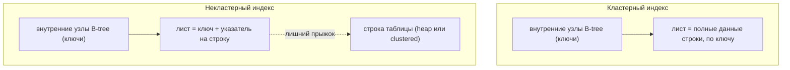
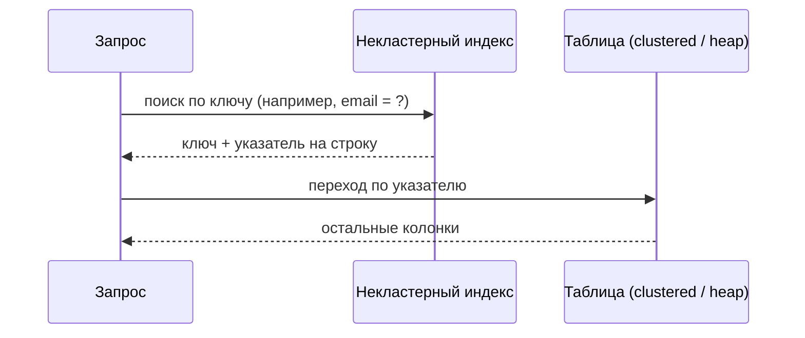

# Кластерные и некластерные индексы

## Интуиция

Оба - это структуры поиска поверх таблицы (основы смотри в [Индексы в базе данных](topic:database-indexes)), но они отличаются тем, **где лежат сами данные строки**. Кластерный индекс *и есть* таблица: строки физически хранятся, отсортированные по ключу индекса, прямо в листьях самого индекса. Некластерный индекс - это отдельная, меньшая структура, которая хранит ключ в отсортированном порядке плюс указатель на то, где строка лежит на самом деле.

Представь два способа организовать библиотеку. Кластерный индекс - это как расставить сами книги по порядку шифров: дошёл до нужной полки - и книга прямо тут. Некластерный индекс - это как алфавитный карточный каталог: карточки отсортированы, но каждая карточка лишь даёт расположение полки, поэтому за самой книгой всё равно нужно идти.

Поскольку строки могут быть выложены только в одном физическом порядке, у таблицы есть **не более одного кластерного индекса**. Зато можно построить **много некластерных индексов**, каждый сортирует свою колонку или набор колонок, как один склад коробок может иметь несколько отдельных отсортированных каталогов: один по названию товара, один по поставщику, один по дате.

## Как работает каждый поиск

Поиск по кластерному индексу спускается по дереву по ключу и попадает прямо на данные строки в листе - одна поездка, без объезда. Поиск `WHERE id = 42` по кластерному первичному ключу сразу даёт всю строку. Это как ячейки для посылок, пронумерованные по порядку: ячейка 42 *содержит* посылку, поэтому дойти до ячейки - и есть вся работа.

Некластерный поиск спускается по своему дереву к подходящему листу, который хранит ключ и **указатель на строку** (row locator), а затем следует за этим указателем, чтобы прочитать остальные колонки из таблицы. Этот второй шаг - классический "key lookup" (или "bookmark lookup"). Это снова карточный каталог: карточку найти быстро, но ответить "что на странице 3 этой книги?" - значит сходить к полке второй раз.

Указатель на строку зависит от движка. В InnoDB у MySQL вторичный (некластерный) индекс хранит **значение первичного ключа** как указатель, поэтому второй прыжок сам по себе является поиском по кластерному индексу. В SQL Server, если у таблицы есть кластерный индекс, указатель - это кластерный ключ; если таблица - heap (без кластерного индекса), указатель - это физический row id. PostgreSQL хранит каждую таблицу как heap, и все его индексы фактически некластерные, указывая на физический id кортежа (ctid).

## Covering index пропускает второй прыжок

Лишний прыжок некластерного индекса исчезает, когда индекс уже содержит все колонки, нужные запросу - это **covering index**. Тогда движок отвечает только по листу индекса и вообще не трогает таблицу. Добавление дополнительных колонок исключительно ради покрытия запроса часто делают через `INCLUDE`. Это как квитанция на доставку, где уже указаны полка, получатель и вес: сотрудник отвечает, не открывая коробку. (Об общей идее covering index и селективности смотри [Индексы в базе данных](topic:database-indexes).)

## Когда что использовать

Кластерный индекс силён для диапазонных сканирований и упорядоченного чтения по своему ключу, потому что подходящие строки физически лежат рядом - чтение `created_at BETWEEN ? AND ?` по кластерному `created_at` - это последовательный проход, как чтение подряд идущих номеров домов по одной стороне улицы. Большинство движков по умолчанию делают кластерным индексом **первичный ключ**, что делает поиск по первичному ключу и join по нему очень дешёвыми.

Некластерные индексы - это способ сделать *другие* колонки доступными для поиска, не переупорядочивая таблицу. Их добавляют под те колонки, по которым запросы реально фильтруют, соединяют или сортируют - email, status, внешние ключи, - соглашаясь с тем, что каждый стоит места и замедляет запись, ведь каждый `INSERT`/`UPDATE`/`DELETE` должен поддержать таблицу плюс каждый затронутый индекс. Это как держать на складе несколько отсортированных каталогов: удобно для поиска, но каждую новую коробку нужно записать во все из них.

## Ответ за 60 секунд

Кластерный индекс определяет физический порядок хранения строк таблицы: данные строки лежат на уровне листьев индекса, отсортированные по кластерному ключу. Поскольку данные можно упорядочить лишь одним способом, кластерный индекс может быть только один на таблицу - обычно это первичный ключ. Кластерный поиск достигает полной строки за один проход по дереву, а диапазонные сканирования по кластерному ключу быстры, потому что подходящие строки хранятся рядом.

Некластерный индекс - это отдельная отсортированная структура, хранящая индексируемый ключ плюс указатель (row locator) на строку. Таких индексов у таблицы может быть много. Некластерный поиск быстро находит ключ, но обычно требует второго прыжка, чтобы прочитать остальные колонки - если только индекс не covering, то есть уже содержит все нужные запросу колонки. Движки отличаются: InnoDB хранит первичный ключ как указатель вторичного индекса, а PostgreSQL держит таблицы как heap, поэтому все его индексы ведут себя как некластерные.

## Значение в production

Выбор кластерного ключа - решение с большим влиянием, потому что он диктует физическую раскладку. Монотонно растущий ключ (auto-increment id) дописывает новые строки в конец, как добавление следующей пронумерованной ячейки в ряд; случайный ключ (UUID) разбрасывает вставки по всей структуре, вызывая page splits и фрагментацию, как если впихивать новую коробку в середину уже забитой полки. Поэтому команды часто предпочитают последовательные кластерные ключи для таблиц с активной записью.

Понимание второго прыжка объясняет реальные планы: если запрос медленный из-за миллионов key lookups, лечение часто - covering index, чтобы движок оставался внутри индекса. Индексы также взаимодействуют с видимостью транзакций - запись индекса указывает лишь на *кандидатные* строки, и движок всё равно проверяет каждую версию по снимку транзакции ([MVCC](topic:mvcc), [уровни изоляции PostgreSQL](topic:postgresql-isolation-levels)). А уникальность кластерного первичного ключа поддерживает гарантию consistency в [ACID](topic:acid-principles).

## Частые заблуждения

- "Кластерный индекс - это просто более быстрый некластерный." Нет - он меняет *то, где лежат данные*. Лист кластерного индекса и есть таблица; лист некластерного лишь указывает на таблицу. Это разные виды структуры, как расставить сами книги против ведения карточного каталога.
- "У каждой таблицы есть кластерный индекс." Не обязательно. SQL Server допускает heap-таблицы, а PostgreSQL хранит все таблицы как heap только с некластерными индексами; одноразовая команда `CLUSTER` переупорядочивает таблицу Postgres, но не поддерживает порядок дальше.
- "Может быть несколько кластерных индексов." Только один, потому что у строк один физический порядок. А некластерных может быть много.
- "Некластерный индекс всегда избегает чтения таблицы." Только когда он covering. Иначе каждое совпадение вызывает key lookup обратно к строке, что на масштабе может быть дорого.
- "Выбор кластерного ключа не важен." Он сильно влияет на скорость вставки и фрагментацию: последовательные ключи дописываются чисто, случайные вызывают page splits.
- "Индексы базы данных - это примерно [HashMap](topic:hashmap)." Hash-структуры быстро находят один ключ, но не умеют упорядоченные диапазонные сканирования; кластерные и некластерные индексы обычно B-tree именно для того, чтобы работали диапазоны и `ORDER BY`.
