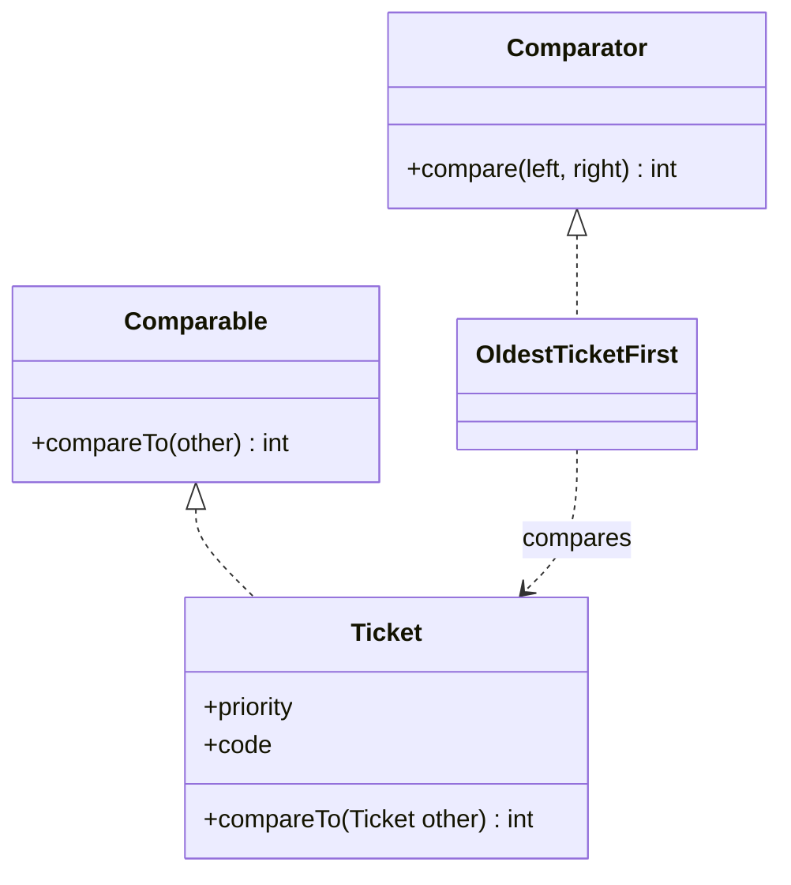
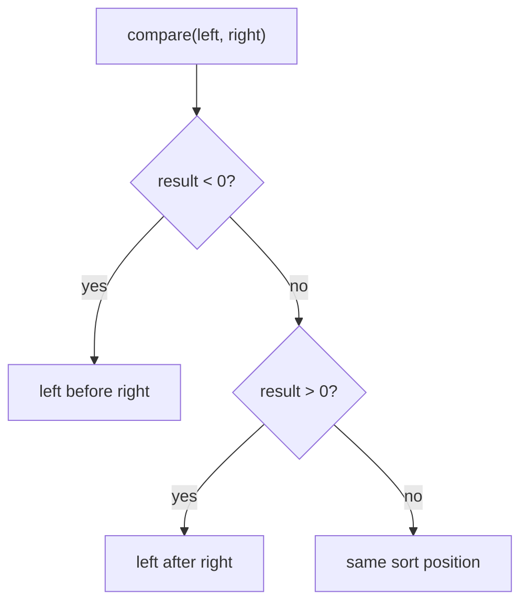

# Comparator vs Comparable

`Comparable` is the natural order of a class. If a `Ticket` always has one default queue order, the rule can live in `Ticket.compareTo(...)`. It is like a post office stamp printed on every parcel: wherever the parcel goes, workers can read its default route.

`Comparator` is an external order supplied by the caller. The same `Ticket` can be sorted by age, assignee, or code without changing the class. It is like a kitchen choosing a different checklist for the same ingredients: breakfast order, allergy order, or expiration-date order.



## The Return Value

Both APIs use the same sign convention: negative means the left value comes before the right value, positive means it comes after, and zero means they occupy the same sort position. Think of a traffic officer placing two cars in a lane: one goes ahead, one goes behind, or they are treated as tied for that lane position.



The exact number does not matter, only its sign. Returning `-7` and `-1` both mean "left before right". It is like a queue ticket: the clerk only needs to know who is first, not how dramatically first.

## Implementing compareTo()

A correct `compareTo()` should be stable, transitive, and consistent with itself: if `A < B` and `B < C`, then `A < C`; if `A.compareTo(B) == 0`, sorted structures treat them as the same ordering key. In daily terms, the sorting rule should not change while the post office line is moving, and it should not say parcel A is before B, B before C, but C before A.

Prefer helper methods such as `Integer.compare(...)`, `Long.compare(...)`, `Comparator.comparing(...)`, and `thenComparing(...)`. Do not write `return this.age - other.age;` because integer subtraction can overflow and flip the sign. It is like subtracting house numbers on a street map that wraps around at the city edge: the answer points the courier in the wrong direction.

```java
@Override
public int compareTo(Ticket other) {
    int byPriority = Integer.compare(this.priority, other.priority);
    if (byPriority != 0) {
        return byPriority;
    }
    return this.code.compareTo(other.code);
}
```

Add tie-breakers when objects can share the first compared field. If two tickets have the same priority but different codes, returning `0` would tell [TreeSet](topic:treeset) or `TreeMap` that only one sort slot exists. It is like a cloakroom worker giving two different coats the same claim number.

## Comparator In Practice

Use `Comparator` when the order is contextual: by newest first on one screen, by customer name on another, by SLA deadline in a batch job. The object stays the same; the sorting instruction changes. That is like a kitchen sorting the same vegetables by chopping order for one recipe and by expiration date for storage.

The fluent helpers make these rules readable:

```java
Comparator<Ticket> oldestFirst = Comparator
        .comparingInt(Ticket::ageHours)
        .reversed()
        .thenComparing(Ticket::code);
```

`Comparator.nullsFirst(...)` and `Comparator.nullsLast(...)` are useful when null is allowed input. Natural ordering through `compareTo()` usually assumes a real object is present. It is like a delivery desk having an explicit basket for address forms that are missing a street name.

For a broader map of collection behavior, see [Java Collections Overview](topic:java-collections-overview). For how sorted uniqueness uses comparison result `0`, see [TreeSet](topic:treeset). If you pass a one-off comparison rule as an old-style object instead of a lambda, it relates to [Anonymous Classes in Java](topic:anonymous-class).

## 60-Second Interview Answer

`Comparable` defines the natural ordering inside the class by implementing `compareTo(T other)`. Use it when the type has one obvious default order, such as `String`, `Integer`, or a domain object ordered by its id.

`Comparator` is an external strategy object or lambda with `compare(left, right)`. Use it when you need different orders for the same type, cannot edit the class, or want helper composition like `comparing`, `thenComparing`, `reversed`, `nullsFirst`, and `nullsLast`.

For both, negative means "this/left comes before other/right", positive means "after", and zero means "same sort position". A good `compareTo()` should be transitive, stable, and usually consistent with `equals` when used in sorted sets or maps. Implement numeric comparisons with `Integer.compare` or `Comparator.comparingInt`, not subtraction, and add tie-breakers so different objects do not accidentally return `0`.

## Common Misconceptions

- "`Comparable` and `Comparator` do the same job." They both compare, but `Comparable` is the class default while `Comparator` is an external rule. The parcel label and the temporary kitchen checklist are not the same tool.
- "`compareTo()` must return exactly `-1`, `0`, or `1`." It may return any negative or positive int. Only the sign matters, like a traffic direction instead of a precise distance.
- "`return a - b` is fine for ints." It can overflow. Use `Integer.compare(a, b)`, like using a reliable street sign instead of a broken odometer.
- "`0` just means equal." It means equal for ordering. In sorted sets and maps, that can collapse distinct objects into one slot, like two coats sharing one cloakroom number.
- "`Comparator` is only for sorting lists." It is also used by sorted collections, priority queues, streams, and APIs that need a caller-provided order.
