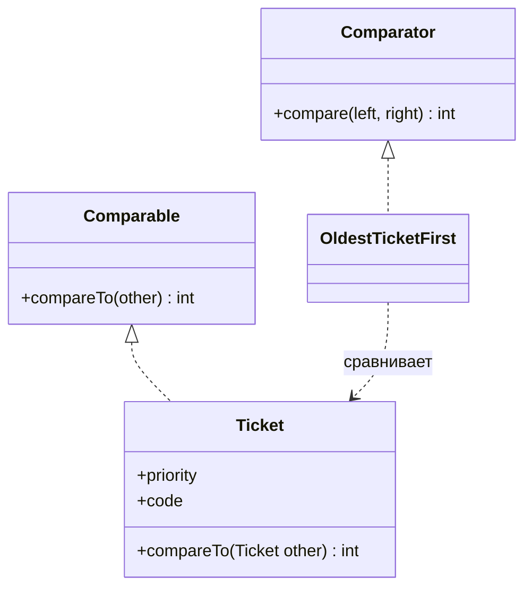
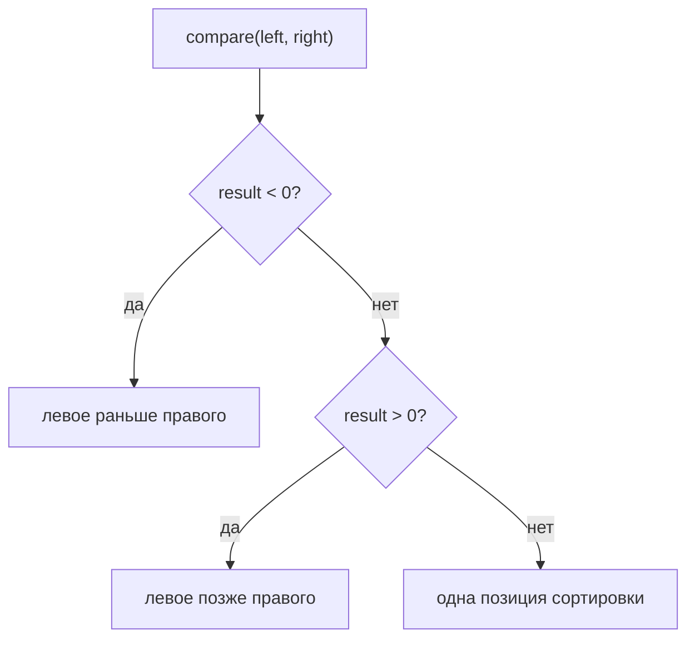

# Comparator и Comparable

`Comparable` - это natural order класса. Если у `Ticket` всегда есть один порядок очереди по умолчанию, правило может жить в `Ticket.compareTo(...)`. Это как почтовый штамп на каждой посылке: куда бы посылка ни попала, сотрудники видят её маршрут по умолчанию.

`Comparator` - это внешний порядок, который передаёт вызывающий код. Один и тот же `Ticket` можно сортировать по возрасту, исполнителю или code, не меняя сам класс. Это как кухня, которая выбирает разный список действий для одних и тех же продуктов: порядок для завтрака, порядок по аллергенам или порядок по сроку годности.



## Возвращаемое Значение

Оба API используют одно правило знака: отрицательное значение означает, что левое значение идёт раньше правого, положительное - что оно идёт позже, а ноль - что они занимают одну позицию сортировки. Представь регулировщика на дороге: одна машина едет впереди, другая позади, или обе считаются связанными одной позицией в полосе.



Точное число не важно, важен только его знак. `-7` и `-1` оба означают «левое раньше правого». Это как талон в очереди: сотруднику нужно понять, кто первый, а не насколько сильно первый.

## Реализация compareTo()

Корректный `compareTo()` должен быть стабильным, транзитивным и согласованным с самим собой: если `A < B` и `B < C`, значит `A < C`; если `A.compareTo(B) == 0`, отсортированные структуры считают эти объекты одним ключом порядка. В бытовом смысле правило сортировки не должно меняться, пока движется очередь на почте, и не должно говорить, что посылка A раньше B, B раньше C, но C раньше A.

Предпочитай вспомогательные методы: `Integer.compare(...)`, `Long.compare(...)`, `Comparator.comparing(...)` и `thenComparing(...)`. Не пиши `return this.age - other.age;`, потому что вычитание int может дать overflow и перевернуть знак. Это как вычитать номера домов на карте улицы, которая замыкается на краю города: ответ отправит курьера не в ту сторону.

```java
@Override
public int compareTo(Ticket other) {
    int byPriority = Integer.compare(this.priority, other.priority);
    if (byPriority != 0) {
        return byPriority;
    }
    return this.code.compareTo(other.code);
}
```

Добавляй tie-breaker, когда у объектов может совпасть первое сравниваемое поле. Если у двух заявок одинаковый priority, но разный code, возврат `0` скажет [TreeSet](topic:treeset) или `TreeMap`, что существует только одна позиция сортировки. Это как сотрудник гардероба, который выдаёт двум разным пальто один и тот же номерок.

## Comparator На Практике

Используй `Comparator`, когда порядок зависит от контекста: сначала новые записи на одном экране, по имени клиента на другом, по SLA deadline в пакетной задаче. Объект остаётся тем же, меняется инструкция сортировки. Это как кухня, которая сортирует одни и те же овощи по порядку нарезки для рецепта и по сроку годности для хранения.

Fluent-методы делают такие правила читаемыми:

```java
Comparator<Ticket> oldestFirst = Comparator
        .comparingInt(Ticket::ageHours)
        .reversed()
        .thenComparing(Ticket::code);
```

`Comparator.nullsFirst(...)` и `Comparator.nullsLast(...)` полезны, когда `null` допустим во входных данных. Natural ordering через `compareTo()` обычно предполагает, что настоящий объект уже есть. Это как стойка доставки с отдельной корзиной для адресных бланков, где не указана улица.

Для общей карты поведения коллекций смотри [Java Collections Overview](topic:java-collections-overview). О том, как отсортированная уникальность использует результат сравнения `0`, смотри [TreeSet](topic:treeset). Если одноразовое правило сравнения передаётся старым объектом вместо lambda, это связано с [Anonymous Classes in Java](topic:anonymous-class).

## Ответ За 60 Секунд

`Comparable` задаёт natural ordering внутри класса через `compareTo(T other)`. Его используют, когда у типа есть один очевидный порядок по умолчанию, например у `String`, `Integer` или доменного объекта, упорядоченного по id.

`Comparator` - это внешний strategy object или lambda с методом `compare(left, right)`. Его используют, когда для одного типа нужны разные порядки, класс нельзя менять или нужна композиция через `comparing`, `thenComparing`, `reversed`, `nullsFirst` и `nullsLast`.

В обоих случаях отрицательное значение значит «this/left идёт раньше other/right», положительное - «позже», а ноль - «та же позиция сортировки». Хороший `compareTo()` должен быть транзитивным, стабильным и обычно согласованным с `equals`, если объект используется в отсортированных set или map. Числа сравнивают через `Integer.compare` или `Comparator.comparingInt`, а не вычитанием, и добавляют tie-breaker, чтобы разные объекты случайно не вернули `0`.

## Частые Заблуждения

- "`Comparable` и `Comparator` делают одно и то же." Оба сравнивают, но `Comparable` - порядок класса по умолчанию, а `Comparator` - внешнее правило. Этикетка на посылке и временный кухонный список - разные инструменты.
- "`compareTo()` обязан вернуть ровно `-1`, `0` или `1`." Он может вернуть любой отрицательный или положительный int. Важен только знак, как направление движения, а не точная дистанция.
- "`return a - b` нормально для int." Это может дать overflow. Используй `Integer.compare(a, b)`, как надёжный дорожный знак вместо сломанного одометра.
- "`0` просто означает equal." Он означает равенство для порядка. В отсортированных set и map это может схлопнуть разные объекты в одну позицию, как два пальто с одним номерком в гардеробе.
- "`Comparator` нужен только для сортировки списков." Он также используется отсортированными коллекциями, priority queues, streams и API, которым нужен порядок от вызывающего кода.
