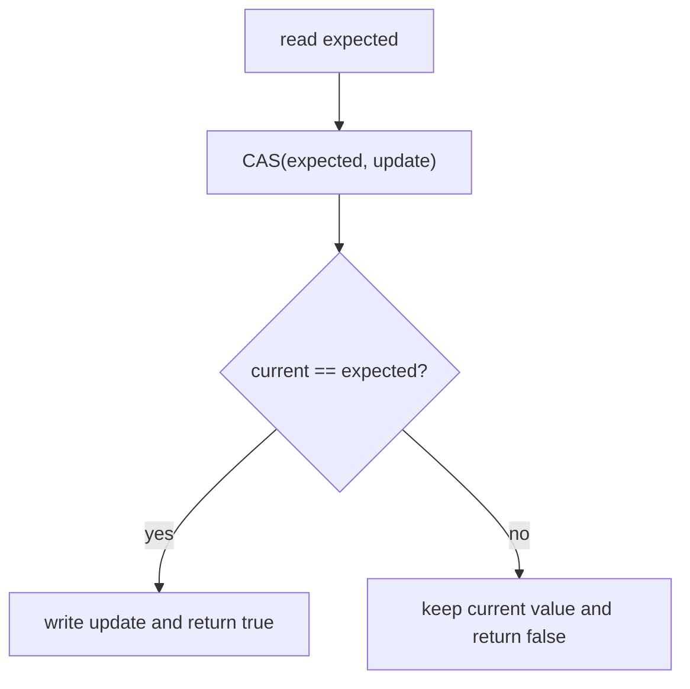
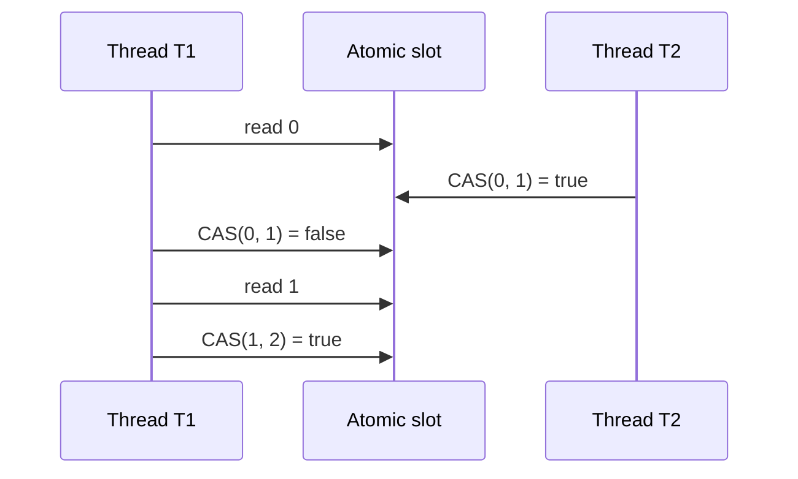
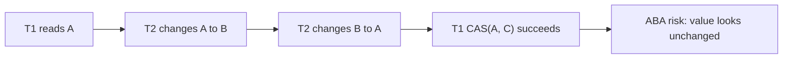

# Compare-And-Set (CAS)

## Intuition

Compare-and-set, usually shortened to CAS, is an atomic operation with this shape: "if the current value is still the expected value, replace it with the new value; otherwise change nothing and report failure." Think of a post office clerk who changes a parcel label only if the label still contains the address you wrote down. The check and the replacement happen as one counter action, so nobody can slip a different label between them.

In Java you usually meet it through `AtomicInteger.compareAndSet(expected, update)`, `AtomicReference.compareAndSet(expected, update)`, `VarHandle.compareAndSet(...)`, and inside lock-free data structures. It is one of the building blocks behind safe updates in concurrent code, next to locks and [critical sections](topic:critical-section). The kitchen analogy is a cook changing a single order ticket only if the ticket still says "pending"; if another cook already marked it "served", the change is rejected instead of overwriting reality.



## Why It Exists

A shared update such as `count = count + 1` is not one step. It reads the old value, computes the next value, then writes it back. That is the classic opening for a lost update, which is covered in [thread-safe numeric addition](topic:thread-safe-addition) and [race-condition avoidance](topic:race-condition-avoidance). The everyday version is two cashiers reading the same stock count from a board and both writing back "9"; one sale disappears.

CAS turns the write into a guarded write. The thread says: "I read 10, so set the value to 11 only if it is still 10." If another thread already changed it to 11, the CAS fails and the thread must decide what to do next. Like a traffic light controller, it changes the signal only if the signal is still in the state it inspected a moment ago.



## Retry Loops

CAS often appears in a loop:

```java
while (true) {
    int current = value.get();
    int next = current + 1;
    if (value.compareAndSet(current, next)) {
        return;
    }
}
```

The loop is not a mistake. It means "if someone changed the value first, read the new value and recompute." In a kitchen, this is like checking the order count, trying to update the ticket, and if another cook updated it first, reading the fresh ticket before writing your own correction.

The code inside the loop must be safe to repeat. Pure calculation is fine; charging a card, sending an email, or appending to a file is not fine inside the retry body because a failed CAS can make the body run again. The post office analogy is simple: rechecking a label is harmless, but printing and mailing a new parcel on every retry is not.

## The ABA Problem

CAS compares only the value it is given. If a thread reads `A`, another thread changes `A` to `B`, then changes `B` back to `A`, the first thread's CAS can still succeed because the value looks unchanged. That is the ABA problem. Imagine a queue number board in a clinic: you saw ticket 42, someone served 42, served 43, then the board shows 42 again because a new ticket reused the number. The number matches, but the situation is not the same.



Common fixes include adding a version stamp, using `AtomicStampedReference`, avoiding reusable identities, or using a lock when the invariant spans more than one value. In household terms, do not check only the jar label if the contents may have been swapped twice; add a dated seal or guard the whole shelf.

## 60-Second Interview Answer

Compare-and-set is an atomic conditional update. It reads the current value, compares it with the expected value supplied by the caller, and only if they match writes the new value and returns `true`; otherwise it leaves the value unchanged and returns `false`. In Java it is exposed by classes such as `AtomicInteger` and `AtomicReference`, and it is used to build non-blocking updates and concurrent data structures. It prevents lost updates because a stale writer cannot overwrite a newer value silently; the stale CAS fails and can retry from a fresh read. The main traps are retry loops under contention, repeated side effects inside the retry body, protecting only one value rather than a whole invariant, and the ABA problem.

## Production Relevance

CAS is useful for counters, flags, one-time state transitions, and small lock-free algorithms. It keeps many updates fast because a thread does not have to block on a monitor when the value is uncontended. At a post office counter, one clerk can stamp a single form without locking the whole building.

CAS is also used inside higher-level tools. `ConcurrentHashMap` uses fine-grained concurrent mechanics for safe updates, which you can compare in [ConcurrentHashMap vs synchronized HashMap](topic:concurrenthashmap-vs-synchronized-map). In real systems, prefer those higher-level classes when they express the problem directly. It is like using a proper queue machine in a busy office instead of asking every visitor to negotiate ticket numbers manually.

Use a lock when the operation must update several fields together, maintain a complex invariant, or perform blocking work. A [critical section](topic:critical-section) is often clearer than a clever CAS loop. In a kitchen, if you must move soup, bread, and the order ticket together, guard the whole tray rather than one sticky note.

## Common Misconceptions

- "CAS means no synchronization is happening." CAS is synchronization, just not a Java monitor. It relies on hardware and JVM atomicity, like a turnstile that lets one person update the counter at a time without closing the whole hallway.
- "`volatile` is enough for `count++`." `volatile` gives visibility, but `count++` is still read, compute, write. CAS adds the conditional atomic write. The notice board is visible to everyone, but two people can still copy the same old number unless the write is guarded.
- "CAS always makes code faster." Under heavy contention, many retries can waste CPU. That is like ten cashiers repeatedly grabbing and rewriting the same small stock card.
- "CAS protects a whole object graph." A single CAS protects one variable or reference. If two fields must change together, use a lock, immutable holder object, or another design. One label on one box does not protect the whole storage room.
- "`compareAndSet` can randomly fail." The usual strong `compareAndSet` should fail only when the comparison fails. `weakCompareAndSet` variants may fail spuriously and are used in specialized loops. It is the difference between a clerk rejecting a label because it changed and a scanner that occasionally asks you to scan again.
